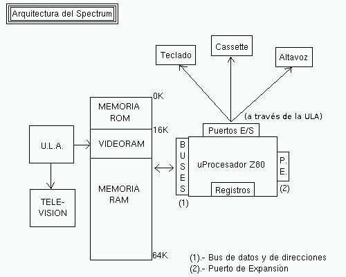
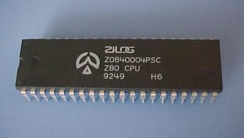
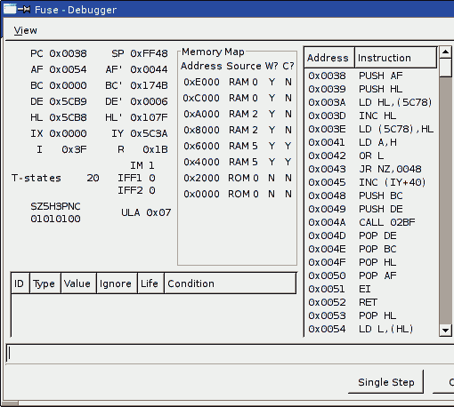
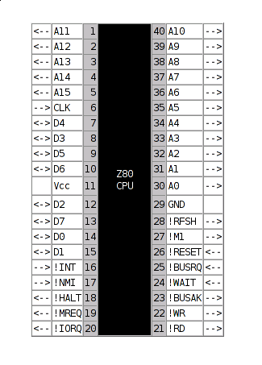
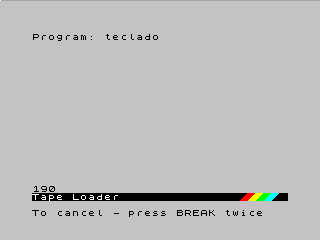
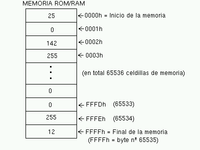
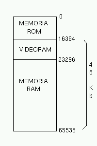

Arquitectura y funcionamiento del Spectrum
==============================================

La Arquitectura del Spectrum
-----------------------------------

Antes de comenzar a programar en lenguaje ensamblador para Spectrum necesitamos conocer su arquitectura: ¿qué hay dentro de nuestro pequeño ordenador y cómo funciona internamente? ¿Cómo procesa las instrucciones código máquina?

En BASIC muchas veces podemos olvidarnos de los detalles a nivel de hardware (precisamente ese es el objetivo de un lenguaje de Alto Nivel como es BASIC), pero en ensamblador no: al escribir los programas en un lenguaje con traducción directa al código máquina es imprescindible conocer cómo funciona internamente el procesador al cual le estamos dando instrucciones.

En este capítulo veremos una visión simplificada de la arquitectura hardware del Spectrum pero que en el fondo es todo lo que necesitaremos para el desarrollo de la mayoría de programas. Bajar hasta el nivel de la electrónica en sí sería una labor para otro tipo de cursos y tendría su principal aplicación en el desarrollo de hardware más que de software.

Comencemos con un esquema de cómo es internamente nuestro Spectrum a nivel de hardware, y después comentaremos uno a uno los elementos que lo componen: 

   Arquitectura del Spectrum

En un vistazo general, podemos ver que el microprocesador Z80 se conecta mediante los puertos de entrada/salida de la CPU a los periféricos externos (teclado, cassette y altavoz de audio), pudiendo leer el estado de los mismos (leer del teclado, leer del cassette) y escribir en ellos (escribir en el altavoz para reproducir sonido, escribir en el cassette) por medio de estas conexiones conocidas como "I/O Ports".

Al mismo tiempo, los Buses de Datos y de Direcciones conectan al microprocesador con la memoria. Esta conexión es la que permite que el Z80 pueda leer y escribir en cualquier posición de la RAM, y leer datos de la ROM (que, juntas, conforman la totalidad de la memoria disponible).

Cuando encendemos el Spectrum, el microprocesador Z80 se dedicada a leer valores de la memoria, decodificar a qué instrucción se corresponde el valor que acaba de leer, y ejecutarlo, continuando el proceso con la siguiente posición de memoria. Así pues, empezando por la posición 0000, el Spectrum comienza a leer instrucciones y a ejecutarlas, una a una.

Al comienzo de la memoria, desde la posición 0 hasta la 16384 (16KB) tenemos mapeada la ROM (Read Only Memory o memoria de sólo lectura) del Spectrum, que contiene instrucciones de programa preprogramadas y que no podemos modificar: contiene las funciones básicas del "sistema operativo" del Spectrum, incluyendo el intérprete de BASIC.

Después de estos primeros 16KB de memoria (la ROM) viene el resto de la memoria disponible: la memoria RAM (Random Access Memory o memoria de acceso aleatorio). Esta es la parte de la memoria en la que nuestros programas pueden trabajar: en ella alojaremos el código del programa, las variables del mismo, etc.

Por otro lado, el microprocesador Z80 tiene una serie de registros internos con los que trabaja y que son los que manipula y utiliza para ejecutar las instrucciones almacenadas en la memoria.

Por último, el puerto de expansión del Spectrum permite conectar nuevos periféricos (como el adaptador de Joystick Kempston o el Interface 1 ó 2) directamente a las patillas de la CPU, ampliando las funcionalidades del ordenador.

Veamos más detalladamente los diferentes componentes de la arquitectura del Spectrum, y cómo funcionan.

El microprocesador Z80
-----------------------

Como podemos distinguir en el esquema, el cerebro de nuestro Spectrum es un microprocesador Zilog Z80A a 3,54Mhz. Un microprocesador es un circuito integrado que consta (principalmente) de registros, microcódigo, puertos de entrada/salida, un bus de datos y uno de direcciones.

   El microprocesador Zilog Z80

Los registros son contenedores de valores numéricos que residen dentro de la misma CPU. En el caso del Z80, tiene 2 juegos de registros (los registros en uso, y los registros alternativos o shadow).

Cada uno de los 2 juegos de registro está formado por las mismas "piezas": Tenemos por un lado registros de un byte como **A**, **F**, **B**, **C**, **D**, **E**, **H**, **L**, **I** y **R**, y registros de dos bytes como **IX**, **IY**, **SP** y **PC**. Los registros de un byte pueden contener valores de 8 bits, es decir, de 0 a 255, y los de 2 bytes pueden contener valores de 16 bits (0-65535).

Algunos de los registros que hemos nombrado pueden agruparse para formar registros de mayor tamaño y así poder realizar operaciones que requieran valores mayores que los que se pueden representar con 8 bits. Por ejemplo, **H** y **L** pueden formar juntos el registro **HL** con el que realizar operaciones de 16 bits concretas.

Veremos los registros en detalle en el próximo capítulo (así como el segundo juego de registros disponible), pero podemos hacernos a la idea de que los registros son simples variables de 8 ó 16 bits que utilizaremos en nuestros programas en ensamblador. Así, podremos cargar un valor en un registro (**LD A, 25**), sumar un registro con otro (**ADD A, B**), activar o desactivar determinados bits de un registro (**SET 7, A**), etc. 

   Depurador del emulador FUSE

El juego de registros es todo lo que tenemos (aparte de la memoria) para realizar operaciones en nuestro programa: siempre que estemos operando con datos o utilizando variables, tendrá que ser por fuerza un registro, o una posición de memoria que usemos como variable. Por ejemplo, podemos escribir el siguiente programa en ensamblador, que sumaría dos números: 

.. code-block:: tasm

    LD A, 10
    LD B, 20
    ADD A, B

 El anterior programa, una vez ensamblado y ejecutado en un Z80, vendría a decir:

* Carga en el registro A el valor "10".
* Carga en el registro B el valor "20".
* Suma el valor del registro A con el del registro B y deja el resultado en el registro A (A=A+B).

Tras ejecutar el anterior programa en un Z80, el contenido del registro A sería 30 (10+20).

Cuando tratemos las diferentes instrucciones del Z80 veremos en más detalle los registros, su tamaño, cómo se agrupan, y de qué forma podemos usarlos para operar entre ellos y realizar nuestras rutinas o programas.

Finalmente, existe un registro especial del procesador llamado PC (Program Counter, o Contador de Programa). Este registro es de 16 bits (puede contener un valor entre 0 y 65535), y su utilidad es la de apuntar a la dirección de memoria de la siguiente instrucción a ejecutar. Así, cuando arrancamos nuestro Spectrum, el registro PC vale $0000, con lo que lo primero que se ejecuta en el Spectrum es el código que hay en $0000. Una vez leído y ejecutado ese primer código de instrucción, se incrementa PC para apuntar al siguiente, y así continuadamente.

Los programas se ejecutan linealmente mediante un ciclo basado en: Leer instrucción en la dirección de memoria apuntada por PC, incrementar registro PC, ejecutar instrucción. Posteriormente veremos más acerca de PC.

Ya hemos visto qué son los registros del microprocesador. Ahora bien, en el ejemplo anterior, ¿cómo sabe el microprocesador qué tiene que hacer cuando se encuentra un comando "LD" o "ADD"? Esto es tarea del microcódigo. El microcódigo del microprocesador es una definición de qué tiene que hacer el microprocesador ante cada una de las posibles órdenes que nosotros le demos.

Por ejemplo, cuando el microprocesador está ejecutando nuestro anterior programa y lee los valores numéricos correspondientes a "LD A, 10", el Z80 utiliza el microcódigo encargado de mover el valor 10 al registro A. Este microcódigo no es más que una secuencia de señales hardware y cambios de estados electrónicos cuyo resultado será, exactamente, activar y desactivar BITs en el registro A (que no es más que una serie de 8 biestables electrónicos que pueden estar a 0 voltios o a 5 voltios cada uno de ellos, representando el estado de los 8 bits del registro A). Lo mismo ocurrirá cuando se lea la instrucción "LD B, 20", sólo que se ejecutará otra porción de microcódigo que lo que hará será modificar el registro B.

Este microcódigo está dentro del microprocesador porque sus diseñadores implementaron todas y cada una de las operaciones que puede hacer el Z80. Cuando pedimos meter un valor en un registro, leer el valor de un registro, sumar un registro con otro, escribir el valor de un registro en una dirección de memoria, saltar a otra parte del programa, etc, para cada una de esas situaciones, hay un microcódigo (implementado mediante hardware) que realiza esa tarea.

Nosotros no tendremos que preocuparnos pués de cómo hace el Z80 las cosas internamente a nivel de microcódigo, aunque es bueno que conozcáis cómo llega el Spectrum a ejecutar nuestros comandos: gracias al microcódigo. 

Puertos de entrada/salida
--------------------------------------------------------------------------------

Si examinamos físicamente un microprocesador Z80A, podremos distinguir 40 patillas o pines de conexión. Además de los pines que se utilizan para alimentar el Z80 desde la fuente de alimentación, existen otra serie de patillas para "Puertos de Entrada/Salida" y "Bus de datos y de direcciones". Éstas se utilizan para la conexión del microprocesador con el resto de elementos del ordenador

   Patillas del Z80

Los registros del microprocesador y el microcódigo son hardware interno del procesador, y ninguna de las patillas que podemos ver en la imagen anterior nos comunica con ellos. Es el procesador (internamente) quien lee/modifica los registros o quien ejecuta microcódigo cuando nosotros se lo decimos mediante las instrucciones de nuestro programa.

Pero nuestro procesador, como hemos dicho, necesita conectarse con elementos del exterior, entre ellos (y casi exclusivamente en el caso del Spectrum) tenemos la memoria, el teclado, el altavoz y la unidad de cinta.

Visto de un modo muy simple, el Z80 puede acceder a través de una serie de patillas a múltiples elementos externos. Esos elementos se conectan a la CPU Z80 a través de las patillas de "Buses de datos y direcciones" (que podemos leer en los puertos de Entrada/Salida). Una vez conectados (la conexión se realiza físicamente a nivel de hardware, con pistas en la placa base del Spectrum), el microprocesador Z80 puede leer los valores que el dispositivo pone en esas pistas, o puede escribir valores en esas pistas para que el dispositivo los utilice.

Supongamos el ejemplo del teclado: un teclado es (a un nivel muy simple) una matriz de pulsadores. Al final de toda esa matriz de pulsadores, lo que acabamos teniendo es un valor numérico cuyos bits nos indican la teclas pulsadas. Pues bien, esos bits es lo que el mismo teclado pone en los "cables" que lo unen con el Z80, concretamente en el bus de datos.

El teclado se conecta a la CPU mediante conexión a los buses de direcciones y de datos y gracias a esto el microprocesador (y nuestro programa) puede leer en todo momento su estado (y saber qué teclas están pulsadas y cuales no) leyendo del puerto correspondiente. 

.. figure:: teclado.jpg
   :scale: 50%
   :align: center
   :alt: Conexiones del teclado

   Conexiones del teclado

Así, en nuestros programas podemos leer el estado del teclado mediante (por ejemplo):

.. code-block:: basic

    5  REM Mostrando el estado de la fila 1-5 del teclado
    10 LET puerto=63486
    20 LET V=IN puerto: PRINT AT 20,0; V ; "  " : GO TO 20

Este ejemplo lee (en un bucle infinito) una de las diferentes filas del teclado, mediante la lectura del puerto 63486 (F7FEh) con la instrucción de lectura de puertos de BASIC "IN". El estado de las 5 teclas que van desde el "1" hasta el "5" del teclado del Spectrum está conectado a 5 "hilos" de los 8 que llegan al puerto 63486 del micro Z80.

Si no hay ninguna tecla pulsada, el estado de estos 5 bits será un "1" lógico, que a nivel de hardware serán 5 Voltios. Cuando se pulsa una tecla, el teclado pone a "0" lógico (a 0 voltios) el "hilo" correspondiente de esos 8, y nosotros podemos conocer el estado de la tecla leyendo dicho puerto y mirando el bit en cuestión.

Al ejecutar el ejemplo BASIC anterior, veremos que la pulsación de la tecla "1" cambiará el valor que aparece en pantalla. Si pasamos los diferentes valores que aparecen a binario y nos fijamos en el estado de los 5 últimos bits, nos daremos cuenta como al pulsar y soltar las diferentes teclas del 1 al 5 estaremos variando esos bits entre 0 (al pulsarlas) y 1 (al liberarlas). Los 3 bits más altos del byte debemos ignorarlos en nuestro ejemplo, ya que no tienen relación con el teclado.

En resumen: Si no hay ninguna tecla pulsada, los 5 bits más bajos del byte que hay en el puerto estarán todos a 1, mientras que si se pulsa alguna de las teclas del 1 al 5, el bit correspondiente a dicha tecla pasará a estado 0. Nosotros podemos leer el estado del puerto y saber, mirando los unos y los ceros, si las teclas están pulsadas o no. Esto es posible gracias a la interconexión del teclado (un periférico) y el microprocesador a través del bus de direcciones (el identificador que permite al microprocesador saber qué puerto queremos leer) y de datos (el lugar donde recogemos el valor puesto por el periférico). 

   Pulsando "1" ponemos 1 el bit 0

Así, leyendo del puerto 63486 obtenemos un byte cuyos 8 bits tienen como significado el estado de cada una de las teclas de la semifila del "1" al "5".

======  ====  ====  ====  ====  ====  ====  ====  ====
Bits     D7    D6    D5    D4    D3    D2    D1    D0
======  ====  ====  ====  ====  ====  ====  ====  ====
Teclas 	XX     XX    XX    "5"   "4"   "3"   "2"   "1" 
======  ====  ====  ====  ====  ====  ====  ====  ====

Los bits D7 a D5 no nos interesan en el caso del teclado (por ejemplo, D6 tiene relación con la unidad de cinta), mientras que los bits de D5 a D0 son bits de teclas (0=pulsada, 1=no pulsada).

Tenemos pues el teclado dividido en filas de teclas y disponemos de una serie de puertos para leer el estado de cada una de ellas: 

==============  =========================
Puerto          Teclas
==============  =========================
65278d (FEFEh) 	de CAPS SHIFT a V
65022d (FDFEh) 	de A a G
64510d (FBFEh) 	de Q a T
63486d (F7FEh) 	de 1 a 5 (and JOYSTICK 1)
61438d (EFFEh) 	de 6 a 0 (and JOYSTICK 2)
57342d (DFFEh) 	de P a Y
49150d (BFFEh) 	de ENTER a H
32766d (7FFEh) 	de (space) a B 
==============  =========================

A la hora de leer estos puertos, el bit menos significativo (D0) siempre hace referencia a la tecla más alejada del centro del teclado ("1" en nuestro ejemplo), mientras que el más significativo de los 5 (D5) lo hace a la tecla más cercana al centro del teclado.

En ensamblador también hay disponibles 2 instrucciones para leer el contenido de un puerto de Entrada/Salida y para escribir un valor en un puerto determinado, las instrucciones se llaman igual que en BASIC: IN y OUT:

.. code-block:: tasm

    ; Cargamos en BC el valor del puerto a leer
    LD BC, F7FEh

    ; Leemos en el registro A el valor del puerto
    IN A, (C)

Hemos mostrado el ejemplo del teclado, aunque estamos todavía empezando y puede haber sido algo complicado de entender, por diferentes motivos:

* El primero, explicar con un ejemplo práctico qué son los puertos de E/S y cómo están conectados a nivel de hardware con el microprocesador. Como habéis visto, del teclado salen una serie de "hilos" o pistas de circuito impreso que van directamente al Z80A (en el caso del Spectrum, a través de la ULA), mediante conexión a sus diferentes buses y puertos.
* Mostrar cómo nosotros podemos, en cualquier momento, leer y escribir en los puertos de E/S. Con esto conseguimos comunicarnos con los periféricos externos. En este caso, podemos leer del teclado (o escribir o leer del cassette, o en el altavoz) con simples operaciones de lectura y escritura IN y OUT.

El lector debería extraer una conclusión adicional del ejemplo del teclado: la gran diferencia de proceso que hay entre programar en ensamblador y programar en BASIC. Supongamos que nos interesa leer el estado del teclado para saber si unas determinadas teclas están pulsadas o no. Para esto, en ensamblador (aunque esto también podemos hacerlo en BASIC) leemos directamente el estado del teclado con un par de simples instrucciones (LD + IN).

En BASIC, por contra, al usar INKEY$ estamos esperando la ejecución de un código que, además de leer TODAS las filas del teclado (no sólo aquellas de las teclas que nos interesen), realiza una conversión de todos los bits pulsados o no pulsados mediante una tabla para al final proporcionarnos el código ASCII de la tecla pulsada.

Lo que son varias instrucciones simples en ASM, en BASIC se realiza mediante cientos de instrucciones en ensamblador que nos acaban dando la última tecla pulsada. Es por eso que el intérprete BASIC es tan lento: cada operación BASIC son decenas, cientos o miles de instrucciones en ensamblador que ni vemos ni controlamos. Programando directamente en ASM, el microprocesador hará EXCLUSIVAMENTE lo que nosotros le digamos que haga. He aquí la "mágica" diferencia de velocidad entre ambos lenguajes.

Podéis encontrar más información sobre los puertos de Entrada y Salida en el capítulo 8 sección 32 del manual del +2A y +3, que tenéis disponible online en World Of Spectrum.

Memoria
--------------------------------------------------------------------------------

Al igual que en el caso de los puertos de entrada/salida, nuestro microprocesador está también conectado a los diferentes chips de memoria (hablamos en plural porque, físicamente, hay más de uno). La conexión se realiza siguiendo unas normas definidas por los ingenieros de Sinclair, de tal forma que la memoria se mapea linealmente. ¿Qué quiere decir esto? Que aunque tengamos varios chips de memoria, vemos la memoria como una gran y única memoria de 64KB (en el caso del modelo de 48KB).

El Spectrum 48KB básico (48KB de RAM y 16KB de ROM) tiene disponibles 64KB de memoria, es decir, 65536 bytes a los cuales podemos acceder. Podemos pensar en esta memoria como un gran baúl con 65536 cajones, uno encima de otro. El primer cajón es el cajón 0 (posición de memoria 0), el segundo el cajón 1 (posición de memoria 1), y así hasta el cajón 65535 (posición de memoria 65535).

Nuestro Spectrum no puede tener más de 65536 cajones porque el "bus de direcciones" del microprocesador Z80 es de 16 bits, es decir, las líneas que conectan al microprocesador con la memoria sólo permiten 16 "conexiones"; lo que nos da la posibilidad de acceder a 2 elevado a 16 bytes de memoria, exactamente 65536 bytes. 

   Aspecto de nuestras 65535 celdas de memoria

Cada uno de estos cajones (más técnicamente, "celdillas de memoria" o "posiciones de memoria") puede contener un número de 8 bits, con un valor, por tanto, entre 0 y 255. Esto es así porque el "bus de datos" del microprocesador Z80 es de 8 bits, lo que implica que "sólo hay 8 conexiones" entre la salida de datos de la memoria y nuestro procesador.

El microprocesador Z80 puede acceder a cualquier posición de memoria tanto para leer como para escribir. Internamente, cuando le pedimos al microprocesador que meta en el registro A el contenido de la celdilla de memoria $1234, mediante una instrucción de ensamblador "LD A, ($1234)" lo que hace el microprocesador internamente es:

(Nota: el operador () (paréntesis abierto y cerrado) en ensamblador significa acceso a memoria).

   
   
Ejecución de: LD A, ($1234)
~~~~~~~~~~~~~~~~~~~~~~~~~~~~~~~~~~~~~~~~~~~~~~~~~~~~~~~~~~~~~~~~~~~~~~~~~~~~~~~~

   
* $1234 en binario es 00010010 00110100, de modo que el Z80 coge las 16 líneas que conectan al microprocesador con la memoria y las pone a esos estados (0 = 0 voltios, 1 = 5 voltios).
* A continuación, el microprocesador utiliza una conexión especial que le conecta con la memoria para indicarle qué operación quiere realizar. Poniendo al valor apropiado la línea de control que le comunica con la memoria, el Z80 informa al chip de memoria de que quiere realizar una operación de lectura.
* La memoria recibe la señal de "deseo leer un dato" por esta señal de control, y mira el bus de direcciones que le conecta con el Spectrum. Mirando el estado de las 16 líneas encuentra el "00010010 00110100" ($1234). Con eso, la memoria sabe a qué "casilla" o "cajón" quiere acceder el microprocesador.
* La memoria lee el valor de la celdilla de memoria $1234 (supongamos que contiene, por ejemplo $0F, que es 00001111 en binario) y cambia las 8 conexiones del Bus de Datos para que contengan 00001111 (4 "líneas" las pone a 0 voltios, y las otras 4 a 5 voltios).
* El Z80 consulta el bus de datos y ve el estado de las líneas, con lo que lee el "00001111" o 0Fh.
* El Z80 coloca en el registro A el valor $0F

El procedimiento para escribir es similar, salvo que la línea de control entre el Z80 y la memoria en lugar de indicar "lectura" indica "escritura", y que es el Z80 quien pone en el bus de datos el valor que quiere escribir en la celdilla indicada en el bus de direcciones:

Ejecución de: LD ($1234), A
~~~~~~~~~~~~~~~~~~~~~~~~~~~~~~~~~~~~~~~~~~~~~~~~~~~~~~~~~~~~~~~~~~~~~~~~~~~~~~~~

* Supongamos que A contiene el valor 15 ($0F): el Z80 coloca las líneas del bus de datos a los valores 00001111 (donde cada 0 es 0 Voltios y cada 1 son 5 Voltios).
* El Z80 coloca las líneas del bus de direcciones a 00010010 00110100 ($1234).
* A continuación, el microprocesador pone las línea de control de Lectura y Escritura de memoria a tal valor que la memoria sabe que el Z80 le pide una operación de escritura.
* La memoria recibe la señal de "deseo escribir un dato", y mira el bus de direcciones que le conecta con el Spectrum. Obteniendo el estado de las 16 líneas encuentra el "00010010 00110100" ($1234). Con eso, la memoria sabe a qué "casilla" o "cajón" quiere acceder el microprocesador para escribir.
* La memoria lee el valor del bus de datos para saber qué dato tiene que escribir y obtiene el valor $0F.
* La memoria escribe en su celdilla número $1234 el valor $0F.

Estas son las 2 operaciones básicas que el Z80 puede realizar con la memoria: leer una posición de memoria y escribir en una posición de memoria. Nosotros no tenemos que preocuparnos de ninguna de las señales hardware necesarias para realizar lecturas y escrituras, de eso se encarga el microprocesador. Para nosotros, a nivel de ensamblador, nos bastará con ejecutar "LD A, ($1234)" o "LD ($1234), A", por ejemplo.

Las celdillas de memoria desde la nº 0 a la 16383 están ocupadas por un chip que es la ROM del Spectrum. Este chip es de sólo lectura (ROM = Read Only Memory), lo cual quiere decir que si intentamos escribir en las celdillas desde la 0 a la 16383 no conseguiremos cambiar el valor almacenado en ellas. ¿Por qué no se puede escribir aquí? Porque es la ROM del Spectrum, es un chip que contiene el "sistema operativo" del Spectrum, su intérprete BASIC, como veremos posteriormente.

   ROM y RAM

Para trabajar (ejecutar programas, realizar operaciones y tareas) podemos utilizar el resto de la memoria. Desde el cajón o celdilla número 16384 hasta el 65535 (en los modelos de 48KB) podremos escribir y leer.

La memoria RAM (celdillas 16384 a 65536) es muy importante para el Spectrum. Para empezar, en ella es donde se almacenan los datos y donde se cargan los programas, y de ella es de donde lee el microprocesador estos programas (como veremos posteriormente) para ejecutarlos instrucción a instrucción. Cuando en nuestra anterior entrega del curso pokeamos la rutina en código máquina en la dirección 40000, estabamos escribiendo un programa en memoria RAM para después ejecutarlo.

Hay una parte de la memoria RAM que es especial. El trozo de 6912 bytes que va desde la dirección 16384 hasta la 23295 es conocida como VideoRAM. Esta porción de la memoria no se utiliza para almacenar programas ni datos, sino que es una representación numérica de los gráficos que aparecen en nuestro televisor. La ULA (un chip que hay dentro de nuestro Spectrum) lee continuamente esta zona de memoria y transforma los unos y ceros que en ella encuentra en puntos y colores en el televisor.

Visto de una manera simple (pero real): al escribir un valor numérico (por ejemplo un 1) en alguna dirección de esta parte de la RAM, de forma inmediata aparece un punto en nuestro televisor, ya que la ULA está continuamente "escaneando" la videoram (de forma independiente del Z80) para reflejar en el televisor todos los valores numéricos que introduzcamos en ella.

La videomemoria es memoria RAM normal y corriente (podemos tanto leer como escribir en ella), sólo que los datos que contiene son leídos por la ULA a un ritmo de 50 veces por segundo. La ULA convierte los datos de la videomemoria en la imagen que vemos en el televisor conectado a nuestro Spectrum. La ULA es, pues, el chip encargado de representar en el televisor el contenido de la videomemoria y nosotros, cuando queramos escribir o dibujar algo en pantalla, ya no utilizaremos funciones como PLOT o DRAW de BASIC, sino que escribiremos directamente valores en esta zona de memoria.

Por ejemplo, el siguiente programa pinta 2 píxeles en el centro de la pantalla escribiendo en la videomemoria:

.. code-block:: basic

    10 REM Pintando 2 pixeles en pantalla mediante POKE
    20 LET DIRECCION= 16384 + 2000
    25 REM 129 = 10000001
    30 POKE DIRECCION, 129
    40 PAUSE 0

Si ejecutamos el programa, veremos 2 puntos en el centro de la pantalla. Estos 2 puntos aparecen al escribir el byte de valor 129 en la dirección 18384. El número 129, en binario, es 10000001. Esos 2 unos son los que se convierten en 2 puntos cuando la ULA lee la videomemoria y transforma los unos en colores de tinta y los ceros en colores de papel.

Lo que nos tiene que quedar claro al respecto de la memoria es lo siguiente:

* El microprocesador puede acceder a la memoria tanto para leer como para escribir, y lo hará cuando nosotros se lo pidamos (para leer o escribir datos en memoria). También lo hará para leer las instrucciones a ejecutar, como veremos posteriormente.
* La memoria se divide en ROM (celdillas 0-16383) y RAM (celdillas desde 16384 hasta la totalidad de memoria instalada), con los primeros 6912 bytes de la RAM mapeados como VideoRAM.
* En la ROM no podemos escribir (pero sí leer). Almacena el "código" de arranque del Spectrum, así como el intérprete de BASIC. En ella existen rutinas que usa BASIC que podremos aprovechar en nuestros programas en ensamblador.
* En la videoRAM sólo leeremos y escribiremos (en nuestro caso) cuando queramos dibujar cosas en pantalla (puntos y colores).
* En el resto de la RAM (a partir de la dirección 23296) es donde realizaremos todo el trabajo: allí situaremos nuestros programas, nuestras variables, datos, gráficos que después copiaremos a la videoRAM, etc.

El puerto de expansión
--------------------------------------------------------------------------------

El puerto de expansión del Spectrum no será en principio tema de discusión en este libro, ya que no lo utilizaremos en nuestros programas. Para información del lector, basta con saber que algunos de los pines del puerto de expansión del Spectrum están conectados directamente a diferentes patillas del microprocesador. Es decir, cada una de las líneas que podemos ver físicamente en el puerto de expansión es una pista de circuito (como si fuera un cable) que va directamente a alguna de las patillas del Z80.

Es por eso que mediante el puerto de expansión se puede implementar casi cualquier dispositivo hardware en el Spectrum sin tener que abrirlo y manipularlo internamente: estamos conectando dipositivos directamente al microprocesador y tras hacerlo, podemos realizar programas que accedan a esos elementos recién conectados: podemos leer los joysticks (porque los estamos conectando a puertos de Entrada/Salida mediante los buses de datos y direcciones), podemos leer cartuchos (porque "ocultamos" la memoria del Spectrum y la reemplazamos con otra memoria que contiene el juego ya cargado en ella, poniéndo esta memoria en el Bus de datos y Direcciones), etc.

Cómo funciona el Spectrum
--------------------------------------------------------------------------------

Una vez hemos visto todas las partes funcionales, veamos cómo funciona el Spectrum a nivel de ciclo de instrucción y ejecución.

Como ya hemos visto, los diferentes dispositivos externos (teclado, altavoz, cassette, elementos conectados al puerto de expansión, joysticks) se comunican con la CPU por medio de puertos de Entrada/Salida (Puertos E/S o I/O Ports). Para acceder a ellos simplemente leemos o escribimos en el puerto correspondiente mediante las instrucciones IN y OUT del Z80. También existen instrucciones para acceder a la memoria, tanto para lectura como para escritura.

En realidad el Z80, visto de una forma simplificada, sólo puede hacer 3 cosas: leer/escribir en la memoria, leer/escribir en los dispositivos de Entrada/Salida y decodificar/ejecutar instrucciones. La parte de lectura/decodificación/ejecución es el funcionamiento principal del microprocesador, y es lo que trataremos a continuación.

Ciclo de ejecución de un Spectrum
--------------------------------------------------------------------------------

Como ya hemos visto, la parte central del Spectrum es un microprocesador Z80 el cual ve la ROM y la RAM de forma continuada como la totalidad de su memoria. Recordemos que el Spectrum puede leer el contenido de cualquiera de estas 65536 celdillas así como escribir en ellas (siempre que no sean celdillas de la ROM).

Al encender el Spectrum éste se inicializa y muestra el BASIC en pantalla. ¿Por qué ocurre esto? Cuando se inicia el Spectrum, el microprocesador Z80 comienza a ejecutar instrucciones, una tras otra, desde la dirección de memoria 0, donde está el principio de la ROM de 16K, es decir, el intérprete BASIC.

Un microprocesador funciona a grandes rasgos de la siguiente forma:

* Leer instrucción apuntada por el registro PC.
* Incrementar PC para apuntar a la siguiente instrucción.
* Ejecutar la instrucción recién leída.
* Repetir continuadamente los 3 pasos anteriores.

Al encender un Spectrum (que perdió en su apagado toda alimentación eléctrica) teóricamente todos los registros del microprocesador Z80 valen 0 (sin alimentación eléctrica, todos los bits de la CPU están a 0 Voltios, es decir, a 0 lógico), incluído el registro PC (Program Counter o Contador de Programa), que es el que apunta a la siguiente instrucción que el Z80 debe leer y ejecutar.

Al ser PC = 0000, el Spectrum comienza a ejecutar, instrucción tras instrucción, el código que hay pregrabado en la ROM a partir de la celdilla 0 de memoria.

Visto en pseudocódigo, como si fuera un programa, un Z80 actúa así::

    * Encendido de ordenador:
        - PC (el Contador de Programa) se pone a 0.
        - SP se pone a $FFFF.
    * Mientras No Se Apague el Ordenador:
        Leer de la memoria la siguiente instrucción, mediante 
        lectura del contenido de la dirección apuntada por PC:
        - Opcode = (PC)
        - PC = PC + 1
        - Si la instrucción necesita algún operando, leerlo:
            + Operando1 = (PC)
            + PC = PC + 1
        - Si hay un segundo operando, leerlo:
            + Operando2 = (PC)
            + PC = PC + 1
        o Decodificar la instrucción (mirar en una tabla interna y ver 
        qué microcódigo hay que ejecutar para la instrucción leída).
        o Ejecutar la instrucción
    Fin Mientras

En realidad, según el texto "The Undocumented Z80 Documented", de Sean Young, tras un reset los registros quedan con los siguientes valores::

    PC              = $0000
    AF, SP          = $FFFF
    Resto           = Valor indefinido
    Interrupciones
    (IM, IFF1 y 2)  = 0

Así pues, al encender el ordenador, PC vale 0. Al estar la ROM mapeada en la posición de memoria 0 (mediante cableado hardware de los chips de memoria en la placa del Spectrum), lo que pasa al encender el ordenador es que ese contador de programa (PC) está apuntando al principio de la ROM, y es por eso que se ejecuta la ROM paso a paso, instrucción a instrucción, cada vez que lo encendemos, realizando desde el característico borrado de pantalla del inicio del Spectrum hasta la impresión del tradicional mensaje "© 1982 Sinclair Research Ltd".

Después, la ejecución del código que hay en la ROM se mantiene en un bucle que escanea el teclado y nos permite introducir órdenes de BASIC y ejecutarlas: el famoso intérprete BASIC.

Fuera de los primeros 16KB de memoria tenemos el resto de memoria disponible, donde el intérprete BASIC almacenará las instrucciones BASIC que tecleemos o bien donde se cargará un programa desde los diferentes dispositivos de entrada/salida (gestionados por el Z80) como la cinta o disco, etc.

Así pues, nuestro Z80 en el momento del arranque lo que hace es comenzar a ejecutar una a una las instrucciones código máquina que hay a partir de la dirección $0000 de la memoria, que se corresponde con la ROM.

¿Y qué contiene la ROM? Pues la ROM no es más que un programa realizado por los ingenieros de Sinclair. Ese programa contiene, entre otras cosas, el intérprete BASIC. Los señores de Sinclair Research programaron un intérprete BASIC en lenguaje ensamblador de Z80, lo ensamblaron con un programa ensamblador de Z80 y grabaron el código binario resultante ensamblado en un CHIP ROM de 16KB. Por eso al encender nuestro Spectrum aparece el intérprete de BASIC; el Sistema Operativo de nuestro ZX. Nada nos impediría realizar nuestro propio "sistema operativo" para Spectrum creando una ROM nueva (mirando siempre la compatibilidad con la ROM vieja, de forma que contenga las mismas rutinas de ROM y variables en memoria que utilizan muchos programas) y reemplazando el chip ROM del Spectrum por nuestro propio chip de ROM.

Opcodes y código máquina
--------------------------------------------------------------------------------

Nuestro microprocesador Z80 no entiende los comandos en ensamblador que hemos estado viendo en estos 2 primeros capítulos del curso de código máquina; el Z80 sólo entiende números binarios, números de 8 bits de 0 a 255 (o de $00 a $FF en hexadecimal).

De entre los registros del microprocesador hay uno llamado PC (Program Counter o Contador de Programa), que como ya hemos visto, es el "puntero" que apunta a la instrucción actual que se está ejecutando. Cuando ejecutamos un programa, lo que hacemos es meterlo en memoria (por ejemplo, como cuando en la primera entrega del curso POKEábamos nuestra rutina a partir de la dirección 40.000) y después saltar al inicio del mismo.

Supongamos por ejemplo que pokeamos el siguiente programa en la dirección 40000:

.. code-block:: tasm

    LD A, 0
    INC A
    LD B, $FFh
    INC B
    LD DE, $AABB
    RET

Si ensamblamos este programa obtendremos los siguientes números (técnicamente llamados "código máquina")::

    3e 00 3c 06 ff 04 11 bb aa c9

Al pokear en memoria estos valores, dejaremos el siguiente contenido en memoria:

=========   =====================
Dirección 	Valor hexadecimal
=========   =====================
40000          3e
40001          00
40002          3c
40003          06
40004          ff
40005          04
40006          11
40007          bb
40008          aa
40009          c9 
=========   =====================

Para nosotros estos números no quieren decir nada, pero para el Spectrum tienen un total significado. Concretamente:

========== ===================  ============
Dirección   Valor hexadecimal   Significado
========== ===================  ============
40000          3e                LD A,
40001          00                00h
40002          3c                INC A
40003          06                LD B,
40004          ff                FFh
40005          04                INC B
40006          11                LD DE,
40007          bb                BBh
40008          aa                AAh
40009          c9                RET
========== ===================  ============

A la hora de ejecutar el programa, nuestro RANDOMIZE USR 40000 lo que hace en realidad es cambiar el valor del registro "PC" del microprocesador. Hace PC igual a 40000. Así, una vez realizamos el salto a la dirección 40000, el microprocesador hace lo siguiente::

    * Leer el byte contenido en la dirección de memoria "PC" (40000).
    * Incrementar PC (PC=PC+1).
    * El byte es "$3e", con lo cual el Spectrum sabe que 
      tiene que meter en A un valor numérico.
    * El valor extra para "LD A," está a continuación en memoria, 
      así que se lee la memoria de nuevo:
            - operando = [PC] = $00
            - Incrementar PC (PC=PC+1) 
    * Ya se tiene el "código de instrucción completo", así que se 
        ejecuta: "LD A, 00". (se ejecuta el microcódigo 
        correspondiente dentro de la CPU).

Esto que hemos visto es el proceso de "Lectura de Instrucción (fetch)", "decodificación (decode)", y "ejecución (execute)". Pero recordemos que este proceso se ejecuta una y otra vez, sin parar, de modo que el procesador sigue con la siguiente instrucción (INC A)::

    * Leer el byte contenido en la dirección de memoria "PC" (40002).
    * Incrementar PC (PC=PC+1).
    * El byte es "$3c", con lo cual el Spectrum sabe que tiene que incrementar A.
    * No hacen falta operandos extra, INC A no requiere nada más.
    * Ya se tiene el "código de instrucción completo", así que se ejecuta: "INC A".

Y este ciclo se vuelve a repetir, una y otra vez, hasta que llegamos al RET::

    * Leer el byte contenido en la dirección de memoria "PC" (40009).
    * Incrementar PC (PC=PC+1).
    * El byte es "$c9", con lo cual el Spectrum sabe que tiene que hacer un RET.
    * No hacen falta operandos extra, RET no requiere nada más.
    * Ya se tiene el "código de instrucción completo", así que se ejecuta: "RET".

Un par de detalles a tener en cuenta:

* Como véis, el microprocesador no entiende el lenguaje ensamblador, sólo la traducción de este a Lenguaje Máquina (los números u opcodes que estamos viendo).
* La primera parte leída de la instrucción es el OPCODE (código de operación), y es lo que permite al Spectrum, mediante una "tabla interna", saber qué tarea exacta tiene que realizar. Si la instrucción necesita datos extra para leer de memoria, se almacenan tras el opcode, y se conocen como "operandos". Así, "LD A, 00" se corresponde con la instrucción "3E 00", donde "3E" es el código de operación (opcode) y "00" es el operando.
* Cuando un operando es de 16 bits (2 bytes), primero encontramos el byte bajo y luego el byte alto. Así, nuestro "LD DE, $AABB" no se codifica como "11 AA BB" sino como "11 BB AA". El opcode para "LD DE" es "11", y "BB AA" los operandos (en este caso, un valor numérico directo). Esta forma de almacenamiento se denomina técnicamente "little endian".
* Para el Spectrum, no hay diferencia entre instrucciones y datos. Un "$3C" puede ser un "INC A" o un valor númerico "$3C". ¿Cómo distingue el Spectrum uno de otro? Sencillo: todo depende de si se encuentra al principio de un ciclo de decodificación o no. Es decir, si cuando vamos a empezar a leer una instrucción leemos un "$3C", es un INC A. Pero si lo leemos en el proceso de lectura de un operando, su significado cambia. Pensad en por ejemplo en "LD A, $3C", que se codificaría como "3E 3C", pero no ejecutaría un INC A porque la lectura del "$3C" se realiza como operando para el "LD A,".
* Al no existir diferencia entre instrucciones y datos, si cambiamos PC de forma que apunte a una zona de la memoria donde hay datos y no código, el Z80 tratará de interpretar los números que va leyendo como si fueran opcodes (con resultados imprecedibles, seguramente con el cuelgue del Spectrum o un reset).
* Por último, existen una serie de opcodes compuestos (dejando de lado los operandos) que ocupan más de 1 byte. Esos opcodes suelen comenzar por CB, ED o FD, de forma que, por ejemplo el opcode "CB 04" se corresponde con la operación "RLC L". Si sólo pudieramos utilizar un byte para representar el opcode, sólo tendríamos disponibles 256 posibles instrucciones en el procesador. Para poder disponer de más instrucciones se utilizan códigos de instrucción de más de un byte. Así, cuando nuestro procesador encuentra un CB, ED o FD sabe que el próximo código que lea después tendrá un significado diferente al que tendría sin el CB, ED o FD delante. Es por eso que "$04" significa "INC B", y "$CB $04" significa "RLC L" (una instrucción diferente).

Ensamblado manual
--------------------------------------------------------------------------------

Al igual que el Spectrum consulta una tabla interna para saber a qué instrucción corresponde cada valor numérico (cada opcode) nosotros podemos consultar una tabla para ensamblar manualmente nuestros programas en ensamblador y obtener los valores de código máquina con que se corresponden. Si no tenemos a mano un programa ensamblador que lo haga por nosotros (que, al fin y al cabo, no es más que un traductor "automático" con una tabla similar), podemos utilizar tablas de ensamblado para traducir el programa manualmente. Cabe decir que es una labor repetitiva y larga, y se recomienda encarecidamente la utilización de un programa ensamblador para ello.

Cuando lleguemos a la parte de definición del lenguaje veremos que ensamblando manualmente resulta bastante costoso calcular las direcciones de los saltos relativos y absolutos, cosa que el programa ensamblador hace con bastante facilidad.

Aún así, quien quiera intentar ensamblar manualmente podrá hacerlo incluso con la tabla de "Juego de caracteres" que tiene disponible en el manual del +2A/+3, capítulo 8, sección 28 (además de no ser la única tabla de ensamblado manual que existe, ya que hay varias disponibles en Internet). 

`Tabla de opcodes <https://sites.google.com/site/timeproofing/z80-instruction-set-1/z80-opcodes-sinclair?authuser=0>`_.

Tiempos de ejecución
--------------------------------------------------------------------------------

Cada instrucción necesita un tiempo diferente para ejecutarse. No es lo mismo un simple "INC A", que requiere leer un único byte como opcode, no requiere parámetros, y sólo realiza un incremento en un registro, que un complejo "LD A, ($1234)", que requiere leer el opcode, a continuación leer 2 bytes para el operando "$1234", después acceder a la memoria y extraer el dato contenido en ($1234) para, finalmente, depositarlo en A.

Los tiempos de ejecución de cada instrucción son, pues, diferentes, y para conocerlos tendremos que consultar cualquier tabla de tiempos, medidos en t-states o t-estados. El t-estado o "ciclo del procesador", es la unidad de medida básica de tiempo. Podéis acceder a alguna de estas tablas en los enlaces que veréis al final de este artículo.

El software de Spectrum
--------------------------------------------------------------------------------

A estas alturas ya debemos tener claro cómo funciona el Spectrum, con su microprocesador Z80 continuamente ejecutando el código apuntado por "PC", incrementando este y de nuevo repitiendo el ciclo.

Cuando encendemos nuestro Spectrum, PC vale 0000h y se ejecuta la ROM que, como ya hemos comentado, no es más que un programa hecho por los ingenieros que desarrollaron el Spectrum.

El código ensamblador de este "programa" está disponible para su consulta ya que usuarios de Spectrum realizaron un desensamblado (a partir de los opcodes, obtener el código fuente original) y comentaron todas las rutinas, variables del sistema y procedimientos que se ejecutan en nuestro Spectrum nada más arrancarlo. El libro "The Complete Spectrum ROM Disassembly" (El desensamblado Completo de la ROM del Spectrum) contiene este desensamblado, y podemos obtenerlo en Internet, por si tenemos curiosidad en conocer las interioridades de la ROM del Spectrum y cómo está programado el intérprete BASIC y las diferentes funciones de la ROM del mismo (con el objetivo de poder "usarlas" en nuestros programas en ensamblador).

Pero aparte de la ROM del Spectrum, ¿cómo llega a la memoria de nuestro ordenador (o emulador) los programas que ejecutamos?. Veamos las diferentes maneras:

1. Desde cinta: Nuestro LOAD "" provoca en BASIC la llamada a una rutina de la ROM que carga desde cinta el código y los datos de los programas. Lo único que se hace es leer de la cinta los opcodes y sus operandos, así como cualquier otro dato (gráficos, sonidos) del programa, e introducirlos en memoria en una zona a la que luego saltaremos (cambiaremos PC a ella). Cuando grabamos a cinta, lo que hacemos es leer el contenido de un trozo de memoria y escribirlo en cinta (escribir los valores numéricos de los opcodes, operandos y datos).
2. Desde disco: exactamente igual que en el caso de la cinta, pero el medio de almacenamiento es un disco de 3" o de 3.5".
3. Ficheros TAP y TZX: son ficheros de ordenador que almacenan los datos exactamente igual que si fuera una cinta real: almacenan opcodes, datos y operandos, que luego serán cargados en memoria.
4. Ficheros .SP, .SNA y .Z80 (en general, cualquier fichero de snapshot). No son más que volcados de la memoria. Por ejemplo, un fichero .SP o .SNA contiene el contenido de las 49152 celdillas de memoria desde 16384 hasta 65536. Para cargar ese .SNA en un emulador, lo que realiza el emulador es un simple "POKEado" del contenido del fichero en las celdillas de memoria. Así, un fichero snapshot no es más que una "copia" de la memoria (de su contenido) que volcamos a fichero.

Cuando nosotros creemos un nuevo programa, lo haremos escribiendo el programa en un fichero de texto con instrucciones en ensamblador. La herramienta ensambladora "pasmo" convertirá este fichero con instrucciones (fichero.asm) en una ristra de bytes en código máquina (fichero.bin) con los opcodes y los datos de nuestro programa. Obtendremos pues un fichero binario que podremos almacenar en cinta, en tap, en tzx, etc.

Este fichero binario (esta ristra de bytes) podrá ser cargado en la memoria del Spectrum con cualquiera de los métodos que acabamos de ver y ejecutado saltando a la dirección de inicio donde haya sido cargado.

En resumen
--------------------------------------------------------------------------------

Hemos visto cómo funciona internamente nuestro ordenador Spectrum y el microprocesador Z80. A partir del próximo capítulo comenzaremos ya con la sintaxis del lenguaje ensamblador y una descripción de las diferentes instrucciones disponibles. No obstante, creemos que los conceptos introducidos ya en estos 2 primeros capítulos deben de haber llevado ya al lector a un punto en el cual podrá realizar sus primeras pruebas en ensamblador mediante la documentación a la cual nos referimos en los enlaces. Basta con consultar el juego de instrucciones del Spectrum en la página oficial del Z80 o de Zilog para poder realizar ya nuestros primeros programas en ensamblador para nuestro querido Sinclair ZX Spectrum. 