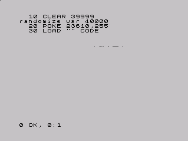
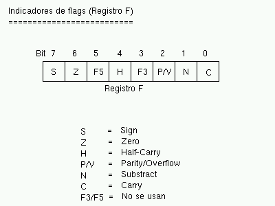

Lenguaje Ensamblador del Z80 (I)
================================================================================

Arquitectura del Z80 e Instrucciones básicas
--------------------------------------------------------------------------------

En este capítulo explicaremos la sintaxis utilizada en los programas en ensamblador. Para ello comenzaremos con una definición general de la sintaxis para el ensamblador Pasmo, que será el “traductor” que usaremos entre el lenguaje ensamblador y el código máquina del Z80.

Posteriormente veremos en detalle los registros: qué registros hay disponibles, cómo se agrupan, y el registro especial de Flags, enlazando el uso de estos registros con las instrucciones de carga, de operaciones aritméticas, y de manejo de bits, que serán las que trataremos hoy.

Esta entrega del curso es delicada y complicada: por un lado, tenemos que explicar las normas y sintaxis del ensamblador cruzado PASMO antes de que conozcamos la sintaxis del lenguaje ensamblador en sí, y por el otro, no podremos utilizar PASMO hasta que conozcamos la sintaxis del lenguaje.

Además, el lenguaje ensamblador tiene disponibles muchas instrucciones diferentes, y nos resultaría imposible explicarlas todas en un mismo capítulo, lo que nos fuerza a explicar las instrucciones del microprocesador en varias entregas. Esto implica que hablaremos de PASMO comentando reglas, opciones de instrucciones y directivas que todavía no conocemos.

Es por esto que recomendamos al lector que, tras releer anteriores capítulos de este libro, se tome esta entrega de una manera especial, leyéndola 2 veces. La “segunda pasada” sobre el texto permitirá enlazar todos los conocimientos dispersos en el mismo, y que no pueden explicarse de una manera lineal porque están totalmente interrelacionados. Además, la parte relativa a la sintaxis de PASMO será una referencia obligada para posteriores capítulos (mientras continuemos viendo diferentes instrucciones ASM y ejemplos).

Sintaxis del lenguaje ASM en PASMO
--------------------------------------------------------------------------------

En anteriores capítulos ya hablamos de PASMO, el ensamblador cruzado que recomendamos para el desarrollo de programas para Spectrum. Este ensamblador traduce nuestros ficheros de texto .asm con el código fuente de programa (en lenguaje ensamblador) a ficheros .bin (o .tap/.tzx) que contendrán el código máquina directamente ejecutable por el Spectrum.

Supondremos para el resto del capítulo que ya tenéis instalado PASMO (ya sea la versión Windows o la de UNIX/Linux) en vuestro sistema y que sabéis utilizarlo de forma básica (bastará con saber realizar un simple ensamblado de programa, como ya vimos en el primer capítulo), y que podéis ejecutarlo dentro del directorio de trabajo que habéis elegido.

El ciclo de desarrollo con PASMO será el siguiente:

* Con un editor de texto, tecleamos nuestro programa en un fichero .ASM con la sintaxis que veremos a continuación.
* Salimos del editor de texto y ensamblamos el programa:
    * Si queremos generar un fichero .bin de código objeto cuyo contenido POKEar en memoria (o cargar con LOAD “” CODE) desde un cargador BASIC, lo ensamblamos con: “pasmo ejemplo1.asm ejemplo1.bin”
    * Si queremos generar un fichero .tap directamente ejecutable (de forma que sea pasmo quien añada el cargador BASIC), lo ensamblamos con “pasmo –tapbas ejemplo1.asm ejemplo1.tap”

Todo esto se mostró bastante detalladamente en su momento en el primer capítulo del curso.

Con esto, ya sabemos ensamblar programas creados adecuadamente, de modo que la pregunta es: ¿cómo debo escribir mi programa para que PASMO pueda ensamblarlo?

Es sencillo: escribiremos nuestro programa en un fichero de texto con extensión .asm. En este fichero de texto se ignorarán las líneas en blanco y los comentarios, que en ASM de Z80 se introducen con el símbolo “;” (punto y coma), de forma que todo lo que el ensamblador encuentre a la derecha de un ; será ignorado (siempre que no forme parte de una cadena). Ese fichero de texto será ensamblado por PASMO y convertido en código binario.

Lo que vamos a ver a continuación son las normas que debe cumplir un programa para poder ser ensamblado en PASMO. Es necesario explicar estas reglas para que el lector pueda consultarlas en el futuro, cuando esté realizando sus propios programas. No te preocupes si no entiendes alguna de las reglas, cuando llegues al momento de implementar tus primeras rutinas, las siguientes normas te serán muy útiles:

* Normas para las instrucciones:
    * Pondremos una sóla instrucción de ensamblador por línea.
    * Como existen diferencias entre los “fin de línea” entre Linux y Windows, es recomendable que los programas se ensamblen con PASMO en la misma plataforma de S.O. en que se han escrito. Si PASMO intenta compilar en Windows un programa ASM escrito en un editor de texto de Linux (con retornos de carro de Linux) es posible que obtengamos errores de ensamblado (aunque no es seguro). * Si os ocurre al compilar los ejemplos que os proporcionamos (están escritos en Linux) y usáis Windows, lo mejor es abrir el fichero .ASM con notepad y grabarlo de nuevo (lo cual lo salvará con formato de retornos de carro de Windows). El fichero “regrabado” con Notepad podrá ser ensamblado en Windows sin problemas.
    * Además de una instrucción, en una misma línea podremos añadir etiquetas (para referenciar a dicha línea, algo que veremos posteriormente) y comentarios (con ';').

* Normas para los valores numéricos:
    * Todos los valores numéricos se considerarán, por defecto, escritos en decimal.
    * Para introducir valores números en hexadecimal los precederemos del carácter “$”, y para escribir valores numéricos en binario lo haremos mediante el carácter “%”.
    * Podremos también especificar la base del literal poniendoles como prefijo las cadena &H ó 0x (para hexadecimal) o &O (para octal).
    * Podemos especificar también los números mediante sufijos: Usando una “H” para hexadecimal, “D” para decimal, “B” para binario u “O” para octal (tanto mayúsculas como minúsculas).

* Normas para cadenas de texto:
    * Podemos separar las cadenas de texto mediante comillas simples o dobles.
    * El texto encerrado entre comillas simples no recibe ninguna interpretación, excepto si se encuentran 2 comillas simples consecutivas, que sirven para introducir una comilla simple en la cadena.
    * El texto encerrado entre comillas dobles permite introducir caracteres especiales al estilo de C/C++ como \n, \r o \t (nueva línea, retorno de carro, tabulador…).
    * El texto encerrado entre comillas dobles también admite \xNN para introducir el carácter correspondiente a un número hexadecimal NN.
    * Una cadena de texto de longitud 1 (un carácter) puede usarse como una constante (valor ASCII del carácter) en expresiones como, por ejemplo, 'C'+10h.

* Normas para los nombres de ficheros:
    * Si vemos que nuestro programa se hace muy largo y por lo tanto incómodo para editarlo, podemos partir el fichero en varios ficheros e incluirlos mediante directivas INCLUDE (para incluir ficheros ASM) o INCBIN (para incluir código máquina ya compilado). Al especificar nombres de ficheros, deberán estar entre dobles comillas o simples comillas.

* Normas para los identificadores:
    * Los identificadores son los nombres usados para etiquetas y también los símbolos definidos mediante EQU y DEFL.
    * Podemos utilizar cualquier cadena de texto, excepto los nombres de las palabras reservadas de ensamblador.

* Normas para las etiquetas:
    * Una etiqueta es un identificador de texto que ponemos poner al principio de cualquier línea de nuestro programa, por ejemplo: “bucle:”
    * Podemos añadir el tradicional sufijo “:” a las etiquetas, pero también es posible no incluirlo si queremos compatibilidad con otros ensambladores que no lo soporten (por si queremos ensamblar nuestro programa con otro ensamblador que no sea pasmo).
    * Para PASMO, cualquier referencia a una etiqueta a lo largo del programa se convierte en una referencia a la posición de memoria de la instrucción o dato siguiente a donde hemos colocado la etiqueta. Podemos utilizar así etiquetas para hacer referencia a nuestros gráficos, variables, datos, funciones, lugares a donde saltar, etc.

* Directivas:
    * Tenemos a nuestra disposición una serie de directivas para facilitarnos la programación, como DEFB o DB para introducir datos en crudo en nuestro programa, ORG para indicar una dirección de inicio de ensamblado, END para finalizar el programa e indicar una dirección de autoejecución, IF/ELSE/ENDIF en tiempo de compilación, INCLUDE e INCBIN, MACRO y REPT.
    * La directiva END permite indicar un parámetro numérico (END XXXX) que “pasmo –tapbas” toma para añadir al listado BASIC de arranque el RANDOMIZE USR XXXX correspondiente. De esta forma, podemos hacer que nuestros programas arranquen en su posición correcta sin que el usuario tenga que teclear el “RANDOMIZE USR DIRECCION_INICIO”.

* Una de las directivas más importantes es ORG, que indica la posición origen donde almacenar el código que la sigue. Podemos utilizar diferentes directivas ORG en un mismo programa. Los datos o el código que siguen a una directiva ORG son ensamblados a partir de la dirección que indica éste.
* Iremos viendo el significado de las directivas conforme las vayamos usando, pero es aconsejable consultar el manual de PASMO para conocer más sobre ellas.

* Operadores
    * Podemos utilizar los operadores típicos +, -, \*. /, así como otros operadores de desplazamiento de bits como » y «.
    * Tenemos disponibles operadores de comparación como EQ, NE, LT, LE, GT, GE o los clásicos =, !=, <, >, ⇐, >=.
    * Existen también operadores lógicos como AND, OR, NOT, o sus variantes \&, \|, \!.
    * Los operadores sólo tienen aplicación en tiempo de ensamblado, es decir, no podemos multiplicar o dividir en tiempo real en nuestro programa usando * o /. Estos operadores están pensados para que podamos poner expresiones como ((32*10)+12), en lugar del valor numérico del resultado, por ejemplo.

Aspecto de un programa en ensamblador

Veamos un ejemplo de programa en ensamblador que muestra el uso de algunas de estas normas, para que las podamos entender fácilmente mediante los comentarios incluidos:

.. code-block:: tasm

    ; Programa de ejemplo para mostrar el aspecto de
    ; un programa típico en ensamblador para PASMO.
    ; Copia una serie de bytes a la videomemoria con
    ; instrucciones simples (sin optimizar).
    ORG 40000
        
    valor     EQU  1
    destino   EQU  18384
        
        ; Aqui empieza nuestro programa que copia los
        ; 7 bytes desde la etiqueta "datos" hasta la
        ; videomemoria ([16384] en adelante).
        
        LD HL, destino     ; HL = destino (VRAM)
        LD DE, datos       ; DE = origen de los datos
        LD B, 6            ; numero de datos a copiar
        
    bucle:               ; etiqueta que usaremos luego
        
        LD A, (DE)         ; Leemos un dato de [DE]
        ADD A, valor       ; Le sumamos 1 al dato leído
        LD (HL), A         ; Lo grabamos en el destino [HL]
        INC DE             ; Apuntamos al siguiente dato
        INC HL             ; Apuntamos al siguiente destino
        
        DJNZ bucle         ; Equivale a:
                            ; B = B-1
                            ; if (B>0) goto Bucle
        RET
        
    datos DEFB 127, %10101010, 0, 128, $FE, %10000000, FFh
        
    END

Algunos detalles a tener en cuenta:

* Se utiliza una instrucción por línea.
* Los comentarios pueden ir en sus propias líneas, o dentro de líneas de instrucciones (tras ellas).
* Podemos definir “constantes” con EQU para hacer referencia a ellas luego en el código. Son constantes, no variables, es decir, se definen en tiempo de ensamblado y no se cambian con la ejecución del programa. Su uso está pensado para poder escribir código más legible y que podamos cambiar los valores asociados posteriormente de una forma sencilla (es más fácil cambiar el valor asignado en el EQU, que cambiar un valor en todas sus apariciones en el código).
* Podemos poner etiquetas (como “bucle” y “datos” -con o sin dos puntos, son ignorados-) para referenciar a una posición de memoria. Así, la etiqueta “bucle” del programa anterior hace referencia a la posición de memoria donde se ensamblaría la siguiente instrucción que aparece tras ella. Las etiquetas se usan para poder saltar a ellas (en los bucles y condiciones) mediante un nombre en lugar de tener que calcular nosotros la dirección del salto a mano y poner direcciones de memoria. Es más fácil de entender y programar un “JP bucle” que un “JP $40008”, por ejemplo. En el caso de la etiqueta “datos”, nos permite referenciar la posición en la que empiezan los datos que vamos a copiar.
* Los datos definidos con DEFB pueden estar en cualquier formato numérico, como se ha mostrado en el ejemplo: decimal, binario, hexadecimal tanto con prefijo “$” como con sufijo “h”, etc.

Podéis ensamblar el ejemplo anterior mediante::

    pasmo --tapbas ejemplo.asm ejemplo.tap

Una vez cargado y ejecutado el TAP en el emulador de Spectrum, podréis ejecutar el código máquina en BASIC con un “RANDOMIZE USR 40000”, y deberéis ver una pantalla como la siguiente: 

   

Los píxeles que aparecen en el centro de la pantalla (dirección de memoria 18384) se corresponden con los valores numéricos que hemos definido en “datos”, ya que los hemos copiado desde “datos” hasta la videomemoria. No os preocupéis por ahora si no entendéis alguna de las instrucciones utilizadas, las iremos viendo poco a poco y al final tendremos una visión global y concreta de todas ellas.

Si cambiáis el END del programa por END 40000, no tendréis la necesidad de ejecutar RANDOMIZE USR 40000 y que pasmo lo introducirá en el listado BASIC de “arranque”. El tap resultante contendrá un cargador que incluirá el RANDOMIZE USR 40000.

Los registros
--------------------------------------------------------------------------------

Como ya vimos en la anterior entrega, todo el “trabajo de campo” lo haremos con los registros de la CPU, que no son más que variables de 8 y 16 bits integradas dentro del Z80 y que por tanto son muy rápidos para realizar operaciones con ellos.

El Z80 tiene una serie de registros de 8 bits con nombres específicos:

* A: El Registro A (de 8 bits) es el acumulador. Es un registro que se utiliza generalmente como destino de muchas operaciones aritméticas y de comparaciones y testeos.
* B, C, D, E, H, L: Registros de propósito general, utilizables para gran cantidad de operaciones, almacenamiento de valores, etc.
* I: Registro de interrupción, no lo utilizaremos en nuestros primeros programas. No debemos modificar su valor, aunque en el futuro veremos su uso en las interrupciones del Spectrum.
* R: Registro de Refresco de memoria: lo utiliza internamente la CPU para saber cuándo debe refrescar la RAM. Su valor cambia sólo conforme el Z80 va ejecutando instrucciones, de modo que podemos utilizarlo (leerlo) para obtener valores pseudo-aleatorios entre 0 y 127 (el Z80 no cambia el bit de mayor peso de R, sólo los bits del 0 al 6).

Además, podemos agrupar algunos de estos registros en pares de 16 bits para determinadas operaciones:

* AF: Formado por el registro A como byte más significativo (Byte alto) y por F como byte menos significativo (Byte bajo). Si A vale $FF y F vale $00, AF valdrá automáticamente “$FF00”.
* BC: Agrupación de los registros B y C que se puede utilizar en bucles y para acceder a puertos. También se utiliza como “repetidor” o “contador” en las operaciones de acceso a memoria (LDIR, LDDR, etc.).
* DE, HL: Registros de 16 bits formados por D y E por un lado y H y L por otro. Utilizaremos generalmente estos registros para leer y escribir en memoria en una operación única, así como para las operaciones de acceso a memoria como LDIR, LDDR, etc.

Aparte de estos registros, existen otra serie de registros de 16 bits:

* IX, IY: Dos registros de 16 bits pensados para acceder a memoria de forma indexada. Gracias a estos registros podemos realizar operaciones como: “LD (IX+desplazamiento), VALOR”. Este tipo de registros se suele utilizar pues para hacer de índices dentro de tablas o vectores. El desplazamiento es un valor numérico de 8 bits en complemento a 2, lo que nos permite un rango desde -128 a +127 (puede ser negativo para acceder a posiciones de memoria anteriores a IX).
* SP: Puntero de pila, como veremos en su momento apunta a la posición actual de la “cabeza” de la pila.
* PC: Program Counter o Contador de Programa. Como ya vimos en la anterior entrega, contiene la dirección de la instrucción actual a ejecutar. No modificaremos PC directamente moviendo valores a este registro, sino que lo haremos mediante instrucciones de salto (JP, JR, CALL…).

Por último, tenemos disponible un banco alternativo de registros, conocidos como Shadow Registers o Registros Alternativos, que se llaman igual que sus equivalentes principales pero con una comilla simple detrás: A', F', B', C', D'. E', H' y L'.

En cualquier momento podemos intercambiar el valor de los registros A, B, C, D, E, F, H y L con el valor de los registros A', B', C', D', E', F', H' y L' mediante la instrucción de ensamblador “EXX”. La utilidad de estos Shadow Registers es almacenar valores temporales y proporcionarnos más registros para operar: podremos intercambiar el valor de los registros actuales con los temporales, realizar operaciones con los registros sin perder los valores originales (que al hacer el EXX se quedarán en los registros Shadow), y después recuperar los valores originales volviendo a ejecutar un EXX.

Ya conocemos los registros disponibles, veamos ahora ejemplos de operaciones típicas que podemos realizar con ellos:

* Meter valores en registros (ya sean valores numéricos directos, de memoria, o de otros registros).
* Incrementar o decrementar los valores de los registros.
* Realizar operaciones (tanto aritméticas como lógicas) entre los registros.
* Acceder a memoria para escribir o leer.

Por ejemplo, las siguientes instrucciones en ensamblador serían válidas:

.. code-block:: tasm

    LD C, $00       ; C vale 0
    LD B, $01       ; B vale 1
                    ; con esto, BC = $0100
    LD A, B         ; A ahora vale 1
    LD HL, $1234    ; HL vale $1234 o 4660d
    LD A, (HL)      ; A contiene el valor de (4660)
    LD A, (16384)   ; A contiene el valor de (16384)
    LD (16385), A   ; Escribimos en (16385) el valor de A
    ADD A, B        ; Suma: A = A + B
    INC B           ; Incrementamos B (B = 1+1 =2)
                    ; Ahora BC vale $0200
    INC BC          ; Incrementamos BC
                    ; (BC = $0200+1 = $0201)

Dentro del ejemplo anterior queremos destacar el operador “()”, que significa “el contenido de la memoria apuntado por”. Así, “LD A, (16384)” no quiere decir “mete en A el valor 16384” (cosa que además no se puede hacer porque A es un registro de 8 bits), sino “mete en A el valor de 8 bits que contiene la celdilla de memoria 16384” (equivalente a utilizar en BASIC las funciones PEEK y POKE, como en LET A=PEEK 16384).

Cabe destacar un gran inconveniente del juego de instrucciones del Z80, y es que no es ortogonal. Se dice que el juego de instrucciones de un microprocesador es ortogonal cuando puedes realizar todas las operaciones sobre todos los registros, sin presentar excepciones. En el caso del Z80 no es así, ya que hay determinadas operaciones que podremos realizar sobre unos registros pero no sobre otros.

Así, si el Z80 fuera ortogonal, podríamos ejecutar cualquiera de estas operaciones:

.. code-block:: tasm

    LD BC, $1234
    LD HL, BC
    LD SP, BC
    EX DE, HL
    EX BC, DE
    ADD HL, BC
    ADD DE, BC

Sin embargo, como el Z80 no tiene un juego de instrucciones (J.I. desde este momento) ortogonal, hay instrucciones del ejemplo anterior que no son válidas, es decir, que no tienen dentro de la CPU un microcódigo para que el Z80 sepa qué hacer con ellas:

.. code-block:: tasm

    LD SP, BC      ; NO: No se puede cargar el valor un registro en SP,
                    ; sólo se puede cargar un valor inmediato NN

    EX BC, DE      ; NO: Existe EX DE, HL, pero no EX BC, DE

    ADD DE, BC     ; NO: Sólo se puede usar HL como operando destino
                    ; en las sumas de 16 bytes con registros de propósito
                    ; general. Una alternativa sería:
                    ;
                    ; LD HL, 0        ; HL = 0
                    ; ADD HL, BC      ; HL = HL + BC
                    ; EX DE, HL       ; Intercambiamos el valor de HL y DE

    LD BC, DE      ; NO:, pero se pueden tomar alternativas, como por ej:
                    ;
                    ; PUSH DE
                    ; POP BC

    LD DE, HL      ; NO: mismo caso anterior.

    LD SP, BC      ; NO: no existe como instrucción.

La única solución para programar sin tratar de utilizar instrucciones no permitidas es la práctica: con ella acabaremos conociendo qué operaciones podemos realizar y sobre qué registros se pueden aplicar, y realizaremos nuestros programas con estas limitaciones en mente. Iremos viendo las diferentes excepciones caso a caso, pero podemos encontrar las nuestras propias gracias a los errores que nos dará el ensamblador al intentar ensamblar un programa con una instrucción que no existe para el Z80.

No os preocupéis: es sólo una cuestión de práctica. Tras haber realizado varios programas en ensamblador ya conoceréis, prácticamente de memoria, qué instrucciones son válidas para el microprocesador y cuáles no. 

El registro de flags
--------------------------------------------------------------------------------

Hemos hablado del registro de 8 bits F como un registro especial. La particularidad de F es que no es un registro de propósito general donde podamos introducir valores a voluntad, sino que los diferentes bits del registro F tienen un significado propio que cambia automáticamente según el resultado de operaciones anteriores.

Por ejemplo, uno de los bits del registro F, el bit nº 6, es conocido como “Zero Flag”, y nos indica si el resultado de la última operación (para determinadas operaciones, como las aritméticas o las de comparación) es cero o no es cero. Si el resultado de la anterior operación resultó cero, este FLAG se pone a uno. Si no resultó cero, el flag se pone a cero.

¿Para qué sirve pues un flag así? Para gran cantidad de tareas, por ejemplo para bucles (repetir X veces una misma tarea poniendo el registro BC al valor X, ejecutando el mismo código hasta que BC sea cero), o para comparaciones (mayor que, menor que, igual que).

Veamos los diferentes registros de flags (bits del registro F) y su utilidad: 

   Los indicadores de flag del registro F

* Flag S (sign o signo): Este flag se pone a uno si el resultado de la operación realizada en complemento a dos es negativo (es una copia del bit más significativo del resultado). Si por ejemplo realizamos una suma entre 2 números en complemento a dos y el resultado es negativo, este bit se pondrá a uno. Si el resultado es positivo, se pondrá a cero. Es útil para realizar operaciones matemáticas entre múltiples registros: por ejemplo, si nos hacemos una rutina de multiplicación o división de números que permita números negativos, este bit nos puede ser útil en alguna parte de la rutina.
* Flag Z (zero o cero): Este flag se pone a uno si el resultado de la última operación que afecte a los flags es cero. Por ejemplo, si realizamos una operación matemática y el resultado es cero, se pondrá a uno. Este flag es uno de los más útiles, ya que podemos utilizarlo para múltiples tareas. La primera es para los bucles, ya que podremos programar código como:

.. code-block:: tasm

    ; Repetir algo 100 veces
    LD B, 100
    bucle:
    ; código del bucle

    DEC B        ; Decrementamos B (B=B-1)
    JR NZ, bucle  
    ; Si el resultado de la operación anterior no es cero (NZ = Non Zero), 
    ; saltar a la etiqueta bucle y continuar. DEC B hará que el flag Z 
    ; se ponga a 1 cuando B llegue a cero, lo que afectará al JR NZ.
    ; Como resultado, este trozo de código (...) se ejecutará 100 veces.

Como veremos en su momento, existe una instrucción equivalente a DEC B + JR NZ que es más cómoda de utilizar y más rápida que estas 2 instrucciones juntas (DJNZ), pero se ha elegido el ejemplo que tenéis arriba para que veáis cómo muchas operaciones (en este caso DEC) afectan a los flags, y la utilidad que estos tienen a la hora de programar.

Además de para bucles, también podemos utilizarlo para comparaciones. Supongamos que queremos hacer en ensamblador una comparación de igualdad, algo como:

.. code-block:: basic

    IF C = B THEN GOTO 1000
    ELSE          GOTO 2000

Si restamos C y B y el resultado es cero, es que ambos registros contienen el mismo valor:

.. code-block:: tasm

    LD A, C              ; A = C
    ; Tenemos que hacer esto porque no existe
    ; una instruccion SUB B, C . Sólo se puede
    ; restar un registro al registro A.

    SUB B                ; A = A-B
    JP Z, EsIgual       ; Si A=B la resta es cero y Z=1
    JP NZ, NoEsIgual   ; Si A<>B la resta no es cero y Z=0
    (...)

    EsIgual:
    ; Código en caso de que sea igual
    NoEsIgual:
    ; Código en caso de que no sea igual

Existe una instrucción específica para realizar comparaciones: CP, que es similar a SUB pero que no altera el valor de A. Hablaremos de CP con más detalle en su momento.

* Flag H (Half-carry o Acarreo-BCD): Se pone a uno cuando en operaciones BCD existe un acarreo del bit 3 al bit 4.
* Flag P/V (Parity/Overflow o Paridad/Desbordamiento): En las operaciones que modifican el bit de paridad, este bit vale 1 si el número de unos del resultado de la operación es par, y 0 si es impar. Si, por contra, el resultado de la operación realizada necesita más bits para ser representado de los que nos provee el registro, tendremos un desbordamiento, con este flag a 1. Este mismo bit sirve pues para 2 tareas, y nos indicará una u otra (paridad o desbordamiento) según sea el tipo de operación que hayamos realizado. Por ejemplo, tras una suma, su utilidad será la de indicar el desbordamiento.
* El flag de desbordamiento se activará cuando en determinadas operaciones pasemos de valores 11111111b a 00000000b, por “falta de bits” para representar el resultado o viceversa . Por ejemplo, en el caso de INC y DEC con registros de 8 bits, si pasamos de 0 a 255 o de 255 a 0.
* Flag N (Substract o Resta): Se pone a 1 si la última operación realizada fue una resta. Se utiliza en operaciones aritméticas.
* Flag C (Carry o Acarreo): Este flag se pone a uno si el resultado de la operación anterior no cupo en el registro y necesita un bit extra para ser representado. Este bit es ese bit extra. Veremos su uso cuando tratemos las operaciones aritméticas, en esta misma entrega.

Así pues, resumiendo:

* El registro F es un registro cuyo valor no manejamos directamente, sino que cada uno de sus bits tiene un valor especial y está a 1 o a 0 según ciertas condiciones de la última operación realizada que afecte a dicho registro.
* Por ejemplo, si realizamos una operación y el resultado de la misma es cero, se pondrá a 1 el flag de Zero (Z) del registro F, que no es más que su bit número 6.
* No todas las operaciones afectan a los flags, iremos viendo qué operaciones afectan a qué flags conforme avancemos en el curso, en el momento en que se estudia cada instrucción.
* Existen operaciones que se pueden ejecutar con el estado de los flags como condición. Por ejemplo, realizar un salto a una dirección de memoria si un determinado flag está activo, o si no lo está.

Instrucciones LD (instrucciones de carga)
--------------------------------------------------------------------------------

Las operaciones que más utilizaremos en nuestros programas en ensamblador serán sin duda las operaciones de carga o instrucciones LD. Estas operaciones sirven para:

* Meter un valor en un registro.
* Copiar el valor de un registro en otro registro.
* Escribir en memoria (en una dirección determinada) un valor.
* Escribir en memoria (en una dirección determinada) el contenido de un registro.
* Asignarle a un registro el contenido de una dirección de memoria.

La sintaxis de LD en lenguaje ensamblador es::

 LD DESTINO, ORIGEN

Así, gracias a las operaciones LD podemos:

* Asignar a un registro un valor numérico directo de 8 o 16 bits.

.. code-block:: tasm

    LD A, 10         ; A = 10
    LD B, 200        ; B = 200
    LD BC, 12345     ; BC = 12345

* Copiar el contenido de un registro a otro registro:

.. code-block:: tasm

    LD A, B          ; A = B
    LD BC, DE        ; BC = DE

* Escribir en posiciones de memoria:

.. code-block:: tasm

    LD (12345), A    ; Memoria[12345] = valor en A
    LD (HL), 10      ; Memoria[valor de HL] = 10

* Leer el contenido de posiciones de memoria:

.. code-block:: tasm

    LD A, (12345)    ; A = valor en Memoria[12345]
    LD B, (HL)       ; B = valor en Memoria[valor de HL]

Nótese cómo el operador () nos permite acceder a memoria. En nuestros ejemplos, LD A, (12345) no significa meter en A el valor 12345 (cosa imposible al ser un registro de 16 bits) sino almacenar en el registro A el valor que hay almacenado en la celdilla número 12345 de la memoria del Spectrum.

En un microprocesador con un juego de instrucciones ortogonal, se podría usar cualquier origen y cualquier destino sin distinción. En el caso del Z80 no es así. El listado completo de operaciones válidas con LD es el siguiente:

Leyenda::

    N  = valor numérico directo de 8 bits (0-255)
    NN = valor numérico directo de 16 bits (0-65535)
    r  = registro de 8 bits (A, B, C, D, E, H, L)
    rr = registro de 16 bits (BC, DE, HL, SP)
    ri = registro índice (IX o IY).
    d  = desplazamiento respecto a un registro índice.

Listado:

.. code-block:: tasm

    ; Carga de valores en registros
    LD r, N
    LD rr, NN
    LD ri, NN

    ; Copia de un registro a otro
    LD r, r
    LD rr, rr

    ; Acceso a memoria
    LD r, (HL)
    LD (NN), A
    LD (HL), N
    LD A, (rr)      ; (excepto rr=SP)
    LD (rr), A      ; (excepto rr=SP)
    LD A, (NN)
    LD rr, (NN)
    LD ri, (NN)
    LD (NN), rr
    LD (NN), ri

    ; Acceso indexado a memoria
    LD (ri+N), r
    LD r, (ri+N)
    LD (ri+N), N

Además, tenemos una serie de casos “especiales”:

.. code-block:: tasm

    ; Manipulación del puntero de pila (SP)
    LD SP, ri
    LD SP, HL

    ; Para manipular el registro I
    LD A, I
    LD I, A

    ; Para manipular el registro R
    LD A, R
    LD R, A

Veamos ejemplos válidos y cuál sería el resultado de su ejecución:

.. code-block:: tasm

    ; Carga de valores en registros
    ; registro_destino = valor
    LD A, 100          ; LD r, N
    LD BC, 12345       ; LD rr, NN

    ; Copia de registros en registros
    ; registro_destino = registro_origen
    LD B, C            ; LD r, r
    LD A, B            ; LD r, r
    LD BC, DE          ; LD rr, rr

    ; Acceso a memoria
    ; (Posicion_memoria) = VALOR o bien
    ;  Registro = VALOR en (Posicion de memoria)
    LD A, (HL)         ; LD r, (rr)
    LD (BL), B         ; LD (rr), r
    LD (12345), A      ; LD (NN), A
    LD A, (HL)         ; LD r, (rr)
    LD (DE), A         ; LD (rr), r
    LD (BC), 1234h     ; LD (BC), NN
    LD (12345), DE     ; LD (NN), rr
    LD IX, (12345)     ; LD ri, (NN)
    LD (34567), IY     ; LD (NN), ri

    ; Acceso indexado a memoria
    ; (Posicion_memoria) = VALOR o VALOR = (Posicion_memoria)
    ; Donde la posicion es IX+N o IY+N:
    LD (IX+10), A      ; LD (ri+N), r
    LD A, (IY+100)     ; LD r, (ri+N)
    LD (IX-30), 100    ; LD (ri+N), N