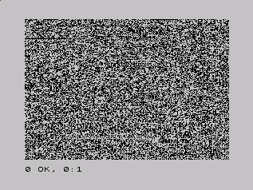
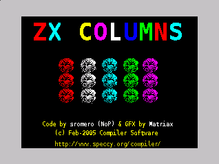
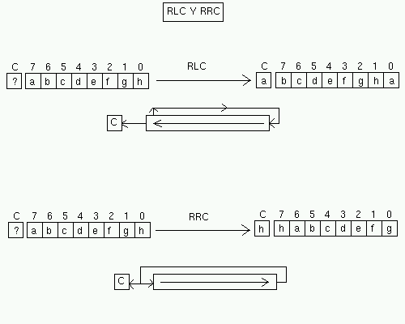
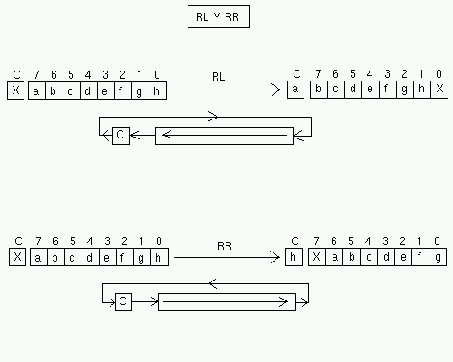
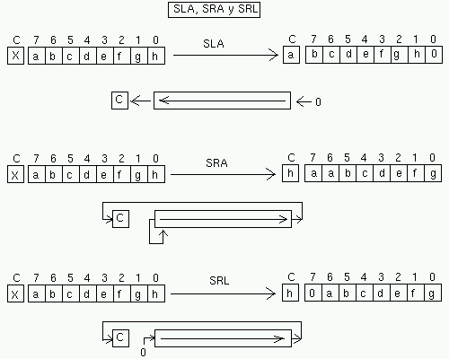

Lenguaje Ensamblador del Z80 (II)
===========================================

Desplazamientos de memoria, manipulación de bits y operaciones lógicas
----------------------------------------------------------------------------

En el anterior capítulo comenzamos nuestra andadura en el lenguaje ensamblador del Z80 por medio de las instrucciones de carga (LD), operaciones aritméticas (*ADD*, *ADC*, *SUB*, *SBC*, *INC*, *DEC*) y de intercambio (*EXX* y *EX*). Mientras se introducían las diferentes instrucciones, mostramos la manera de emplear los registros y cómo los resultados podían afectar a los flags del registro F, mediante las “tablas de afectación de flags”.

Toda la teoría explicada en el anterior capítulo del curso nos permitirá avanzar ahora mucho más rápido, ya que con todos los conceptos asimilados podemos ir realizando una rápida introducción a nuevas instrucciones, bastando ahora con una simple descripción de cada una de ellas. Las tablas de afectación de flags y comentarios sobre los operandos permitidos (o prohibidos) para cada una de ellas completarán la formación necesaria.

Para poder continuar con éste y posteriores capítulos del curso será imprescindible haber comprendido y asimilado todos los conocimientos de las entregas anteriores, de modo que si no es así, recomendamos al lector que relea las entregas 1, 2 y 3, y que se asegure de comprender todos los conceptos explicados.

En esta entrega trataremos las operaciones con bits (*NEG*, *CPL*, *BIT*, *SET* y *RES*), las operaciones lógicas (*AND*, *OR* y *XOR*) y las operaciones de desplazamiento de bits (*RR*, *RL*, *RLC*, *RRC*, *SLA*, *SRA* y *SRL*).

No obstante, antes de pasar a hablar de las operaciones con bits finalizaremos con la descripción de las instrucciones de carga (en este caso las repetitivas), y veremos 4 instrucciones muy sencillas: *SCF*, *CCF*, *NOP* y *DAA*.

Instrucciones de desplazamiento de memoria
----------------------------------------------

Ya conocemos la existencia de las instrucciones de carga (LD), que nos permitían mover valores entre 2 registros o entre la memoria y los registros. Lo que vamos a ver a continuación es cómo podemos copiar un byte de una posición de memoria a otra, con una sóla instrucción.

Las 2 instrucciones que vamos a describir: LDI y LDD, no admiten parámetros. Lo que hacen estas instrucciones es:

*LDI (Load And Increment)*:

* Leer el byte de la posición de memoria apuntada por el registro HL.
* Escribir ese byte en la posición de memoria apuntada por el registro DE.
* Incrementar DE en una unidad (DE=DE+1).
* Incrementar HL en una unidad (HL=HL+1).
* Decrementar BC en una unidad (BC=BC-1).

*LDD (Load And Decrement)*:

* Leer el byte de la posición de memoria apuntada por el registro HL.
* Escribir ese byte en la posición de memoria apuntada por el registro DE.
* Decrementar DE en una unidad (DE=DE-1).
* Decrementar HL en una unidad (HL=HL-1).
* Decrementar BC en una unidad (BC=BC-1).

En pseudocódigo::

    LDI:    Copiar [HL] en [DE]
            DE=DE+1
            HL=HL+1
            BC=BC-1

    LDD:    Copiar [HL] en [DE]
            DE=DE-1
            HL=HL-1
            BC=BC-1

Estas instrucciones lo que nos permiten es copiar datos de una zona de la memoria a otra. Por ejemplo, supongamos que queremos copiar el byte contenido en 16384 a la posición de memoria 40000:

.. code-block:: tasm

    LD HL, 16384
    LD DE, 40000
    LDI

¿Qué tiene de especial LDI con respecto a realizar la copia a mano con operaciones LD? Pues que al incrementar HL y DE, lo que hace es apuntar a los siguientes elementos en memoria (HL=16385 y DE=40001), con lo cual nos facilita la posibilidad de copiar múltiples datos (no sólo 1), con varios LDI. Lo mismo ocurre con LDD, que al decrementar DE y HL los hace apuntar a los bytes anteriores de origen y destino.

Pero para facilitarnos aún más la tarea de copia (y no tener que realizar bucles manualmente), el Z80 nos proporciona las instrucciones LDIR y LDDR, que funcionan igual que LDI y LDD pero copiando tantos bytes como valor contenga el registro BC. Es decir::

    LDIR = Repetir LDI hasta que BC valga 0
            = Repetir:
                Copiar [HL] en [DE]
                DE=DE+1
                HL=HL+1
                BC=BC-1
            Hasta que BC = 0

    LDDR = Repetir LDD hasta que BC valga 0
            = Repetir:
                Copiar [HL] en [DE]
                DE=DE-1
                HL=HL-1
                BC=BC-1
            Hasta que BC = 0

Estas instrucciones son enormemente útiles porque nos permiten copiar bloques de datos desde una zona de la memoria a otra. Por ejemplo, podemos hacernos una copia del estado de la pantalla en una zona de memoria mediante:

.. code-block:: tasm

    LD HL, 16384
    LD DE, 50000
    LD BC, 6912
    LDIR

Con el anterior programa, copiamos los 6912 bytes que hay a partir de la dirección de memoria 16384 (la pantalla) y los almacenamos a partir de la dirección 50000. De este modo, desde 50000 a 56912 tendremos una copia del estado de la pantalla (podría servir, por ejemplo, para modificar cosas en esta “pantalla virtual” y después copiarla de nuevo a la videoram, tomando HL=50000 y DE=16384).

Para demostrar esto, ensamblemos y ejecutemos el siguiente ejemplo:

.. code-block:: tasm

    ; Ejemplo de LDIR donde copiamos 6144 bytes de la ROM
    ; a la videomemoria. Digamos que "veremos la ROM" :)
    ORG 40000

    LD HL, 0         ; Origen: la ROM
    LD DE, 16384     ; Destino: la VideoRAM
    LD BC, 6144      ; toda la pantalla
    LDIR             ; copiar

    RET

Este ejemplo copia el contenido de los primeros 6144 bytes de memoria (el inicio de la ROM) sobre la videomemoria, haciendo aparecer píxeles que se corresponden con los valores que hay en la rom (las instrucciones de arranque y el intérprete BASIC del Spectrum):

   Aspecto de la ROM al copiarla a la VRAM

   

Al probar el equivalente BASIC del ejemplo anterior se puede comprobar la diferencia de velocidad existente:

.. code-block:: basic

    10 REM Copiamos la ROM en la VideoRAM
    20 FOR I=0 TO 6144 : POKE (16384+I), (PEEK I) : NEXT I
    30 PAUSE 0
    RUN

Concluímos pues que en todas estas instrucciones de copia de memoria o transferencia, HL es el origen, DE el destino y BC el número de bytes a transferir. Con LDI y LDD sólo copiaremos 1 byte (independientemente del valor de BC, aunque lo decrementará), y con LDIR y LDDR copiaremos tantos bytes como valga BC, decrementando BC hasta que su valor llega a cero. Los flags quedarán afectados, especialmente con LDI y LDD para indicarnos mediante el registro P/V si BC ha llegado a cero.

==============   ====== ====== ====== ====== ====== ====== 
Instrucción      Flag S Flag Z Flag H Flag P Flag N Flag C
==============   ====== ====== ====== ====== ====== ====== 
LDI                -      -      0      *       0      -
LDD                -      -      0      *       0      -
LDDR               -      -      0      0       0      -
LDIR               -      -      0      0       0      -
==============   ====== ====== ====== ====== ====== ====== 

Recordemos el significado de los símbolos de la tabla de afectación de flags (válido para todas las tablas de instrucciones que utilizaremos a lo largo del curso)::

    - = El flag NO se ve afectado por la operación.
    * = El flag se ve afectado por la operación acorde al resultado.
    0 = El flag se pone a cero.
    1 = El flag se pone a uno.
    V = El flag se comporta como un flag de Overflow acorde al resultado.
    P = El flag se comporta como un flag de Paridad acorde al resultado.
    ? = El flag toma un valor indeterminado.

Una duda que puede asaltarle al lector es: “si tenemos LDIR para copiar bloques, ¿para qué nos puede servir LDDR? ¿No es una instrucción redundante, que podemos no necesitar nunca gracias a LDIR? La respuesta es que LDDR es especialmente útil cuando hay que hacer copias de bloques de datos que se superponen.

Supongamos que tenemos que realizar una copia de 1000 bytes desde 25000 hasta 25100. Preparamos para ello el siguiente código:

.. code-block:: tasm

    LD HL, 25000
    LD DE, 25100
    LD BC, 1000
    LDIR

Este código no funcionará como esperamos: ambas zonas se superponen, con lo cual si lo ejecutamos, ocurrirá lo siguiente::

    El byte en [25000] se copiará a [25100].
    El byte en [25001] se copiará a [25101].
    etc…

¿Qué ocurrirá cuando LDIR llegue al byte número 25100 y lo intente copiar a 25200? Sencillamente, que hemos perdido el contenido REAL del byte número 25100, porque fue machacado al principio de la ejecución del LDIR por el byte contenido en [25000]. No estamos moviendo el bloque correctamente, porque las zonas se superponen y cuando llegamos a la zona destino, estamos copiando bytes que movimos desde el origen.

Para ello, lo correcto sería utilizar el siguiente código de “copia hacia atrás”:

.. code-block:: tasm

    LD HL, 25999
    LD DE, 25099
    LD BC, 1000
    LDDR

Es decir, apuntamos HL y DE al final de los 2 bloques de copia, y copiamos los bloques desde abajo, decrementando. De este modo nunca sobreescribimos con un dato ninguna posición de memoria que vayamos a copiar posteriormente.

En este ejemplo::

    El byte en [26000] se copia en [26100].
    El byte en [25999] se copia en [26099].
    El byte en [25998] se copia en [26098].
    (…)
    El byte en [25001] se copia en [25101].
    El byte en [25000] se copia en [25100].

Que es, efectivamente, lo que queríamos hacer, pero sin perder datos en la copia: copiar 1000 bytes desde 25000 a 25100 (sólo que realizamos la copia de abajo a arriba). 

Un ejemplo de rutina con LDIR
----------------------------------

Vamos a ver un ejemplo de rutina en ensamblador que utiliza LDIR con un propósito concreto: vamos a cargar una pantalla de carga (por ejemplo, para nuestros juegos) de forma que no aparezca poco a poco como lo haría con LOAD ”“ SCREEN$, sino que aparezca de golpe.

Para eso lo que haremos será lo siguiente:

Crearemos una rutina en ensamblador que copiará 6912 bytes desde la dirección 50000 hasta la posición 16384 (la videoram). La rutina ya la hemos visto:

.. code-block:: tasm

    ORG 40000
    LD HL, 50000     ; Origen: 50000
    LD DE, 16384     ; Destino: la VideoRAM
    LD BC, 6912      ; toda la pantalla
    LDIR             ; copiar
    RET

La ensamblamos con pasmo a formato binario (pasmo carga.asm carga.bin) y obtenemos el siguiente código máquina (que podremos ver con hexedit, hexdump o cualquier otro editor/visor hexadecimal)::

    33, 80, 195, 17, 0, 64, 1, 0, 27, 237, 176, 201

Nos crearemos un cargador BASIC que realice el trabajo de pokear nuestra rutina en 40000 y cargar la pantalla en 50000:

.. code-block:: basic

    10 REM Ejemplo de volcado de pantalla de carga
    20 CLEAR 39999
    30 DATA 33, 80, 195, 017, 0, 64, 1, 0, 27, 237, 176, 201
    40 FOR I=0 TO 11 : READ OPCODE : POKE 40000+I, OPCODE : NEXT I
    50 LOAD "" CODE 50000, 6912
    60 RANDOMIZE USR 40000
    70 PAUSE 0

Grabamos este cargador en cinta (o tap/tzx), y a continuación, tras el cargador, grabamos una pantalla de carga, que es cargada desde cinta en la dirección de memoria 50000 con la sentencia BASIC LOAD ”“ CODE.

Ejecutamos el programa resultante en emulador o Spectrum, y veremos cómo la carga de la pantalla no puede verse en el monitor. Cuando está termina su carga, la rutina ensamblador se ejecuta y se vuelca, de golpe, a la videoram (estad atentos a la carga, porque el volcado es muy rápido). 

   La pantalla de carga de ZXColumns, volcada a VideoRAM

Algunas instrucciones especiales
------------------------------------

Antes de comenzar con las instrucciones de manipulación de registros y datos a nivel de bits vamos a ver una serie de instrucciones difíciles de encuadrar en futuros apartados y que pueden sernos de utilidad en nuestros programas:

* SCF: Set Carry Flag : Esta instrucción (que no admite parámetros) pone a 1 el Carry Flag del registro F. Puede sernos útil en determinadas operaciones aritméticas.
* CCF: Complement Carry Flag : Esta instrucción (que tampoco admite parámetros) invierte el estado del bit de Carry Flag: si está a 1 lo pone a 0, y viceversa. Puede servirnos para poner a 0 el carry flag mediante la combinación de SCF + CCF, aunque esta misma operación se puede realizar con un simple “AND A”.
* NOP: No OPeration : Esta instrucción especial del microprocesador ocupa un byte en el código (opcode $00) y no efectúa ninguna operación ni afecta a ningún flag. En cambio, se toma 4 t-states (t-estados, o ciclos del procesador) para ejecutarse, debido al ciclo de fetch/decode/execute del procesador. ¿Para qué puede servir una instrucción que no realiza ninguna acción y que requiere tiempo del procesador (aunque sea muy poco) para ejecutarse? Por un lado, podemos utilizarla en bucles de retardos (varios NOPs ejecutados en un bucle que se repita varias veces) para poner retardos en nuestros programas o juegos. Por otro, como ocupa un byte en memoria (en el código) y no realiza ninguna operación, podemos utilizarla para rellenar zonas de nuestro código, y así alinear código posterior en una determinada dirección que nos interese.
* DAA: Decimal Adjust Accumulator : Esta instrucción permite realizar ajustes en los resultados de operaciones con números BCD (tras operaciones aritméticas). ¿Qué son los números en formato BCD? Es una manera de representar números en los registros (o memoria) de forma que de los 8 bits de un byte se utilizan los 4 bits del 0 al 3 para representar un número del 0 al 9 (4 bits = desde 0000 hasta 1111), y los 4 bits del bit 4 al 7 para representar otro número del 0 al 9. A los 2 números BCD juntos se les llama “Byte BCD” o “números en formato BCD”. Un número BCD puede estar formado por varios bytes BCD, siendo cada byte 2 cifras del mismo. Así, para representar un número de 10 cifras en BCD sólo es necesario utilizar 5 bytes. Además, podemos utilizar un byte extra que indique la posición de la “coma decimal” para así poder trabajar con números decimales en ensamblador. Si queremos realizar operaciones entre este tipo de números deberemos programarnos nosotros mismos las rutinas para realizarlas.

A lo largo del curso no utilizaremos números en BCD y por lo tanto es muy probable que no lleguemos a utilizar DAA, pero conviene saber que el Z80 nos brinda la oportunidad de utilizar números más grandes de 16 bits, operando con números en BCD. Para realizar juegos normalmente no necesitaremos de estas instrucciones.

Todas estas instrucciones afectan a los flags de la siguiente manera:

==============   ====== ====== ====== ====== ====== ====== 
Instrucción      Flag S Flag Z Flag H Flag P Flag N Flag C
==============   ====== ====== ====== ====== ====== ====== 
SCF                -     -       0      -      0      1
CCF                -     -       ?      -      0      *
NOP                -     -       -      -      -      -
DAA                *     *       *      P      -      *
==============   ====== ====== ====== ====== ====== ====== 

Operaciones con bits
--------------------------

El conjunto de instrucciones que vamos a ver hoy está pensado para trabajar con los bits individuales de un registro: invertir los bits de un registro, obtener el complemento a dos de un registro y poner a 0 o a 1, o comprobar, un determinado bit de un registro.

CPL y NEG
~~~~~~~~~~~~~~~~~~~~

CPL es una instrucción que se usa para obtener el inverso en bits del registro A. No admite parámetros (el operando destino es el registro A) y cuando la ejecutamos, se invierte el estado de cada uno de los bits de A, de forma que los unos pasan a valer cero, y los ceros, uno. 

.. code-block:: tasm

    LD A, %10000001
    CPL                 ; A = %01111110

La tabla de afectación de flags de CPL es:

==============   ====== ====== ====== ====== ====== ====== 
Instrucción      Flag S Flag Z Flag H Flag P Flag N Flag C
==============   ====== ====== ====== ====== ====== ====== 
CPL                -      -      1      -      1      -
==============   ====== ====== ====== ====== ====== ====== 

Es decir, se deja a uno el flag de Resta (N) y el de HalfCarry (H). El resto de flags no se ven afectados.

Existe una instrucción similar a CPL, pero que además de realizar la inversión de unos y ceros suma 00000001 al resultado de la inversión del registro A. Esta instrucción es NEG. El resultado es que en A obtenemos el valor negativo del número en complemento a dos almacenado en este registro (A = -A).

Por ejemplo:

.. code-block:: tasm

    LD A, 1        ; A = +1
    NEG            ; A = -1 = %11111111

La tabla de afectación de flags de NEG es:

==============   ====== ====== ====== ====== ====== ====== 
Instrucción      Flag S Flag Z Flag H Flag P Flag N Flag C
==============   ====== ====== ====== ====== ====== ====== 
CPL                *      *      *      V       1      *
==============   ====== ====== ====== ====== ====== ====== 
   
SET, RES y BIT
~~~~~~~~~~~~~~~~~~~~

Las siguientes instrucciones que vamos a ver nos permitirán el manejo de cualquiera de los bits de un registro o posición de memoria: activar un bit (ponerlo a uno), desactivar un bit (ponerlo a cero), o comprobar su valor (averiguar si es cero o uno) afectando a los flags.

Comencemos con “SET”. Esta instrucción activa (pone a valor 1) uno de los bits de un registro o dirección de memoria. El formato de la instrucción es::

    SET bit, DESTINO

donde Bit es un número entre 0 (el bit menos significativo o bit 0) y 7 (el de más valor o más significativo), y destino puede ser cualquier registro de 8 bits (A, B, C, D, E, H y L), una dirección de memoria apuntada por HL (es decir, el destino puede ser [HL]), o una dirección de memoria indexada por [IX+N] o [IY+N]. Con esto, las siguientes instrucciones serían válidas:

.. code-block:: tasm

    SET 5, A         ; Activar el bit 5 del registro A
    SET 0, H         ; Activar el bit 0 del registro H
    SET 7, [HL]      ; Activar el bit 7 del dato contenido en
                    ; la dirección de memoria apuntada por HL
    SET 1, [IX+10]   ; Activar el bit 1 del dato en [IX+10]

La instrucción opuesta a SET es RES (de reset), que pone a cero el bit indicado del destino especificado. Su formato es igual que el de SET, como podemos ver en los siguientes ejemplos::

    RES bit, DESTINO
 
.. code-block:: tasm

    RES 0, H         ; Desactivar el bit 0 del registro H
    RES 7, [HL]      ; Desactivar el bit 7 del dato contenido en
                    ; la dirección de memoria apuntada por HL
    RES 1, [IX-5]    ; Desactivar el bit 0 del dato en [IX-5]

SET y RES no afectan a los flags, como podemos ver en su tabla de afectación de indicadores:

==============   ====== ====== ====== ====== ====== ====== 
Instrucción      Flag S Flag Z Flag H Flag P Flag N Flag C
==============   ====== ====== ====== ====== ====== ====== 
SET b, s           -      -      -      -      -      -
RES b, s           -      -      -      -      -      -
==============   ====== ====== ====== ====== ====== ====== 

La última instrucción de manipulación de bits individuales que veremos en este apartado es BIT. Esta instrucción modifica el flag de cero (Z) y deja su valor en 0 ó 1 dependiendo del valor del bit que estamos probando. Si estamos probando, por ejemplo, el bit 5 del registro A, ocurrirá lo siguiente:

* Si el bit 5 del registro A es cero: el Flag Z se pone a 1.
* Si el bit 5 del registro A es uno: el flag Z se pone a 0.

En otras palabras, Z toma la inversa del valor del Bit que comprobamos: esto es así porque Z no es una COPIA del bit que estamos testeando, sino el resultado de evaluar si dicho bit es cero o no, y una evaluación así pone a uno el flag Z sólo cuando lo que se evalúa es cero.

Su formato es::

    BIT bit, DESTINO

El destino puede ser el mismo que en SET y RES: un registro, posición de memoria apuntado por HL o posición de memoria apuntada por un registro índice más un desplazamiento.

Por ejemplo:

.. code-block:: tasm

    LD A, 8       ; A = %00001000
    BIT 7, A      ; El flag Z vale 1
                ; porque el bit 7 es 0
    BIT 3, A      ; El flag Z vale 0
                ; porque el bit 3 no es 0
                ; (es 1).

El lector se preguntará ... ¿cuál es la utilidad de BIT? Bien, el hecho de que BIT modifique el Zero Flag de acuerdo al bit que queremos comprobar nos permitirá utilizar instrucciones condicionales para realizar muchas tareas. Por ejemplo, podemos comprobar el bit 0 de un registro (algo que nos permitiría saber si es par o impar) y en caso de que se active el flag de Zero (Si z=1, el bit 0 vale 0, luego es par), realizar un salto a una determinada línea de programa.

Por ejemplo:

.. code-block:: tasm

    BIT 0, A      ; Que valor tiene el bit 0?
                ; Ahora Z = NEG del bit 0 de A.
    JP Z es_par   ; Saltar si esta Z activado
                ; (si Z=1 -> salta a es_par)
                ; ya que si Z=1, es porque el bit era 0

Esta instrucción es, como veremos en muchas ocasiones, muy útil, y como ya hemos dicho sí que altera el registro F:

==============   ====== ====== ====== ====== ====== ====== 
Instrucción      Flag S Flag Z Flag H Flag P Flag N Flag C
==============   ====== ====== ====== ====== ====== ====== 
BIT b, s           ?      *      1      ?      0      -
==============   ====== ====== ====== ====== ====== ====== 

Rotacion de bits
----------------------

El siguiente set de instrucciones que veremos nos permitirá ROTAR (ROTATE) los bits de un dato de 8 bits (por ejemplo, almacenado en un registro o en memoria) hacia la izquierda o hacia la derecha.

RLC, RRC, RL y RC
~~~~~~~~~~~~~~~~~~~~~~~~~~

Para realizar esta tarea tenemos disponibles 2 instrucciones básicas: RLC y RRC. La primera de ellas, RLC, rota el registro o dato en un bit a la izquierda (RLC = Rotate Left Circular), y la segunda lo hace a la derecha::

    Bit      7 6 5 4 3 2 1 0                 7 6 5 4 3 2 1 0
            ----------------- -> RLC ->     -----------------
    Valor    a b c d e f g h                 b c d e f g h a

    Bit      7 6 5 4 3 2 1 0                 7 6 5 4 3 2 1 0
            ----------------- -> RRC ->     -----------------
    Valor    a b c d e f g h                 h a b c d e f g

Así, RLC de 00000001 daría como resultado 00000010. Como la rotación es circular, todos los bits se mueven una posición a la izquierda y el bit 7 se copia en el bit 0. Asímismo, RRC de 00000001 daría como resultado 10000000, ya que el bit 0 al rotarse a la derecha (como todos los demás bits) se copia donde estaba el bit 7. Cabe destacar que el Carry Flag se vé afectado, ya que el bit 7 en RLC y el 0 en RRC también se copiará allí. 

RLC y RRC
~~~~~~~~~~~~~~

Por ejemplo, supongamos el valor 10000001 almacenado en el registro B:

El resultado las 2 operaciones descritas sería:

.. code-block:: tasm

    LD B, %10000001   ; B = 10000001
    RLC B             ; B = 00000011

    LD B, %10000001   ; B = 10000001
    RRC B             ; B = 11000000

No sólo podemos rotar registros: en general el destino de la rotación podrá ser un registro, el contenido de la dirección de memoria apuntada por [HL], o bien el contenido de la memoria apuntada por un registro índice más desplazamiento ([IX+N] o [IY+N]). Más adelante veremos la tabla de afectación de flags de esta y otras instrucciones que veremos a continuación.

Además de RLC y RRC (rotación circular), tenemos disponibles 2 instrucciones más que nos permiten apoyarnos en el Carry Flag del registro F como si fuera un bit más de nuestro registro, comportándose como el noveno bit (de más valor) del registro: hablamos de las instrucciones RL y RC::

    Bit     C   7 6 5 4 3 2 1 0               C   7 6 5 4 3 2 1 0
        ---------------------- ->  RL  ->  ---------------------
    Valor   X   a b c d e f g h               a   b c d e f g h X

    Bit     C   7 6 5 4 3 2 1 0               C   7 6 5 4 3 2 1 0
        ---------------------- ->  RR  ->  ---------------------
    Valor   X   a b c d e f g h               h   X a b c d e f g

El CarryFlag hace de bit extra: por un lado se copia al Bit 0 o al Bit 7 según estemos rotando a izquierda o a derecha, y por otra parte recibe el valor del bit 7 del bit 0 (respectivamente para RL y RR). 

Por ejemplo, supongamos el valor 10000001 almacenado en el registro B y que el carry flag estuviera a uno:

El resultado las 2 operaciones descritas sería:

.. code-block:: tasm

    SCF              ; Set Carry Flag (hace C=1)
    LD B, %00000010  ; B = 00000010
    RL B             ; B = 00000101 y C=0 (del bit 7)

    SCF              ; Set Carry Flag (hace C=1)
    LD B, %01000001  ; B = 01000000
    RR B             ; B = 10100000 y C=1 (del bit 0)

Así pues, RLC y RRC son circulares y no utilizan el Carry Flag, mientras que RR y RL sí que lo utilizan, como un bit extra. Utilizando RR/RL 9 veces o bien RLC/RRC 8 veces sobre un mismo registro obtenemos el valor original antes de comenzar a rotar.

Veamos la tabla de afectación de flags de estas nuevas instruccion

==============   ====== ====== ====== ====== ====== ====== 
Instrucción      Flag S Flag Z Flag H Flag P Flag N Flag C 
==============   ====== ====== ====== ====== ====== ====== 
RLC s              *      *      0      P      0      *
RRC s              *      *      0      P      0      *
RL s               *      *      0      P      0      *
RR s               *      *      0      P      0      *
==============   ====== ====== ====== ====== ====== ====== 

El destino “s” puede ser cualquier registro de 8 bits, memoria apuntada por HL o registros índice con desplazamiento. Como veis hay muchos flags afectados, y en esta ocasión el flag P/V ya no nos sirve para indicar desbordamientos sino que su estado nos da la PARIDAD del resultado de la operación de rotación. Con el flag P a uno, tenemos paridad par (even), es decir, el número de bits a uno en el resultado es par. Si está a cero significa que el número de bits a uno en el resultado es impar.

RLA, RRA, RLCA y RRCA
~~~~~~~~~~~~~~~~~~~~~~~~

Aunque pueda parecer sorprendente (ya que podemos utilizar las 4 operaciones anteriores con el registro A como operando), existen 4 instrucciones más dedicadas exclusivamente a trabajar con “A”: hablamos de RLA, RRA, RLCA y RRCA. La diferencia entre estas 4 instrucciones y su versión con un espacio en medio (RL A, RR A, RLC A y RRC A) radica simplemente en que las nuevas 4 instrucciones alteran los flags de una forma diferente:

==============   ====== ====== ====== ====== ====== ====== 
Instrucción      Flag S Flag Z Flag H Flag P Flag N Flag C 
==============   ====== ====== ====== ====== ====== ====== 
RLA               -       -      0      -      0      *
RRA               -       -      0      -      0      *
RLCA              -       -      0      -      0      *
RRCA              -       -      0      -      0      *
==============   ====== ====== ====== ====== ====== ====== 

RLD y RRD
~~~~~~~~~~~~~~

Y para acabar con las instrucciones de rotación, tenemos RLD y RRD, que realiza una rotación entre A y el contenido de la memoria apuntada por HL.

Concretamente, RRD lo que hace es:

* Leer el dato contenido en la dirección de memoria apuntada por HL.
* Coger los 4 bits más significativos (bit 4-7) de ese valor.
* Rotar A hacia la izquierda 4 veces (copiando los bits 0-3 en las posiciones 4-7).
* Copiar los 4 bits extraídos de la memoria en los 4 bits menos significativos de A.

Resumiendo, supongamos los siguientes valores de A y [HL]::

    Registro A:   Bit 7 6 5 4 3 2 1 0
                --------------------
                    a b c d e f g h

    [HL]:         Bit 7 6 5 4 3 2 1 0
                --------------------
                    s t u v w x y z

Resultado de RRD:: 

    Registro A:   Bit 7 6 5 4 3 2 1 0
                --------------------
                    e f g h s t u v

    Resultado de RLD:

    Registro A:   Bit 7 6 5 4 3 2 1 0
                --------------------
                    s t u v e f g h

En pseudocódigo C:: 

    RRD:  A = ( A<<4 )    | ([HL]>>4)
    RLD:  A = ( [HL]<<4 ) | (A & 0x0F)

La afectación de flags sería:

==============   ====== ====== ====== ====== ====== ====== 
Instrucción      Flag S Flag Z Flag H Flag P Flag N Flag C 
==============   ====== ====== ====== ====== ====== ====== 
RLD                *      *       0     P      0      -
RRD                *      *       0     P      0      -
==============   ====== ====== ====== ====== ====== ====== 

Aunque ahora todo este conjunto de instrucciones pueda parecernos carente de utilidad, lo que hace el microprocesador Z80 es proveernos de toda una serie de pequeñas herramientas (como estas de manipulación, chequeo y rotación de bits) para que con ellas podamos resolver cualquier problema, mediante la combinación de las mismas. Os aseguramos que en más de una rutina tendréis que usar instrucciones de rotación o desplazamiento. 

Desplazamiento de bits
---------------------------

El siguiente set de instrucciones que veremos nos permitirá DESPLAZAR (SHIFT) los bits de un dato de 8 bits (por ejemplo, almacenado en un registro o en memoria) hacia la izquierda o hacia la derecha. Desplazar es parecido a rotar, sólo que el desplazamiento no es circular; es decir, los bits que salen por un lado no entran por otro, sino que entran ceros en el caso de desplazar a la izquierda, o copias del bit 7 en el caso de desplazar a la derecha::

    00010001 DESPLAZADO A LA IZQUIERDA es 00100010
    (movemos todos los bits hacia la izquierda y el bit 0 
    entra como 0. El bit 7 se copia al Carry)

    00001001 DESPLAZADO A LA DERECHA es 00000100
    (el 0 del bit 7 del resultado entra nuevo, el 1 del 
    bit 0 origen se pierde, el cuarto se desplaza)

Las instrucciones de desplazamiento a izquierda y derecha en Z80 se llaman SLA (Shift Left Arithmetic) y SRA (Shift Right Arithmetic), y su formato es:

.. code-block:: tasm

    SRA operando
    SLA operando

Donde operando puede ser el mismo tipo de operando que en las instrucciones de rotación: un registro de 8 bits, [HL] o [IX/IY+N]. Lo que realizan estas operaciones sobre el dato operando es::

    Bit 7 6 5 4 3 2 1 0                C    7 6 5 4 3 2 1 0
        ----------------- -> SLA ->  ------------------------
        a b c d e f g h                a    b c d e f g h 0

Literalmente::

    Rotar los bits a la izquierda (<<).
    El bit “a” (bit 7) se copia al Carry Flag.
    Por la derecha entra un cero.

    Bit 7 6 5 4 3 2 1 0                C    7 6 5 4 3 2 1 0
        ----------------- -> SRA ->  ------------------------
        a b c d e f g h                h    a a b c d e f g

Literalmente:

* Rotar los bits a la derecha (»).
* El bit “h” (bit 0) se copia al Carry Flag.
* En la izquierda (bit 7) se mantiene su valor anterior.

Nótese pues que SLA y SRA nos permiten trabajar también con números negativos. En el caso de SLA se utiliza el carry flag para almacenar el estado del bit 7 tras la rotación (con lo cual podemos conservar el signo si sabemos dónde buscarlo). En el caso de SRA, porque el bit 7 además de desplazarse hacia la derecha se mantiene en su posición (manteniendo el signo).

El hecho de desplazar un número binario una posición a izquierda o derecha tiene una curiosa propiedad: *el número resultante es el original multiplicado o dividido por 2*.

Pensemos un poco en nuestro sistema decimal: si tenemos un determinado número y desplazamos todos los dígitos una posición a la izquierda y añadimos un cero, lo que está sucediendo es que multiplicamos el valor del número por la base (10)::

    1 5  -> Desplazar y añadir cero  ->  1 5 0
    (equivale a multiplicar por la base, es decir, por 10)

Si desplazamos el número a la derecha, por contra, estamos dividiendo por la base::

    1 5 2 -> Desplazar y añadir cero -> 0 1 5
    (equivale a dividir por la base, es decir, por 10).

En binario ocurre lo mismo: al desplazar un byte a la izquierda estamos multiplicando por 2 (por la base), y al hacerlo a la derecha estamos dividiendo por 2 (siempre divisiones enteras). Veamos unos ejemplos::

    33 = 00100001
             << 1   (<< significa desplazamiento de bits a izquierda)
     ------------
         01000010 = 66 (33*2)

    14 = 00001110
            >> 1   (>> significa desplazamiento de bits a derecha)
     ------------
         00000111 = 7 (14/2)

Cada vez que realizamos un desplazamiento estamos multiplicando o dividiendo el resultado por dos, de forma que: 

==================  ====================    =======================
Dirección Desplaz.  Núm. desplazamientos    Operación (con SLA)
==================  ====================    =======================
Izquierda (<<)               1                N = N*2
Izquierda (<<)               2                N = (N*2)*2 = N*4
Izquierda (<<)               3                N = ((N*2)*2)*2 = N*8
Izquierda (<<)               4                N = (…) N*16
Izquierda (<<)               5                N = (…) N*32
Izquierda (<<)               6                N = (…) N*64
Izquierda (<<)               7                N = (…) N*128 
==================  ====================    =======================

==================  ====================    =======================
Dirección Desplaz.  Núm. desplazamientos     Operación (con SRA)
==================  ====================    =======================
Derecha (>>)               1                N = N/2
Derecha (>>)               2                N = (N/2)/2 = N/4
Derecha (>>)               3                N = ((N/2)/2)/2 = N/8
Derecha (>>)               4                N = (…) N/16
Derecha (>>)               5                N = (…) N/32
Derecha (>>)               6                N = (…) N/64
Derecha (>>)               7                N = (…) N/128 
==================  ====================    =======================

Así, desplazar una vez a la izquierda equivale a multiplicar por 2. Desplazar 2 veces, por 4. Desplazar 3 veces, por 8, etc. En resumen, desplazar un registro N veces a la izquierda equivale a multiplicarlo por 2 elevado a N. Lo mismo ocurre con el desplazamiento a derecha y la división.

De este modo, acabamos de descubrir una manera muy sencilla y efectiva (y rápida, muy rápida para el microprocesador) de efectuar multiplicaciones y divisiones por 2, 4, 8, 16, 32, 64 y 128.

Existe una pequeña variante de SRA llamada SRL que realiza la misma acción que SRA pero que, a diferencia de esta, lo que hace es introducir un cero a la izquierda (en lugar de copiar el bit de signo). La diferencia es que SRA es un desplazamiento aritmético (tiene en cuenta el signo) y SRL es un desplazamiento lógico (simplemente desplaza los bits)::

    Bit 7 6 5 4 3 2 1 0                C    7 6 5 4 3 2 1 0
        ----------------- -> SRL ->  ------------------------
        a b c d e f g h                h    0 a b c d e f g

Literalmente:

* Rotar los bits a la derecha (»).
* El bit “h” (bit 0) se copia al Carry Flag.
* Por la izquierda entra un cero.

   Instrucciones SLA, SRA y SRL