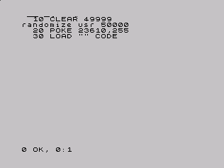

Lenguaje Ensamblador del Z80 (III)
================================================================================

Instrucciones condicionales
--------------------------------------------------------------------------------

Una vez hemos visto la mayoría de instrucciones aritméticas y lógicas, es el momento de utilizarlas como condicionales para realizar cambios en el flujo lineal de nuestro programa. En esta entrega aprenderemos a usar etiquetas y saltos mediante instrucciones condicionales (CP, JR + condición, JP + condición, etc.), lo que nos permitirá implementar en ensamblador las típicas instrucciones IF/THEN/ELSE y los GOTO de BASIC.

Las etiquetas en los programas ASM
--------------------------------------------------------------------------------

Las etiquetas son unas útiles directivas de los ensambladores que nos permitirán hacer referencia a posiciones concretas de memoria por medio de nombres, en lugar de tener que utilizar valores numéricos.

Veamos un ejemplo de etiqueta en un programa ensamblador: 

.. code-block:: tasm

        ORG 50000

        NOP
        LD B, 10
    bucle:
        LD A, 20
        NOP
        (...)
        JP bucle
        RET

Este es el código binario que genera el listado anterior al ser ensamblado::

    00 06 0a 3e 14 00 (...) c3 53 c3 c9

Concretamente: 

+-----------+----------+------------------+
| DIRECCIÓN | OPCODE   | INSTRUCCION      |
+===========+==========+==================+
| 50000     | 00       | NOP              |
+-----------+----------+------------------+
| 50001     | 06 0a    | LD B, 10         |
+-----------+----------+------------------+
| 50003     | 3e 14    | LD A, 20         |
+-----------+----------+------------------+
| 50004     | 00       | NOP              |
+-----------+----------+------------------+
| ...       | ...      | ...              |
+-----------+----------+------------------+
|           | c3 53 c3 | JP $C353 (53000) |
+-----------+----------+------------------+
| …+1       | c9       | RET              |
+-----------+----------+------------------+

Si mostramos las direcciones de memoria en que se ensambla cada instrucción, veremos:

.. code-block:: tasm

    50000   NOP              ; (opcode = 1 byte)
    50001   LD B, 10         ; (opcode = 2 bytes)
    50003   LD A, 20         ; (opcode = 2 bytes)
    50005   NOP              ; (opcode = 1 byte)
    50005   (más código)
    50006   (más código)
    .....
    50020   JP bucle
    50023   RET

¿Dónde está en ese listado de instrucciones nuestra etiqueta “bucle”? Sencillo: no está. No es ninguna instrucción, sino, para el ensamblador, una referencia a la celdilla de memoria 50003, donde está la instrucción que sigue a la etiqueta.

En nuestro ejemplo anterior, le decimos al programa ensamblador mediante ORG 50000 que nuestro código, una vez ensamblado, debe quedar situado a partir de la dirección 50000, con lo cual cuando calcule las direcciones de las etiquetas deberá hacerlo en relación a esta dirección de origen. Así, en nuestro ejemplo anterior la instrucción NOP, que se ensambla con el opcode $00, será “pokeada” (por nuestro cargador BASIC) en la dirección 50000. La instrucción LD B, 10, cuyo opcode tiene 2 bytes, será “pokeada” en 50001 y 50002, y así con todas las instrucciones del programa.

Cuando el ensamblador se encuentra la etiqueta “bucle:” después del “LD B, 10”, ¿cómo la ensambla? Supuestamente le corresponde la posición 50003, pero recordemos que esto no es una instrucción, sino una etiqueta: no tiene ningún significado para el microprocesador, sólo para el programa ensamblador. Por eso, cuando el ensamblador encuentra la etiqueta “bucle:”, asocia internamente esta etiqueta (el texto “bucle”) a la dirección 50003, que es la dirección donde hemos puesto la etiqueta.

Si la etiqueta fuera una instrucción, se ensamblaría en la dirección 50003, pero como no lo es, el programa ensamblador simplemente la agrega a una tabla interna de referencias, donde lo que anota es:

* La etiqueta “bucle” apunta a la dirección 50003

Lo que realmente ensamblará en la dirección 50003 (y en la 50004) es la instrucción siguiente: “LD A, 20”.

Pero, entonces, ¿para qué nos sirve la etiqueta? Sencillo: para poder hacer referencia en cualquier momento a esa posición de memoria (del programa, en este caso), mediante una cadena fácil de recordar en lugar de mediante un número. Es más sencillo recordar “bucle” que recordar “50003”, y si nuestro programa es largo y tenemos muchos saltos, funciones o variables, acabaremos utilizando decenas y centenares de números para saltos, con lo que el programa sería inmanejable.

El siguiente programa es equivalente al anterior, pero sin usar etiquetas:

.. code-block:: tasm
    
    ORG 50000

    NOP
    LD B, 10
    LD A, 20
    NOP
    (...)
    JP 50003
    RET

En este caso, “JP 50003” no permite distinguir rápidamente a qué instrucción vamos a saltar, mientras que la etiqueta “bucle” que utilizamos en el anterior ejemplo marcaba de forma indiscutible el destino del salto.

Las etiquetas son muy útiles no sólo por motivos de legibilidad del código. Imaginemos que una vez acabado nuestro programa sin etiquetas (utilizando sólo direcciones numéricas), con muchos saltos (JP, CALL, JR, DJNZ…) a diferentes partes del mismo, tenemos que modificarlo para corregir alguna parte del mismo. Al añadir o quitar instrucciones del programa, estamos variando las posiciones donde se ensambla todo el programa. Si por ejemplo, añadiéramos un NOP extra al principio del mismo, ya no habría que saltar a 50003 sino a 50004:

.. code-block:: tasm

    ORG 50000

    NOP
    NOP        ; Un NOP extra
    LD B, 10
    LD A, 20
    NOP
    (...)
    JP 50004   ; La dirección de salto cambia
    RET

Para que nuestro programa funcione, tendríamos que cambiar TODAS las direcciones numéricas de salto del programa, a mano (recalculandolas todas). Las etiquetas evitan esto, ya que es el programa ensamblador quien, en tiempo de ensamblado, cuando está convirtiendo el programa a código objeto, cambia todas las referencias a la etiqueta por el valor numérico correcto (por la posición donde aparece la etiqueta). Un “JP bucle” siempre saltaría a la dirección correcta (la de la posición de la etiqueta) aunque cambiemos la cantidad de instrucciones del programa.

Como veremos posteriormente, la instrucción JP realiza un salto de ejecución de código a una posición de memoria dada. Literalmente, un JP XX hace el registro PC = XX, de forma que alteramos el orden de ejecución del programa. Las etiquetas nos permiten establecer posiciones donde saltar en nuestro programa para utilizarlas luego fácilmente: 

.. code-block:: tasm
    
    ORG 50000
    
    ; Al salir de esta rutina, A=tecla pulsada
    RutinaLeerTeclado:
    (instrucciones)    ; Aquí código
    RET
    
    ; Saltar (JP) a esta rutina con:
    ;  HL = Sprite a dibujar
    ;  DE = Direccion en pantalla donde dibujar
    RutinaDibujarSprite:
    (...)
    bucle1:
        (instrucciones)
    bucle2:
        (instrucciones)
    pintar:
        (instrucciones)
        JP bucle1
    (...)
    salir:
    RET
    (etc...)

Así, podremos especificar múltiples etiquetas para hacer referencia a todas las posiciones que necesitemos dentro de nuestro programa.

Lo que nos tiene que quedar claro de este apartado son dos conceptos: cuando el ensamblador encuentra la definición de una etiqueta, guarda en una tabla interna la dirección de ensamblado de la siguiente instrucción a dicha etiqueta. Después, cada vez que hay una aparición de esa etiqueta en el código, sustituye la etiqueta por dicha dirección de memoria. Además, podemos utilizar la etiqueta incluso aunque la definamos después (más adelante) del código, ya que el ensamblador hace varias pasadas en la compilación: no es necesario primero definir la etiqueta y después hacer referencia a ella, podemos hacerlo también a la inversa.

Es decir, es válido tanto:

.. code-block:: tasm
    
    etiqueta:
        ;;; (más código)
        JP etiqueta

Como:

.. code-block:: tasm

        JP etiqueta
        ;;; (más código)
    etiqueta:

Como vamos a ver, también podemos utilizar etiquetas para referenciar a bloques de datos, cadenas de texto, gráficos y en general cualquier tipo de dato en crudo que queramos insertar dentro de nuestro programa.

Definir datos y referenciarlos con etiquetas
--------------------------------------------------------------------------------

Podemos insertar en cualquier posición de la memoria y de nuestro programa datos en formato numérico o de texto con directivas como **DB (DEFB), DW (DEFW) o DS (DEFS)**, y hacer referencia a ellos mediante etiquetas.

Por ejemplo: 

.. code-block:: tasm

 ; Principio del programa
 ORG 50000
 
   ; Primero vamos a copiar los datos a la videomemoria.
   LD HL, datos
   LD DE, 16384
   LD BC, 10
   LDIR
 
   ; Ahora vamos a sumar 1 a cada carácter:
   LD B, 27
bucle:
   LD HL, texto
   LD A, (HL)
   INC A
   LD (HL), A
 
   DJNZ bucle
   RET
   datos DB 0, $FF, $FF, 0, $FF, 12, 0, 0, 0, 10, 255
   texto DB "Esto es una cadena de texto"
 
   ; Fin del programa
   END

   Resultado de RANDOMIZE USR 50000 en nuestro programa

Como puede verse, con DB hemos “insertado” datos directamente dentro de nuestro programa. Estos datos se cargarán en memoria (pokeados) también como parte del programa, y podremos acceder a ellos posteriormente. Los datos, en nuestro programa, están situados en la memoria, justo después de las instrucciones ensambladas (tras el último RET). Podemos verlo si ensamblamos el programa::

    $ pasmo --bin db.asm db.bin

    $ hexdump -C db.bin
    00000000  21 66 c3 11 00 40 01 0a  00 ed b0 06 1b 21 71 c3  |!f...@.......!q.|
    00000010  7e 3c 77 10 f8 c9 00 ff  ff 00 ff 0c 00 00 00 0a  |~<w.............|
    00000020  ff 45 73 74 6f 20 65 73  20 75 6e 61 20 63 61 64  |.Esto es una cad|
    00000030  65 6e 61 20 64 65 20 74  65 78 74 6f              |ena de texto|
    0000003c

Si os fijáis, podemos ver el RET (201, o $C9) justo antes del bloque de datos FF, FF, 0, FF. Concretamente, la etiqueta “datos” en el programa hará referencia (al pokear el programa a partir de 50000), a la posición de memoria 50022, que contendrá el 00 inicial de nuestros datos DB.

Cuando en el programa hacemos “LD HL, datos”, el ensamblador transforma esa instrucción en realidad en “LD HL, 50022” (fijaos en el principio del programa: 21 66 C3, que corresponde a LD HL, C366, que es 50022). Gracias a esto podemos manipular los datos (que están en memoria) y leerlos y cambiarlos, utilizando un “nombre” como referencia a la celdilla de memoria de inicio de los mismos.

Lo mismo ocurre con el texto que se ha definido entre dobles comillas. A partir de la dirección definida por “texto” se colocan todos los bytes que forman la cadena “Esto es una cadena de texto”. Cada byte en memoria es una letra de la cadena, en formato ASCII (La “E” es $45, la “s” es $73“, etc.).

Con DB (o DEFB, que es un equivalente por compatibilidad con otros ensambladores) podremos definir:

* Cadenas de texto (todos los mensajes de texto de nuestros programas/juegos).
* Datos numéricos con los que trabajar (bytes, words, caracteres…).
* Tablas precalculadas para optimizar. Por ejemplo, podemos tener un listado como el siguiente::

     numeros_primos  DB  1, 3, 5, 7, 11, 13, (etc...)

* Variables en memoria para trabajar en nuestro programa:: 

    vidas  DB   3
    x      DB   0
    y      DB   0
    ancho  DB  16
    alto   DB  16
    (...)
    
    LD A, (vidas)
    (...)
    muerte:
    DEC A
    LD (vidas), A

* Datos gráficos de nuestros sprites (creados con utilidades como SevenuP o ZXPaintBrush, por ejemplo)::

    Enemigo:
        DB 12, 13, 25, 123, 210 (etc...)

Ahora bien, es muy importante tener clara una consideración: los datos que introducimos con DB (o DW, o cualquier otra directiva de inclusión) no se ensamblan, pero se insertan dentro del código resultante tal cual. Y el Z80 no puede distinguir un 201 introducido con DB de un opcode 201 (RET), con lo cual tenemos que asegurarnos de que dicho código no se ejecute, como en el siguiente programa:

.. code-block:: tasm

    ORG 50000
    
    ; Cuidado, al situar los datos aquí, cuando saltemos a 50000
    ; con RANDOMIZE USR 50000, ejecutaremos estos datos como si
    ; fueran opcodes.
    datos DB 00, 201, 100, 12, 255, 11
    
    LD B, A
    (más instrucciones)
    RET
 
Lo correcto sería:
 
.. code-block:: tasm
    
    ORG 50000

    ; Ahora el salto a 50000 ejecutará el LD B, A, no los
    ; datos que habíamos introducido antes.
    LD B, A
    (más instrucciones)
    RET

    ; Aquí nunca serán ejecutados, el RET está antes.
    datos DB 00, 201, 100, 12, 255, 11

Los microprocesadores como el Z80 no saben distinguir entre datos e instrucciones, y es por eso que tenemos que tener cuidado de no ejecutar datos como si fueran códigos de instrucción del Z80. De hecho, si hacemos un RANDOMIZE USR XX (siendo XX cualquier valor de la memoria fuera de la ROM), lo más probable es que ejecutemos datos como si fueran instrucciones y el Spectrum se cuelgue, ya que los datos no son parte de un programa, y la ejecución resultante de interpretar esos datos no tendría ningún sentido.

