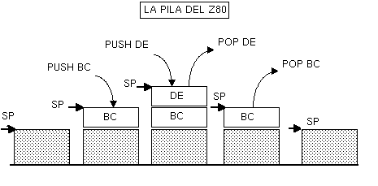

Lenguaje Ensamblador del Z80 (IV)
================================================================================

La pila y las llamadas a subrutinas
--------------------------------------------------------------------------------

La pila del Spectrum
~~~~~~~~~~~~~~~~~~~~~~~~~~~~~~~~~~~~~~~~~~~~~~~~~~~~~~~~~~~~~~~~~~~~~~~~~~~~~~~~

Este capítulo se centra en una de las estructuras más importantes del microprocesador Z80: la pila (o Stack en inglés).

La pila es una porción de memoria donde se pueden almacenar valores de 16 bits, apilados uno a continuación del siguiente.

Su nombre viene del hecho que los datos se almacenan unos “encima” de los otros, como, por ejemplo, en una pila de platos.

Cuando almacenamos un nuevo plato en una pila, lo dejamos en la parte superior de la misma, sobre el plato anterior. Cuando queremos coger un plato, cogemos el plato de arriba, el situado en la parte superior de la pila.

Es lo que se conoce como una estructura de datos “tipo LIFO” (“Last In, First Out”): el último que entró es el primero que sale. En nuestro ejemplo de los platos, efectivamente cuando retiramos un plato extraemos el que está arriba del todo, por lo que el primero en salir (First Out) es el último que habíamos dejado (Last In).

En una pila de ordenador (como en nuestra pila de datos) sólo podemos trabajar con el dato que está arriba del todo de la pila: no podemos extraer uno de los platos intermedios. Sólo podemos apilar un dato nuevo y desapilar el dato apilado arriba del todo de la pila.

La pila del Spectrum no es de platos sino de valores numéricos de 16 bits. Introducimos valores y sacamos valores mediante 2 instrucciones concretas: PUSH <valor> y POP <valor>, donde normalmente <valor> será un registro (metemos en la pila el valor que contiene un registro de 16 bits, o bien leemos de la pila un valor y lo asignamos a un registro de 16 bits).

Por ejemplo, podemos guardar el valor que contiene un registro en la pila si tenemos que hacer operaciones con ese registro para así luego recuperarlo tras realizar una determinada tarea:

.. code-block:: tasm

    LD BC, 1000
    PUSH BC         ; Guardamos el contenido de BC en la pila

    LD BC, 2000
    (...)           ; Operamos con BC 

    LD HL, 0
    ADD HL, BC      ; y ya podemos guardar el resultado de la operación
                    ; (recordemos que no existe "LD HL, BC", de modo que
                    ; lo almacenamos como HL = 0+BC

    POP BC          ; Hemos terminado de trabajar con BC, ahora
                    ; recuperamos el valor que tenia BC (1000).

La instrucción “PUSH BC” introduce en memoria, en lo alto de la pila, el valor contenido en BC (1000), que recuperamos posteriormente con el “POP BC”.

La realidad es que el Spectrum no tiene una zona de memoria especial o aislada de la RAM dedicada a la pila. En su lugar se utiliza la misma RAM del Spectrum (0-65535).

El Z80 tiene un registro conocido como SP (Stack Pointer), o puntero de pila, que es un registro de 16 bits que contiene una dirección de memoria. Esa dirección de memoria es “la cabeza de la pila”: apunta al próximo lugar donde almacenaremos un dato.

La peculiaridad de la pila del Spectrum es que crece hacia abajo, en lugar de hacia arriba. Veamos un ejemplo práctico: 

   Como crece y decrece la pila del Spectrum

Veámoslo con un ejemplo:

Supongamos que SP (puntero de pila) apunta a 65535 (la última posición de la memoria) y que tenemos los siguientes valores en BC y DE:

.. code-block:: tasm

    LD BC, $00FF
    LD DE, $AABB
    LD SP, 65535     ; Puntero de pila al final de la memoria

Si ahora hacemos:

.. code-block:: tasm

    PUSH BC          ; Apilamos el registro BC

Lo que estaremos haciendo es::

    SP   = SP - 2 = 65533
    (SP) =   BC   = $00FF

Con lo que el contenido de la memoria sería::
        

           Celdilla    Contenido
           -----------------------
           65534         $FF
    SP ->  65533         $00

Si a continuación hacemos otro PUSH:

.. code-block:: tasm

    PUSH DE          ; Apilamos el registro DE

Lo que estaremos haciendo es::

    SP   = SP - 2 = 65531
    (SP) =   DE   = $AABB

Con lo que el contenido de las celdillas de memoria sería::

            Celdilla    Contenido
            -----------------------
            65534         $FF
            65533         $00
            65532         $AA
    SP ->   65531         $BB

Si ahora hacemos un POP:

.. code-block:: tasm

    POP DE

Lo que hacemos es::

    DE =   (SP) = $AABB
    SP = SP + 2 = 65533

Y la memoria queda, de nuevo, como::
        
           Celdilla    Contenido
           -----------------------
           65534         $FF
    SP ->  65533         $00

Como podemos ver, PUSH apila valores, haciendo decrecer el valor de SP, mientras que POP recupera valores, haciendo crecer (en 2 bytes, 16 bits) el valor de SP.

PUSH y POP

Así pues, podemos hacer PUSH y POP de los siguientes registros:

    PUSH: AF, BC, DE, HL, IX, IY
    POP : AF, BC, DE, HL, IX, IY

Lo que hacen PUSH y POP, tal y como funciona la pila, es:

 PUSH xx :
   SP   = SP-2
   (SP) = xx
   
 POP xx :
   xx   = (SP)
   SP   = SP+2

Nótese cómo la pila se decrementa ANTES de poner los datos en ella, y se incrementa DESPUES de sacar datos de la misma. Esto mantiene siempre SP apuntando al TOS (Top Of Stack).

                        Flags 
   Instrucción       |S Z H P N C|
 ----------------------------------
 POP xx              |- - - - - -|
 PUSH xx             |- - - - - -|

Nótese que también podemos apilar y desapilar AF. De hecho, es una forma de manipular los bits del registro F (hacer PUSH BC con un valor determinado, por ejemplo, y hacer un POP AF).

Utilidad de la pila del Spectrum
--------------------------------------------------------------------------------

La pila resulta muy útil para gran cantidad de tareas en programas en ensamblador. Veamos algunos ejemplos:

* Intercambiar valores de registros mediante PUSH y POP. Por ejemplo, para intercambiar el valor de BC y de DE:

.. code-block:: tasm

    PUSH BC       ; Apilamos BC
    PUSH DE       ; Apilamos DE
    POP BC        ; Desapilamos BC 
                ; ahora BC=(valor apilado en PUSH DE)
    POP DE        ; Desapilamos DE
                ; ahora DE=(valor apilado en PUSH BC)

* Para manipular el registro F: La instrucción POP AF es la principal forma de manipular el registro F directamente (haciendo PUSH de otro registro y POP de AF).

* Almacenaje de datos mientras ejecutamos porciones de código: Supongamos que tenemos un registro cuyo valor queremos mantener, pero que tenemos que ejecutar una porción de código que lo modifica. Gracias a la pila podemos hacer lo siguiente:

.. code-block:: tasm

    PUSH BC       ; Guardamos el valor de BC
    
    (código)      ; Hacemos operaciones
    
    POP BC        ; Recuperamos el valor que teníamos en BC

Esto incluye, por ejemplo, el almacenaje del valor de BC en los bucles cuando necesitamos operador con B, C o BC:

.. code-block:: tasm

        LD A, 0
        LD B, 100
    bucle:
        PUSH BC         ; Guardamos BC
        LD B, 1
        ADD A, B
        POP BC          ; Recuperamos BC
        DJNZ bucle  

En este sentido, también podremos anidar 2 o más bucles que usen el registro B o BC con PUSH y POPs entre ellos. Supongamos un bucle BASIC del tipo:

.. code-block:: basic
        
    FOR I=0 TO 20:
        FOR J=0 TO 100:
            CODIGO
        NEXT J
    NEXT I

En ensamblador podríamos hacer:

.. code-block:: tasm

        LD B, 20                ; repetimos bucle externo 20 veces
    
    bucle_externo:
        PUSH BC                 ; Nos guardamos el valor de BC
        LD B, 100               ; Iteraciones del bucle interno
    bucle_interno:
        (... código ...)
        DJNZ bucle_interno      ; FOR J=0 TO 100
        POP BC                  ; Recuperamos el valor de B
    
        DJNZ bucle_externo      ; FOR I=0 TO 20

Hay que tener en cuenta que PUSH y POP implican escribir en memoria (en la dirección apuntada por SP), por que siempre serán más lentas que guardarse el valor actual de B en otro registro:

.. code-block:: tasm

        LD B, 20                ; repetimos bucle externo 20 veces
    
    bucle_externo:
        LD D, B                 ; Nos guardamos el valor de B
    
        LD B, 100               ; Iteraciones del bucle interno
    bucle_interno:
        (... código ...)        ; En este codigo no podemos usar D
        DJNZ bucle_interno      ; FOR J=0 TO 100
    
        LD B, D                 ; Recuperamos el valor de B
        DJNZ bucle_externo      ; FOR I=0 TO 20

No obstante, en múltiples casos nos quedaremos sin registros libres donde guardar datos, por lo que la pila es una gran opción. No hay que obsesionarse con no usar la pila porque implique escribir en memoria. A menos que estemos hablando de una rutina muy muy crítica, que se ejecute muchas veces por cada fotograma de nuestro juego, PUSH y POP serán las mejores opciones para preservar valores, con un coste de 11 t-estados para el PUSH y 10 t-estados para el POP de los registros de propósito general y de 15 y 14 t-estados cuando trabajamos con IX e IY.

* Almacenaje de datos de entrada y salida en subrutinas: Podemos pasar parámetros a nuestras rutinas apilándolos en el stack, de forma que nada más entrar en la rutina leamos de la pila esos parámetros.

* Extendiendo un poco más el punto anterior, cuando realicemos funciones en ensamblador embebidas dentro de otros lenguajes (por ejemplo, dentro de programas en C con Z88DK), podremos recoger dentro de nuestro bloque en ensamblador los parámetros pasados con llamadas de funciones C.

* Como veremos en el próximo apartado, la pila es la clave de las subrutinas (CALL/RET) en el Spectrum (equivalente al GOSUB/RETURN de BASIC).

Recordad también que tenéis instrucciones de intercambio (EX) que permiten manipular el contenido de la pila. Hablamos de:

.. code-block:: tasm

    EX (SP), HL
    EX (SP), IX
    EX (SP), IY

Los peligros de la pila
-------------------------------
Pero como todo arma, las pilas también tienen un doble filo. Mal utilizada puede dar lugar a enormes desastres en nuestros programas.

Veamos algunos de los más habituales:

* Dado que la pila decrece en memoria, tenemos que tener cuidado con el valor de SP y la posición más alta de memoria donde hayamos almacenado datos o rutinas. Si ponemos un gráfico o una rutina cerca del valor inicial de SP, y realizamos muchas operaciones de PUSH, podemos sobreescribir nuestros datos con los valores que estamos apilando.
* Hacer más PUSH que POP o más POP que PUSH. Recordemos que la pila tiene que ser consistente. Si hacemos un push, debemos recordar hacer el pop correspondiente (a menos que haya una razón para ello), y viceversa. Como veremos a continuación, la pila es utilizada tanto para pasar parámetros a funciones como para volver de ellas, si introducimos un valor en ella con PUSH dentro de una función y no lo sacamos antes de hacer el RET, nuestro programa continuará su ejecución en algún lugar de la memoria que no era al que debía volver. Es más, si nuestro programa debe volver a BASIC correctamente tras su ejecución, entonces es obligatorio que hagamos tantos PUSH como POP para que el punto final de retorno del programa al BASIC esté en la siguiente posición de la pila cuando nuestro programa acabe.
* Ampliando la regla anterior, hay que tener cuidado con los bucles a la hora de hacer PUSH y POP.
* Finalmente, no hay que asumir que SP tiene un valor correcto para nosotros. Tal vez tenemos planeado usar una zona de la memoria para guardar datos o subrutinas y el uso de PUSH y POP pueda sobreescribir estos datos. Si sabemos dónde no puede hacer daño SP y sus escrituras en memoria, basta con inicializar la pila al principio de nuestro programa a una zona de memoria libre (por ejemplo, “LD SP, 49999”, o cualquier otra dirección que sepamos que no vamos a usar). Esto no es obligatorio y muchas veces el valor por defecto de SP será válido, siempre que no usemos zonas de la memoria que creemos libres como “almacenes temporales”. Si usamos “variables” creadas en tiempo de ensamblado (definidas como DB o DW en el ensamblador) no deberíamos tener problemas, al menos con programas pequeños.

Veamos algunos ejemplos de “errores” con la pila. Empecemos con el típico PUSH del cual se nos olvida hacer POP:

.. code-block:: tasm

    ; Este programa se colgará (probablemente, depende de BC)
    ; pero en cualquier caso, no seguirá su ejecución normal.
    PUSH BC
    PUSH DE

    (código)

    POP DE
    RET          ; En lugar de volver a la dirección de memoria
                ; a la que teníamos que volver, volveremos a
                ; la dirección apuntada por el valor de BC, que
                ; no hemos recogido de la pila.

También hay que tener cuidado con los bucles:

.. code-block:: tasm

    bucle:
        PUSH BC         ; Nos queremos guardar BC
        (código que usa B)
    
        JR flag, bucle
        POP BC

En ese código hacemos múltiples PUSHes pero un sólo POP. Probablemente, en realidad, queremos hacer lo siguiente:

.. code-block:: tasm

    bucle:
        PUSH BC         ; Nos queremos guardar BC
        (código)
    
        POP BC
        JR flag, bucle

O bien:

.. code-block:: tasm

        PUSH BC         ; Nos queremos guardar BC
    bucle:
        (código)
    
        JR flag, bucle
        POP BC

Y una curiosidad al respecto de la pila y la sentencia CLEAR de BASIC: en el fondo, lo que realiza la función CLEAR es cambiar el valor de la variable del sistema RAMTOP, lo que implica cambiar el valor de SP. Así, con CLEAR XXXX, ponemos la pila colgando de la dirección de memoria XXXX, asegurándonos de que BASIC no pueda hacer crecer la pila de forma que sobreescriba código máquina que hayamos cargado nosotros en memoria. Si, por ejemplo, vamos a cargar todo nuestro código a partir de la dirección 50000, en nuestro cargador BASIC haremos un CLEAR 49999, de forma que BASIC no podrá tocar ninguna dirección de memoria por encima de este valor.

La ubicación de la pila en el Spectrum
-------------------------------------------------

Al cambiar la ubicación de la pila en el Spectrum mediante la modificación del registro SP debemos tener una consideración especial: no debemos ubicar el stack en la zona de memoria de 16KB entre 16384 y 32767.

Comenzando en la dirección de memoria 16384 está el área de videomemoria del Spectrum, donde se almacena en forma de datos numéricos el estado de los píxeles y colores de la pantalla. La ULA utiliza esta información para redibujar en la pantalla el contenido de esta videomemoria, a razón de 50 veces por segundo.

El haz de electrones del monitor se mueve de forma constante recorriendo la pantalla y la ULA, sincronizada con él, lee regularmente el contenido de la videomemoria para construir la señal de vídeo que debe representar dicho haz.

Cuando la ULA necesita leer un dato de la videoram bloquea temporalmente el acceso del Z80 al chip de memoria que contiene los datos de vídeo, ya que el dibujado de la pantalla tiene prioridad (el haz de electrones del monitor no se puede detener y se le debe proporcionar la información de imagen conforme la necesita). Cuando tanto la ULA como nuestro programa necesitan acceder a la memoria simultaneamente, es la ULA quien accede y el Z80 quien espera a que la ULA acabe. Esto es lo que se conoce como “contented memory” o “memoria contenida”.

Esto implica que las lecturas y escrituras de nuestro programa (ejecutado por el Z80) en la página de memoria de 16KB que va desde 16384 a 32767 se ven interrumpidas de forma constante por la ULA (aunque de forma transparente para nuestro programa), por lo que ubicar la pila en esta zona puede suponer una gran ralentización con respecto a ubicarla más arriba de la dirección 32768. Recuerda que cada operación PUSH y POP es, físicamente, un acceso de escritura y lectura a memoria, y las rutinas de nuestro programa harán, seguro, gran uso de ellas, además de los CALLs y RETs (PUSH PC + JP DIR / POP PC).

Por ahora, y hasta que veamos más información respecto a la ULA y la memoria contenida, basta con saber que debemos evitar el colocar la pila en el bloque de 16KB que comienza en la dirección 16384.

Subrutinas: CALL y RET
-----------------------------------

Ya de por sí el lenguaje ensamblador es un lenguaje de listados “largos” y enrevesados, y donde teníamos 10 líneas en BASIC podemos tener 100 ó 1000 en ensamblador.

Lo normal para hacer el programa más legible es utilizar bloques de código que hagan unas funciones concretas y a los cuales podamos llamar a lo largo de nuestro programa. Esos bloques de código son las funciones o subrutinas.

Las subrutinas son bloques de código máquina a las cuales saltamos, hacen su tarea asignada, y devuelven el control al punto en que fueron llamadas. A veces, esperan recibir los registros con una serie de valores y devuelven registros con los valores resultantes.

Para saltar a subrutinas utilizamos la instrucción CALL, y estas deben de terminar en un RET.

El lector podría preguntar, ¿por qué no utilizar las instrucciones de salto JP y JR vistas hasta ahora? La respuesta es: debido a la necesidad de una dirección de retorno.

Veamos un ejemplo ilustrativo de la importancia de CALL/RET realizando una subrutina que se utilice JP para su llamada. Supongamos la siguiente “subrutina” sin RET:

.. code-block:: tasm

        ; SUMA_A_10
        ;
        ; SUMA 10 a A y devuelve el resultado en B
        ;
        ; Nota: Modifica el valor de A
        
    SUMA_A_10:
        ADD A, 10         ; A = A + 10
        LD B, A           ; B = A

Nuestra función/subrutina de ejemplo espera obtener en A un valor, y devuelve el resultado de su ejecución en B. Antes de llamar a esta rutina, nosotros deberemos poner en A el valor sobre el que actuar, y posteriormente interpretar el resultado (sabiendo que lo tenemos en B).

Pero, ¿cómo llamamos a las subrutinas y volvemos de ellas? Comencemos probando con “JP”:

.. code-block:: tasm

        LD A, 35
        JP SUMA_A_10
    volver1:
        (...)
        
        ; SUMA_A_10
        ; SUMA 10 a A y devuelve el resultado en B
        ; Nota: Modifica el valor de A
    SUMA_A_10:
        ADD A, 10         ; A = A + 10
        LD B, A           ; B = A
        JP volver1        ; Volvemos de la subrutina

En este caso, cargaríamos A con el valor 35, saltaríamos a la subrutina, sumaríamos 10 a A (pasando a valer 45), haríamos B = 45, y volveríamos al lugar posterior al punto de llamada.

Pero … ¿qué pasaría si quisieramos volver a llamar a la subrutina desde otro punto de nuestro programa? Que sería inviable, porque nuestra subrutina acaba con un “JP volver1” que no devolvería la ejecución al punto desde donde la hemos llamado, sino a “volver1”.

.. code-block:: tasm

        LD A, 35
        JP SUMA_A_10
    volver1:
    
        LD A, 50
        JP SUMA_A_10
                        ; Nunca llegariamos a volver aqui
        (...)
    SUMA_A_10:
        ADD A, 10         ; A = A + 10
        LD B, A           ; B = A
        JP volver1        ; Volvemos de la subrutina

Para evitar ese enorme problema es para lo que se usa CALL y RET.

Uso de CALL y RET
-----------------------

CALL es, en esencia, similar a JP, salvo porque antes de realizar el salto, introduce en la pila (PUSH) el valor del registro PC (Program Counter, o contador de programa), el cual (una vez leída y decodificada la instrucción CALL) apunta a la instrucción que sigue al CALL.

¿Y para qué sirve eso? Para que lo aprovechemos dentro de nuestra subrutina con RET. RET lee de la pila la dirección que introdujo CALL y salta a ella. Así, cuando acaba nuestra función, el RET devuelve la ejecución a la instrucción siguiente al CALL que hizo la llamada.

Son, por tanto, el equivalente ensamblador de GO SUB y RETURN en BASIC (o más bien se debería decir que GO SUB y RETURN son la implantación en BASIC de estas instrucciones del microprocesador).

 CALL NN equivale a:

 .. code-block:: tasm

    PUSH PC
    JP NN
   
RET equivale a:

.. code-block:: tasm

POP PC

Veamos la aplicación de CALL y RET con nuestro ejemplo anterior:

.. code-block:: tasm

        LD A, 35
        CALL SUMA_A_10
    
        LD A, 50
        CALL SUMA_A_10
    
        LD C, B
        
        (...)
        
    SUMA_A_10:
        ADD A, 10         ; A = A + 10
        LD B, A           ; B = A
        RET               ; Volvemos de la subrutina

En esta ocasión, cuando ejecutamos el primer CALL, se introduce en la pila el valor de PC, que se corresponde exáctamente con la dirección de memoria donde estaría ensamblada la siguiente instrucción (LD A, 50). El CALL cambia el valor de PC al de la dirección de “SUMA_A_10”, y se continúa la ejecución dentro de la subrutina.

Al acabar la subrutina encontramos el RET, quien extrae de la pila el valor de PC anteriormente introducido, con lo que en el siguiente ciclo de instrucción del microprocesador, el Z80 leerá, decodificará y ejecutará la instrucción “LD A, 50”, siguiendo el flujo del programa linealmente desde ahí. Con la segunda llamada a CALL ocurriría lo mismo, pero esta vez lo que se introduce en la pila es la dirección de memoria en la que está ensamblada la instrucción “LD C, B”. Esto asegura el retorno de nuestra subrutina al punto adecuado.

Al hablar de la pila os contamos lo importante que era mantener la misma cantidad de PUSH que de POPs en nuestro código. Ahora entenderéis por qué: si dentro de una subrutina hacéis un PUSH que no elimináis después con un POP, cuando lleguéis al RET éste obtendrá de la pila un valor que no será el introducido por CALL, y saltará allí. Por ejemplo:

.. code-block:: tasm

        CALL SUMA_A_10
        LD C, B              ; Esta dirección se introduce en la pila con CALL
        
    SUMA_A_10:
        LD DE, $0000
        PUSH DE
        ADD A, 10
        LD B, a
        RET                  ; RET no sacará de la pila lo introducido por CALL
                            ; sino "0000", el valor que hemos pulsado nosotros.

Aquí RET sacará de la pila 0000h, en lugar de la dirección que introdujo CALL, y saltará al inicio del a ROM, produciendo un bonito reset.

Ni CALL ni RET afectan a la tabla de flags del registro F::

                            Flags 
    Instrucción         |S Z H P N C|
    ----------------------------------
    CALL NN             |- - - - - -|
    RET                 |- - - - - -|

Saltos y retornos condicionales
-----------------------------------

Una de las peculiaridades de CALL y RET es que tienen instrucciones condicionales con respecto al estado de los flags, igual que “JP cc” o “JR cc”, de forma que podemos condicionar el SALTO (CALL) o el retorno (RET) al estado de un determinado flag.

Para eso, utilizamos las siguientes instrucciones:

* CALL flag, NN : Salta sólo si FLAG está activo.
* RET flag : Vuelve sólo si FLAG está activo.

Por ejemplo, supongamos que una de nuestras subrutinas tiene que comprobar que uno de los parámetros que le pasamos, BC, no sea 0.

.. code-block:: tasm

    ; Copia_Pantalla:
    ;
    ; Entrada:
    ;             HL = direccion origen
    ;             DE = direccion destino
    ;             BC = bytes a copiar
    ;
    Copia_Pantalla:
    
    ; lo primero, comprobamos que BC no sea cero:
        LD A, B
        OR C                           ; Hacemos un OR de B sobre C
                                        ; Si BC es cero, activará el flag Z
        RET Z                          ; Si BC es cero, volvemos sin hacer nada
        
    (más código)
    ; Aquí seguiremos si BC no es cero, el 
    ; RET no se habrá ejecutado.

Del mismo modo, el uso de CALL condicionado al estado de flags (CALL Z, CALL NZ, CALL M, CALL P, etc) nos permitirá llamar o no a funciones según el estado de un flag.

Al igual que CALL y RET, sus versiones condicionales no afectan al estado de los flags::

                            Flags 
    Instrucción         |S Z H P N C|         Pseudocodigo
    -----------------------------------------------------------
    CALL cc, NN         |- - - - - -|        IF cc CALL NN
    RET cc              |- - - - - -|        IF cc RET

Pasando parametros a rutinas
-----------------------------------

Ahora que ya sabemos crear rutinas y utilizarlas, vamos a ver los 3 métodos que hay para pasar y devolver parámetros a las funciones.

Método 1: Uso de registros
~~~~~~~~~~~~~~~~~~~~~~~~~~~~~~~~~~~~

Este método consiste en modificar unos registros concretos antes de hacer el CALL a nuestra subrutina, sabiendo que dicha subrutina espera esos registros con los valores sobre los que actuar. Asímismo, nuestra rutina puede modificar alguno de los registros con el objetivo de devolvernos un valor.

Por ejemplo:

.. code-block:: tasm

    ;--------------------------------------------------------------
    ; MULTIPLI: Multiplica DE*BC
    ;       Entrada:        DE: Multiplicando,  
    ;                       BC: Multiplicador
    ;       Salida:         HL: Resultado.
    ;--------------------------------------------------------------
    MULTIPLICA:
            LD HL, 0
    MULTI01:
            ADD HL, DE
            DEC BC
            LD A, B
            OR C
            JR NZ, MULTI01
            RET

Antes de hacer la llamada a MULTIPLICA, tendremos que cargar en DE y en BC los valores que queremos multiplicar, de modo que si estos valores están en otros registros o en memoria, tendremos que moverlos a DE y BC.

Además, sabemos que la salida nos será devuelta en HL, con lo que si dicho registro contiene algún valor importante, deberemos preservarlo previamente.

Con este tipo de funciones resulta importantísimo realizarse cabeceras de comentarios explicativos, que indiquen:

a)  Qué función realiza la subrutina.
b)  Qué registros espera como entrada.
c)  Qué registros devuelve como salida.
d)  Qué registros modifica además de los de entrada y salida.

Con este tipo de paso de parámetros tenemos el mayor ahorro y la mayor velocidad: no se accede a la pila y no se accede a la memoria, pero por contra tenemos que tenerlo todo controlado. Tendremos que saber en cada momento qué parámetros de entrada y de salida utiliza (de ahí la importancia del comentario explicativo, al que acudiremos más de una vez cuando no recordemos en qué registros teníamos que pasarle los datos de entrada), y asegurarnos de que ninguno de los registros “extra” que modifica están en uso antes de llamar a la función, puesto que se verán alterados.

Si no queremos que la función modifique muchos registros además de los de entrada y salida, siempre podemos poner una serie de PUSH y POP en su inicio y final, al estilo:

.. code-block:: tasm

    MiFuncion:
        PUSH BC
        PUSH DE      ; Nos guardamos sus valores
        
        (...)
        
        POP DE
        POP BC       ; Recuperamos sus valores
        RET

En funciones que no sean críticas en velocidad, es una buena opción porque no tendremos que preocuparnos por el estado de nuestros registros durante la ejecución de la subrutina: al volver de ella tendrán sus valores originales (excepto aquellos de entrada y salida que consideremos necesarios).

No nos olvidemos de que en algunos casos podemos usar el juego de registros alternativos (EX AF, AF', EXX) para evitar algún PUSH o POP.

Método 2: Uso de localidades de memoria
~~~~~~~~~~~~~~~~~~~~~~~~~~~~~~~~~~~~~~~~~~~~~~

Aunque no es una opción especialmente rápida, el uso de variables o posiciones de memoria para pasar y recoger parámetros de funciones es bastante efectivo y sencillo. Nos ahorra el uso de muchos registros, y hace que podamos usar dentro de las funciones prácticamente todos los registros. Se hace especialmente útil usando el juego de registros alternativos.

Por ejemplo:

.. code-block:: tasm

        LD A, 10
        LD (x), A
        LD A, 20
        LD (y), A
        LD BC, 40
        LD (size), BC      ; Parametros de entrada a la funcion
        CALL MiFuncion
        (...)
    
    MiFuncion:
        EXX                ; Preservamos TODOS los registros
    
        LD A, (x)
        LD B, A
        LD A, (y)
        LD BC, (size)      ; Leemos los parametros
    
        (Codigo)
    
        LD (salida), a     ; Devolvemos un valor
        EXX
        RET
    
    x      DB  0
    y      DB  0
    size   DW  0
    salida DB  0

Este es un ejemplo exagerado donde todos los parámetros se pasan en variables, pero lo normal es usar un método mixto entre este y el anterior, pasando cosas en registros excepto si nos quedamos sin ellos (por que una función requiere muchos parámetros, por ejemplo), de forma que algunas cosas las pasamos con variables de memoria.

La ventaja del paso de parámetros por memoria es que podemos utilizar las rutinas desde BASIC, POKEando los parámetros en memoria y llamando a la rutina con RANDOMIZE USR DIRECCION.

Método 3: Uso de la pila (método C)
~~~~~~~~~~~~~~~~~~~~~~~~~~~~~~~~~~~~~~~~~~~~

El tercer método es el sistema que utilizan los lenguajes de alto nivel para pasar parámetros a las funciones: el apilamiento de los mismos. Este sistema no se suele utilizar en ensamblador, pero vamos a comentarlo de forma que os permita integrar funciones en ASM dentro de programas escritos en C, como los compilables con el ensamblador Z88DK.

En C (y en otros lenguajes de programación) los parámetros se insertan en la pila en el orden en que son leídos. La subrutina debe utilizar el registro SP (una copia) para acceder a los valores apilados en orden inverso. Estos valores son siempre de 16 bits aunque las variables pasadas sean de 8 bits (en este caso ignoraremos el byte que no contiene datos, el segundo).

Veamos unos ejemplos:

.. code-block:: c

    //-----------------------------------------------------------------
    // Sea parte de nuestro programa en C:

    int jugador_x, jugador_y;

    jugador_x = 10;
    jugador_y = 200;
    Funcion( jugador_x, jugador_y );
    (...)

    //-----------------------------------------------------------------
    int Funcion( int x, int y )
    {

        #asm
        LD HL,2             
        ADD HL,SP           ; Ahora SP apunta al ultimo parametro metido
                            ; en la pila por el compilador (valor de Y)

        LD C, (HL)
        INC HL
        LD B, (HL)
        INC HL              ; Ahora BC = y

        LD E, (HL)
        INC HL
        LD D, (HL)
        INC HL              ; Ahora, DE = x

        ;;; (ahora hacemos lo que queramos en asm)

        #endasm
    }

No tenemos que preocuparnos por hacer PUSH y POP de los registros para preservar su valor dado que Z88DK lo hace automáticamente antes y después de cada #asm y #endasm.

El problema es que conforme crece el número de parámetros apilados, es posible que tengamos que hacer malabarismos para almacenarlos, dado que no podemos usar HL (es nuestro puntero a la pila en las lecturas). Veamos el siguiente ejemplo con 3 parámetros, donde tenemos que usar PUSH para guardar el valor de DE y EX DE, HL para acabar asociando el valor final a HL:

.. code-block:: c

    //-----------------------------------------------------------------
    int Funcion( int x, int y, int z )
    {

        #asm
        LD HL,2             
        ADD HL,SP           ; Ahora SP apunta al ultimo parametro metido
                            ; en la pila por el compilador (z)
        LD C, (HL)
        INC HL
        LD B, (HL)
        INC HL              ; Ahora BC = z

        LD E, (HL)
        INC HL
        LD D, (HL)
        INC HL              ; Ahora, DE = y

        PUSH DE             ; Guardamos DE

        LD E, (HL)
        INC HL
        LD D, (HL)
        INC HL              ; Usamos DE para leer el valor de x

        EX DE, HL           ; Ahora cambiamos x a HL
        POP DE              ; Y recuperamos el valor de y en DE 

        ;;; (ahora hacemos lo que queramos en asm)

        #endasm
    }

La manera de leer bytes (variables de tipo char) pulsados en C es de la misma forma que leemos una palabra de 16 bits, pero ignorando la parte alta. En realidad, como la pila es de 16 bits, el compilador convierte el dato de 8 bits en uno de 16 (rellenando con ceros) y mete en la pila este valor:

.. code-block:: c

    //-----------------------------------------------------------------
    int Funcion( char x, char y )
    {

        #asm
        LD HL,2             
        ADD HL,SP           ; Ahora SP apunta al ultimo parametro metido
                            ; en la pila por el compilador (z)

        LD A, (HL)          ; Aquí tenemos nuestro dato de 8 bits (y)
        LD B, A
        INC HL
        INC HL              ; La parte alta del byte no nos interesa

        LD A, (HL)          ; Aquí tenemos nuestro dato de 8 bits (x)
        LD C, A
        INC HL
        INC HL              ; La parte alta del byte no nos interesa

        ;;; (ahora hacemos lo que queramos en asm)

        #endasm
    }

En ocasiones, es posible que incluso tengamos que utilizar variables auxiliares de memoria para guardar datos:

.. code-block:: c

    //-----------------------------------------------------------------
    int Funcion( int x, int y, char z )
    {

        #asm
        LD HL,2             
        ADD HL,SP           ; Ahora SP apunta al ultimo parametro metido
                            ; en la pila por el compilador (z)

        LD C, (HL)
        INC HL
        LD B, (HL)
        INC HL              ; Ahora BC = y
        LD (valor_y), BC    ; nos lo guardamos, BC libre de nuevo

        LD C, (HL)
        INC HL
        LD B, (HL)
        INC HL 
        LD (valor_x), BC    ; Nos lo guardamos, BC libre de nuevo

        LD A, (HL)
        LD (valor_z), A     ; Nos guardamos el byte
        INC HL
        INC HL              ; La parte alta del byte no nos interesa

        ;;; (ahora hacemos lo que queramos en asm)

        RET 

        valor_x   DW  0
        valor_y   DW  0
        valor_z   DB  0

        #endasm
    }

Por contra, para devolver valores no se utiliza la pila (dado que no podemos tocarla), sino que se utiliza un determinado registro. En el caso de Z88DK, se utiliza el registro HL. Si la función es de tipo INT o CHAR en cuanto a devolución, el valor que dejemos en HL será el que se asignará en una llamada de este tipo:

.. code-block:: c

    valor = MiFuncion_ASM( x, y, z);

Hemos considerado importante explicar este tipo de paso de parámetros y devolución de valores porque nos permite integrar nuestro código ASM en programas en C.

Integracion de ASM en Z88DK
------------------------------------

Para aprovechar esta introducción de “uso de ASM en Z88DK”, veamos el código de alguna función en C que use ASM internamente y que muestre, entre otras cosas, la lectura de parámetros de la pila, el acceso a variables del código C, el uso de etiquetas, o la devolución de valores.

.. code-block:: c

    //
    // Devuelve la direccion de memoria del atributo de un caracter
    // de pantalla, de coordenadas (x,y). Usando la dirección que
    // devuelve esta función (en HL, devuelto en la llamada), podemos
    // leer o cambiar los atributos de dicho carácter.
    //
    // Llamada:   valor =  Get_LOWRES_Attrib_Address( 1, 3 );
    //
    int Get_LOWRES_Attrib_Address( char x, char y )
    {
        #asm

        LD HL, 2
        ADD HL, SP                 ; Leemos x e y de la pila
        LD  D, (HL)  ; d = y       
        INC HL                     ; Primero "y" y luego "x".
        INC HL                     ; Como son "char", ignoramos parte alta.
        LD  E, (HL)  ; e = x       
                                        
        LD H, 0
        LD L, D
        ADD HL, HL                 ; HL = HL*2
        ADD HL, HL                 ; HL = HL*4
        ADD HL, HL                 ; HL = HL*8
        ADD HL, HL                 ; HL = HL*16
        ADD HL, HL                 ; HL = HL*32
        LD D, 0
        ADD HL, DE                 ; Ahora HL = (32*y)+x
        LD BC, 16384+6144          ; Ahora BC = offset attrib (0,0)
        ADD HL, BC                 ; Sumamos y devolvemos en HL

        #endasm
    }

    //
    // Set Border
    // Ejemplo de modificación del borde, muestra cómo leer variables
    // globales de C en ASM, añadiendo "_" delante.
    //

    unsigned char bordeactual;

    void BORDER( unsigned char value )
    {
        #asm
        LD HL, 2
        ADD HL, SP
        LD A, (HL)
        LD C, 254
        OUT (C), A
        LD (_bordeactual), A

        RLCA                   ; Adaptamos el borde para guardarlo
        RLCA                   ; en la variable del sistema BORDCR
        RLCA                   ; Color borde -> a zona de PAPER
        LD HL, 23624           ; lo almacenamos en BORDCR para que
        LD (HL), A             ; lo usen las rutinas de la ROM.
        #endasm
    }

    //
    // Realización de un fundido de la pantalla hacia negro
    // Con esta función se muestra el uso de etiquetas. Nótese
    // como en lugar de escribirse como ":", se escriben sin
    // ellos y con un punto "." delante.
    //
    void FadeScreen( void )
    {

        #asm
        LD B, 9                      ; Repetiremos el bucle 9 veces

        .fadescreen_loop1
        LD HL, 16384+6144            ; Apuntamos HL a la zona de atributos
        LD DE, 768                   ; Iteraciones bucle

        HALT
        HALT                         ; Ralentizamos el efecto
        
        .fadescreen_loop2
        LD A, (HL)                   ; Cogemos el atributo
        AND 127                      ; Eliminamos el bit de flash
        LD C, A

        AND 7                        ; Extraemos la tinta (AND 00000111b)
        JR Z, fadescreen_ink_zero    ; Si la tinta ya es cero, no hacemos nada

        DEC A                        ; Si no es cero, decrementamos su valor

        .fadescreen_ink_zero
        
        EX AF, AF                    ; Nos hacemos una copia de la tinta en A
        LD A, C                      ; Recuperamos el atributo
        SRA A
        SRA A                        ; Pasamos los bits de paper a 0-2
        SRA A                        ; con 3 instrucciones de desplazamiento >>

        AND 7                        ; Eliminamos el resto de bits
        JR Z, fadescreen_paper_zero  ; Si ya es cero, no lo decrementamos

        DEC A                        ; Lo decrementamos

        .fadescreen_paper_zero
        SLA A
        SLA A                        ; Volvemos a color paper en bits 3-5
        SLA A                        ; Con 3 instrucciones de desplazamiento <<

        LD C, A                      ; Guardamos el papel decrementado en A
        EX AF, AF                    ; Recuperamos A
        OR C                         ; A = A OR C  =  PAPEL OR TINTA

        LD (HL), A                   ; Almacenamos el atributo modificado
        INC HL                       ; Avanzamos puntero de memoria

        DEC DE
        LD A, D
        OR E
        JP NZ, fadescreen_loop2      ; Hasta que DE == 0

        DJNZ fadescreen_loop1        ; Repeticion 9 veces

        #endasm
    }

Si tenéis curiosidad por ver el funcionamiento de esta rutina de Fade (fundido), podéis verla integramente en ASM en el fichero fade.asm. Un detalle a tener en cuenta, en Z88DK se soporta “EX AF, AF”, mientras que pasmo requiere poner la comilla del shadow-register: “EX AF, AF'”. 

.. figure:: fade.png

La importancia de usar subrutinas
-------------------------------------

Usar subrutinas es mucho más importante de lo que parece a simple vista: nos permite organizar el programa en unidades o módulos funcionales que cumplen una serie de funciones específicas, lo que hace mucha más sencilla su depuración y optimización.

Si en el menú de nuestro juego estamos dibujando una serie de sprites móviles, y también lo hacemos a lo largo del juego, resulta absurdo “construir” 2 bloques de código, uno para mover los sprites del menú y otro para los del juego. Haciendo esto, si encontramos un error en una de las 2 rutinas, o realizamos una mejora, deberemos corregirlo en ambas.

Por contra, si creamos una subrutina, digamos, DrawSprite, que podamos llamar con los parámetros adecuados en ambos puntos del programa, cualquier cambio, mejora o corrección que realicemos en DrawSprite afectará a todas las llamadas que le hagamos. También reducimos así el tamaño de nuestro programa (y con él el tiempo de carga del mismo), las posibilidades de fallo, y la longitud del listado (haciéndolo más legible y manejable).

Aunque no sea el objetivo de esta serie de artículos, antes de sentarse a teclear, un buen programador debería coger un par de folios de papel y hacer un pequeño análisis de lo que pretende crear. Este proceso, la fase de diseño, define qué debe de hacer el programa y, sobre todo, una división lógica de cuáles son las principales partes del mismo. Un sencillo esquema en papel, un diagrama de flujo, identificar las diferentes partes del programa, etc.

El proceso empieza con un esbozo muy general del programa, que será coincidente con la gran mayoría de los juegos: inicialización de variables, menú (que te puede llevar bien a las opciones o bien al juego en sí), y dentro del juego, lectura de teclado/joystick, trazado de la pantalla, lógica del juego, etc.

Después, se teclea un programa vacío que siga esos pasos, pero que no haga nada; un bucle principal que tenga un aspecto parecido a:

.. code-block:: tasm

    BuclePrincipal:
        CALL Leer_Teclado
        CALL Logica_Juego
        CALL Comprobar_Estado
        jp Bucle_Principal
    
    Leer_Teclado:
        RET
    
    Logica_Juego:
        RET
    
    Comprobar_Estado:
        RET

Tras esto, ya tenemos el “esqueleto del programa”. Y ahora hay que rellenar ese esqueleto, y la mejor forma de hacerlo es aprovechar esa “modularidad” que hemos obtenido con ese diseño en papel.

Por ejemplo, supongamos que nuestro juego tiene que poder dibujar sprites y pantallas hechas a bases de bloques que se repiten (tiles). Gracias a nuestro diseño, sabemos que necesitamos una rutina que imprima un sprite, una rutina que dibuje un tile y una rutina que dibuje una pantalla llena de tiles.

Pues bien, creamos un programa en ASM nuevo, desde cero, y en él creamos una función DrawSprite que acepte como parámetros la dirección origen de los datos del Sprite, y las posiciones X e Y donde dibujarlo, y la realizamos. En este nuevo programa, pequeño, sencillo de leer, realizamos todo tipo de pruebas:

.. code-block:: tasm

    ORG 50000
    
        ; Probamos de diferentes formas nuestra rutina
        LD B, 10
        LD C, 15
        LD HL, sprite
        CALL DrawSprite
        RET
    
        ; Rutina DrawSprite
        ; Acepta como parametros ... y devuelve ...
    DrawSprite:
        (aquí el código)
        RET
        
        sprite DB 0,0,255,123,121,123,34, (etc...)
    
    END 50000

Gracias a esto, podremos probar nuestra nueva rutina y trabajar con ella limpiamente y en un fichero de programa pequeño. Cuando la tenemos lista, basta con copiarla a nuestro programa “principal” y ya sabemos que la tenemos disponible para su uso con CALL.

Así, vamos creando diferentes rutinas en un entorno controlado y testeable, y las vamos incorporando a nuestro programa. Si hay algún bug en una rutina y tenemos que reproducirlo, podemos hacerlo en nuestros pequeños programas de prueba, evitando el típico problema de tener que llegar a un determinado punto de nuestro programa para chequear una rutina, o modificar su bucle principal para hacerlo.

Además, el definir de antemano qué tipo de subrutinas necesitamos y qué parámetros deben aceptar o devolver permite trabajar en equipo. Si sabes que necesitarás una rutina que dibuje un sprite, o que lea el teclado y devuelva la tecla pulsada, puedes decir los registros de entrada y los valores de salida que necesitas, y que la realice una segunda persona y te envíe la rutina lista para usar.

En ocasiones una excesiva desgranación del programa en módulos más pequeños puede dar lugar a una penalización en el rendimiento, aunque no siempre es así. Por ejemplo, supongamos que tenemos que dibujar un mapeado de 10×10 bloques de 8×8 pixeles cada uno. Si hacemos una función de que dibuja un bloque de 8×8, podemos llamarla en un bucle para dibujar nuestros 10×10 bloques.

Hay gente que, en lugar de esto, preferirá realizar una función específica que dibuje los 10×10 bloques dentro de una misma función. Esto es así porque de este modo te evitas 100 CALLs (10×10) y sus correspondientes RETs, lo cual puede ser importante en una rutina gráfica que se ejecute X veces por segundo. Por supuesto, en muchos casos tendrán razón, en ciertas ocasiones hay que hacer rutinas concretas para tareas concretas, aún cuando puedan repetir parte de otro código que hayamos escrito anteriormente, con el objetivo de evitar llamadas, des/apilamientos u operaciones innecesarias en una función crítica.

Pero si, por ejemplo, nosotros sólo dibujamos la pantalla una vez cuando nuestro personaje sale por el borde, y no volvemos a dibujar otra hasta que sale por otro borde (típico caso de juegos sin scroll que muestran pantallas completas de una sóla vez), vale la pena el usar funciones modulares dado que unos milisegundos más de ejecución en el trazado de la pantalla no afectarán al desarrollo del juego.

Al final hay que llegar a un compromiso entre modularidad y optimización, en algunos casos nos interesará desgranar mucho el código, y en otros nos interesará hacer funciones específicas. Y esa decisión no deja de ser, al fin y al cabo, diseño del programa.

En cualquier caso, el diseño nos asegura que podremos implementar nuestro programa en cualquier lenguaje y en cualquier momento. Podremos retomar nuestros “papeles de diseño” 3 meses después y, pese a no recordar en qué parte del programa estábamos, volver a su desarrollo sin excesivas dificultades.

Una de las cosas más complicadas de hacer un juego es el pensar por dónde empezar. Todo este proceso nos permite empezar el programa por la parte del mismo que realmente importa. Todos hemos empezado alguna vez a realizar nuestro juego por el menú, perdiendo muchas horas de trabajo para descubrir que teníamos un menú, pero no teníamos un juego, y que ya estábamos cansados del desarrollo sin apenas haber empezado.

Veamos un ejemplo: suponiendo que realizamos, por ejemplo, un juego de puzzles tipo Tetris, lo ideal sería empezar definiendo dónde se almacenan los datos del area de juego, hacer una función que convierta esos datos en imágenes en pantalla, y realizar un bucle que permita ver caer la pieza. Después, se agrega control por teclado para la pieza y se pone la lógica del juego (realización de líneas al tocar suelo, etc).

Tras esto, ya tenemos el esqueleto funcional del juego y podemos añadir opciones, menúes y demás. Tendremos algo tangible, funcional, donde podemos hacer cambios que implican un inmediato resultado en pantalla, y no habremos malgastado muchas horas con un simple menú.

Por otra parte, el diseñar correctamente nuestro programa y desgranarlo en piezas reutilizables redundará en nuestro beneficio no sólo actual (con respecto al programa que estamos escribiendo) sino futuro, ya que podremos crearnos nuestras propias “bibliotecas” de funciones que reutilizar en futuros programas.

Aquella rutina de dibujado de Sprites, de zoom de pantalla o de compresión de datos que tanto nos costó programar, bien aislada en una subrutina y con sus parámetros de entrada y salida bien definidos puede ser utilizada directamente en nuestros próximos programas simplemente copiando y pegando el código correspondiente.

Más aún, podemos organizar funciones con finalidades comunes en ficheros individuales. Tendremos así nuestro fichero / biblioteca con funciones gráficas, de sonido, de teclado/joystick, etc. El ensamblador PASMO nos permite incluir un fichero en cualquier parte de nuestro código con la directiva “INCLUDE”.

Así, nuestro programa en ASM podría comenzar (o acabar) por algo como:

.. code-block:: tasm

    INCLUDE "graficos.asm"
    INCLUDE "sonido.asm"
    INCLUDE "teclado.asm"
    INCLUDE "datos.asm"

También podemos utilizar este sistema para los programas de prueba y testeo de las funciones que vamos realizando para el programa principal. Así, podemos verificar con un sencillo programa que incluya algunos .asm del juego si la rutina que acabamos de crear funciona correctamente.

La organización del código en bibliotecas de funciones contribuye a reducir fallos en la codificación, hacer más corto el “listado general del programa”, y, sobre todo, reduce el tiempo de desarrollo. 
