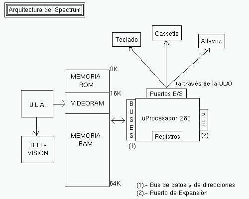
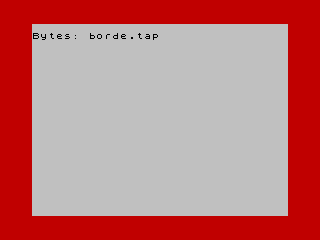

Puertos de E/S y Tabla de Opcodes
=======================================

En este capítulo se introducirán las instrucciones IN y OUT para la exploración de los puertos del microprocesador, mostrando cómo el acceso a dichos puertos nos permitirá la gestión de los diferentes dispositivos conectados al microprocesador (teclado, altavoz, controladora de disco, etc…).

Finalmente, para acabar con la descripción del juego de instrucciones del Z80 veremos algunos ejemplos de opcodes no documentados, y una tabla-resumen con la mayoría de instrucciones, así como sus tiempos de ejecución y tamaños.

Los puertos E/S
---------------------

Como ya vimos en su momento, el microprocesador Z80 se conecta mediante los puertos de entrada/salida de la CPU a los periféricos externos (teclado, cassette y altavoz de audio), pudiendo leer el estado de los mismos (leer del teclado, leer del cassette) y escribir en ellos (escribir en el altavoz para reproducir sonido, escribir en el cassette) por medio de estas conexiones conocidas como "I/O Ports". 

 Aunque para nosotros el teclado o el altavoz puedan ser parte del ordenador, para el Z80, el microprocesador en sí mismo, son tan externos a él como el monitor o el joystick. Nuestro microprocesador accede a todos estos elementos externos mediante una serie de patillas (buses de datos y direcciones) que son conectadas eléctricamente a todos los elementos externos con los que queremos que interactúe. La memoria, el teclado, el altavoz, o los mismos pines del bus trasero del Spectrum, se conectan al Z80 y éste nos permite su acceso a través de dichas líneas, o de los puertos de entrada/salida (I/O).

IN y OUT
-------------
Ya conocemos la existencia y significado de los puertos y su conexión con el microprocesador. Sólo resta saber: ¿cómo accedemos a un puerto tanto para leer como para escribir desde nuestros programas en ensamblador?

La respuesta la tienen los comandos IN y OUT del Z80.

Comenzaremos con IN, que nos permite leer el valor de un puerto ya sea directamente, o cargado sobre el registro BC:

.. code-block:: tasm

    IN registro, (C)

Leemos el puerto "BC" y ponemos su contenido en el registro especificado. En realidad, pese a que teóricamente el Spectrum sólo tiene acceso a puertos E/S de 8 bits (0-255), para acceder a los puertos, IN r, (C) pone todo el valor de BC en el bus de direcciones.

IN A, (puerto)
Leemos el puerto "A*256 + Puerto" y ponemos su contenido en A. En esta ocasión, el Spectrum pone en el bus de direcciones el valor del registro de 16 bits formado por A y (puerto) (en lugar de BC).

Por ejemplo, estas 2 lecturas de puerto (usando los 2 formatos de la instrucción IN vistos anteriormente) son equivalentes:

.. code-block:: tasm

    ; Forma 1
    LD BC, FFFEh
    IN A, (C)       ; A = Lectura de puerto FFFEh

    ; Forma 2
    LD A, FFh
    IN A, (FEh)     ; A = Lectura de puerto FFFEh

Aunque la instrucción de la "Forma 1" hable del puerto C, en realidad el puerto es un valor de 16 bits y se carga en el registro BC.

De la misma forma, podemos escribir un valor en un puerto con sus equivalentes "OUT":

.. code-block:: tasm

    OUT (puerto), A

Escribimos en "puerto" (valor de 8 bits) el valor de A.

.. code-block:: tasm
    
    OUT (C), registro

Escribimos en el puerto "C" el valor contenido en "registro" (aunque se pone el valor de BC en el bus de direcciones).

Curiosamente, como se explica en el excelente documento "The Undocumented Z80 Documented" (que habla de las funcionalidades y opcodes no documentados del Z80), los puertos del Spectrum son oficialmente de 8 bits (0-255) aunque realmente se pone o bien BC o bien (A*256)+PUERTO en el bus de direcciones, por lo que en el fondo se pueden acceder a todos los 65536 puertos disponibles.

La forma en que estas instrucciones afectan a los flags es la siguiente::

                            Flags
    Instrucción       |S Z H P N C|
    ----------------------------------
    IN A, (n)         |- - - - - -|
    IN r, (C)         |* * * P 0 -|
    OUT (C), r        |- - - - - -|
    OUT (n), A        |- - - - - -|

Aunque entre los 2 formatos OUT no debería haber ninguna diferencia funcional, cabe destacar que "OUT (N), A" es 1 t-estado o ciclo de reloj más rápida que "OUT (C), A", tardando 11 y 12 t-estados respectivamente.

Instrucciones de puerto repetitivas e incrementales
-----------------------------------------------------------

Al igual que LD carga un valor de un origen a un destino, y tiene sus correspondientes instrucciones incrementales (LDI "carga e incrementa", LDD "carga y decrementa") o repetitivas (LDIR "carga, incrementa y repite BC veces", LDDR "carga, decrementa, y repite BC veces"), IN y OUT tienen sus equivalentes incrementales y repetidores.

Así:

.. code-block:: tasm

    IND :
        Leemos en la dirección de memoria apuntada por HL ([HL]) el valor contenido en el puerto C.
        Decrementamos HL.
        Decrementamos B

    INI :
        Leemos en la dirección de memoria apuntada por HL ([HL]) el valor contenido en el puerto C.
        Incrementamos HL.
        Decrementamos B

    OUTD :
        Escribimos en el puerto C el valor de la dirección de memoria apuntada por HL ([HL])
        Decrementamos HL.
        Decrementamos B

    OUTI :
        Escribimos en el puerto C el valor de la dirección de memoria apuntada por HL ([HL])
        Incrementamos HL.
        Decrementamos B

Y sus versiones repetitivas INDR, INIR, OTDR y OTIR, que realizan la misma función que sus hermanas incrementales, repitiéndolo hasta que BC sea cero.

Las afectaciones de flags de estas funciones son las siguientes:

Flags::

                            Flags
    Instrucción       |S Z H P N C|
    ----------------------------------
    INI               |? * ? ? 1 ?|
    IND               |? * ? ? 1 ?|
    OUTI              |? * ? ? 1 ?|
    OUTD              |? * ? ? 1 ?|
    INDR              |? 1 ? ? 1 ?|
    INIR              |? 1 ? ? 1 ?|
    OTDR              |? 1 ? ? 1 ?|
    OTIR              |? 1 ? ? 1 ?|

Nota: Pese a que la documentación oficial dice que estas instrucciones no afectan al Carry Flag, las pruebas hechas a posteriori y recopiladas en la información disponible sobre Opcodes No Documentados del Z80 sugieren que sí que son modificados.

Algunos puertos E/S comunes
-----------------------------------

Para terminar con el tema de los puertos de Entrada y Salida, vamos a hacer referencia a algunos puertos disponibles en el Sinclair Spectrum (algunos de ellos sólo en ciertos modelos).

Como veremos en capítulo dedicado al teclado, existe una serie de puertos E/S que acceden directamente a la lectura del estado de las diferentes teclas de nuestro Spectrum. Leyendo del puerto adecuado, y chequeando en la respuesta obtenida el bit concreto asociado a la tecla que queremos consultar podremos conocer si una determinada tecla está pulsada (0) o no pulsada (1), como podemos ver en el siguiente ejemplo:

.. code-block:: tasm

    ; Lectura de la tecla "P" en un bucle
    ORG 50000
    
    bucle:
        LD BC, $DFFE         ; Semifila "P" a "Y"
        IN A, (C)            ; Leemos el puerto
        BIT 0, A             ; Testeamos el bit 0
        JR Z, salir          ; Si esta a 0 (pulsado) salir.
        JR bucle             ; Si no (a 1, no pulsado) repetimos
    
    salir:
        RET

El anterior ejemplo lee constantemente el puerto $DFFE a la espera de que el bit 0 de la respuesta obtenida de dicha lectura sea 0, lo que quiere decir que la tecla "p" ha sido pulsada.

Aunque los veremos en su momento en profundidad, estos son los puertos asociados a las diferentes filas de teclas:

+------------------+-----------+-------+-------+-------+--------+---------+
| 65278d (FEFEh)   |  Teclas:  |  "V"  |  "C"  |  "X"  |  "Z"   |  CAPS   |
+------------------+-----------+-------+-------+-------+--------+---------+
|  65022d (FDFEh)  |  Teclas:  |  "G"  |  "F"  |  "D"  |  "S"   |  "A"    |
+------------------+-----------+-------+-------+-------+--------+---------+
|  64510d (FBFEh)  |  Teclas:  |  "T"  |  "R"  |  "E"  |  "W"   |  "Q"    |
+------------------+-----------+-------+-------+-------+--------+---------+
|  63486d (F7FEh)  |  Teclas:  |  "5"  |  "4"  |  "3"  |  "2"   |  "1"    |
+------------------+-----------+-------+-------+-------+--------+---------+
|  61438d (EFFEh)  |  Teclas:  |  "0"  |  "9"  |  "8"  |  "7"   |  "6"    |
+------------------+-----------+-------+-------+-------+--------+---------+
|  57342d (DFFEh)  |  Teclas:  |  "Y"  |  "U"  |  "I"  |  "O"   |  "P"    |
+------------------+-----------+-------+-------+-------+--------+---------+
|  49150d (BFFEh)  |  Teclas:  |  "H"  |  "J"  |  "K"  |  "L"   |  ENTER  |
+------------------+-----------+-------+-------+-------+--------+---------+
|  32766d (7FFEh)  |  Teclas:  |  "B"  |  "N"  |  "M"  |  SYMB  |  SPACE  |
+------------------+-----------+-------+-------+-------+--------+---------+

El bit 6 de los puertos que hemos visto para el teclado tiene un valor aleatorio, excepto cuando se pulsa PLAY en el cassette, y es a través de dicho bit de donde podremos obtener los datos a cargar.

La escritura en el puerto 00FEh permite acceder al altavoz (bit 4) y a la señal de audio para grabar a cinta (bit 3). Los bits 0, 1 y 2 controlan el color del borde, como podemos ver en el siguiente ejemplo:

.. code-block:: tasm

    ; Cambio del color del borde al pulsar espacio
    ORG 50000
    
        LD B, 6              ; 6 iteraciones, color inicial borde
    
    bucle:
        LD A, $7F            ; Semifila B a ESPACIO
        IN A, ($FE)          ; Leemos el puerto
        BIT 0, A             ; Testeamos el bit 0 (ESPACIO)
        JR NZ, bucle         ; Si esta a 1 (no pulsado), esperar
        
        LD A, B              ; A = B
        OUT (254), A         ; Cambiamos el color del borde
        
    suelta_tecla:          ; Ahora esperamos a que se suelte la tecla
        LD A, $7F            ; Semifila B a ESPACIO
        IN A, ($FE)          ; Leemos el puerto
        BIT 0, A             ; Testeamos el bit 0
        JR Z, suelta_tecla   ; Saltamos hasta que se suelte
        
        djnz bucle           ; Repetimos "B" veces
        
    salir:
        RET
    
    END 50000            ; Ejecucion en 50000

 El puerto 7FFDh gestiona la paginación en los modos de 128K, permitiendo cambiar el modelo de páginas de memoria (algo que no vamos a ver en este capítulo).

Los puertos BFFDh y FFFDh gestionan el chip de sonido en aquellos modelos que dispongan de él, así como el RS232/MIDI y el interfaz AUX.

Finalmente, el puerto 0FFDh gestiona el puerto paralelo de impresora, y los puertos 2FFDh y 3FFDh permiten gestionar la controladora de disco en aquellos modelos de Spectrum que dispongan de ella.

Podéis encontrar más información sobre los puertos de Entrada y Salida en el capítulo 8 sección 23 del manual del +2A y +3, disponible online en World Of Spectrum. 

Tabla de instrucciones, ciclos y tamaños
--------------------------------------------

A continuación se incluye una tabla donde se hace referencia a las instrucciones del microprocesador Z80 (campo Mnemonic), los ciclos de reloj que tarda en ejecutarse (campo Clck), el tamaño en bytes de la instrucción codificada (Siz), la afectación de Flags (SZHPNC), el opcode y su descripción en cuanto a ejecución.

La tabla forma parte de un documento llamado "The Complete Z80 OP-Code Reference", de Devin Gardner. [#anexotablas]

.. table:: Instrucciones.rst

    +------------+------+-----+-+-+-+-+-+-+---------------+---------------------+----------------------+
    | Mnemónico  |Ciclos|Bytes|S|Z|H|P|N|C|    COD.OP     |     Descripción     |        Notas         |
    +============+======+=====+=+=+=+=+=+=+===============+=====================+======================+
    |ADC A,r     |     4|    1|x|x|x|V|0|x|88+rb          |Add with Carry       |A=A+s+CY              |
    +------------+------+-----+-+-+-+-+-+-+---------------+---------------------+----------------------+
    |ADC A,N     |     7|    2| | | | | | |CE XX          |                     |                      |
    +------------+------+-----+-+-+-+-+-+-+---------------+---------------------+----------------------+
    |ADC A,(HL)  |     7|    1| | | | | | |8E             |                     |                      |
    +------------+------+-----+-+-+-+-+-+-+---------------+---------------------+----------------------+
    |ADC A,(IX+N)|    19|    3| | | | | | |DD 8E XX       |                     |                      |
    +------------+------+-----+-+-+-+-+-+-+---------------+---------------------+----------------------+
    |ADC A,(IY+N)|    19|    3| | | | | | |FD 8E XX       |                     |                      |
    +------------+------+-----+-+-+-+-+-+-+---------------+---------------------+----------------------+
    |ADC HL,BC   |    15|    2|x|x|?|V|0|x|ED 4A          |Add with Carry       |HL=HL+ss+CY           |
    +------------+------+-----+-+-+-+-+-+-+---------------+---------------------+----------------------+
    |ADC HL,DE   |    15|    2| | | | | | |ED 5A          |                     |                      |
    +------------+------+-----+-+-+-+-+-+-+---------------+---------------------+----------------------+
    |ADC HL,HL   |    15|    2| | | | | | |ED 6A          |                     |                      |
    +------------+------+-----+-+-+-+-+-+-+---------------+---------------------+----------------------+
    |ADC HL,SP   |    15|    2| | | | | | |ED 7A          |                     |                      |
    +------------+------+-----+-+-+-+-+-+-+---------------+---------------------+----------------------+
    |ADD A,r     |     4|    1|x|x|x|V|0|x|80+rb          |Add (8-bit)          |A=A+s                 |
    +------------+------+-----+-+-+-+-+-+-+---------------+---------------------+----------------------+
    |ADD A,N     |     7|    2| | | | | | |C6 XX          |                     |                      |
    +------------+------+-----+-+-+-+-+-+-+---------------+---------------------+----------------------+
    |ADD A,(HL)  |     7|    1| | | | | | |86             |                     |                      |
    +------------+------+-----+-+-+-+-+-+-+---------------+---------------------+----------------------+
    |ADD A,(IX+N)|    19|    3| | | | | | |DD 86 XX       |                     |                      |
    +------------+------+-----+-+-+-+-+-+-+---------------+---------------------+----------------------+
    |ADD A,(IY+N)|    19|    3| | | | | | |FD 86 XX       |                     |                      |
    +------------+------+-----+-+-+-+-+-+-+---------------+---------------------+----------------------+
    |ADD HL,BC   |    11|    1|-|-|?|-|0|x|09             |Add (16-bit)         |HL=HL+ss              |
    +------------+------+-----+-+-+-+-+-+-+---------------+---------------------+----------------------+
    |ADD HL,DE   |    11|    1| | | | | | |19             |                     |                      |
    +------------+------+-----+-+-+-+-+-+-+---------------+---------------------+----------------------+
    |ADD HL,HL   |    11|    1| | | | | | |29             |                     |                      |
    +------------+------+-----+-+-+-+-+-+-+---------------+---------------------+----------------------+
    |ADD HL,SP   |    11|    1| | | | | | |39             |                     |                      |
    +------------+------+-----+-+-+-+-+-+-+---------------+---------------------+----------------------+
    |ADD IX,BC   |    15|    2|-|-|?|-|0|x|DD 09          |Add (IX register)    |IX=IX+pp              |
    +------------+------+-----+-+-+-+-+-+-+---------------+---------------------+----------------------+
    |ADD IX,DE   |    15|    2| | | | | | |DD 19          |                     |                      |
    +------------+------+-----+-+-+-+-+-+-+---------------+---------------------+----------------------+
    |ADD IX,IX   |    15|    2| | | | | | |DD 29          |                     |                      |
    +------------+------+-----+-+-+-+-+-+-+---------------+---------------------+----------------------+
    |ADD IX,SP   |    15|    2| | | | | | |DD 39          |                     |                      |
    +------------+------+-----+-+-+-+-+-+-+---------------+---------------------+----------------------+
    |ADD IY,BC   |    15|    2|-|-|?|-|0|x|FD 09          |Add (IY register)    |IY=IY+rr              |
    +------------+------+-----+-+-+-+-+-+-+---------------+---------------------+----------------------+
    |ADD IY,DE   |    15|    2| | | | | | |FD 19          |                     |                      |
    +------------+------+-----+-+-+-+-+-+-+---------------+---------------------+----------------------+
    |ADD IY,IY   |    15|    2| | | | | | |FD 29          |                     |                      |
    +------------+------+-----+-+-+-+-+-+-+---------------+---------------------+----------------------+
    |ADD IY,SP   |    15|    2| | | | | | |FD 39          |                     |                      |
    +------------+------+-----+-+-+-+-+-+-+---------------+---------------------+----------------------+
    |AND r       |     4|    1|x|x|x|P|0|0|A0+rb          |Logical AND          |A=A&s                 |
    +------------+------+-----+-+-+-+-+-+-+---------------+---------------------+----------------------+
    |AND N       |     7|    2| | | | | | |E6 XX          |                     |                      |
    +------------+------+-----+-+-+-+-+-+-+---------------+---------------------+----------------------+
    |AND (HL)    |     7|    1| | | | | | |A6             |                     |                      |
    +------------+------+-----+-+-+-+-+-+-+---------------+---------------------+----------------------+
    |AND (IX+N)  |    19|    3| | | | | | |DD A6 XX       |                     |                      |
    +------------+------+-----+-+-+-+-+-+-+---------------+---------------------+----------------------+
    |AND (IY+N)  |    19|    3| | | | | | |FD A6 XX       |                     |                      |
    +------------+------+-----+-+-+-+-+-+-+---------------+---------------------+----------------------+
    |BIT b,r     |     8|    2|?|x|1|?|0|-|CB 40+8*b+rb   |Test Bit             |m&{2^b}               |
    +------------+------+-----+-+-+-+-+-+-+---------------+---------------------+----------------------+
    |BIT b,(HL)  |    12|    2| | | | | | |CB 46+8*b      |                     |                      |
    +------------+------+-----+-+-+-+-+-+-+---------------+---------------------+----------------------+
    |BIT b,(IX+N)|    20|    4| | | | | | |DD CB XX 46+8*b|                     |                      |
    +------------+------+-----+-+-+-+-+-+-+---------------+---------------------+----------------------+
    |BIT b,(IY+N)|    20|    4| | | | | | |FD CB XX 46+8*b|                     |                      |
    +------------+------+-----+-+-+-+-+-+-+---------------+---------------------+----------------------+
    |CALL NN     |    17|    3|-|-|-|-|-|-|CD XX XX       |Unconditional Call   |-(SP)=PC,PC=nn        |
    +------------+------+-----+-+-+-+-+-+-+---------------+---------------------+----------------------+
    |CALL C,NN   |     0|    3|-|-|-|-|-|-|DC XX XX       |Conditional Call     |If Carry = 1          |
    +------------+------+-----+-+-+-+-+-+-+---------------+---------------------+----------------------+
    |CALL NC,NN  |     0|    3| | | | | | |D4 XX XX       |                     |If carry = 0          |
    +------------+------+-----+-+-+-+-+-+-+---------------+---------------------+----------------------+
    |CALL M,NN   |     0|    3| | | | | | |FC XX XX       |                     |If Sign = 1 (negative)|
    +------------+------+-----+-+-+-+-+-+-+---------------+---------------------+----------------------+
    |CALL P,NN   |     0|    3| | | | | | |F4 XX XX       |                     |If Sign = 0 (positive)|
    +------------+------+-----+-+-+-+-+-+-+---------------+---------------------+----------------------+
    |CALL Z,NN   |     0|    3| | | | | | |CC XX XX       |                     |If Zero = 1 (ans.=0)  |
    +------------+------+-----+-+-+-+-+-+-+---------------+---------------------+----------------------+
    |CALL NZ,NN  |     0|    3| | | | | | |C4 XX XX       |                     |If Zero = 0 (non-zero)|
    +------------+------+-----+-+-+-+-+-+-+---------------+---------------------+----------------------+
    |CALL PE,NN  |     0|    3| | | | | | |EC XX XX       |                     |If Parity = 1 (even)  |
    +------------+------+-----+-+-+-+-+-+-+---------------+---------------------+----------------------+
    |CALL PO,NN  |     0|    3| | | | | | |E4 XX XX       |                     |If Parity = 0 (odd)   |
    +------------+------+-----+-+-+-+-+-+-+---------------+---------------------+----------------------+
    |CCF         |     4|    1|-|-|?|-|0|x|3F             |Complement Carry Flag|CY=~CY                |
    +------------+------+-----+-+-+-+-+-+-+---------------+---------------------+----------------------+
    |CP r        |     4|    1|x|x|x|V|1|x|B8+rb          |Compare              |Compare A-s           |
    +------------+------+-----+-+-+-+-+-+-+---------------+---------------------+----------------------+
    |CP N        |     7|    2| | | | | | |FE XX          |                     |                      |
    +------------+------+-----+-+-+-+-+-+-+---------------+---------------------+----------------------+
    |CP (HL)     |     7|    1| | | | | | |BE             |                     |                      |
    +------------+------+-----+-+-+-+-+-+-+---------------+---------------------+----------------------+
    |CP (IX+N)   |    19|    3| | | | | | |DD BE XX       |                     |                      |
    +------------+------+-----+-+-+-+-+-+-+---------------+---------------------+----------------------+
    |CP (IY+N)   |    19|    3| | | | | | |FD BE XX       |                     |                      |
    +------------+------+-----+-+-+-+-+-+-+---------------+---------------------+----------------------+
    |CPD         |    16|    2|x|x|x|x|1|-|ED A9          |Compare and Decrement|A-(HL),HL=HL-1,BC=BC-1|
    +------------+------+-----+-+-+-+-+-+-+---------------+---------------------+----------------------+
    |CPDR        |     0|    2|x|x|x|x|1|-|ED B9          |Compare, Dec., Repeat|CPD till A=(HL)or BC=0|
    +------------+------+-----+-+-+-+-+-+-+---------------+---------------------+----------------------+
    |CPI         |    16|    2|x|x|x|x|1|-|ED A1          |Compare and Increment|A-(HL),HL=HL+1,BC=BC-1|
    +------------+------+-----+-+-+-+-+-+-+---------------+---------------------+----------------------+
    |CPIR        |     0|    2|x|x|x|x|1|-|ED B1          |Compare, Inc., Repeat|CPI till A=(HL)or BC=0|
    +------------+------+-----+-+-+-+-+-+-+---------------+---------------------+----------------------+
    |CPL         |     4|    1|-|-|1|-|1|-|2F             |Complement           |A=~A                  |
    +------------+------+-----+-+-+-+-+-+-+---------------+---------------------+----------------------+
    |DAA         |     4|    1|x|x|x|P|-|x|27             |Decimal Adjust Acc.  |A=BCD format  (dec.)  |
    +------------+------+-----+-+-+-+-+-+-+---------------+---------------------+----------------------+
    |DEC A       |     4|    1|x|x|x|V|1|-|3D             |Decrement (8-bit)    |s=s-1                 |
    +------------+------+-----+-+-+-+-+-+-+---------------+---------------------+----------------------+
    |DEC B       |     4|    1| | | | | | |05             |                     |                      |
    +------------+------+-----+-+-+-+-+-+-+---------------+---------------------+----------------------+
    |DEC C       |     4|    1| | | | | | |0D             |                     |                      |
    +------------+------+-----+-+-+-+-+-+-+---------------+---------------------+----------------------+
    |DEC D       |     4|    1| | | | | | |15             |                     |                      |
    +------------+------+-----+-+-+-+-+-+-+---------------+---------------------+----------------------+
    |DEC E       |     4|    1| | | | | | |1D             |                     |                      |
    +------------+------+-----+-+-+-+-+-+-+---------------+---------------------+----------------------+
    |DEC H       |     4|    1| | | | | | |25             |                     |                      |
    +------------+------+-----+-+-+-+-+-+-+---------------+---------------------+----------------------+
    |DEC L       |     4|    2| | | | | | |2D             |                     |                      |
    +------------+------+-----+-+-+-+-+-+-+---------------+---------------------+----------------------+
    |DEC (HL)    |    11|    1| | | | | | |35             |                     |                      |
    +------------+------+-----+-+-+-+-+-+-+---------------+---------------------+----------------------+
    |DEC (IX+N)  |    23|    3| | | | | | |DD 35 XX       |                     |                      |
    +------------+------+-----+-+-+-+-+-+-+---------------+---------------------+----------------------+
    |DEC (IY+N)  |    23|    3| | | | | | |FD 35 XX       |                     |                      |
    +------------+------+-----+-+-+-+-+-+-+---------------+---------------------+----------------------+
    |DEC BC      |     6|    1|-|-|-|-|-|-|0B             |Decrement (16-bit)   |ss=ss-1               |
    +------------+------+-----+-+-+-+-+-+-+---------------+---------------------+----------------------+
    |DEC DE      |     6|    1| | | | | | |1B             |                     |                      |
    +------------+------+-----+-+-+-+-+-+-+---------------+---------------------+----------------------+
    |DEC HL      |     6|    1| | | | | | |2B             |                     |                      |
    +------------+------+-----+-+-+-+-+-+-+---------------+---------------------+----------------------+
    |DEC SP      |     6|    1| | | | | | |3B             |                     |                      |
    +------------+------+-----+-+-+-+-+-+-+---------------+---------------------+----------------------+
    |DEC IX      |    10|    2|-|-|-|-|-|-|DD 2B          |Decrement            |xx=xx-1               |
    +------------+------+-----+-+-+-+-+-+-+---------------+---------------------+----------------------+
    |DEC IY      |    10|    2| | | | | | |FD 2B          |                     |                      |
    +------------+------+-----+-+-+-+-+-+-+---------------+---------------------+----------------------+
    |DI          |     4|    1|-|-|-|-|-|-|F3             |Disable Interrupts   |                      |
    +------------+------+-----+-+-+-+-+-+-+---------------+---------------------+----------------------+
    |DJNZ $+2    |     0|    1|-|-|-|-|-|-|10             |Dec., Jump Non-Zero  |B=B-1 till B=0        |
    +------------+------+-----+-+-+-+-+-+-+---------------+---------------------+----------------------+
    |EI          |     4|    1|-|-|-|-|-|-|FB             |Enable Interrupts    |                      |
    +------------+------+-----+-+-+-+-+-+-+---------------+---------------------+----------------------+
    |EX (SP),HL  |    19|    1|-|-|-|-|-|-|E3             |Exchange             |(SP)<->HL             |
    +------------+------+-----+-+-+-+-+-+-+---------------+---------------------+----------------------+
    |EX (SP),IX  |    23|    2|-|-|-|-|-|-|DD E3          |                     |(SP)<->xx             |
    +------------+------+-----+-+-+-+-+-+-+---------------+---------------------+----------------------+
    |EX (SP),IY  |    23|    2| | | | | | |FD E3          |                     |                      |
    +------------+------+-----+-+-+-+-+-+-+---------------+---------------------+----------------------+
    |EX AF,AF'   |     4|    1|-|-|-|-|-|-|08             |                     |AF<->AF'              |
    +------------+------+-----+-+-+-+-+-+-+---------------+---------------------+----------------------+
    |EX DE,HL    |     4|    1|-|-|-|-|-|-|EB             |                     |DE<->HL               |
    +------------+------+-----+-+-+-+-+-+-+---------------+---------------------+----------------------+
    |EXX         |     4|    1|-|-|-|-|-|-|D9             |Exchange             |qq<->qq'   (except AF)|
    +------------+------+-----+-+-+-+-+-+-+---------------+---------------------+----------------------+
    |HALT        |     4|    1|-|-|-|-|-|-|76             |Halt                 |                      |
    +------------+------+-----+-+-+-+-+-+-+---------------+---------------------+----------------------+
    |IM 0        |     8|    2|-|-|-|-|-|-|ED 46          |Interrupt Mode       |(n=0,1,2)             |
    +------------+------+-----+-+-+-+-+-+-+---------------+---------------------+----------------------+
    |IM 1        |     8|    2| | | | | | |ED 56          |                     |                      |
    +------------+------+-----+-+-+-+-+-+-+---------------+---------------------+----------------------+
    |IM 2        |     8|    2| | | | | | |ED 5E          |                     |                      |
    +------------+------+-----+-+-+-+-+-+-+---------------+---------------------+----------------------+
    |IN A,(N)    |    11|    2|-|-|-|-|-|-|DB XX          |Input                |A=(n)                 |
    +------------+------+-----+-+-+-+-+-+-+---------------+---------------------+----------------------+
    |IN (C)      |    12|    2|x|x|x|P|0|-|ED 70          |Input*               |(Unsupported)         |
    +------------+------+-----+-+-+-+-+-+-+---------------+---------------------+----------------------+
    |IN A,(C)    |    12|    2|x|x|x|P|0|-|ED 78          |Input                |r=(C)                 |
    +------------+------+-----+-+-+-+-+-+-+---------------+---------------------+----------------------+
    |IN B,(C)    |    12|    2| | | | | | |ED 40          |                     |                      |
    +------------+------+-----+-+-+-+-+-+-+---------------+---------------------+----------------------+
    |IN C,(C)    |    12|    2| | | | | | |ED 48          |                     |                      |
    +------------+------+-----+-+-+-+-+-+-+---------------+---------------------+----------------------+
    |IN D,(C)    |    12|    2| | | | | | |ED 50          |                     |                      |
    +------------+------+-----+-+-+-+-+-+-+---------------+---------------------+----------------------+
    |IN E,(C)    |    12|    2| | | | | | |ED 58          |                     |                      |
    +------------+------+-----+-+-+-+-+-+-+---------------+---------------------+----------------------+
    |IN H,(C)    |    12|    2| | | | | | |ED 60          |                     |                      |
    +------------+------+-----+-+-+-+-+-+-+---------------+---------------------+----------------------+
    |IN L,(C)    |    12|    2| | | | | | |ED 68          |                     |                      |
    +------------+------+-----+-+-+-+-+-+-+---------------+---------------------+----------------------+
    |INC A       |     4|    1|x|x|x|V|0|-|3C             |Increment (8-bit)    |r=r+1                 |
    +------------+------+-----+-+-+-+-+-+-+---------------+---------------------+----------------------+
    |INC B       |     4|    1| | | | | | |04             |                     |                      |
    +------------+------+-----+-+-+-+-+-+-+---------------+---------------------+----------------------+
    |INC C       |     4|    1| | | | | | |0C             |                     |                      |
    +------------+------+-----+-+-+-+-+-+-+---------------+---------------------+----------------------+
    |INC D       |     4|    1| | | | | | |14             |                     |                      |
    +------------+------+-----+-+-+-+-+-+-+---------------+---------------------+----------------------+
    |INC E       |     4|    1| | | | | | |1C             |                     |                      |
    +------------+------+-----+-+-+-+-+-+-+---------------+---------------------+----------------------+
    |INC H       |     4|    1| | | | | | |24             |                     |                      |
    +------------+------+-----+-+-+-+-+-+-+---------------+---------------------+----------------------+
    |INC L       |     4|    1| | | | | | |2C             |                     |                      |
    +------------+------+-----+-+-+-+-+-+-+---------------+---------------------+----------------------+
    |INC BC      |     6|    1|-|-|-|-|-|-|03             |Increment (16-bit)   |ss=ss+1               |
    +------------+------+-----+-+-+-+-+-+-+---------------+---------------------+----------------------+
    |INC DE      |     6|    1| | | | | | |13             |                     |                      |
    +------------+------+-----+-+-+-+-+-+-+---------------+---------------------+----------------------+
    |INC HL      |     6|    1| | | | | | |23             |                     |                      |
    +------------+------+-----+-+-+-+-+-+-+---------------+---------------------+----------------------+
    |INC SP      |     6|    1| | | | | | |33             |                     |                      |
    +------------+------+-----+-+-+-+-+-+-+---------------+---------------------+----------------------+
    |INC IX      |    10|    2|-|-|-|-|-|-|DD 23          |Increment            |xx=xx+1               |
    +------------+------+-----+-+-+-+-+-+-+---------------+---------------------+----------------------+
    |INC IY      |    10|    2| | | | | | |FD 23          |                     |                      |
    +------------+------+-----+-+-+-+-+-+-+---------------+---------------------+----------------------+
    |INC (HL)    |    11|    1|x|x|x|V|0|-|34             |Increment (indirect) |(HL)=(HL)+1           |
    +------------+------+-----+-+-+-+-+-+-+---------------+---------------------+----------------------+
    |INC (IX+N)  |    23|    3|x|x|x|V|0|-|DD 34 XX       |Increment            |(xx+d)=(xx+d)+1       |
    +------------+------+-----+-+-+-+-+-+-+---------------+---------------------+----------------------+
    |INC (IY+N)  |    23|    3| | | | | | |FD 34 XX       |                     |                      |
    +------------+------+-----+-+-+-+-+-+-+---------------+---------------------+----------------------+
    |IND         |    16|    2|?|x|?|?|1|-|ED AA          |Input and Decrement  |(HL)=(C),HL=HL-1,B=B-1|
    +------------+------+-----+-+-+-+-+-+-+---------------+---------------------+----------------------+
    |INDR        |     0|    2|?|1|?|?|1|-|ED BA          |Input, Dec., Repeat  |IND till B=0          |
    +------------+------+-----+-+-+-+-+-+-+---------------+---------------------+----------------------+
    |INI         |    16|    2|?|x|?|?|1|-|ED A2          |Input and Increment  |(HL)=(C),HL=HL+1,B=B-1|
    +------------+------+-----+-+-+-+-+-+-+---------------+---------------------+----------------------+
    |INIR        |     0|    2|?|1|?|?|1|-|ED B2          |Input, Inc., Repeat  |INI till B=0          |
    +------------+------+-----+-+-+-+-+-+-+---------------+---------------------+----------------------+
    |JP $NN      |    10|    3|-|-|-|-|-|-|C3 XX XX       |Unconditional Jump   |PC=nn                 |
    +------------+------+-----+-+-+-+-+-+-+---------------+---------------------+----------------------+
    |JP (HL)     |     4|    1|-|-|-|-|-|-|E9             |Unconditional Jump   |PC=(HL)               |
    +------------+------+-----+-+-+-+-+-+-+---------------+---------------------+----------------------+
    |JP (IX)     |     8|    2|-|-|-|-|-|-|DD E9          |Unconditional Jump   |PC=(xx)               |
    +------------+------+-----+-+-+-+-+-+-+---------------+---------------------+----------------------+
    |JP (IY)     |     8|    2| | | | | | |FD E9          |                     |                      |
    +------------+------+-----+-+-+-+-+-+-+---------------+---------------------+----------------------+
    |JP C,$NN    |     0|    3|-|-|-|-|-|-|DA XX XX       |Conditional Jump     |If Carry = 1          |
    +------------+------+-----+-+-+-+-+-+-+---------------+---------------------+----------------------+
    |JP NC,$NN   |     0|    3| | | | | | |D2 XX XX       |                     |If Carry = 0          |
    +------------+------+-----+-+-+-+-+-+-+---------------+---------------------+----------------------+
    |JP M,$NN    |     0|    3| | | | | | |FA XX XX       |                     |If Sign = 1 (negative)|
    +------------+------+-----+-+-+-+-+-+-+---------------+---------------------+----------------------+
    |JP P,$NN    |     0|    3| | | | | | |F2 XX XX       |                     |If Sign = 0 (positive)|
    +------------+------+-----+-+-+-+-+-+-+---------------+---------------------+----------------------+
    |JP Z,$NN    |     0|    3| | | | | | |CA XX XX       |                     |If Zero = 1 (ans.= 0) |
    +------------+------+-----+-+-+-+-+-+-+---------------+---------------------+----------------------+
    |JP NZ,$NN   |     0|    3| | | | | | |C2 XX XX       |                     |If Zero = 0 (non-zero)|
    +------------+------+-----+-+-+-+-+-+-+---------------+---------------------+----------------------+
    |JP PE,$NN   |     0|    3| | | | | | |EA XX XX       |                     |If Parity = 1 (even)  |
    +------------+------+-----+-+-+-+-+-+-+---------------+---------------------+----------------------+
    |JP PO,$NN   |     0|    3| | | | | | |E2 XX XX       |                     |If Parity = 0 (odd)   |
    +------------+------+-----+-+-+-+-+-+-+---------------+---------------------+----------------------+
    |JR $N+2     |    12|    2|-|-|-|-|-|-|18 XX          |Relative Jump        |PC=PC+e               |
    +------------+------+-----+-+-+-+-+-+-+---------------+---------------------+----------------------+
    |JR C,$N+2   |     0|    2|-|-|-|-|-|-|38 XX          |Cond. Relative Jump  |If cc JR(cc=C,NC,NZ,Z)|
    +------------+------+-----+-+-+-+-+-+-+---------------+---------------------+----------------------+
    |JR NC,$N+2  |     0|    2| | | | | | |30 XX          |                     |                      |
    +------------+------+-----+-+-+-+-+-+-+---------------+---------------------+----------------------+
    |JR Z,$N+2   |     0|    2| | | | | | |28 XX          |                     |                      |
    +------------+------+-----+-+-+-+-+-+-+---------------+---------------------+----------------------+
    |JR NZ,$N+2  |     0|    2| | | | | | |20 XX          |                     |                      |
    +------------+------+-----+-+-+-+-+-+-+---------------+---------------------+----------------------+
    |LD I,A      |     9|    2|-|-|-|-|-|-|ED 47          |Load*                |dst=src               |
    +------------+------+-----+-+-+-+-+-+-+---------------+---------------------+----------------------+
    |LD R,A      |     9|    2| | | | | | |ED 4F          |                     |                      |
    +------------+------+-----+-+-+-+-+-+-+---------------+---------------------+----------------------+
    |LD A,I      |     9|    2|x|x|0|x|0|-|ED 57          |Load*                |dst=src               |
    +------------+------+-----+-+-+-+-+-+-+---------------+---------------------+----------------------+
    |LD A,R      |     9|    2| | | | | | |ED 5F          |                     |                      |
    +------------+------+-----+-+-+-+-+-+-+---------------+---------------------+----------------------+
    |LD A,r      |     4|    1|-|-|-|-|-|-|78+rb          |Load (8-bit)         |dst=src               |
    +------------+------+-----+-+-+-+-+-+-+---------------+---------------------+----------------------+
    |LD A,N      |     7|    2| | | | | | |3E XX          |                     |                      |
    +------------+------+-----+-+-+-+-+-+-+---------------+---------------------+----------------------+
    |LD A,(BC)   |     7|    1| | | | | | |0A             |                     |                      |
    +------------+------+-----+-+-+-+-+-+-+---------------+---------------------+----------------------+
    |LD A,(DE)   |     7|    1| | | | | | |1A             |                     |                      |
    +------------+------+-----+-+-+-+-+-+-+---------------+---------------------+----------------------+
    |LD A,(HL)   |     7|    1| | | | | | |7E             |                     |                      |
    +------------+------+-----+-+-+-+-+-+-+---------------+---------------------+----------------------+
    |LD A,(IX+N) |    19|    3| | | | | | |DD 7E XX       |                     |                      |
    +------------+------+-----+-+-+-+-+-+-+---------------+---------------------+----------------------+
    |LD A,(IY+N) |    19|    3| | | | | | |FD 7E XX       |                     |                      |
    +------------+------+-----+-+-+-+-+-+-+---------------+---------------------+----------------------+
    |LD A,(NN)   |    13|    3| | | | | | |3A XX XX       |                     |                      |
    +------------+------+-----+-+-+-+-+-+-+---------------+---------------------+----------------------+
    |LD B,r      |     4|    1| | | | | | |40+rb          |                     |                      |
    +------------+------+-----+-+-+-+-+-+-+---------------+---------------------+----------------------+
    |LD B,N      |     7|    2| | | | | | |06 XX          |                     |                      |
    +------------+------+-----+-+-+-+-+-+-+---------------+---------------------+----------------------+
    |LD B,(HL)   |     7|    1| | | | | | |46             |                     |                      |
    +------------+------+-----+-+-+-+-+-+-+---------------+---------------------+----------------------+
    |LD B,(IX+N) |    19|    3| | | | | | |DD 46 XX       |                     |                      |
    +------------+------+-----+-+-+-+-+-+-+---------------+---------------------+----------------------+
    |LD B,(IY+N) |    19|    3| | | | | | |FD 46 XX       |                     |                      |
    +------------+------+-----+-+-+-+-+-+-+---------------+---------------------+----------------------+
    |LD C,r      |     4|    1| | | | | | |48+rb          |                     |                      |
    +------------+------+-----+-+-+-+-+-+-+---------------+---------------------+----------------------+
    |LD C,N      |     7|    2| | | | | | |0E XX          |                     |                      |
    +------------+------+-----+-+-+-+-+-+-+---------------+---------------------+----------------------+
    |LD C,(HL)   |     7|    1| | | | | | |4E             |                     |                      |
    +------------+------+-----+-+-+-+-+-+-+---------------+---------------------+----------------------+
    |LD C,(IX+N) |    19|    3| | | | | | |DD 4E XX       |                     |                      |
    +------------+------+-----+-+-+-+-+-+-+---------------+---------------------+----------------------+
    |LD C,(IY+N) |    19|    3| | | | | | |FD 4E XX       |                     |                      |
    +------------+------+-----+-+-+-+-+-+-+---------------+---------------------+----------------------+
    |LD D,r      |     4|    1| | | | | | |50+rb          |                     |                      |
    +------------+------+-----+-+-+-+-+-+-+---------------+---------------------+----------------------+
    |LD D,N      |     7|    2| | | | | | |16 XX          |                     |                      |
    +------------+------+-----+-+-+-+-+-+-+---------------+---------------------+----------------------+
    |LD D,(HL)   |     7|    1| | | | | | |56             |                     |                      |
    +------------+------+-----+-+-+-+-+-+-+---------------+---------------------+----------------------+
    |LD D,(IX+N) |    19|    3| | | | | | |DD 56 XX       |                     |                      |
    +------------+------+-----+-+-+-+-+-+-+---------------+---------------------+----------------------+
    |LD D,(IY+N) |    19|    3| | | | | | |FD 56 XX       |                     |                      |
    +------------+------+-----+-+-+-+-+-+-+---------------+---------------------+----------------------+
    |LD E,r      |     4|    1| | | | | | |58+rb          |                     |                      |
    +------------+------+-----+-+-+-+-+-+-+---------------+---------------------+----------------------+
    |LD E,N      |     7|    2| | | | | | |1E XX          |                     |                      |
    +------------+------+-----+-+-+-+-+-+-+---------------+---------------------+----------------------+
    |LD E,(HL)   |     7|    1| | | | | | |5E             |                     |                      |
    +------------+------+-----+-+-+-+-+-+-+---------------+---------------------+----------------------+
    |LD E,(IX+N) |    19|    3| | | | | | |DD 5E XX       |                     |                      |
    +------------+------+-----+-+-+-+-+-+-+---------------+---------------------+----------------------+
    |LD E,(IY+N) |    19|    3| | | | | | |FD 5E XX       |                     |                      |
    +------------+------+-----+-+-+-+-+-+-+---------------+---------------------+----------------------+
    |LD H,r      |     4|    1| | | | | | |60+rb          |                     |                      |
    +------------+------+-----+-+-+-+-+-+-+---------------+---------------------+----------------------+
    |LD H,N      |     7|    2| | | | | | |26 XX          |                     |                      |
    +------------+------+-----+-+-+-+-+-+-+---------------+---------------------+----------------------+
    |LD H,(HL)   |     7|    1| | | | | | |66             |                     |                      |
    +------------+------+-----+-+-+-+-+-+-+---------------+---------------------+----------------------+
    |LD H,(IX+N) |    19|    3| | | | | | |DD 66 XX       |                     |                      |
    +------------+------+-----+-+-+-+-+-+-+---------------+---------------------+----------------------+
    |LD H,(IY+N) |    19|    3| | | | | | |FD 66 XX       |                     |                      |
    +------------+------+-----+-+-+-+-+-+-+---------------+---------------------+----------------------+
    |LD L,r      |     4|    1| | | | | | |68+rb          |                     |                      |
    +------------+------+-----+-+-+-+-+-+-+---------------+---------------------+----------------------+
    |LD L,N      |     7|    2| | | | | | |2E XX          |                     |                      |
    +------------+------+-----+-+-+-+-+-+-+---------------+---------------------+----------------------+
    |LD L,(HL)   |     7|    1| | | | | | |6E             |                     |                      |
    +------------+------+-----+-+-+-+-+-+-+---------------+---------------------+----------------------+
    |LD L,(IX+N) |    19|    3| | | | | | |DD 6E XX       |                     |                      |
    +------------+------+-----+-+-+-+-+-+-+---------------+---------------------+----------------------+
    |LD L,(IY+N) |    19|    3| | | | | | |FD 6E XX       |                     |                      |
    +------------+------+-----+-+-+-+-+-+-+---------------+---------------------+----------------------+
    |LD BC,(NN)  |    20|    4|-|-|-|-|-|-|ED 4B XX XX    |Load (16-bit)        |dst=src               |
    +------------+------+-----+-+-+-+-+-+-+---------------+---------------------+----------------------+
    |LD BC,NN    |    10|    3| | | | | | |01 XX XX       |                     |                      |
    +------------+------+-----+-+-+-+-+-+-+---------------+---------------------+----------------------+
    |LD DE,(NN)  |    20|    4| | | | | | |ED 5B XX XX    |                     |                      |
    +------------+------+-----+-+-+-+-+-+-+---------------+---------------------+----------------------+
    |LD DE,NN    |    10|    3| | | | | | |11 XX XX       |                     |                      |
    +------------+------+-----+-+-+-+-+-+-+---------------+---------------------+----------------------+
    |LD HL,(NN)  |    20|    3| | | | | | |2A XX XX       |                     |                      |
    +------------+------+-----+-+-+-+-+-+-+---------------+---------------------+----------------------+
    |LD HL,NN    |    10|    3| | | | | | |21 XX XX       |                     |                      |
    +------------+------+-----+-+-+-+-+-+-+---------------+---------------------+----------------------+
    |LD SP,(NN)  |    20|    4| | | | | | |ED 7B XX XX    |                     |                      |
    +------------+------+-----+-+-+-+-+-+-+---------------+---------------------+----------------------+
    |LD SP,HL    |     6|    1| | | | | | |F9             |                     |                      |
    +------------+------+-----+-+-+-+-+-+-+---------------+---------------------+----------------------+
    |LD SP,IX    |    10|    2| | | | | | |DD F9          |                     |                      |
    +------------+------+-----+-+-+-+-+-+-+---------------+---------------------+----------------------+
    |LD SP,IY    |    10|    2| | | | | | |FD F9          |                     |                      |
    +------------+------+-----+-+-+-+-+-+-+---------------+---------------------+----------------------+
    |LD SP,NN    |    10|    3| | | | | | |31 XX XX       |                     |                      |
    +------------+------+-----+-+-+-+-+-+-+---------------+---------------------+----------------------+
    |LD IX,(NN)  |    20|    4| | | | | | |DD 2A XX XX    |                     |                      |
    +------------+------+-----+-+-+-+-+-+-+---------------+---------------------+----------------------+
    |LD IX,NN    |    14|    4| | | | | | |DD 21 XX XX    |                     |                      |
    +------------+------+-----+-+-+-+-+-+-+---------------+---------------------+----------------------+
    |LD IY,(NN)  |    20|    4| | | | | | |FD 2A XX XX    |                     |                      |
    +------------+------+-----+-+-+-+-+-+-+---------------+---------------------+----------------------+
    |LD IY,NN    |    14|    4| | | | | | |FD 21 XX XX    |                     |                      |
    +------------+------+-----+-+-+-+-+-+-+---------------+---------------------+----------------------+
    |LD (HL),r   |     7|    1|-|-|-|-|-|-|70+rb          |Load (Indirect)      |dst=src               |
    +------------+------+-----+-+-+-+-+-+-+---------------+---------------------+----------------------+
    |LD (HL),N   |    10|    2| | | | | | |36 XX          |                     |                      |
    +------------+------+-----+-+-+-+-+-+-+---------------+---------------------+----------------------+
    |LD (BC),A   |     7|    1| | | | | | |02             |                     |                      |
    +------------+------+-----+-+-+-+-+-+-+---------------+---------------------+----------------------+
    |LD (DE),A   |     7|    1| | | | | | |12             |                     |                      |
    +------------+------+-----+-+-+-+-+-+-+---------------+---------------------+----------------------+
    |LD (NN),A   |    13|    3| | | | | | |32 XX XX       |                     |                      |
    +------------+------+-----+-+-+-+-+-+-+---------------+---------------------+----------------------+
    |LD (NN),BC  |    20|    4| | | | | | |ED 43 XX XX    |                     |                      |
    +------------+------+-----+-+-+-+-+-+-+---------------+---------------------+----------------------+
    |LD (NN),DE  |    20|    4| | | | | | |ED 53 XX XX    |                     |                      |
    +------------+------+-----+-+-+-+-+-+-+---------------+---------------------+----------------------+
    |LD (NN),HL  |    16|    3| | | | | | |22 XX XX       |                     |                      |
    +------------+------+-----+-+-+-+-+-+-+---------------+---------------------+----------------------+
    |LD (NN),IX  |    20|    4| | | | | | |DD 22 XX XX    |                     |                      |
    +------------+------+-----+-+-+-+-+-+-+---------------+---------------------+----------------------+
    |LD (NN),IY  |    20|    4| | | | | | |FD 22 XX XX    |                     |                      |
    +------------+------+-----+-+-+-+-+-+-+---------------+---------------------+----------------------+
    |LD (NN),SP  |    20|    4| | | | | | |ED 73 XX XX    |                     |                      |
    +------------+------+-----+-+-+-+-+-+-+---------------+---------------------+----------------------+
    |LD (IX+N),r |    19|    3| | | | | | |DD 70+rb XX    |                     |                      |
    +------------+------+-----+-+-+-+-+-+-+---------------+---------------------+----------------------+
    |LD (IX+N),N |    19|    4| | | | | | |DD 36 XX XX    |                     |                      |
    +------------+------+-----+-+-+-+-+-+-+---------------+---------------------+----------------------+
    |LD (IY+N),r |    19|    3| | | | | | |FD 70+rb XX    |                     |                      |
    +------------+------+-----+-+-+-+-+-+-+---------------+---------------------+----------------------+
    |LD (IY+N),N |    19|    4| | | | | | |FD 36 XX XX    |                     |                      |
    +------------+------+-----+-+-+-+-+-+-+---------------+---------------------+----------------------+
    |LDD         |    16|    2|-|-|0|x|0|-|ED A8          |Load and Decrement   |(DE)=(HL),HL=HL-1,#   |
    +------------+------+-----+-+-+-+-+-+-+---------------+---------------------+----------------------+
    |LDDR        |     0|    2|-|-|0|0|0|-|ED B8          |Load, Dec., Repeat   |LDD till BC=0         |
    +------------+------+-----+-+-+-+-+-+-+---------------+---------------------+----------------------+
    |LDI         |    16|    2|-|-|0|x|0|-|ED A0          |Load and Increment   |(DE)=(HL),HL=HL+1,#   |
    +------------+------+-----+-+-+-+-+-+-+---------------+---------------------+----------------------+
    |LDIR        |     0|    2|-|-|0|0|0|-|ED B0          |Load, Inc., Repeat   |LDI till BC=0         |
    +------------+------+-----+-+-+-+-+-+-+---------------+---------------------+----------------------+
    |NEG         |     8|    2|x|x|x|V|1|x|ED 44          |Negate               |A=-A                  |
    +------------+------+-----+-+-+-+-+-+-+---------------+---------------------+----------------------+
    |NOP         |     4|    1|-|-|-|-|-|-|00             |No Operation         |                      |
    +------------+------+-----+-+-+-+-+-+-+---------------+---------------------+----------------------+
    |OR r        |     4|    1|x|x|x|P|0|0|B0+rb          |Logical inclusive OR |A=Avs                 |
    +------------+------+-----+-+-+-+-+-+-+---------------+---------------------+----------------------+
    |OR N        |     7|    2| | | | | | |F6 XX          |                     |                      |
    +------------+------+-----+-+-+-+-+-+-+---------------+---------------------+----------------------+
    |OR (HL)     |     7|    1| | | | | | |B6             |                     |                      |
    +------------+------+-----+-+-+-+-+-+-+---------------+---------------------+----------------------+
    |OR (IX+N)   |    19|    3| | | | | | |DD B6 XX       |                     |                      |
    +------------+------+-----+-+-+-+-+-+-+---------------+---------------------+----------------------+
    |OR (IY+N)   |    19|    3| | | | | | |FD B6 XX       |                     |                      |
    +------------+------+-----+-+-+-+-+-+-+---------------+---------------------+----------------------+
    |OUT (N),A   |    11|    2|-|-|-|-|-|-|D3 XX          |Output               |(n)=A                 |
    +------------+------+-----+-+-+-+-+-+-+---------------+---------------------+----------------------+
    |OUT (C),0   |    12|    2|-|-|-|-|-|-|ED 71          |Output*              |(Unsupported)         |
    +------------+------+-----+-+-+-+-+-+-+---------------+---------------------+----------------------+
    |OUT (C),A   |    12|    2|-|-|-|-|-|-|ED 79          |Output               |(C)=r                 |
    +------------+------+-----+-+-+-+-+-+-+---------------+---------------------+----------------------+
    |OUT (C),B   |    12|    2| | | | | | |ED 41          |                     |                      |
    +------------+------+-----+-+-+-+-+-+-+---------------+---------------------+----------------------+
    |OUT (C),C   |    12|    2| | | | | | |ED 49          |                     |                      |
    +------------+------+-----+-+-+-+-+-+-+---------------+---------------------+----------------------+
    |OUT (C),D   |    12|    2| | | | | | |ED 51          |                     |                      |
    +------------+------+-----+-+-+-+-+-+-+---------------+---------------------+----------------------+
    |OUT (C),E   |    12|    2| | | | | | |ED 59          |                     |                      |
    +------------+------+-----+-+-+-+-+-+-+---------------+---------------------+----------------------+
    |OUT (C),H   |    12|    2| | | | | | |ED 61          |                     |                      |
    +------------+------+-----+-+-+-+-+-+-+---------------+---------------------+----------------------+
    |OUT (C),L   |    12|    2| | | | | | |ED 69          |                     |                      |
    +------------+------+-----+-+-+-+-+-+-+---------------+---------------------+----------------------+
    |OUTD        |    16|    2|?|x|?|?|1|-|ED AB          |Output and Decrement |(C)=(HL),HL=HL-1,B=B-1|
    +------------+------+-----+-+-+-+-+-+-+---------------+---------------------+----------------------+
    |OTDR        |     0|    2|?|1|?|?|1|-|ED BB          |Output, Dec., Repeat |OUTD till B=0         |
    +------------+------+-----+-+-+-+-+-+-+---------------+---------------------+----------------------+
    |OUTI        |    16|    2|?|x|?|?|1|-|ED A3          |Output and Increment |(C)=(HL),HL=HL+1,B=B-1|
    +------------+------+-----+-+-+-+-+-+-+---------------+---------------------+----------------------+
    |OTIR        |     0|    2|?|1|?|?|1|-|ED B3          |Output, Inc., Repeat |OUTI till B=0         |
    +------------+------+-----+-+-+-+-+-+-+---------------+---------------------+----------------------+
    |POP AF      |    10|    1|-|-|-|-|-|-|F1             |Pop                  |qq=(SP)+              |
    +------------+------+-----+-+-+-+-+-+-+---------------+---------------------+----------------------+
    |POP BC      |    10|    1| | | | | | |C1             |                     |                      |
    +------------+------+-----+-+-+-+-+-+-+---------------+---------------------+----------------------+
    |POP DE      |    10|    1| | | | | | |D1             |                     |                      |
    +------------+------+-----+-+-+-+-+-+-+---------------+---------------------+----------------------+
    |POP HL      |    10|    1| | | | | | |E1             |                     |                      |
    +------------+------+-----+-+-+-+-+-+-+---------------+---------------------+----------------------+
    |POP IX      |    14|    2|-|-|-|-|-|-|DD E1          |Pop                  |xx=(SP)+              |
    +------------+------+-----+-+-+-+-+-+-+---------------+---------------------+----------------------+
    |POP IY      |    14|    2| | | | | | |FD E1          |                     |                      |
    +------------+------+-----+-+-+-+-+-+-+---------------+---------------------+----------------------+
    |PUSH AF     |    11|    1|-|-|-|-|-|-|F5             |Push                 |-(SP)=qq              |
    +------------+------+-----+-+-+-+-+-+-+---------------+---------------------+----------------------+
    |PUSH BC     |    11|    1| | | | | | |C5             |                     |                      |
    +------------+------+-----+-+-+-+-+-+-+---------------+---------------------+----------------------+
    |PUSH DE     |    11|    1| | | | | | |D5             |                     |                      |
    +------------+------+-----+-+-+-+-+-+-+---------------+---------------------+----------------------+
    |PUSH HL     |    11|    1| | | | | | |E5             |                     |                      |
    +------------+------+-----+-+-+-+-+-+-+---------------+---------------------+----------------------+
    |PUSH IX     |    15|    2|-|-|-|-|-|-|DD E5          |Push                 |-(SP)=xx              |
    +------------+------+-----+-+-+-+-+-+-+---------------+---------------------+----------------------+
    |PUSH IY     |    15|    2| | | | | | |FD E5          |                     |                      |
    +------------+------+-----+-+-+-+-+-+-+---------------+---------------------+----------------------+
    |RES b,r     |     8|    2|-|-|-|-|-|-|CB 80+8*b+rb   |Reset bit            |m=m&{~2^b}            |
    +------------+------+-----+-+-+-+-+-+-+---------------+---------------------+----------------------+
    |RES b,(HL)  |    15|    2|-|-|-|-|-|-|CB 86+8*b      |                     |                      |
    +------------+------+-----+-+-+-+-+-+-+---------------+---------------------+----------------------+
    |RES b,(IX+N)|    23|    4|-|-|-|-|-|-|DD CB XX 86+8*b|                     |                      |
    +------------+------+-----+-+-+-+-+-+-+---------------+---------------------+----------------------+
    |RES b,(IY+N)|    23|    4|-|-|-|-|-|-|FD CB XX 86+8*b|                     |                      |
    +------------+------+-----+-+-+-+-+-+-+---------------+---------------------+----------------------+
    |RET         |    10|    1|-|-|-|-|-|-|C9             |Return               |PC=(SP)+              |
    +------------+------+-----+-+-+-+-+-+-+---------------+---------------------+----------------------+
    |RET C       |     0|    1|-|-|-|-|-|-|D8             |Conditional Return   |If Carry = 1          |
    +------------+------+-----+-+-+-+-+-+-+---------------+---------------------+----------------------+
    |RET NC      |     0|    1| | | | | | |D0             |                     |If Carry = 0          |
    +------------+------+-----+-+-+-+-+-+-+---------------+---------------------+----------------------+
    |RET M       |     0|    1| | | | | | |F8             |                     |If Sign = 1 (negative)|
    +------------+------+-----+-+-+-+-+-+-+---------------+---------------------+----------------------+
    |RET P       |     0|    1| | | | | | |F0             |                     |If Sign = 0 (positive)|
    +------------+------+-----+-+-+-+-+-+-+---------------+---------------------+----------------------+
    |RET Z       |     0|    1| | | | | | |C8             |                     |If Zero = 1 (ans.=0)  |
    +------------+------+-----+-+-+-+-+-+-+---------------+---------------------+----------------------+
    |RET NZ      |     0|    1| | | | | | |C0             |                     |If Zero = 0 (non-zero)|
    +------------+------+-----+-+-+-+-+-+-+---------------+---------------------+----------------------+
    |RET PE      |     0|    1| | | | | | |E8             |                     |If Parity = 1 (even)  |
    +------------+------+-----+-+-+-+-+-+-+---------------+---------------------+----------------------+
    |RET PO      |     0|    1| | | | | | |E0             |                     |If Parity = 0 (odd)   |
    +------------+------+-----+-+-+-+-+-+-+---------------+---------------------+----------------------+
    |RETI        |    14|    2|-|-|-|-|-|-|ED 4D          |Return from Interrupt|PC=(SP)+              |
    +------------+------+-----+-+-+-+-+-+-+---------------+---------------------+----------------------+
    |RETN        |    14|    2|-|-|-|-|-|-|ED 45          |Return from NMI      |PC=(SP)+              |
    +------------+------+-----+-+-+-+-+-+-+---------------+---------------------+----------------------+
    |RLA         |     4|    1|-|-|0|-|0|x|17             |Rotate Left Acc.     |A={CY,A}<-            |
    +------------+------+-----+-+-+-+-+-+-+---------------+---------------------+----------------------+
    |RL r        |     8|    2|x|x|0|P|0|x|CB 10+rb       |Rotate Left          |m={CY,m}<-            |
    +------------+------+-----+-+-+-+-+-+-+---------------+---------------------+----------------------+
    |RL (HL)     |    15|    2| | | | | | |CB 16          |                     |                      |
    +------------+------+-----+-+-+-+-+-+-+---------------+---------------------+----------------------+
    |RL (IX+N)   |    23|    4| | | | | | |DD CB XX 16    |                     |                      |
    +------------+------+-----+-+-+-+-+-+-+---------------+---------------------+----------------------+
    |RL (IY+N)   |    23|    4| | | | | | |FD CB XX 16    |                     |                      |
    +------------+------+-----+-+-+-+-+-+-+---------------+---------------------+----------------------+
    |RLCA        |     4|    1|-|-|0|-|0|x|07             |Rotate Left Cir. Acc.|A=A<-                 |
    +------------+------+-----+-+-+-+-+-+-+---------------+---------------------+----------------------+
    |RLC r       |     8|    2|x|x|0|P|0|x|CB 00+rb       |Rotate Left Circular |m=m<-                 |
    +------------+------+-----+-+-+-+-+-+-+---------------+---------------------+----------------------+
    |RLC (HL)    |    15|    2| | | | | | |CB 06          |                     |                      |
    +------------+------+-----+-+-+-+-+-+-+---------------+---------------------+----------------------+
    |RLC (IX+N)  |    23|    4| | | | | | |DD CB XX 06    |                     |                      |
    +------------+------+-----+-+-+-+-+-+-+---------------+---------------------+----------------------+
    |RLC (IY+N)  |    23|    4| | | | | | |FD CB XX 06    |                     |                      |
    +------------+------+-----+-+-+-+-+-+-+---------------+---------------------+----------------------+
    |RLD         |    18|    2|x|x|0|P|0|-|ED 6F          |Rotate Left 4 bits   |{A,(HL)}={A,(HL)}<- ##|
    +------------+------+-----+-+-+-+-+-+-+---------------+---------------------+----------------------+
    |RRA         |     4|    1|-|-|0|-|0|x|1F             |Rotate Right Acc.    |A=->{CY,A}            |
    +------------+------+-----+-+-+-+-+-+-+---------------+---------------------+----------------------+
    |RR r        |     8|    2|x|x|0|P|0|x|CB 18+rb       |Rotate Right         |m=->{CY,m}            |
    +------------+------+-----+-+-+-+-+-+-+---------------+---------------------+----------------------+
    |RR (HL)     |    15|    2| | | | | | |CB 1E          |                     |                      |
    +------------+------+-----+-+-+-+-+-+-+---------------+---------------------+----------------------+
    |RR (IX+N)   |    23|    4| | | | | | |DD CB XX 1E    |                     |                      |
    +------------+------+-----+-+-+-+-+-+-+---------------+---------------------+----------------------+
    |RR (IY+N)   |    23|    4| | | | | | |FD CB XX 1E    |                     |                      |
    +------------+------+-----+-+-+-+-+-+-+---------------+---------------------+----------------------+
    |RRCA        |     4|    1|-|-|0|-|0|x|0F             |Rotate Right Cir.Acc.|A=->A                 |
    +------------+------+-----+-+-+-+-+-+-+---------------+---------------------+----------------------+
    |RRC r       |     8|    2|x|x|0|P|0|x|CB 08+rb       |Rotate Right Circular|m=->m                 |
    +------------+------+-----+-+-+-+-+-+-+---------------+---------------------+----------------------+
    |RRC (HL)    |    15|    2| | | | | | |CB 0E          |                     |                      |
    +------------+------+-----+-+-+-+-+-+-+---------------+---------------------+----------------------+
    |RRC (IX+N)  |    23|    4| | | | | | |DD CB XX 0E    |                     |                      |
    +------------+------+-----+-+-+-+-+-+-+---------------+---------------------+----------------------+
    |RRC (IY+N)  |    23|    4| | | | | | |FD CB XX 0E    |                     |                      |
    +------------+------+-----+-+-+-+-+-+-+---------------+---------------------+----------------------+
    |RRD         |    18|    2|x|x|0|P|0|-|ED 67          |Rotate Right 4 bits  |{A,(HL)}=->{A,(HL)} ##|
    +------------+------+-----+-+-+-+-+-+-+---------------+---------------------+----------------------+
    |RST 0       |    11|    1|-|-|-|-|-|-|C7             |Restart              |(p=0H,8H,10H,...,38H) |
    +------------+------+-----+-+-+-+-+-+-+---------------+---------------------+----------------------+
    |RST 08H     |    11|    1| | | | | | |CF             |                     |                      |
    +------------+------+-----+-+-+-+-+-+-+---------------+---------------------+----------------------+
    |RST 10H     |    11|    1| | | | | | |D7             |                     |                      |
    +------------+------+-----+-+-+-+-+-+-+---------------+---------------------+----------------------+
    |RST 18H     |    11|    1| | | | | | |DF             |                     |                      |
    +------------+------+-----+-+-+-+-+-+-+---------------+---------------------+----------------------+
    |RST 20H     |    11|    1| | | | | | |E7             |                     |                      |
    +------------+------+-----+-+-+-+-+-+-+---------------+---------------------+----------------------+
    |RST 28H     |    11|    1| | | | | | |EF             |                     |                      |
    +------------+------+-----+-+-+-+-+-+-+---------------+---------------------+----------------------+
    |RST 30H     |    11|    1| | | | | | |F7             |                     |                      |
    +------------+------+-----+-+-+-+-+-+-+---------------+---------------------+----------------------+
    |RST 38H     |    11|    1| | | | | | |FF             |                     |                      |
    +------------+------+-----+-+-+-+-+-+-+---------------+---------------------+----------------------+
    |SBC r       |     4|    1|x|x|x|V|1|x|98+rb          |Subtract with Carry  |A=A-s-CY              |
    +------------+------+-----+-+-+-+-+-+-+---------------+---------------------+----------------------+
    |SBC A,N     |     7|    2| | | | | | |DE XX          |                     |                      |
    +------------+------+-----+-+-+-+-+-+-+---------------+---------------------+----------------------+
    |SBC (HL)    |     7|    1| | | | | | |9E             |                     |                      |
    +------------+------+-----+-+-+-+-+-+-+---------------+---------------------+----------------------+
    |SBC A,(IX+N)|    19|    3| | | | | | |DD 9E XX       |                     |                      |
    +------------+------+-----+-+-+-+-+-+-+---------------+---------------------+----------------------+
    |SBC A,(IY+N)|    19|    3| | | | | | |FD 9E XX       |                     |                      |
    +------------+------+-----+-+-+-+-+-+-+---------------+---------------------+----------------------+
    |SBC HL,BC   |    15|    2|x|x|?|V|1|x|ED 42          |Subtract with Carry  |HL=HL-ss-CY           |
    +------------+------+-----+-+-+-+-+-+-+---------------+---------------------+----------------------+
    |SBC HL,DE   |    15|    2| | | | | | |ED 52          |                     |                      |
    +------------+------+-----+-+-+-+-+-+-+---------------+---------------------+----------------------+
    |SBC HL,HL   |    15|    2| | | | | | |ED 62          |                     |                      |
    +------------+------+-----+-+-+-+-+-+-+---------------+---------------------+----------------------+
    |SBC HL,SP   |    15|    2| | | | | | |ED 72          |                     |                      |
    +------------+------+-----+-+-+-+-+-+-+---------------+---------------------+----------------------+
    |SCF         |     4|    1|-|-|0|-|0|1|37             |Set Carry Flag       |CY=1                  |
    +------------+------+-----+-+-+-+-+-+-+---------------+---------------------+----------------------+
    |SET b,r     |     8|    2|-|-|-|-|-|-|CB C0+8*b+rb   |Set bit              |m=mv{2^b}             |
    +------------+------+-----+-+-+-+-+-+-+---------------+---------------------+----------------------+
    |SET b,(HL)  |    15|    2| | | | | | |CB C6+8*b      |                     |                      |
    +------------+------+-----+-+-+-+-+-+-+---------------+---------------------+----------------------+
    |SET b,(IX+N)|    23|    4| | | | | | |DD CB XX C6+8*b|                     |                      |
    +------------+------+-----+-+-+-+-+-+-+---------------+---------------------+----------------------+
    |SET b,(IY+N)|    23|    4| | | | | | |FD CB XX C6+8*b|                     |                      |
    +------------+------+-----+-+-+-+-+-+-+---------------+---------------------+----------------------+
    |SLA r       |     8|    2|x|x|0|P|0|x|CB 20+rb       |Shift Left Arithmetic|m=m*2                 |
    +------------+------+-----+-+-+-+-+-+-+---------------+---------------------+----------------------+
    |SLA (HL)    |    15|    2| | | | | | |CB 26          |                     |                      |
    +------------+------+-----+-+-+-+-+-+-+---------------+---------------------+----------------------+
    |SLA (IX+N)  |    23|    4| | | | | | |DD CB XX 26    |                     |                      |
    +------------+------+-----+-+-+-+-+-+-+---------------+---------------------+----------------------+
    |SLA (IY+N)  |    23|    4| | | | | | |FD CB XX 26    |                     |                      |
    +------------+------+-----+-+-+-+-+-+-+---------------+---------------------+----------------------+
    |SRA r       |     8|    2|x|x|0|P|0|x|CB 28+rb       |Shift Right Arith.   |m=m/2                 |
    +------------+------+-----+-+-+-+-+-+-+---------------+---------------------+----------------------+
    |SRA (HL)    |    15|    2| | | | | | |CB 2E          |                     |                      |
    +------------+------+-----+-+-+-+-+-+-+---------------+---------------------+----------------------+
    |SRA (IX+N)  |    23|    4| | | | | | |DD CB XX 2E    |                     |                      |
    +------------+------+-----+-+-+-+-+-+-+---------------+---------------------+----------------------+
    |SRA (IY+N)  |    23|    4| | | | | | |FD CB XX 2E    |                     |                      |
    +------------+------+-----+-+-+-+-+-+-+---------------+---------------------+----------------------+
    |SLL r       |     8|    2|x|x|0|P|0|x|CB 30+rb       |Shift Left Logical*  |m={0,m,CY}<-          |
    +------------+------+-----+-+-+-+-+-+-+---------------+---------------------+----------------------+
    |SLL (HL)    |    15|    2| | | | | | |CB 36          |                     |(SLL instructions     |
    +------------+------+-----+-+-+-+-+-+-+---------------+---------------------+----------------------+
    |SLL (IX+N)  |    23|    4| | | | | | |DD CB XX 36    |                     |are Unsupported)      |
    +------------+------+-----+-+-+-+-+-+-+---------------+---------------------+----------------------+
    |SLL (IY+N)  |    23|    4| | | | | | |FD CB XX 36    |                     |                      |
    +------------+------+-----+-+-+-+-+-+-+---------------+---------------------+----------------------+
    |SRL r       |     8|    2|x|x|0|P|0|x|CB 38+rb       |Shift Right Logical  |m=->{0,m,CY}          |
    +------------+------+-----+-+-+-+-+-+-+---------------+---------------------+----------------------+
    |SRL (HL)    |    15|    2| | | | | | |CB 3E          |                     |                      |
    +------------+------+-----+-+-+-+-+-+-+---------------+---------------------+----------------------+
    |SRL (IX+N)  |    23|    4| | | | | | |DD CB XX 3E    |                     |                      |
    +------------+------+-----+-+-+-+-+-+-+---------------+---------------------+----------------------+
    |SRL (IY+N)  |    23|    4| | | | | | |FD CB XX 3E    |                     |                      |
    +------------+------+-----+-+-+-+-+-+-+---------------+---------------------+----------------------+
    |SUB r       |     4|    1|x|x|x|V|1|x|90+rb          |Subtract             |A=A-s                 |
    +------------+------+-----+-+-+-+-+-+-+---------------+---------------------+----------------------+
    |SUB N       |     7|    2| | | | | | |D6 XX          |                     |                      |
    +------------+------+-----+-+-+-+-+-+-+---------------+---------------------+----------------------+
    |SUB (HL)    |     7|    1| | | | | | |96             |                     |                      |
    +------------+------+-----+-+-+-+-+-+-+---------------+---------------------+----------------------+
    |SUB (IX+N)  |    19|    3| | | | | | |DD 96 XX       |                     |                      |
    +------------+------+-----+-+-+-+-+-+-+---------------+---------------------+----------------------+
    |SUB (IY+N)  |    19|    3| | | | | | |FD 96 XX       |                     |                      |
    +------------+------+-----+-+-+-+-+-+-+---------------+---------------------+----------------------+
    |XOR r       |     4|    1|x|x|x|P|0|0|A8+rb          |Logical Exclusive OR |A=Axs                 |
    +------------+------+-----+-+-+-+-+-+-+---------------+---------------------+----------------------+
    |XOR N       |     7|    2| | | | | | |EE XX          |                     |                      |
    +------------+------+-----+-+-+-+-+-+-+---------------+---------------------+----------------------+
    |XOR (HL)    |     7|    1| | | | | | |AE             |                     |                      |
    +------------+------+-----+-+-+-+-+-+-+---------------+---------------------+----------------------+
    |XOR (IX+N)  |    19|    3| | | | | | |DD AE XX       |                     |                      |
    +------------+------+-----+-+-+-+-+-+-+---------------+---------------------+----------------------+
    |XOR (IY+N)  |    19|    3| | | | | | |FD AE XX       |                     |                      |
    +------------+------+-----+-+-+-+-+-+-+---------------+---------------------+----------------------+

Leyenda:

+-----------------+-----------------------------------------------+
|  n              | Immediate addressing                          |
+=================+===============================================+
|  nn             | Immediate extended addressing                 |
+-----------------+-----------------------------------------------+
|  e              | Relative addressing (PC=PC+2+offset)          |
+-----------------+-----------------------------------------------+
|  (nn)           | Extended addressing                           |
+-----------------+-----------------------------------------------+
|  (xx+d)         | Indexed addressing                            |
+-----------------+-----------------------------------------------+
|  r              | Register addressing                           |
+-----------------+-----------------------------------------------+
|  (rr)           | Register indirect addressing                  |
+-----------------+-----------------------------------------------+
|                 | Implied addressing                            |
+-----------------+-----------------------------------------------+
|  b              | Bit addressing                                |
+-----------------+-----------------------------------------------+
|  p              | Modified page zero addressing (see RST)       |
+-----------------+-----------------------------------------------+
|  x              | Undocumented opcode                           |
+-----------------+-----------------------------------------------+
|  A  B  C  D  E  | Registers (8-bit)                             |
+-----------------+-----------------------------------------------+
|  AF BC DE HL    | Register pairs (16-bit)                       |
+-----------------+-----------------------------------------------+
|  F              | Flag register (8-bit)                         |
+-----------------+-----------------------------------------------+
|  I              | Interrupt page address register (8-bit)       |
+-----------------+-----------------------------------------------+
|  IX IY          | Index registers (16-bit)                      |
+-----------------+-----------------------------------------------+
|  PC             | Program Counter register (16-bit)             |
+-----------------+-----------------------------------------------+
|  R              | Memory Refresh register                       |
+-----------------+-----------------------------------------------+
|  SP             | Stack Pointer register (16-bit)               |
+-----------------+-----------------------------------------------+
|  b              | One bit (0 to 7)                              |
+-----------------+-----------------------------------------------+
|  cc             | Condition (C,M,NC,NZ,P,PE,PO,Z)               |
+-----------------+-----------------------------------------------+
|  d              | One-byte expression (-128 to +127)            |
+-----------------+-----------------------------------------------+
|  dst            | Destination s, ss, (BC), (DE), (HL), (nn)     |
+-----------------+-----------------------------------------------+
|  e              | One-byte expression (-126 to +129)            |
+-----------------+-----------------------------------------------+
|  m              | Any register r, (HL) or (xx+d)                |
+-----------------+-----------------------------------------------+
|  n              | One-byte expression (0 to 255)                |
+-----------------+-----------------------------------------------+
|  nn             | Two-byte expression (0 to 65535)              |
+-----------------+-----------------------------------------------+
|  pp             | Register pair BC, DE, IX or SP                |
+-----------------+-----------------------------------------------+
|  qq             | Register pair AF, BC, DE or HL                |
+-----------------+-----------------------------------------------+
|  qq'            | Alternative register pair AF, BC, DE or HL    |
+-----------------+-----------------------------------------------+
|  r              | Register A, B, C, D, E, H or L                |
+-----------------+-----------------------------------------------+
|  rr             | Register pair BC, DE, IY or SP                |
+-----------------+-----------------------------------------------+
|  s              | Any register r, value n, (HL) or (xx+d)       |
+-----------------+-----------------------------------------------+
|  src            | Source s, ss, (BC), (DE), (HL), nn, (nn)      |
+-----------------+-----------------------------------------------+
|  ss             | Register pair BC, DE, HL or SP                |
+-----------------+-----------------------------------------------+
|  xx             | Index register IX or IY                       |
+-----------------+-----------------------------------------------+
| \+  \- \* /  ^  | Add/subtract/multiply/divide/exponent         |
+-----------------+-----------------------------------------------+
|  &  ~  v  x     | Logical AND/NOT/inclusive OR/exclusive OR     |
+-----------------+-----------------------------------------------+
|  <-  ->         | Rotate left/right                             |
+-----------------+-----------------------------------------------+
|  ( )            | Indirect addressing                           |
+-----------------+-----------------------------------------------+
|  ( )+  -( )     | Indirect addressing auto-increment/decrement  |
+-----------------+-----------------------------------------------+
|  { }            | Combination of operands                       |
+-----------------+-----------------------------------------------+
|  #              | Also BC=BC-1,DE=DE-1                          |
+-----------------+-----------------------------------------------+
|  ##             | Only lower 4 bits of accumulator A used       |
+-----------------+-----------------------------------------------+

 Unos apuntes sobre esta tabla:

1.- En instrucciones como "ADC A, r" podemos ver una defición del OPCODE como "88+rb". En este caso, el opcode final se obtendría sumando a "88h" un valor de 0 a 7 según el registro al que nos referimos:

+----------+----------+
| Registro | Valor RB |
+----------+----------+
| A        | 7        |
+----------+----------+
| B        | 0        |
+----------+----------+
| C        | 1        |
+----------+----------+
| D        | 2        |
+----------+----------+
| E        | 3        |
+----------+----------+
| H        | 4        |
+----------+----------+
| L        | 5        |
+----------+----------+
| (HL)     | 6        |
+----------+----------+

Por ejemplo, "ADC A, B" se codificaría en memoria como "88+0=88".

2.- En los saltos hay 2 tiempos de ejecución diferentes (por ejemplo, 10/1). En este caso el valor más alto (10) son los t-estados o ciclos que toma la instrucción cuando el salto se realiza, y el más bajo (1) es lo que tarda la instrucción cuando no se salta al destino. Como véis, a la hora de programar una rutina que tenga saltos o bifurcaciones, es interesante programarla de forma que el caso más común, el que se produzca la mayoría de las veces, no produzca un salto.

3.- La descripción de las afectaciones de flags son las siguientes::

	+-------+-------+---------------------------------------------+
	| F     | -x01? |Flag unaffected/affected/reset/set/unknown   |
	| S     | S     |Sign flag (Bit 7)                            |
	| Z     |  Z    |Zero flag (Bit 6)                            |
	| HC    |   H   |Half Carry flag (Bit 4)                      |
	| P/V   |    P  |Parity/Overflow flag (Bit 2, V=overflow)     |
	| N     |     N |Add/Subtract flag (Bit 1)                    |
	| CY    |      C|Carry flag (Bit 0)                           |
	+-------+-------+---------------------------------------------+

Instrucciones no documentadas del Z80
------------------------------------------

En Internet podemos encontrar gran cantidad de documentación acerca del Z80 y su juego de instrucciones, incluyendo las especificaciones oficiales del microprocesador Z80 de Zilog.

No obstante, existen una serie de instrucciones u opcodes que el microprocesador puede ejecutar y que no están detallados en la documentación oficial de Zilog. Con respecto a esto, tenemos la suerte de disponer de algo que los programadores de la época del Spectrum no tenían: una descripción detallada de las instrucciones no documentadas del Z80. Aunque la mayoría son instrucciones repetidas de sus versiones documentadas, hay algunas instrucciones curiosas y a las que tal vez le podamos sacar alguna utilidad.

¿Por qué existen estos opcodes y no fueron documentados? Supongo que algunos de ellos no fueron considerados como "merecedores de utilidad alguna" y los ingenieros de Zilog no los documentaron, o tal vez sean simplemente un resultado no previsto de la ejecución del Z80 porque los diseñadores no pensaron que al microprocesador pudieran llegarle dichos códigos. El caso es que para el microprocesador existen "todos" los opcodes, otra cosa es qué haga al leerlos y decodificarlos. En este caso algunos de ellos realizan funciones válidas mientras que otros son el equivalente a ejecutar 2 instrucciones NOP, por ejemplo.

¿Cuál es la utilidad de estas instrucciones para los programadores? Para ser sinceros, como programadores con un ensamblador o un ensamblador cruzado, poca. Si haces tus programas desde cero con un programa ensamblador, éste se encargará de la conversión de instrucciones estándar a opcodes, aunque no viene mal conocer la existencia de estas instrucciones. Para los programadores de emuladores y de desensambladores, el conocimiento de estos opcodes es vital.

El juego Sabre Wulf, por ejemplo, utiliza una de estas instrucciones en la determinación del camino de uno de los enemigos en pantalla (la instrucción SLL, que veremos a continuación), hasta el punto en que los primeros emuladores de Spectrum emulaban mal este juego hasta que incluyeron dicha instrucción en la emulación.

Los "undocumented opcodes" son esencialmente opcodes con prefijos CB, ED, DD o FD que hacen unas determinadas operaciones y que no están incluídos en la "lista oficial" que hemos visto hasta ahora. Todos los ejemplos que veremos a continuación están extraídos del documento "The Undocumented Z80 Documented", de Sean Young.

Prefijo CB
~~~~~~~~~~~~~~~~~~~~~~~~~~~~~~~~~~~~~~~~~~~~~~~~~~~~~~~~~~~~~~~~~~~~~~~~~~~~~~~~

Por ejemplo, los opcodes CB 30, CB 31, CB 32, CB 33, CB 34, CB 35, CB 36 y CB 37 definen una nueva instrucción: SLL. 

+---------+---------------+
| OPCODE  |  INSTRUCCION  |
+---------+---------------+
|  CB 30  |  SLL B        |
+---------+---------------+
|  CB 31  |  SLL C        |
+---------+---------------+
|  CB 32  |  SLL D        |
+---------+---------------+
|  CB 33  |  SLL E        |
+---------+---------------+
|  CB 34  |  SLL H        |
+---------+---------------+
|  CB 35  |  SLL L        |
+---------+---------------+
|  CB 36  |  SLL (HL)     |
+---------+---------------+
|  CB 37  |  SLL A        |
+---------+---------------+

**SLL (Shift Logical Left)** funciona exactamente igual que SLA salvo porque pone a 1 el bit 0 (mientras que SLA lo ponía a 0). 

Prefijos DD y FD
~~~~~~~~~~~~~~~~~~~~~~~~~~~~~~~~~~~~~~~~~~~~~~~~~~~~~~~~~~~~~~~~~~~~~~~~~~~~~~~~

En general, una instrucción precedida por el opcode DD se ejecuta igual que sin él excepto por las siguientes reglas:

* Si la instrucción usaba el registro HL, éste se sustituye por IX (excepto en las instrucciones EX DE, HL y EXX).
* Cualquier uso de (HL) se reemplaza por (IX+d), excepto JP (HL).
* Cualquier acceso a H se reemplaza por IXh (byte alto de IX), excepto en el uso de (IX+d).
* Cualquier acceso a L se reemplaza por IXl (byte alto de IX), excepto en el uso de (IX+d).

Por ejemplo: 

+--------------------+---------------------+
| Sin el prefijo DD  |  Con el Prefijo DD  |
+--------------------+---------------------+
|  LD HL, 0          |  LD IX, 0           |
+--------------------+---------------------+
|  LD H, A           |  LD IXh, A          |
+--------------------+---------------------+
|  LD H, (HL)        |  LD H, (IX+d)       |
+--------------------+---------------------+

 El caso de FD es exactamente igual que el de DD, pero usando el registro IY en lugar del IX.

Prefijo ED
~~~~~~~~~~~~~~~~~~~~~~~~~~~~~~~~~~~~~~~~~~~~~~~~~~~~~~~~~~~~~~~~~~~~~~~~~~~~~~~~

Hay una gran cantidad de instrucciones ED XX indocumentadas. Muchos de ellos realizan la misma función que sus equivalentes sin ED delante, mientras que otros simplemente son leídos y decodificados, resultando, a niveles prácticos, equivalentes a 2 instrucciones NOP. Veamos algunos de ellos: 

+---------+---------------------+
| OPCODE  |     INSTRUCCION     |
+---------+---------------------+
|  ED 4C  |  NEG                |
+---------+---------------------+
|  ED 4E  |  IM 0               |
+---------+---------------------+
|  ED 44  |  NEG                |
+---------+---------------------+
|  ED 45  |  RETN               |
+---------+---------------------+
|  ED 5C  |  NEG                |
+---------+---------------------+
|  ED 5D  |  RETN               |
+---------+---------------------+
|  ED 64  |  NEG                |
+---------+---------------------+
|  ED 65  |  RETN               |
+---------+---------------------+
|  ED 66  |  IM 0               |
+---------+---------------------+
|  ED 6C  |  NEG                |
+---------+---------------------+
|  ED 6D  |  RETN               |
+---------+---------------------+
|  ED 6E  |  IM 0               |
+---------+---------------------+
|  ED 70  |  IN (C) / IN F,(C)  |
+---------+---------------------+
|  ED 71  |  OUT (C),0          |
+---------+---------------------+
|  ED 74  |  NEG                |
+---------+---------------------+
|  ED 75  |  RETN               |
+---------+---------------------+
|  ED 76  |  IM1                |
+---------+---------------------+
|  ED 77  |  NOP                |
+---------+---------------------+
|  ED 7C  |  NEG                |
+---------+---------------------+
|  ED 7D  |  RETN               |
+---------+---------------------+
|  ED 7E  |  IM2                |
+---------+---------------------+
|  ED 7F  |  NOP                |
+---------+---------------------+

Aparte de los duplicados de NOP, NEG, IM0, etc, podemos ver un par de instrucciones curiosas y que nos pueden ser de utilidad. Por ejemplo:

.. code-block:: tasm

    ED 70       IN (C)

Esta instrucción lee el puerto C, pero no almacena el resultado de la lectura en ningún lugar. No obstante, altera los flags del registro F como corresponde al resultado leído. Puede ser interesante si sólo nos interesa, por ejemplo, si el valor leído es cero o no (flag Z), y no queremos perder un registro para almacenar el resultado. 

Prefijos DDCB y FDCB
~~~~~~~~~~~~~~~~~~~~~~~~~~~~~~~~~~~~~~~~~~~~~~~~~~~~~~~~~~~~~~~~~~~~~~~~~~~~~~~~

Las instrucciones DDCB y FDCB no documentadas almacenan el resultado de la operación de la instrucción equivalente sin prefijo (si existe dicho resultado) en uno de los registros de propósito general: B, C, D, E, H, L, ninguno o A, según los 3 bits más bajos del último byte del opcode (000=B, 001=C, 010=D, etc).

Así, supongamos el siguiente opcode sí documentado::

    DD CB 01 06         RLC (IX+01h)

Si hacemos los 3 últimos bits de dicho opcode 010 (010), el resultado de la operación se copia al registro D (010 = D en nuestra definición anterior), con lo que realmente, en lugar de "RLC (IX+01h)" se ejecuta:

.. code-block:: tasm

    LD D, (IX+01h)
    RLC D
    LD (IX+01h), D

La notación que sugiere Sean Young para estos opcodes es: "RLC (IX+01h), D".

Con el prefijo FDCB ocurre igual que con DDCB, salvo que se usa el registro IY en lugar de IX.

De la teoría a la práctica
-----------------------------------

Con este capítulo hemos cubierto el 99% de las instrucciones soportadas por el microprocesador Z80. Con la excepción de los Modos de Interrupciones del Z80 y sus aplicaciones, ya tenemos a nuestra disposición las piezas básicas para formar cualquier programa o rutina en ensamblador.

No obstante, todavía quedan por delante muchas horas de programación para dominar este lenguaje, así como diferentes técnicas, trucos, rutinas y mapas de memoria que nos permitan dibujar nuestros gráficos, realizar rutinas complejas, utilizar el sistema de interrupciones del microprocesador para realizar controles de temporización de nuestros programas, o reproducir sonido. 

.. rubric:: Nota

.. [#anexotablas] Para un mejor resultado estético, las tablas se han editado. Se ha dejado la tabla con el formato original ASCII en el anexo I.