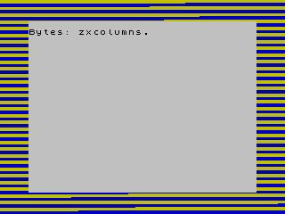

Save y Load: almacenamiento en cinta
================================================================================

¿En qué formato se almacenan los datos en una cinta de cassette para que el Spectrum pueda después cargar desde ellas pantallas de presentación, los personajes de un juego o el código ejecutable de un programa?

En este capítulo mostraremos cómo se graban y estructuran los datos en las cintas, y qué hace el Spectrum para acceder a ellos mediante las rutinas de que nos provee la ROM. Como aplicación práctica, se incluirá código de carga y grabación de pantallas junto a un ejemplo completo que hará uso de las mismas.

Formato de los datos en cinta
--------------------------------------------------------------------------------

Supongamos que, desde BASIC, salvamos un bloque de datos en cinta con el comando SAVE. Lo primero que nos interesa conocer es el formato o estructura de los datos almacenados en la cinta, es decir, ¿qué se guarda realmente en la cinta (en formato de audio) cuando hacemos un SAVE?

Un SAVE produce 2 bloques de datos en la cinta:

1. Un bloque de 19 bytes de tamaño fijo, conocido como cabecera. Este bloque es cargado muy rápidamente, debido a su pequeño tamaño. Si pensáis en los cientos ó miles de LOADs desde cinta que habréis hecho en vuestro Spectrum, recordaréis, nada más pulsar PLAY, la aparición del tono guía (líneas del borde rojas y cyan) seguido de un brevísimo momento de carga de datos (líneas del borde azules y amarillas). Es en ese momento en el que aparece en pantalla la información relativa al juego/programa que estamos cargando.
2. Un bloque de longitud variable que contiene los datos concretos y reales a cargar.

Ambos bloques son en realidad "datos" con el siguiente formato:

1. Un byte inicial, que como veremos se llama Flag Byte.
2. Los datos en sí mismos: 17 bytes para cabeceras, o la longitud concreta de los datos para los bloques de datos.
3. Un byte de checksum o CRC.

Profundicemos un poco más en estos 2 bloques de datos:

Cada bloque se inicia con una serie de pulsos de 2168 t-stados cada uno, que constituyen el tono guía. La cantidad de pulsos (la duración) de este tono guía es de 8063 pulsos para los bloques de cabecera, y 3223 pulsos para los bloques de datos. Es por eso que la duración del tono guía (el famoso pitido inicial de la carga) es mayor para la carga de la cabecera que para el de los datos en sí mismos. Es decir, el tono guía está presente tanto para los bloques de cabecera como para los de datos, salvo que su duración es menor en los bloques de datos.

Un t-stado (t-state) es 1 ciclo de reloj, y equivale a 1 / 3.500.000 segundos. 

.. figure:: tono_guia.png
   :scale: 100%
   :align: center
   :alt: Aspecto del tono guía

   Aspecto del tono guía

Tras el tono guía de la cabecera viene la cabecera en sí misma (que no dejan de ser datos). Su carga, como ya hemos dicho, tarda un tiempo muy corto en realizarse, ya que son sólo 19 bytes a ser leídos desde el cassette.

.. figure:: header.png
   :scale: 100%
   :align: center
   :alt: Una vez cargada la cabecera

   Una vez cargada la cabecera

En la imagen anterior podemos ver el aspecto de la pantalla una vez terminado el tono guía y cargada la cabecera. Esta cabecera, mediante sus 19 bytes, le indican al Spectrum la naturaleza de los datos a cargar en el bloque de datos que sigue a la misma, con el siguiente formato: 

+-------+------------+--------------------------------------------------------+
| Byte  |  Longitud  |                       Descripción                      |
+=======+============+========================================================+
|  0    |  1         |  Byte Flag ($00 ó $FF)                                 |
+-------+------------+--------------------------------------------------------+
|  1    |  1         |  Tipo de bloque (0-3)                                  |
+-------+------------+--------------------------------------------------------+
|  2    |  10        |  Nombre de fichero (rellenado con espacios en blanco)  |
+-------+------------+--------------------------------------------------------+
|  12   |  2         |  Longitud del bloque de datos a cargar                 |
+-------+------------+--------------------------------------------------------+
|  14   |  2         |  Parámetro 1                                           |
+-------+------------+--------------------------------------------------------+
|  16   |  2         |  Parámetro 2                                           |
+-------+------------+--------------------------------------------------------+
|  18   |  1         |  Checksum / Suma de comprobación                       |
+-------+------------+--------------------------------------------------------+

Pasemos a describir los diferentes campos de la cabecera:

El byte de flag (Byte 0) y el de Checksum (byte 18) no forman parte exactamente de la cabecera, sino del bloque cargado en sí mismo (también están presente cuando cargamos datos y no cabeceras), pero se han incluído dentro de la tabla para hacerla de lectura más sencilla. Puede decirse que el byte-flag es el byte prefijo de todo bloque de datos (considerando una cabecera de 17 bytes como un bloque de datos) y el checksum es el byte sufijo de ese mismo bloque. Concretamente, el valor de Byte-Flag es de $00 para bloques de cabecera y $FF para bloques de datos.

El byte de tipo de bloque indica qué datos se van a cargar a continuación, según los siguientes valores: 

+--------+-----------------------------------+
| Valor  |            Significado            |
+========+===================================+
|  0     |  Programa                         |
+--------+-----------------------------------+
|  1     |  Array de números                 |
+--------+-----------------------------------+
|  2     |  Array de caracteres              |
+--------+-----------------------------------+
|  3     |  CODE (datos a cargar en memoria) |
+--------+-----------------------------------+

 En el caso de bloques de tipo CODE, el byte "Parámetro 1" define la dirección de inicio del bloque de código cuando se hizo el SAVE, y el parámetro 2 contiene el valor 32768.

Para bloques de tipo PROGRAM, el Parámetro 1 contiene el valor de la línea BASIC de autostart (o un número mayor de 32768 si no se dio un parámetro LINE al hacer el SAVE), y el Parámetro 2 contiene el inicio del área de variables relativa al inicio del programa.

Un detalle: una pantalla de datos (SCREEN$) se define en esta cabecera como un bloque de tipo CODE de 6912 bytes a cargar sobre la dirección 16384.

Tras la cabecera (tono guía + bloque datos) viene el bloque de datos en sí mismo, que vuelve a componerse de un tono guía, el Flag Byte, los datos 

   Aspecto de la carga del bloque de datos en sí mismo

Ahora bien  ¿cómo es posible que se almacenen como audio datos digitales? ¿Cómo entiende el Spectrum si los datos que está cargando son unos o ceros y los agrupa en bloques de bytes que podemos interpretar de forma lógica?

Como ya hemos comentado al hablar del tono guía, la clave está en la temporización precisa a la hora de leer datos desde la cinta. Aparte de tonos guía y pulsos de sincronización ... ¿qué es un cero en la cinta? ¿qué es un uno? ¿Cómo se almacena (y lee) un byte de 8 bits? ¿Y cómo se almacena (y lee) un conjunto de bytes?

* Un cero (bit=0) se codifica en cinta como 2 pulsos de una duración de 855 t-stados cada uno.
* Un uno (bit=1) se codifica en cinta como 2 pulsos de una duración de 1710 t-stados cada uno.
* Para almacenar los 8 bits de un byte, se almacenan bit a bit de mayor a menor peso (primero el bit 7, luego el 6, el 5, el 4, el 3, el 2, el 1 y finalmente el LSB o bit 0).
* Cuando se almacena más de un byte (un bloque) se guardan primero los datos del primer byte del bloque, luego el segundo, etc.

Los pulsos son ondas con un aspecto como el siguiente (aspecto de un tono guía en TAPER): 

.. figure:: pilot.png
   :scale: 100%
   :align: center
   :alt: Aspecto de un tono guía (TAPER)

   Aspecto de un tono guía (TAPER)

Es decir, si tenemos que almacenar en cinta los siguientes bytes::

    abcdefgh ijklmnop

Se almacenarían en cinta en este orden::

    a b c d e f g h i j k l m n o p

Así pues, la rutina de la ROM del Spectrum se encarga (tanto al grabar como al leer) de codificar pulsos de diferentes duraciones para almacenar los ceros y unos de forma consecutiva. Nosotros aprovecharemos (como veremos a continuación) dicha rutina para cargar o salvar bloques de datos a nuestro antojo sin tener que programar esas temporizaciones y lecturas/escrituras a la cinta. Para nosotros será tan sencillo como cargar los valores adecuados en ciertos registros y realizar un CALL. No obstante, para los más curiosos, al final de este capítulo tenéis un enlace a las rutinas de la ROM adecuadamente comentadas de "The Complete Spectrum ROM Disassembly", por el Ian Logan y Frank O'Hara (publicado en 1983).

El nivel más bajo al que necesitamos llegar es el siguiente:

* Cada bloque tiene la siguiente estructura física:

    * Un tono guía de 8063 (cabeceras) ó 3223 pulsos (datos) de 2168 t-stados cada uno.
    * Un pulso de sincronización de 667 t-stados.
    * Un segundo pulso de sincronización de 735 t-stados.
    * El bloque de datos en sí mismo, bit a bit (0 = 2 pulsos de 855 t-stados, 1 = 2 pulsos de 1710 t-stados).

Cada bloque tiene la siguiente estructura lógica (formato de los datos DENTRO de un bloque):
    * Flag byte, con un valor de $00 para bloques de cabecera o $FF para bloques de datos.
    * Los datos en sí mismos: 17 bytes para cabeceras, o la longitud concreta de los datos para los bloques de datos.
    * Un byte de checksum, calculado de forma que haciendo un XOR de todos los bytes juntos, incluyendo el flag Byte, produzca $00.

Resumiendo:

* Los datos salvados en cinta constan de tono guía, seguido de un bloque de datos de 19 bytes denominado cabecera, seguido de un tono guía de menor duración que el inicial (por ser de datos), seguido de los datos en sí mismos.
* Esa cabecera proporciona información sobre el nombre, duración y ciertos parámetros relativos a los datos en sí mismos (el segundo bloque cargado).
* Los datos se leen de cinta secuencialmente, del primer al último byte del bloque de datos, y almacenado cada byte desde el bit 7 al 0 secuencialmente.
* Los 1s y los 0s se almacenan en cinta como pulsos de duraciones concretas.
* Las rutinas de la ROM nos permiten leer y escribir en cinta bloques de datos, realizando ellas la temporización adecuada para convertir nuestros "datos en memoria" en "pulsos" o viceversa sin complicación por nuestra parte.
* Sólo necesitaríamos escribir una rutina propia de carga (que detecte pulsos, temporice, etc) si quisiéramos programar nuestra propia carga, por ejemplo para cargar a diferente velocidad que el Spectrum (ultracargas), que cargue de dispositivos externos (puerto de joystick, algún pin concreto del bus de expansión, etc.) o para ejecutar código mientras cargamos el programa (minijuegos durante la carga, contadores de carga, etc). Para el resto de casos, bastará con usar mediante CALL las rutinas de la ROM.

Ejemplo de volcado de un SAVE

--------------------------------------------------------------------------------

En la FAQ de comp.sys.sinclair y WorldOfSpectrum tenemos un ejemplo muy interesante que muestra el formato lógico de los datos grabados con un SAVE en cinta. Supongamos el siguiente comando BASIC:

.. code-block:: basic

    SAVE "ROM" CODE 0,2

Este comando BASIC salvaría (SAVE), un total de 2 bytes (2) de datos (CODE), empezando en 0 (0) a cinta. En resumen, salvaría el contenido de la dirección de memoria 0x0000 y 0x0001 en cinta. Esto produciría los siguientes datos en cinta::

    00 03 52 4f 4d 20 20 20 20 20 20 20 02 00 00 00 00 80 f1 ff f3 af a3

Comencemos mostrando qué representa cada dato poco a poco:

+------------------------------------------------------------+-------------------+
|                          cabecera                          |  bloque de datos  |
+============================================================+===================+
|  00 03 52 4f 4d 20 20 20 20 20 20 20 02 00 00 00 00 80 f1  |  ff f3 af a3      |
+------------------------------------------------------------+-------------------+

Desgranando más la información:

+------------+------------------------------------------------------+------------+-------------+-------------+------------+
| Byte Flag  |                    datos cabecera                    |  checksum  |  byte flag  |  datos ROM  |  checksum  |
+============+======================================================+============+=============+=============+============+
|  00        |  03 52 4f 4d 20 20 20 20 20 20 20 02 00 00 00 00 80  |  f1        |  ff         |  f3 af      |  a3        |
+------------+------------------------------------------------------+------------+-------------+-------------+------------+

Concretamente, los datos de la cabecera (ignorando el Byte Flag y el Checksum): 

+-----------------+---------------------------------+-------------------+---------------+---------------+
| Tipo de bloque  |        Nombre de fichero        |  Longitud bloque  |  Parámetro 1  |  Parametro 2  |
+=================+=================================+===================+===============+===============+
|  03             |  52 4f 4d 20 20 20 20 20 20 20  |  02 00            |  00 00        |  00 80        |
+-----------------+---------------------------------+-------------------+---------------+---------------+

Como véis el nombre "ROM" (52 4F 4D) se completa con espacios en blanco hasta los 10 caracteres. Además podemos ver la longitud del bloque que se salvó (02 bytes).

Después de estos datos tenemos el checksum (F1) y el bloque de datos en sí mismo: 

+------------+------------------+------------+
| Byte Flag  |  Datos grabados  |  Checksum  |
+============+==================+============+
|  ff        |  f3 af           |  a3        |
+------------+------------------+------------+

En este caso el byte flag es 0xFF (bloque de tipo "datos"), al cual siguen los 2 bytes tomados de la ROM y grabados a cinta (0x0000 y 0x0001) y el checksum (0xA3).

Rutinas de carga de la ROM
--------------------------------------------------------------------------------

Ya sabemos cómo se almacenan los datos en cinta, así que nuestra próxima misión es conocer cómo cargarlos o grabarlos de una manera sencilla. Para hacer esto usaremos las funciones de la ROM del Spectrum para carga y grabación de datos a cinta: hablamos de 2 subrutinas (de LOAD y SAVE) a las que podremos llamar con unos parámetros concretos.

Rutina de LOAD de la ROM
~~~~~~~~~~~~~~~~~~~~~~~~~~~~~~~~~~~~~~~~~~~~~~~~~~~~~~~~~~~~~~~~~~~~~~~~~~~~~~~~

La rutina de LOAD comienza en la dirección $0556 (0556h ó 1366d) y requiere los siguientes parámetros: 

+------------------+-----------------------------------------------------------------------------------+
|     Registro     |                                       Valor                                       |
+==================+===================================================================================+
|  IX              |  Dirección inicio de memoria de los datos que se van a grabar.                    |
+------------------+-----------------------------------------------------------------------------------+
|  DE              |  Longitud del bloque de datos a grabar (se grabarán los datos desde IX a IX+DE).  |
+------------------+-----------------------------------------------------------------------------------+
|  A               |  Flag Byte, 0x00 para grabar cabeceras o 0xFF (255) para grabar datos.            |
+------------------+-----------------------------------------------------------------------------------+
|  CF (CarryFlag)  |  0 (SAVE)                                                                         |
+------------------+-----------------------------------------------------------------------------------+

 La rutina devuelve el CF = 0 si ocurre alguno de los siguientes errores:

* "R-Tape Loading Error" (bien por timeout o bien por byte de paridad incorrecto)
* Flag Byte incorrecto.
* "D BREAK - CONT repeats" (se pulsó la tecla BREAK).

Recuerda que puedes activar el CARRY FLAG con la instruccion "SCF" (Set Carry Flag) y ponerlo a cero con un simple "AND A".

Veamos 2 ejemplos, el primero cargaría una pantalla gráfica sobre la videomemoria (el equivalente de un LOAD "" SCREEN$) siempre y cuando la pantalla se haya grabado sin cabecera:

.. code-block:: tasm

   SCF                ; Set Carry Flag -> CF=1 -> LOAD
   LD A, 255          ; A = 0xFF (cargar datos)
   LD IX, 16384       ; Destino del load = 16384
   LD DE, 6912        ; Tamaño a cargar = 6912
   CALL 1366          ; Llamamos a la rutina de carga

Este segundo programa cargaría un bloque de código ejecutable en memoria, y saltaría a él (un programa "cargador"):

.. code-block:: tasm

   SCF               ; Set Carry Flag (LOAD)
   LD A, 255 	     ; A = 0xFF (cargar datos)
   LD IX, 32768      ; Destino de la carga
   LD DE, 12000      ; Nuestro "programa" ocupa 12000 bytes.
   CALL 0556  	     ; Recordemos que 0556h = 1366d
   JP 32768          ; Saltamos al programa código máquina cargado

Rutina de SAVE de la ROM
~~~~~~~~~~~~~~~~~~~~~~~~~~~~~~~~~~~~~~~~~~~~~~~~~~~~~~~~~~~~~~~~~~~~~~~~~~~~~~~~

La rutina SAVE de la ROM tiene unos parámetros muy similares a la de LOAD, y está alojada en 1218d (04c2h):

+------------------+-----------------------------------------------------------------------------------+
|     Registro     |                                       Valor                                       |
+==================+===================================================================================+
|  IX              |  Dirección inicio de memoria de los datos que se van a grabar.                    |
+------------------+-----------------------------------------------------------------------------------+
|  DE              |  Longitud del bloque de datos a grabar (se grabarán los datos desde IX a IX+DE).  |
+------------------+-----------------------------------------------------------------------------------+
|  A               |  Flag Byte, 0x00 para grabar cabeceras o 0xFF (255) para grabar datos.            |
+------------------+-----------------------------------------------------------------------------------+
|  CF (CarryFlag)  |  0 (SAVE)                                                                         |
+------------------+-----------------------------------------------------------------------------------+

Lo normal es que no tengamos que recurrir en prácticamente ninguna ocasión a la rutina de grabación de datos, de modo que nos centraremos, mediante ejemplos, en la rutina de carga.

Cargando o Ignorando la cabecera
~~~~~~~~~~~~~~~~~~~~~~~~~~~~~~~~~~~~~~~~~~~~~~~~~~~~~~~~~~~~~~~~~~~~~~~~~~~~~~~~

Cuando salvamos datos desde BASIC, lo normal es que se generen 2 bloques de datos, el de la cabecera, y el de los datos en sí mismos. El bloque de datos de la cabecera, cargado en memoria, nos permite saber el tamaño y destino de los datos que vendrán en el siguiente bloque. Es decir, cargando el primer bloque obtenemos la información necesaria para cargar en IX y DE los valores adecuados para la carga del bloque de datos.

En ocasiones, podemos ignorar el bloque de cabecera totalmente, sobre todo cuando sabemos qué vamos a cargar desde cinta, qué destino tiene, y qué tamaño tiene, y lo especificamos directamente en nuestro programa ASM. En ese caso, podemos cargar la cabecera con el CARRY FLAG a cero (verify), con lo cual la leemos pero no la almacenamos en memoria, y después cargar los valores adecuados en IX, DE, A, etc, poner el CF a 1, y cargar los datos que vienen tras la cabecera.

Supongamos que grabamos un bloque de datos, gráficos, una pantalla o música en cinta usando SAVE, rutinas de la ROM, o desde un emulador o herramienta cruzada de PC. Supongamos que sabemos el tamaño exacto en cinta de dichos datos, y no necesitamos leer y analizar la cabecera para cargarlos. En tal caso, podemos ejecutar código como el siguiente:

.. code-block:: tasm
        
    AND A                           ; CF = 0 (verify)
    CALL 1366                       ; Cargamos e ignoramos la cabecera
    
    SCF                             ; Set Carry Flag -> CF=1 -> LOAD
    LD A, 255                       ; A = 0xFF (cargar datos)
    LD IX, direccion_destino        ; Destino del load
    LD DE, tamaño_a_cargar          ; Tamaño a cargar
    CALL 1366                       ; Llamamos a la rutina de carga

Posteriormente veremos un ejemplo que ignora la cabecera al cargar una pantalla SCR completa sobre la videoram.

¿Cuándo nos interesa analizar la cabecera? Principalmente cuando los datos están generados desde nuestro propio programa y tienen un tamaño variable. Por ejemplo, supongamos que programamos un editor de textos que da al usuario la oportunidad de salvar y cargar los textos en cinta. En tal caso, necesitaremos leer la cabecera para saber el tamaño del documento (bloque de datos) a cargar, ya que no lo conocemos de antemano.

No obstante, en el caso de un juego, normalmente se conoce con antelación el tamaño de los datos a cargar, por lo que se puede ignorar felizmente la cabecera del bloque de cinta..

Convirtiendo datos en cinta
~~~~~~~~~~~~~~~~~~~~~~~~~~~~~~~~~~~~~~~~~~~~~~~~~~~~~~~~~~~~~~~~~~~~~~~~~~~~~~~~

Lo primero que necesitamos saber es, ¿cómo convertimos nuestros datos (gráficos, pantalla de carga, números, tablas precalculadas, sprites, música, etc) en datos cargables desde las rutinas que hemos visto? Hay múltiples formas de hacerlo.

Para empezar, podemos hacerlo desde el mismo BASIC del Spectrum, usando el comando SAVE: esto nos permitirá grabar datos de memoria en cinta:

.. code-block:: basic
        
    SAVE "nombre" CODE direccion_inicio, tamaño

En la mayoría de los casos, muchos de nosotros programamos hoy en sistemas PC usando compiladores cruzados, ensambladores cruzados y emuladores, por lo que normalmente lo que nos interesará es obtener ficheros TAP para poder concatenarlos con nuestros cargadores o programas.

Supongamos que estamos programando un juego que, nada más acabar, lo primero que hace es cargar desde cinta los datos del nivel actual (gráficos, mapeado, etc). Esto implica que cuando programemos el juego, tendremos por un lado el código, que nos proporcionará un fichero TAP (por ejemplo) listo para ejecutar. A ese fichero TAP tendremos que concatenarle los datos de los diferentes niveles (o gráficos, o los datos que necesitemos).

Así, nuestro "programa.asm" (código fuente) se convierte en "programa.bin" tras el proceso de ensamblado, y finalmente obtenemos un "programa.tap" (o .tzx) listo para cargar en un Spectrum.

Pero en dicho TAP o TZX tenemos que añadir (al final del mismo) los datos que el programa espera cargar. Imaginemos que estos datos son una pantalla gráfica (.scr) de 6912 bytes. Tendremos un fichero "pantalla.scr", y tenemos que introducirlo dentro de nuestro fichero TAP, al final, tras el código del programa, para que cuando este sea ejecutado, lo siguiente que cargue desde cinta nuestro programa sea dicha pantalla SCR.

Para ello, con el objetivo de hacerlo de una manera muy sencilla, utilizaremos ficheros TAP. El formato de este tipo de ficheros es muy sencillo, simplemente contienen bloques de datos precedidos por 2 bytes que indican el tamaño del bloque. Supongamos que tenemos en un fichero los 2 primeros bytes de la ROM que vimos anteriormente::

    f3 af

Este fichero de 2 bytes de tamaño (inicio_rom.bin, por ejemplo), guardado en una cinta tendría el formato que vimos anteriormente: 2 bloques (cabecera y datos)::

    00 03 52 4f 4d 20 20 20 20 20 20 20 02 00 00 00 00 80 f1 
    +
    ff f3 af a3

Es decir, 2 bloques de cinta de 19 y 4 bytes de datos, que conforman un SAVE de nuestros 2 bytes. Pues un fichero TAP con estos datos sería, sencillamente, el escribir estos 2 bloques en un fichero anteponiendo a cada bloque el tamaño a cargar::

    13 00 00 03 52 4f 4d 20 20 20 20 20 20 20 02 00 00 00 00 80 f1 
    +
    04 00 ff f3 af a3

Es decir "13 00" (número 19 en formato WORD, indicando el tamaño del bloque que viene a continuación) seguido de los 19 bytes, y "04 00" (número 4 en formato WORD) seguido de los 4 bytes del bloque.

El contenido en binario de nuestro inicio_rom.tap sería, pues::

    13 00 00 03 52 4f 4d 20 20 20 20 20 20 20 
    02 00 00 00 00 80 f1 04 00 ff f3 af a3

Y el tamaño resultante en bytes del fichero serían 2 + 19 + 2 + 4= 27 bytes.

Gracias a este formato tan sencillo, podemos unir ficheros TAP simplemente concatenándolos. De esta forma, si tenemos nuestro "programa.tap" y la "graficos.tap", y queremos unirlos porque nuestro programa, al ejecutarse, carga los gráficos esperándolos en cinta tras el código del mismo, bastaría con hacer:

* Linux:    ``cat programa.tap graficos.tap > programa_final.tap``
* Windows:  ``copy /B programa.tap graficos.tap programa_final.tap``

Sabemos cómo podemos obtener nuestro programa en formato TAP: cogemos el código fuente, lo compilamos, y o bien obtenemos un TAP directamente (``pasmo –tapbas``), o bien obtenemos un BIN que convertimos con BIN2TAP. Pero  ¿cómo convertimos nuestro "graficos.bin", "pantalla_carga.bin", "musica.bin" o cualquier otro fichero de datos en crudo? No podemos usar el BIN2TAP original porque éste añade un cargador BASIC al principio del programa... hay múltiples soluciones, pero la más sencilla es utilizar un ensamblador como pasmo.

Para convertir un fichero .bin en un fichero tap sin cabecera, creamos un pequeño programa ASM (rom.asm) como el siguiente::

    INCBIN "rom.bin"

A continuación, "ensamblamos" ese programa con PASMO indicando que queremos que nos genere un TAP sin cabecera BASIC::
    
    pasmo --tap rom.asm rom.tap

Con esto, obtendremos un fichero "rom.tap" con el contenido de rom.bin, y sin cargador BASIC, listo para utilizar.

Ejemplo completo
~~~~~~~~~~~~~~~~~~~~~~~~~~~~~~~~~~~~~~~~~~~~~~~~~~~~~~~~~~~~~~~~~~~~~~~~~~~~~~~~

Finamente, para aquellos programadores que quieran ver un ejemplo de aplicación práctica de la recuperación de datos desde un binario en ejecución, vamos a juntar todo lo visto para realizar un programa que cargue una pantalla gráfica completa (fichero .scr) sobre la videoRAM.

Los pasos a seguir para generar el ejemplo son los siguientes:

Primero, buscamos un fichero .SCR de carga (por ejemplo, la pantalla de carga de cualquier juego obtenida desde WOS InfoSeek ) y lo almacenamos en disco.

Segundo, mediante pasmo obtenemos un TAP con los datos del fichero SCR, sin cabecera BASIC. Dicho TAP tendrá un tamaño como el siguiente::

    $ ls -l zxcolumns.*
    -rw-r--r-- 1 sromero sromero 6912 2007-10-08 13:01 zxcolumns.scr
    -rw-r--r-- 1 sromero sromero 6937 2007-10-08 13:02 zxcolumns.tap

Ahora ya tenemos una pantalla SCR guardada en formato TAP (en cinta). Nótese cómo podríamos cargar este TAP desde BASIC con un ``LOAD "" CODE 16384,6912``, y aparecería la imagen en pantalla.

Lo siguiente que necesitamos es el programa propiamente dicho, el cual hará la carga de la pantalla en videomemoria:

.. code-block:: tasm
        
    ;----------------------------------------------------------------------
    ; Loadscr.asm : Demostración de las rutinas LOAD de la ROM, con
    ; la carga de un fichero SCR (desde cinta) en videomemoria.
    ;----------------------------------------------------------------------
    
    ORG 32000
    
    AND A                           ; CF = 0 (verify)
    CALL 1366                       ; Cargamos e ignoramos la cabecera
    
    SCF                             ; Set Carry Flag -> CF=1 -> LOAD
    LD A, 255                       ; A = 0xFF (cargar datos)
    LD IX, 16384                    ; Destino del load = 16384
    LD DE, 6912                     ; Tamaño a cargar = 6912
    CALL 1366                       ; Llamamos a la rutina de carga
    
    RET
    
    END 32000

Al respecto del código fuente, como habréis notado, realizamos 2 llamadas a la rutina de la ROM. La primera carga (pero no almacena en ningún sitio) el primer bloque de datos existente (la cabecera de la pantalla de carga). La rutina de la ROM ignorará esta carga porque el CARRY FLAG está a cero (0=VERIFY). La segunda llamada a 1366 realizará la carga de los datos propiamente dichos. Al cargarlos sobre la dirección de destino 16384 (la dirección de la videoram), veremos cómo se van cargando sobre la pantalla directamente desde la cinta.

Ensamblamos nuestro programa con ``pasmo –tapbas loadscr.asm loadscr.tap`` y tendremos lo siguiente:

* Un TAP (loadscr.tap) con nuestro programa (pero que no tiene datos después de él).
* Un TAP (zxcolumns.tap) con los datos gráficos (en este caso, una pantalla completa de 6912 bytes).

Si cargamos en el Spectrum, o en un emulador, el fichero loadscr.tap, nos encontraríamos con que intenta cargar los datos desde cinta, pero no hay datos almacenados tras el programa. Para solucionarlo, concatenamos los 2 TAPs (con cat en Linux o copy en Windows/DOS)::

    $ cat loadscr.tap zxcolumns.tap > programa.tap

Ahora sí, cargando "programa.tap" en el emulador, cargaremos nuestro programa, el cual llama a la rutina de la ROM para cargar los datos que van después del programa (la pantalla de carga) en videomemoria. Si lo probáis en un emulador, recordad deshabilitar las opciones de carga rápida o carga instantánea si queréis ver el efecto de la carga. 

   Nuestro programa cargando el fichero SCR

Si os fijáis durante la carga, veréis como primero se carga el LOADER, luego el código máquina de nuestro programa, y después la pantalla. Contando los tonos guía de carga también encontraréis el lugar donde se lee, pero ignora, la cabecera (19 bytes, carga muy corta) de la pantalla SCR.

Un apunte: tanto en el caso de la carga, como de la grabación de datos, recordad que las rutinas de la ROM no indican al usuario que debe pulsar PLAY o REC, por lo que debemos indicar al usuario cuándo debe pulsar PLAY o REC dentro de nuestros programas o juegos. Incluso, cuando acabemos de cargar los datos relativos a nuestro juego, resulta conveniente indicarle al usuario cuándo debe detener la cinta (especialmente en juegos multicarga) e insertar los segundos de "espacio" que creamos convenientes entre bloques.

Recordad que en este ejemplo hemos cargado 6912 bytes de un fichero SCR directamente sobre la videoRAM, pero nada nos impide cargar ficheros de cualquier otro tamaño, con cualquier otro contenido (sprites, fondos, datos, mapeados) sobre cualquier lugar de la memoria (asegurándonos primero que no hay nada en el lugar destino de la carga, como código, la pila, u otros datos o variables).

Así pues, de la misma forma que hemos cargado una pantalla SCR, podemos organizar los gráficos y mapeados de nuestro juego en 1 "bloque de datos" por nivel, cargar los datos del nivel 1 tras acabar la carga de nuestro programa, y sobreescribir estos gráficos y mapeados "en memoria" con los de los diferentes niveles según vaya avanzando el jugador. En otras palabras, podemos hacer un juego multicarga que nos permita tener más sprites, pantallas o gráficos disponibles para cada nivel, que los que tendríamos disponibles si cargamos todos los datos de todos los niveles del juego, ya que usamos toda la memoria para cada nivel, en lugar de dividirla en espacio para los diferentes niveles. A cambio, el usuario tendrá que cargar desde cinta las diferentes fases conforme avanza, y rebobinar para cargar los datos del "Nivel 1" cuando deba empezar una nueva partida.

La rutina LD-BYTES (Load)
~~~~~~~~~~~~~~~~~~~~~~~~~~~~~~~~~~~~~~~~~~~~~~~~~~~~~~~~~~~~~~~~~~~~~~~~~~~~~~~~

A continuación podemos ver el código desensamblado de la rutina LD-BYTES ($0556), la que estamos utilizando para la carga de datos desde cinta. Es una rutina muy interesante y disponer de su código fuente puede tener 2 usos directos.

El primero es poder comprender de forma exácta cómo funciona la carga de datos desde cinta y los tiempos que se manejan en dicha carga. El segundo es el de reproducir la rutina en nuestro programa y añadir funciones adicionales como un contador de carga o incluso algún tipo de minijuego durante la misma.

El código comentado está extraído del documento "The Complete Spectrum ROM Disassembly", de Ian Logan y Frank O'Hara.

.. code-block:: tasm
        
    ; THE 'LD-BYTES' SUBROUTINE
    ; This subroutine is called to LOAD the header information (from 07BE)
    ; and later LOAD, or VERIFY, an actual block of data (from 0802).
    0556 LD-BYTES:
                    INC   D                   ; This resets the zero flag. (D
                                                ; cannot hold +FF.)
                    EX    AF,A'F'             ; The A register holds +00 for a
                                                ; header and +FF for a block of
                                                ; data.
                                                ; The carry flag is reset for
                                                ; VERIFYing and set for
                                                ; LOADing.
                    DEC   D                   ; Restore D to its original value.
    
                    DI                        ; The maskable interrupt is now
                                                ; disabled.
                    LD    A,+0F               ; The border is made WHITE.
                    OUT   (+FE),A
                    LD    HL,+053F            ; Preload the machine stack
                    PUSH  HL                  ; with the address - SA/LD-RET.
                    IN    A,(+FE)             ; Make an initial read of port '254'
                    RRA                       ; Rotate the byte obtained but
                    AND   +20                 ; keep only the EAR bit,
                    OR    +02                 ; Signal 'RED' border.
                    LD    C,A                 ; Store the value in the C register. -
                                                ; (+22 for 'off' and +02 for 'on'
                                                ; - the present EAR state.)
                    CP    A                   ; Set the zero flag.
    
    ; The first stage of reading a tape involves showing that a pulsing
    ; signal actually exist (i.e. 'On/off' or 'off/on' edges.)
    
    056B LD-BREAK   RET   NZ                  ; Return if the BREAK key is
                                                ; being pressed.
    056C LD-START   CALL  05E7,LD-EDGE-1      ; Return with the carry flag reset
                    JR    NC,056B,LD-BREAK    ; if there is no 'edge' within
                                                ; approx. 14,000 T states. But if
                                                ; an 'edge' is found the border
                                                ; will go CYAN.
    
    ; The next stage involves waiting a while and then showing
    ; that the signal is still pulsing.
    
                    LD    HL,+0415            ; The length of this waiting
    0574 LD-WAIT    DJNZ  0574,LD-WAIT        ; period will be almost one
                    DEC   HL                  ; second in duration.
                    LD    A,H
                    OR    L
                    JR    NZ,0574,LD-WAIT
                    CALL  05E3,LD-EDGE-2      ; Continue only if two edges are
                    JR    NC,056B,LD-BREAK    ; found within the allowed time
                                                ; period.
    
    ; Now accept only a 'leader signal'.
    
    0580 LD-LEADER  LD    B,+9C               ; The timing constant,
                    CALL  05E3,LD-EDGE-2      ; Continue only if two edges are
                    JR    NC,056B,LD-BREAK    ; found within the allowed time
                                                ; period.
                    LD    A,+C6               ; However the edges must have
                    CP    B                   ; been found within about
                    JR    NC,056C,LD-START    ; 3,000 T states of each other
                    INC   H                   ; Count the pair of edges in the H
                    JR    NZ,0580,LD-LEADER   ; register until '256' pairs have
                                                ; been found.
    
    ; After the leader come the 'off' and 'on' part's of the sync pulse.
    
    058F LD-SYNC    LD    B,+C9               ; The timing constant.
                    CALL  05E7,LD-EDGE-1      ; Every edge is considered until
                    JR    NC,056B,LD-BREAK    ; two edges are found close
                    LD    A,B                 ; together - these will be the
                    CP    +D4                 ; start and finishing edges of
                    JR    NC,058F,LD-SYNC     ; the 'off' sync pulse.
                    CALL  05E7,LD-EDGE-1      ; The finishing edge of the
                    RET   NC                  ; 'on' pulse must exist.
                                                ; (Return carry flag reset.)
    
    ; The bytes of the header or the program/data block can now be LOADed or
    ; VERIFied. But the first byte is the type flag.
    
                    LD    A,C                 ; The border colours from now
                    XOR   +03                 ; on will be BLUE & YELLOW.
    
                    LD    C,A
                    LD    H,+00               ; Initialise the 'parity matching'
                                                ; byte to zero.
                    LD    B,+B0               ; Set the timing constant for the
                                                ; flag byte.
                    JR    05C8,LD-MARKER      ; Jump forward into the byte
                                                ; LOADING loop.
    
    ; The byte LOADing loop is used to fetch the bytes one at a time.
    ; The flag byte is first. This is followed by the data bytes and
    ; the last byte is the 'parity' byte.
    
    05A9 LD-LOOP    EX    AF,A'F'             ; Fetch the flags.
                    JR    NZ,05B3,LD-FLAG     ; Jump forward only when
                                                ; handling the first byte.
                    JR    NC,05BD,LD-VERIFY   ; Jump forward if VERIFYing a
                                                ; tape.
                    LD    (IX+00),L           ; Make the actual LOAD when
                                                ; required.
                    JR    05C2,LD-NEXT        ; Jump forward to LOAD the
                                                ; next byte.
    05B3 LD-FLAG    RL    C                   ; Keep the carry flag in a safe
                                                ; place temporarily.
                    XOR   L                   ; Return now if the type flag does
                    RET   NZ                  ; not match the first byte on the
                                                ; tape. (Carry flag reset.)
                    LD    A,C                 ; Restore the carry flag now.
                    RRA
                    LD    C,A
                    INC   DE                  ; Increase the counter to
                    JR    05CA,LD-DEC         ; compensate for its 'decrease'
                                                ; after the jump.
    
    ; If a data block is being verified then the freshly loaded byte is
    ; tested against the original byte.
    
    05BD LD-VERlFY  LD    A,(IX+00)           ; Fetch the original byte.
                    XOR   L                   ; Match it against the new byte.
                    RET   NZ                  ; Return if 'no match'. (Carry
                                                ; flag reset.)
    
    ; A new byte can now be collected from the tape.
    
    05C2 LD-NEXT      INC   IX                  ; Increase the 'destination'.
    05C4 LD-DEC       DEC   DE                  ; Decrease the 'counter'.
                      EX    AF,A'F'             ; Save the flags.
                      LD    B,+B2               ; Set the timing constant.
    05C8 LD-MARKER    LD    L,+01               ; Clear the 'object' register apart
                                                ; from a 'marker' bit.
    
    ; The 'LD-8-BITS' loop is used to build up a byte in the L register.
    
    05CA LD-8-BITS    CALL  05E3,LD-EDGE-2      ; Find the length of the 'off' and 
                                                ; 'on' pulses of the next bit.
                    RET   NC                  ; Return if the time period is
                                                ; exceeded. (Carry flag reset.)
                    LD    A,+CB               ; Compare the length against
                                                ; approx. 2,400 T states; resetting
                    CP    B                   ; the carry flag for a '0' and
                                                ; setting it for a '1'.
                    RL    L                   ; Include the new bit in the L
                                                ; register.
                    LD    B,+B0               ; Set the timing constant for the
                                                ; next bit.
                    JP    NC,05CA,LD-8-BITS   ; Jump back whilst there are still
                                                ; bits to be fetched.
    
    ; The 'parity matching' byte has to be updated with each new byte.
    
                    LD    A,H                 ; Fetch the 'parity matching'
                    XOR   L                   ; byte and include the new byte.
                    LD    H,A                 ; Save it once again.
    ; Passes round the loop are made until the 'counter' reaches zero. 
    ; At that point the 'parity matching' byte should be holding zero.
                    LD    A,D                 ; Make a further pass if the DE
                    OR    E                   ; register pair does not hold
                    JR    NZ,05A9,LD-LOOP     ; zero.
                    LD    A,H                 ; Fetch the 'parity matching'
                                                ; byte.
                    CP    +01                 ; Return with the carry flat set
                    RET                       ; if the value is zero.
                                                ; (Carry flag reset if in error.)
    
    ; THE 'LD-EDGE-2' AND 'LD-EDGE-1' SUBROUTINES
    ; These two subroutines form the most important part of the LOAD/VERIFY
    ; operation. The subroutines are entered with a timing constant in the B
    ; register, and the previous border colour and 'edge-type' in the C register.
    ; The subroutines return with the carry flag set if the required number
    ; of 'edges' have been found in the time allowed; and the change to the
    ; value in the B register shows just how long it took to find the 'edge(s)'.
    ; The carry flag will be reset if there is an error. The zero flag then
    ; signals 'BREAK pressed' by being reset, or 'time-up' by being set.
    ; The entry point LD-EDGE-2 is used when the length of a complete pulse
    ; is required and LD-EDGE-1 is used to find the time before the next 'edge'.
    
    05E3 LD-EDGE-2    CALL  05E7,LD-EDGE-1      ; In effect call LD-EDGE-1 twice;
                      RET   NC                  ; returning in between if there
                                                ; is an error.
    05E7 LD-EDGE-1    LD    A,+16               ; Wait 358 T states before
    05E9 LD-DELAY     DEC   A                   ; entering the sampling loop.
                      JR    NZ,05E9,LD-DELAY
                      AND   A
    
    ; The sampling loop is now entered. The value in the B register is
    ; incremented for each pass; 'time-up' is given when B reaches zero.
    
    05ED LD-SAMPLE  INC   B                   ; Count each pass.
                    RET   Z                   ; Return carry reset & zero set if
                                                ; 'time-up'.
                    LD    A,+7F               ; Read from port +7FFE.
                    IN    A,(+FE)             ; i.e. BREAK & EAR.
                    RRA                       ; Shift the byte.
                    RET   NC                  ; Return carry reset & zero reset
                                                ; if BREAK was pressed.
                    XOR   C                   ; Now test the byte against the
                    AND   +20                 ; 'last edge-type'; jump back
                    JR    Z,05ED,LD-SAMPLE    ; unless it has changed.
    
    ; A new 'edge' has been found within the time period allowed for the search.
    ; So change the border colour and set the carry flag.
    
                    LD    A,C                 ; Change the 'last edge-type'
                    CPL                       ; and border colour.
                    LD    C,A
                    AND   +07                 ; Keep only the border colour.
                    OR    +08                 ; Signal 'MIC off'.
                    OUT   (+FE),A             ; Change the border colour (RED/
                                                ; CYAN or BLUE/YELLOW).
                    SCF                       ; Signal the successful search
                    RET                       ; before returning.
    
    ; Note: The LD-EDGE-1 subroutine takes 465 T states, plus an additional 58 T
    ; states for each unsuccessful pass around the sampling loop.
    
    ; For example, therefore, when awaiting the sync pulse (see LD-SYNC at 058F)
    ; allowance is made for ten additional passes through the sampling loop.
    ; The search is thereby for the next edge to be found within, roughly,
    ; 1,100 T states (465 + 10 * 58 + overhead). This will prove successful
    ; for the sync 'off' pulse that comes after the long 'leader pulses'.