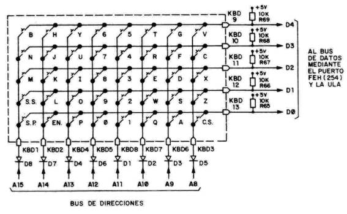

Lectura del teclado en el Spectrum
================================================================================

Este capítulo está íntegramente dedicado a la lectura del teclado mediante la instrucción de lectura de puertos "IN". A lo largo del mismo veremos cómo responde el estado del puerto a los cambios del teclado, y subrutinas útiles para la gestión del mismo.

Tras este capítulo seremos capaces de consultar el estado del teclado, ya sean teclas concretas predefinidas en el código o redefinidas por el usuario, permitiéndonos interactuar con él y cubriendo una de las principales necesidades a la hora de programar juegos para Spectrum: el control, tanto de los menúes como del juego en sí.

El teclado a nivel hardware
--------------------------------------------------------------------------------

El teclado del Spectrum es una matriz de 40 pulsadores (40 teclas) que proporcionan al microprocesador, a través de las líneas de Entrada/Salida, para diferentes filas, un valor de 8 bits en el rango 0-255, donde cada bit indica el estado de una determinada tecla. Estrictamente hablando, la encargada de la lectura del teclado (como de otros periféricos) es realmente la ULA, pero para nosotros esto es transparente y podremos utilizar las funciones estándar de IO del microprocesador Z80 para conocer el estado del teclado. Para leer el estado de cada una de las teclas del teclado (0 = pulsada, 1 = no pulsada), debemos obtener el estado del puerto $FE.

La pregunta en este momento debe de ser: si $FE es el puerto de lectura del teclado, y el Z80A es un microprocesador con un bus de datos de 8 bits, ¿cómo leemos el estado de 40 teclas en un registro de 8 bits?

La respuesta es: organizando el teclado en filas de teclas y seleccionando qué fila leer mediante el registro B. 

   Teclado del Spectrum

Si abrimos físicamente nuestro Spectrum, veremos que el teclado está conectado a la placa base del mismo mediante 2 cintas de datos: una de ellas de 8 líneas y la otra de 5. La de 8 líneas (8 bits) se puede considerar como el "byte de direcciones" del teclado, y es la que está unida al byte alto (bits 8 al 15) del bus de direcciones del Spectrum. La de 5 bits está conectado a los 5 bits inferiores (del 0 al 4) del bus de datos. Mediante la primera seleccionamos qué fila queremos leer (con el registro B), y mediante la segunda leemos el estado del teclado (en ceros y unos).

   El aspecto de la membrana de teclado

Así, en nuestros programas podemos leer el estado del teclado accediendo a los puertos de Entrada / Salida del microprocesador a los que están conectadas las diferentes líneas de dicha matriz. 

   Plantilla eléctrica del teclado

Rescatemos el siguiente programa BASIC de uno de los capítulos iniciales del curso:

5  REM Mostrando el estado de la fila 1-5 del teclado ($F7FE)
10 LET puerto=63486
20 LET V=IN puerto: PRINT AT 20,0; V ; "  " : GO TO 20

Este ejemplo lee (en un bucle infinito) una de las filas del teclado, concretamente la fila de las teclas del 1 al 5. Esta fila tiene sus diferentes bits de estado conectados al puerto 63486 ($F7FEh), y como podéis suponer, mediante la instrucción IN de BASIC realizamos la misma función que con su equivalente ensamblador: consultar el valor contenido en dicho puerto.

El valor $FE se corresponde con el puerto del teclado, mientras que $F7 se corresponde con 11110111 en binario, donde el cero selecciona la fila concreta del teclado que queremos leer, en este caso, la fila de teclas del 1 al 5.

Por defecto, sin pulsar ninguna tecla, los diferentes bits del valor leído en dicho puerto estarán a 1. Cuando pulsamos una tecla, el valor del bit correspondiente a dicha tecla aparecerá como 0, y soltándola volverá a su valor 1 original.

Al ejecutar el ejemplo en BASIC, veremos que la pulsación de cualquier tecla modifica el valor numérico que aparece en pantalla. Si pasamos dicho valor numérico a formato binario veremos cómo el cambio del valor se corresponde con las teclas que vamos pulsando y liberando.

Si no hay ninguna tecla pulsada, los 5 bits más bajos del byte que hay en el puerto estarán todos a 1, mientras que si se pulsa alguna de las teclas del 1 al 5, el bit correspondiente a dicha tecla pasará a estado 0. Nosotros podemos leer el estado del puerto y saber, mirando los unos y los ceros, si las teclas están pulsadas o no. Los 3 bits más altos del byte debemos ignorarlos para este propósito, ya que no tienen relación alguna con el teclado (son los bits de acceso al cassette, a la unidad de cinta y al altavoz del Spectrum).

Así, por ejemplo, leyendo del puerto 63486 obtenemos un byte cuyos 5 últimos bits tienen como significado el estado de cada una de las teclas de la semifila del "1" al "5". 
   

+-----------+------+------+------+-------+-------+-------+-------+-------+
|   Bits:   |  D7  |  D6  |  D5  |   D4  |   D3  |   D2  |   D1  |   D0  |
+===========+======+======+======+=======+=======+=======+=======+=======+
|  Teclas:  |  XX  |  XX  |  XX  |  "5"  |  "4"  |  "3"  |  "2"  |  "1"  |
+-----------+------+------+------+-------+-------+-------+-------+-------+

Como ya hemos dicho, los bits D7 a D5 no nos interesan en el caso del teclado (por ejemplo, D6 tiene relación con la unidad de cinta), mientras que los bits de D4 a D0 son bits de teclas (0=pulsada, 1=no pulsada). Tenemos pues el teclado dividido en filas de teclas y disponemos de una serie de puertos para leer el estado de todas ellas: 

+------------------+---------------------------+
|      Puerto      |           Teclas          |
+==================+===========================+
|  65278d ($FEFE)  |  de CAPS SHIFT a V        |
+------------------+---------------------------+
|  65022d ($FDFE)  |  de A a G                 |
+------------------+---------------------------+
|  64510d ($FBFE)  |  de Q a T                 |
+------------------+---------------------------+
|  63486d ($F7FE)  |  de 1 a 5 (y JOYSTICK 1)  |
+------------------+---------------------------+
|  61438d ($EFFE)  |  de 6 a 0 (y JOYSTICK 2)  |
+------------------+---------------------------+
|  57342d ($DFFE)  |  de P a Y                 |
+------------------+---------------------------+
|  49150d ($BFFE)  |  de ENTER a H             |
+------------------+---------------------------+
|  32766d ($7FFE)  |  de (space) a B           |
+------------------+---------------------------+

En el resultado de la lectura de estos puertos, el bit menos significativo (D0) siempre hace referencia a la tecla más alejada del centro del teclado ("1" en nuestro ejemplo), mientras que el más significativo de los 5 (D5) lo hace a la tecla más cercana al centro del teclado.

Concretamente: 

+------------------+-----------+-------+-------+-------+--------+---------+
|      Puerto      |   Bits:   |   D4  |   D3  |   D2  |   D1   |    D0   |
+==================+===========+=======+=======+=======+========+=========+
|  65278d ($FEFE)  |  Teclas:  |  "V"  |  "C"  |  "X"  |  "Z"   |  CAPS   |
+------------------+-----------+-------+-------+-------+--------+---------+
|  65022d ($FDFE)  |  Teclas:  |  "G"  |  "F"  |  "D"  |  "S"   |  "A"    |
+------------------+-----------+-------+-------+-------+--------+---------+
|  64510d ($FBFE)  |  Teclas:  |  "T"  |  "R"  |  "E"  |  "W"   |  "Q"    |
+------------------+-----------+-------+-------+-------+--------+---------+
|  63486d ($F7FE)  |  Teclas:  |  "5"  |  "4"  |  "3"  |  "2"   |  "1"    |
+------------------+-----------+-------+-------+-------+--------+---------+
|  61438d ($EFFE)  |  Teclas:  |  "6"  |  "7"  |  "8"  |  "9"   |  "0"    |
+------------------+-----------+-------+-------+-------+--------+---------+
|  57342d ($DFFE)  |  Teclas:  |  "Y"  |  "U"  |  "I"  |  "O"   |  "P"    |
+------------------+-----------+-------+-------+-------+--------+---------+
|  49150d ($BFFE)  |  Teclas:  |  "H"  |  "J"  |  "K"  |  "L"   |  ENTER  |
+------------------+-----------+-------+-------+-------+--------+---------+
|  32766d ($7FFE)  |  Teclas:  |  "B"  |  "N"  |  "M"  |  SYMB  |  SPACE  |
+------------------+-----------+-------+-------+-------+--------+---------+

**SINCLAIR 1 y 2 (las mismas teclas 0-9)**

+------------------+----------+---------+---------+--------+---------+--------+
|      Puerto      |   Bits:  |    D4   |    D3   |   D2   |    D1   |   D0   |
+==================+==========+=========+=========+========+=========+========+
| 61438d ($EFFE)   |  SINCL1  |  LEFT   |  RIGHT  |  DOWN  |  UP     |  FIRE  |
+------------------+----------+---------+---------+--------+---------+--------+
|  63486d ($F7FE)  |  SINCL2  |   FIRE  |  DOWN   |  UP    |  RIGHT  |  LEFT  |
+------------------+----------+---------+---------+--------+---------+--------+

Como puede verse en la tabla, la parte baja de los 16 bits del puerto representan siempre $FE (254d), el puerto al que está conectado el teclado.

La parte alta es, la única que varía según la semifila a leer, y su valor consiste, como hemos visto, en la puesta a cero de la semifila deseada, teniendo en cuenta que cada semifila de teclas está conectada a uno de los bits del bus de direcciones: 

+-----------------+-------------+---------+-------------------+
| FILA DE TECLAS  |  LINEA BUS  |  VALOR  |   VALOR BINARIO   |
+=================+=============+=========+===================+
|  CAPSSHIFT a V  |  A8         |  $FE    |  1 1 1 1 1 1 1 0  |
+-----------------+-------------+---------+-------------------+
|  A-G            |  A9         |  $FD    |  1 1 1 1 1 1 0 1  |
+-----------------+-------------+---------+-------------------+
|  Q-T            |  A10        |  $FB    |  1 1 1 1 1 0 1 1  |
+-----------------+-------------+---------+-------------------+
|  1-5            |  A11        |  $F7    |  1 1 1 1 0 1 1 1  |
+-----------------+-------------+---------+-------------------+
|  6-0            |  A12        |  $EF    |  1 1 1 0 1 1 1 1  |
+-----------------+-------------+---------+-------------------+
|  Y-P            |  A13        |  $DF    |  1 1 0 1 1 1 1 1  |
+-----------------+-------------+---------+-------------------+
|  H-ENTER        |  A14        |  $BF    |  1 0 1 1 1 1 1 1  |
+-----------------+-------------+---------+-------------------+
|  B-SPACE        |  A15        |  $7F    |  0 1 1 1 1 1 1 1  |
+-----------------+-------------+---------+-------------------+

 Así, al mandar estos valores en la lectura de puerto (en la parte alta del mismo), lo que hacemos realmente es seleccionar cuál de las líneas del bus de direcciones (cada una de ellas conectada a una fila del teclado) queremos leer.

En resumen: es posible obtener el estado de una tecla determinada leyendo de un puerto de Entrada / Salida del microprocesador. Este puerto de 16 bits se compone poniendo en su parte alta el valor de la semifila de teclado a leer (todo "1"s excepto un "0" en la semifila de interés, según la tabla vista anteriormente), y poniendo en su parte baja el valor $FE. El IN de dicho puerto nos proporcionará un valor de 8 bits cuyos 5 últimos bits indicarán el estado de las 5 teclas de la semifila seleccionada (1=no pulsada, 0=pulsada).

(Nótese que es posible leer el estado de 2 o más semifilas simultáneamente haciendo 0 a la vez valor 2 de los bits del byte alto del puerto. El resultado obtenido será un AND del estado de los bits de todas las semifilas leídas).

Ejemplo práctico: leyendo el teclado

Veamos un ejemplo en ASM que se queda en un bucle infinito hasta que pulsamos la tecla "p":

.. code-block:: tasm
        
    ; Lectura de la tecla "P" en un bucle
    ORG 50000
    
    bucle:
        LD BC, $DFFE         ; Semifila "P" a "Y"
        IN A, (C)            ; Leemos el puerto
        BIT 0, A             ; Testeamos el bit 0
        JR Z, salir          ; Si esta a 0 (pulsado) salir.
        JR bucle             ; Si no (a 1, no pulsado) repetimos
        
    salir:
        RET
    
    END 50000

De nuevo ensamblamos nuestro programa con "pasmo –tapbas keyb1.asm keyb1.tap", y lo cargamos en el Spectrum o en un emulador.

Efectivamente, el programa se mantendrá en un bucle infinito hasta que se ponga a cero el bit 0 del puerto $DFFE, que se corresponde con el estado de la tecla "P". Al pulsar esa tecla, la comparación hecha con BIT hará que el Zero Flag se active y el "JR Z" saldrá de dicho bucle, retornando al BASIC.

Nótese cómo en ciertos casos puede ser más recomendable la utilización de una u otra forma de IN. Por ejemplo, nuestro ejemplo anterior se podría escribir con "IN A, (N)", y sería más recomendable, puesto que evita el tener que utilizar el registro B:

.. code-block:: tasm

    ; Lectura de la tecla "P" en un bucle (FORMA 2)
    ORG 50000
    
    bucle:
        LD A, $DF            ; Semifila "P" a "Y"
        IN A, ($FE)          ; Leemos el puerto
        BIT 0, A             ; Testeamos el bit 0
        JR Z, salir          ; Si esta a 0 (pulsado) salir.
        JR bucle             ; Si no (a 1, no pulsado) repetimos
        
    salir:
        RET
  
    END 50000

En este ejemplo B no se usa, usamos A para albergar la semifila a leer, que no nos afecta puesto que ya íbamos a perder su valor tras la lectura (como resultado de ella). Si estamos usando B, por ejemplo como contador de un bucle, nos interesa más esta forma de uso.

Esperar pulsación y esperar liberación de tecla
--------------------------------------------------------------------------------

Veamos otras 2 rutinas interesantes para nuestros programas. La primera espera a que se pulse cualquier tecla (por ejemplo, para realizar una pausa), y la segunda espera a que se suelte la tecla pulsada (esta la podemos usar tras detectar una pulsación para esperar a que el usuario suelte la tecla y no volver a leer la misma tecla en una segunda iteración de nuestro bucle).

Ambas rutinas se basan en el hecho de que, realmente, es posible leer más de una semifila del teclado simultáneamente. Como ya vimos, el valor que mandamos como byte alto del puerto tiene a valor 0 el bit que representa a la línea de datos que queremos leer.

Pero como vamos a ver, podemos leer más de una línea simultáneamente, poniendo a cero tantos bits como deseemos en la parte alta del puerto. En estos ejemplos, con el XOR A (que equivale a "LD A, 0" dado que un XOR de un registro con sí mismo es cero) dejamos a 0 todo el byte alto con lo que leemos la información de todas las semifilas simultáneamente.

Este tipo de "multilectura" no nos permite saber de forma exacta qué tecla ha sido pulsada. Por ejemplo, si intentamos leer simultaneamente las semifilas 1-5 y Q-T, el bit 0 del resultado valdrá "0" (tecla pulsada) si se pulsa "1", se pulsa "Q", o se pulsan ambas.

Así, podemos saber que una de las teclas de las semifilas está siendo leída, pero no cuál de ellas. Para saber qué valor debemos enviar al puerto para leer varias semifilas de forma simultánea, recordemos la tabla vista en el anterior apartado: 

+-----------------+--------------+-------------------+
| FILA DE TECLAS  |  BIT A CERO  |   VALOR BINARIO   |
+=================+==============+===================+
|  CAPSSHIFT a V  |  A8          |  1 1 1 1 1 1 1 0  |
+-----------------+--------------+-------------------+
|  A-G            |  A9          |  1 1 1 1 1 1 0 1  |
+-----------------+--------------+-------------------+
|  Q-T            |  A10         |  1 1 1 1 1 0 1 1  |
+-----------------+--------------+-------------------+
|  1-5            |  A11         |  1 1 1 1 0 1 1 1  |
+-----------------+--------------+-------------------+
|  6-0            |  A12         |  1 1 1 0 1 1 1 1  |
+-----------------+--------------+-------------------+
|  Y-P            |  A13         |  1 1 0 1 1 1 1 1  |
+-----------------+--------------+-------------------+
|  H-ENTER        |  A14         |  1 0 1 1 1 1 1 1  |
+-----------------+--------------+-------------------+
|  B-SPACE        |  A15         |  0 1 1 1 1 1 1 1  |
+-----------------+--------------+-------------------+

Así, para leer tanto 1-5 como Q-T, necesitamos tener 2 ceros: uno en el bit 10 y otro en el bit 11. El valor decimal que corresponde con (11110011d), 243d, nos permite la lectura de ambas semifilas de forma simultánea.

En el caso de una rutina de espera de pulsación o liberación de tecla, podemos hacer la parte alta del byte igual a cero (activar todas las semifilas) para leer todo el teclado, ya que no nos importa cuál de las teclas ha sido pulsada sino el hecho de que lo haya sido o no.

.. code-block:: tasm
        
    ;-----------------------------------------------------------------------
    ; Esta rutina espera a que haya alguna tecla pulsada para volver,
    ; consultando las diferentes filas del teclado en un bucle.
    ;-----------------------------------------------------------------------
    Wait_For_Keys_Pressed:
        XOR A                        ; A = 0
        IN A, (254)
        OR 224
        INC A
        JR Z, Wait_For_Keys_Pressed
        RET
        
    
    ;-----------------------------------------------------------------------
    ; Esta rutina espera a que no haya ninguna tecla pulsada para volver,
    ; consultando las diferentes filas del teclado en un bucle.
    ;-----------------------------------------------------------------------
    Wait_For_Keys_Released:
        XOR A
        IN A, ($FE)
        OR 224
        INC A
        JR NZ, Wait_For_Keys_Released
        RET

Existe otra forma de codificar Wait_For_Keys_Pressed consistente en utilizar CPL para "complementar" los bits del resultado leído:

.. code-block:: tasm
        
    Wait_For_Key_Pressed:
        XOR A                        ; Leer todas las teclas
        IN A, ($FE)
        CPL
        AND 1Fh                      ; Comprobar todos los unos
        JR Z, Wait_For_Key_Pressed
        RET

Leyendo todas las direcciones
~~~~~~~~~~~~~~~~~~~~~~~~~~~~~~~~~~~~~~~~~~~~~~~~~~~~~~~~~~~~~~~~~~~~~~~~~~~~~~~~

En el siguiente ejemplo veremos cómo leer las 4 direcciones más la tecla de disparo en un juego y codificar la información de la lectura en un formato usable en el bucle principal del programa (para poder chequear cómodamente el estado de las teclas consultadas).

La idea sería que, utilizando los diferentes bits de un byte, podemos codificar el estado de las 5 teclas básicas (arriba, abajo, izquierda, derecha, disparo) en 5 de los 8 bits de un registro, y que nuestra función de detección de teclado sea algo parecido a lo siguiente:

.. code-block:: tasm
        
    ; Lee el estado de O, P, Q, A, ESPACIO y devuelve
    ; en A en A el estado de las teclas (1=pulsada, 0=no pulsada).
    ; El byte está codificado de forma que:
    ;
    ; BITS            4    3    2     1   0
    ; SIGNIFICADO   FIRE LEFT RIGHT DOWN  UP
    ;
    LEER_TECLADO:
    
        LD D, 0                    ; Keyboard status flag register (D)
        
        LD BC, $FBFE
        IN A, (C)
        BIT 0, A                   ; Leemos la tecla Q
        JR NZ, Control_no_up       ; No pulsada, no cambiamos nada en D
        SET 0, D                   ; Pulsada, ponemos a 1 el bit 0
    Control_no_up:
    
        LD BC, $FDFE
        IN A, (C)
        BIT 0, A                   ; Leemos la tecla A
        JR NZ, Control_no_down     ; No pulsada, no cambianos nada en D
        SET 1, D                   ; Pulsada, ponemos a 1 el bit 1
    Control_no_down:
    
        LD BC, $DFFE
        IN A, (C)
        BIT 0, A                   ; Leemos la tecla P
        JR NZ, Control_no_right    ; No pulsada
        SET 2, D                   ; Pulsada, ponemos a 1 el bit 2
    Control_no_right:
                                   ; BC ya vale $DFFE, (O y P en misma fila)
        BIT 1, A                   ; Tecla O
        JR NZ, Control_no_left
        SET 3, D
    Control_no_left:
    
        LD BC, $7FFE
        IN A, (C)
        BIT 0, A                   ; Tecla Espacio
        JR NZ, Control_no_fire
        SET 4, D
    Control_no_fire:
    
        LD A, D                    ; Devolvemos en A el estado de las teclas
        RET

El bucle principal del programa deberá llamar a esta función de lectura del teclado y después, con el valor devuelto en el registro A, actuar consecuentemente de acuerdo al estado de los bits (aprovechando las funciones de testeo de bits del Z80). De esta forma, al volver de la llamada a esta subrutina sabremos si el usuario pretende mover el personaje en una dirección u otra, o si ha pulsado disparo, según el estado de los diferentes bits. La rutina que hemos visto trabaja con 5 teclas, pero todavía tenemos espacio para almacenar el estado de 3 teclas más en los bits 5, 6 y 7 del registro A.

Con esta información sobre el teclado y las instrucciones IN y OUT, nada os impide dotar de interacción y movimiento vuestros programas, utilizando la lectura del teclado en menúes, acciones sobre los personajes, etc.

Por otra parte, el código que acabamos de ver se basa en leer las semifilas de teclado y comprobar el estado de teclas concretas y definidas ("hardcodeadas") en el propio listado del programa. Esto quiere decir que las teclas de control son fijas y no seleccionables por el usuario. Este es el mecanismo de "lectura de teclado" más rápido y que menos espacio ocupa puesto que no es necesario crear rutinas para re-definir las teclas de juego, almacenarlas en variables de memoria y comparar el estado del teclado de los scancodes seleccionados por el usuario.

No obstante, una de las cosas que más agradecen los usuarios es la posibilidad de que las teclas de control se puedan redefinir y no sean fijas, por lo que a continuación veremos mecanismos para obtener del usuario las teclas de control y posteriormente poder detectar su pulsación en el transcurso de la lógica del programa o juego.

Redefinicion de teclas
~~~~~~~~~~~~~~~~~~~~~~~~~~~~~~~~~~~~~~~~~~~~~~~~~~~~~~~~~~~~~~~~~~~~~~~~~~~~~~~~

Hasta ahora hemos visto cómo verificar el estado de unas teclas predeterminadas del teclado. Normalmente los juegos o programas suelen incluir la opción de redefinir las teclas asociadas a las acciones del juego, de forma que sea el jugador quien elija la combinación de teclas con la que se sienta más cómodo.

Para ello necesitaremos una rutina que haga lo siguiente:

* Antes de ser llamada, deberemos llegar a ella con el mensaje apropiado en pantalla ("Pulse tecla para ARRIBA", por ejemplo). La rutina se dedicará sólo al escaneo del teclado en sí mismo, de forma que pueda ser llamada tantas veces como teclas a redefinir. Además, tenemos que asegurarnos de que cuando la llamamos no haya ninguna tecla pulsada. Para eso podemos usar la rutina Wait_For_Keys_Released vista previamente.
* La rutina deberá devolver un valor único para cada tecla pulsada, y asegurarse (o informarnos) de que no está siendo pulsada más de una tecla simultáneamente.
* Dicho valor devuelto por la rutina será almacenado para su posterior chequeo durante el juego, utilizando una rutina que nos indique si la tecla asociada a ese "valor único" está siendo pulsada.

David Webb nos ofrece el siguiente conjunto de rutinas para este propósito. Existen bastantes posibilidades de realizar esta tarea (tablas con las semifilas y bits y sus correspondientes en ASCII, modificación en tiempo real de los opcodes que hacen los testeos, elegir entre un conjunto de combinaciones de teclas predeterminadas, etc), pero la que nos muestra David Webb es elegante y sencilla de utilizar.

Consiste en escanear el teclado completo y, al detectar la pulsación de una tecla, codificar la semifila y el bit donde se han detectado en un mismo byte, utilizando los 3 bits más bajos para "el bit de la tecla pulsada" y los 3 siguientes para "la semifila (puerto)" en que se ha detectado la pulsación.

.. code-block:: tasm
        
    ; Chequea el teclado para detectar la pulsación de una tecla.
    ; Devuelve un código en el registro D que indica:
    ;
    ;    Bits 0, 1 y 2 de "D": Fila de teclas (puerto) detectada.
    ;    Bits 3, 4 y 5 de "D": Posición de la tecla en esa media fila
    ;
    ; Así, el valor devuelto nos indica la semifila a leer y el bit a testear.
    ; El registro D valdrá 255 ($FF) si no hay ninguna tecla pulsada.
    ;
    ; Flags: ZF desactivado: Más de una tecla pulsada
    ;        ZF activado: Tecla correctamente leída
    Find_Key:
        
        LD DE, $FF2F         ; Valor inicial "ninguna tecla"
        LD BC, $FEFE         ; Puerto
        
    NXHALF:
        IN A, (C)
        CPL 
        AND $1F
        JR Z, NPRESS         ; Saltar si ninguna tecla pulsada
        
        INC D                ; Comprobamos si hay más de 1 tecla pulsada
        RET NZ               ; Si es así volver con Z a 0
        
        LD H, A              ; Cálculo del valor de la tecla
        LD A, E
        
    KLOOP:
        SUB 8
        SRL H
        JR NC, KLOOP
        
        RET NZ               ; Comprobar si más de una tecla pulsada
    
        LD D, A              ; Guardar valor de tecla en D
    
    NPRESS:                 ; Comprobar el resto de semifilas
        DEC E
        RLC B
        JR C, NXHALF         ; Repetimos escaneo para otra semifila
        
        CP A                 ; Ponemos flag a zero
        RET Z                ; Volvemos

La forma en que llamaríamos a esta subrutina sería la siguiente:

.. code-block:: tasm

    ;; Pedimos tecla ARRIBA
        CALL Imprimir_Texto_Pulse_Arriba
        CALL Wait_For_Keys_Released     ; Esperamos teclado libre
        
    Pedir_Arriba:
    
        CALL Find_Key                   ; Llamamos a la rutina
        JR NZ, Pedir_Arriba             ; Repetir si la tecla no es válida
        INC D
        JR Z, Pedir_Arriba              ; Repetir si no se pulsó ninguna tecla
        DEC D
        
        LD A, D
        LD (tecla_arriba), A
        
        ;; Pedimos siguiente tecla (ABAJO)
        CALL Imprimir_Texto_Pulse_Abajo
        CALL Wait_For_Keys_Released     ; Esperamos teclado libre
        
    Pedir_Abajo:
        
        CALL Find_Key                   ; Llamamos a la rutina
        JR NZ, Pedir_Abajo              ; Repetir si la tecla no es válida
        INC D
        JR Z, Pedir_Abajo               ; Repetir si no se pulsó ninguna tecla
        DEC D
        
        LD A, D
        LD (tecla_abajo), A
        
        ;;; Repetir el mismo código para IZQ, DERECHA, DISPARO, etc.
        
        tecla_arriba DEFB 0
        tecla_abajo  DEFB 0

A continuación podemos ver un ejemplo (scancode.asm) que "dibuja" en pantalla de forma gráfica el SCANCODE que devuelve la función Find_Key:

.. code-block:: tasm

    ; Visualizando los scancodes de las teclas codificadas con "Find_Key"
    
    ORG 50000
    
    Bucle_entrada:
        CALL Wait_For_Keys_Released
        
    Pedir_Tecla:
        CALL Find_Key                   ; Llamamos a la rutina
        JR NZ, Pedir_Tecla              ; Repetir si la tecla no es valida
        INC D
        JR Z, Pedir_Tecla               ; Repetir si no se pulsa ninguna tecla
        DEC D
        
        LD A, D                         ; Guardamos en A copia del resultado
        CALL PrintBin                   ; Imprimimos el scancode bin en pantalla
        
        LD A, D                         ; Guardamos en A copia del resultado
        CALL PrintHex                   ; Imprimimos el scancode hex en pantalla
        
        CP $21                          ; Comprobamos si A == 21h (enter)
        JR NZ, Bucle_entrada            ; Si no lo es, repetir
        
        RET                             ; Si es enter, fin del programa
        
        
    ;-----------------------------------------------------------------------
    ; PrintBin: Imprime en la pantalla un patron para visualizar el valor
    ; de A en binario, usando 8 pixels "puros" para "1" y punteados para "0"
    ;
    ; Entrada: A = valor a "imprimir" en binario
    ;-----------------------------------------------------------------------
    PrintBin:
        PUSH AF
        PUSH HL
        PUSH BC                            ; Preservamos los registros que se usará
        
        LD HL, 20704                       ; Esquina (0,24) de la pantalla
        LD C, A                            ; Guardamos en C copia de A
        LD B, 8                            ; Imprimiremos el estado de los 8 bits
        
    printbin_loop:
        LD A, $FF                          ; Para bit = 1, todo negro
        BIT 7, C                           ; Chequeamos el estado del bit 7
        JR NZ, printbin_es_uno             ; Dejamos A = 255
        LD A, $55                          ; Para bit = 0, punteado/gris
        
    printbin_es_uno:
        LD (HL), A                         ; Lo "imprimimos" (A) y pasamos a la
        INC HL                             ; Siguiente posició en memoria
        RLC C                              ; Rotamos C a la izq para que podamos
                                            ; usar de nuevo el BIT 7 en el bucle
        DJNZ printbin_loop                 ; Repetimos 8 veces
        
        POP BC
        POP HL
        POP AF
        RET
        
    ;-----------------------------------------------------------------------
    ; PrintHex: Imprime en la pantalla un numero de 1 byte en hexadecimal.
    ;        Para ello convierte el valor numérico en una cadena llamando
    ;        a Byte2ASCII_Hex y luego llama a RST 16 para imprimir cada
    ;        caracter por separado. Imprime un $ delante y ESPACIO detrás.
    ;
    ; Entrada: A = valor a "imprimir" en binario
    ;-----------------------------------------------------------------------
    PrintHex:
        PUSH HL
        PUSH AF
        PUSH DE
        
        LD H, A
        CALL Byte2ASCII_Hex            ; Convertimos A en Cadena HEX
        LD HL, Byte2ASCII_output       ; HL apunta a la cadena
        
        LD A, "$"
        RST 16                         ; Imprimimos un "$"
        
        LD A, (HL)
        RST 16                         ; Imprimimos primer valor HEX
        
        INC HL                         ; Avanzar en la cadena
        LD A, (HL)
        RST 16                         ; Imprimimos segundo valor HEX
        
        LD A, " "
        RST 16                         ; Imprimimos un espacio
        
        POP DE
        POP AF
        POP HL
        
        RET
        
    ;-----------------------------------------------------------------------
    ; Byte2ASCII_Hex: Convierte el valor del registro H en una cadena
    ; de texto de max. 2 caracteres hexadecimales, para poder imprimirla.
    ; Rutina adaptada de Num2Hex en http://baze.au.com/misc/z80bits.html .
    ;
    ; IN:   H = Numero a convertir
    ; OUT:  [Byte2ASCII_output] = Espacio de 2 bytes con los ASCIIs
    ;-----------------------------------------------------------------------
    Byte2ASCII_Hex:
        
        ld de, Byte2ASCII_output
        ld a, h
        call B2AHex_Num1
        ld a, h
        call B2AHex_Num2
        ret
        
    B2AHex_Num1:
        rra
        rra
        rra
        rra
        
    B2AHex_Num2:
        or $F0
        daa
        add a, $A0
        adc a, $40
        ld (de), a
        inc de
        ret
        
    Byte2ASCII_output DB 0, 0
    ;-----------------------------------------------------------------------
    
    ; Debemos incluir, además, el código de Wait_For_Keys_Released y
    ; de Find_Key dentro de este ejemplo para que ensamble correctamente.
    
    ; Nota: recuerda que acabando el programa con END 50000 no sería necesario
    ; ejecutarlo manualmente con randomize usr 50000 al ensamblarlo con PASMO.

Este ejemplo proporcionará en pantalla (hasta que se pulse ENTER) una salida como la siguiente: 

.. figure:: scancode.png
   :scale: 90%
   :align: center
   :alt: Representación binaria de las teclas pulsadas.

   Representación binaria de las teclas pulsadas.

Mediante Byte2ASCII_Hex convertimos el scancode en una cadena de 2 caracteres, que imprimimos en pantalla con PrintHex. Esta función, PrintHex, hace uso de la RST 16 para trazar caracteres por pantalla en la posición actual del cursor.

Por otra parte, se incluye una rutina PrintBin para mostrar el estado de los diferentes bits del valor del scancode mediante pixeles "encendidos" y "apagados". Como véis, la rutina PrintBin es una forma rudimentaria de mostrar en pantalla el valor del registro A en binario. Lo que muestra es una representación gráfica binaria de las teclas pulsadas.

Los scancodes asociados a las diferentes teclas son: 

+--------------+---------+-------+-------+-------+-------+-------+-------+-------+---------+---------+
| Desglose     | Tecla   | Tecla | Tecla | Tecla | Tecla | Tecla | Tecla | Tecla | Tecla   | Tecla   |
+==============+=========+=======+=======+=======+=======+=======+=======+=======+=========+=========+
|   Teclas:    |    1    |   2   |   3   |   4   |   5   |   6   |   7   |   8   |    9    |    0    |
+--------------+---------+-------+-------+-------+-------+-------+-------+-------+---------+---------+
|  Scancodes:  |  $24    |  $1C  |  $14  |  $0C  |  $04  |  $03  |  $0B  |  $13  |  $1B    |  $23    |
+--------------+---------+-------+-------+-------+-------+-------+-------+-------+---------+---------+
|   Teclas:    |    Q    |   W   |   E   |   R   |   T   |   Y   |   U   |   I   |    O    |    P    |
+--------------+---------+-------+-------+-------+-------+-------+-------+-------+---------+---------+
|  Scancodes:  |  $25    |  $1D  |  $15  |  $0D  |  $05  |  $02  |  $0A  |  $12  |  $1A    |  $22    |
+--------------+---------+-------+-------+-------+-------+-------+-------+-------+---------+---------+
|   Teclas:    |    A    |   S   |   D   |   F   |   G   |   H   |   J   |   K   |    L    |  ENTER  |
+--------------+---------+-------+-------+-------+-------+-------+-------+-------+---------+---------+
|  Scancodes:  |  $26    |  $1E  |  $16  |  $0E  |  $06  |  $01  |  $09  |  $11  |  $19    |   $21   |
+--------------+---------+-------+-------+-------+-------+-------+-------+-------+---------+---------+
|   Teclas:    |   CAPS  |   Z   |   X   |   C   |   V   |   B   |   N   |   M   |   SYMB  |  SPACE  |
+--------------+---------+-------+-------+-------+-------+-------+-------+-------+---------+---------+
|  Scancodes:  |   $27   |  $1F  |  $17  |  $0F  |  $07  |  $00  |  $08  |  $10  |   $18   |   $20   |
+--------------+---------+-------+-------+-------+-------+-------+-------+-------+---------+---------+

 Estos valores nos serán necesarios si queremos establecer unos scancodes por defecto para las teclas del programa, de forma que si el usuario no las redefine, tengan unos valores de comprobación determinados para la rutina de chequeo que veremos a continuación.

Chequeando las teclas redefinidas
--------------------------------------------------------------------------------

Llegados a este punto tenemos una función que nos devuelve un "scancode" propio (creado a nuestra medida) de una tecla pulsada. De esta forma, podemos almacenar en variables de memoria (por ejemplo: "tecla_arriba DEFB 0") los valore que nos devuelve dicha función. En lugar de dar a estas variables un valor de 0 por defecto, tenemos una tabla de "scancodes" que nos permitiría definir unas "teclas iniciales" como:

.. code-block:: tasm

    tecla_arriba  DEFB  $25
    tecla_abajo   DEFB  $26
    tecla_izq     DEFB  $1A
    tecla_der     DEFB  $22
    tecla_disp    DEFB  $20

Dichos valores podrán ser modificados (o no) por la rutina de redefinición del teclado.

Lo único que nos falta para un control total del teclado en nuestro juego sería una rutina que reciba un scancode y nos indique si dicho scancode está pulsado o no. De esta forma, llamaríamos a la rutina 5 veces, poniendo el valor de las diferentes teclas (tecla_arriba, tecla_abajo, etc.) en el registro A antes de cada llamada, para conocer el estado de las mismas.

Llamaremos a esta rutina Check_Key:

.. code-block:: tasm
        
    ; Chequea el estado de una tecla concreta, aquella de scancode
    ; codificado en A (como parametro de entrada).
    ;
    ; Devuelve:    CARRY FLAG = 0 -> Tecla pulsada
    ;              CARRY FLAG = 1 y BC = 0 -> Tecla no pulsada
    ;
    Check_Key:
        LD C, A          ; Copia de A
        
        AND 7
        INC A
        LD B, A          ; B = 16 - (num. linea dirección)
        
        SRL C
        SRL C
        SRL C
        LD A, 5
        SUB C
        LD C, A          ; C = (semifila + 1)
        
        LD A, $FE
    
    CKHiFind:           ; Calcular el octeto de mayor peso del puerto
        RRCA
        DJNZ CKHiFind
        
        IN A, ($FE)      ; Leemos la semifila
    
    CKNXKey:
        RRA
        DEC C
        JR NZ, CKNXKey   ; Ponemos el bit de tecla en el CF
        
        RET   

La forma en que se debe llamar a esta rutina sería la siguiente:

.. code-block:: tasm
        
    Comprobar_tecla_izquierda:
        LD A, (teclaizq)
        CALL Check_Key
        JR C, izq_no_pulsada            ; Carry = 1, tecla no pulsada
        
        acciones a realizar si se pulso izq
        
    izq_no_pulsada:
    
    Comprobar_tecla_derecha:
        LD A, (teclader)
        CALL Check_Key
        JR C, der_no_pulsada            ; Carry = 1, tecla no pulsada
        
    acciones a realizar si se pulso der
    
    ; Repetir para arriba, abajo, disparo, etc.

También podemos generar una rutina que combine lo que acabamos de ver con la codificación de las direcciones en los 5 bits de un único byte, de la misma forma que lo realizamos con teclas predefinidas.

Por supuesto, estas rutinas son sólo de ejemplo y pueden ser modificadas para que devuelvan los resultados en otros flags (Zero, Carry), en otros registros, sean llamadas con diferentes parámetros, etc.

Veamos a continuación un ejemplo final que permite modificar el valor de una variable en memoria ("valor") mediante las teclas Q y A (sumando o restando 1 a su valor de 8 bits). Cada vez que el valor de la variable cambie, se mostrará en pantalla con nuestra la sencilla rutina PrintBin.

.. code-block:: tasm
        
    ; Controlando el valor de "valor" con Q y A
    ORG 50000
    
        LD A, (valor)
        CALL PrintBin                   ; Imprimimos el scancode en pantalla
        
    Bucle_entrada:
        
        LD BC, 20000                    ; Retardo (bucle 20000 iteraciones)
    retardo:
        DEC BC
        LD A, B
        OR C
        JR NZ, retardo                  ; Fin retardo
        
    Comprobar_tecla_mas:
        LD A, (tecla_mas)
        CALL Check_Key
        JR C, mas_no_pulsado            ; Carry = 1, tecla_mas no pulsada
        
        LD A, (valor)
        INC A
        LD (valor), A                   ; Incrementamos (valor)
        JR Print_Valor
        
    mas_no_pulsado:                   
    
    Comprobar_tecla_menos:
        LD A, (tecla_menos)
        CALL Check_Key
        JR C, menos_no_pulsado          ; Carry = 1, tecla_menos no pulsada
        
        LD A, (valor)
        DEC A
        LD (valor), A                   ; Decrementamos (valor)
        JR Print_Valor
        
    menos_no_pulsado:
    
        JR Bucle_entrada                ; Repetimos continuamente hasta que se
                                        ; pulse algo (tecla_mas o tecla_menos)
        
    Print_Valor:
        LD A, (valor)                   ; Guardamos en A copia del resultado
        CALL PrintBin                   ; Imprimimos el scancode en pantalla
        
        LD A, (valor)                   ; Guardamos en A copia del resultado
        CALL PrintHex                   ; Imprimimos el scancode HEX en pantalla
        
        JR Bucle_entrada                ; Repetimos
        
    valor        DEFB  0
    tecla_mas    DEFB  $25
    tecla_menos  DEFB  $26
    
    
    ;-----------------------------------------------------------------------
    ; Chequea el estado de una tecla concreta, aquella de scancode
    ; codificado en A (como parametro de entrada).
    ;
    ; Devuelve:    CARRY FLAG = 0 -> Tecla pulsada
    ;              CARRY FLAG = 1 y BC = 0 -> Tecla no pulsada
    ;-----------------------------------------------------------------------
    Check_Key:
        LD C, A          ; Copia de A
        
        AND 7
        INC A
        LD B, A          ; B = 16 - (num. linea direcció
        SRL C
        SRL C
        SRL C
        LD A, 5
        SUB C
        LD C, A          ; C = (semifila + 1)
        
        LD A, $FE
        
    CKHiFind:           ; Calcular el octeto de mayor peso del puerto
        RRCA
        DJNZ CKHiFind
        
        IN A, ($FE)      ; Leemos la semifila
        
    CKNXKey:
        RRA
        DEC C
        JR NZ, CKNXKey   ; Ponemos el bit de tecla en el CF
        
        RET   
        
        
    ;; Nota: Incluir en el código las siguientes rutinas para re-ensamblarlo:
    ;;       Wait_For_Keys_Released, PrintBin, PrintHex y Byte2ASCII_Hex.
    
    END 50000

Queda como ejercicio para el lector la modificación del programa para que, antes de entrar en el bucle principal, lea 2 teclas válidas y diferentes del teclado para permitir la redefinición de "tecla_mas" y "tecla_menos" con respecto a sus valores por defecto.

Redefinición de las teclas
--------------------------------------------------------------------------------

En las secciones anteriores hemos visto las rutinas Find_Key y Check_Key para detectar las pulsaciones de teclas y chequear el estado de una tecla concreta. Estas teclas concretas las guardamos en variables de memoria y así podemos permitir al jugador redefinirlas.

El menú principal deberá de tener una opción que permita modificar el contenido de estas variables de memoria con aquellos scancodes que el jugador elija para controlar el juego.

El sistema de redefinición de teclas debe:

a) Establecer en el arranque del programa unos valores por defecto para las teclas:

.. code-block:: tasm

    tecla_arriba   DEFB  $25
    tecla_abajo    DEFB  $26
    tecla_izq      DEFB  $1A
    tecla_der      DEFB  $22
    tecla_disp     DEFB  $20

b) Repetir N veces (uno por cada control a redefinir):

* Esperar a que ninguna tecla del teclado esté pulsada (para evitar que la tecla de selección del menú para entrar en la redefinición, o la anterior tecla pulsada, se seleccione como tecla pulsada por el usuario).
* Mostrar por pantalla el mensaje de "Pulse una tecla para (dirección a redefinir)".
* Esperar una pulsación de teclado del usuario.
* Opcionalmente, comprobar que esa pulsación no se corresponda con ninguna de las teclas anteriores, para evitar que el usuario seleccione la misma dirección para, por ejemplo, izquierda y derecha. Este paso es opcional porque el usuario, si se equivoca, siempre puede redefinir de nuevo el teclado con las teclas adecuadas, y para nosotros esta comprobación representa tiempo de programación y espacio ocupado innecesariamente en el programa.
* Mostrar al usuario la tecla que ha pulsado a la derecha del mensaje impreso pidiendo dicha tecla. Para eso tenemos que convertir el Scancode en un código ASCII imprimible en pantalla.
* Modificar la variable en memoria que deba almacenar el scancode de la tecla pulsada para poder usarla posteriormente en el transcurso del juego (es decir, guardar el scancode obtenido en tecla_arriba, tecla_abajo, tecla_izq, o en la variable que corresponda).

Hasta ahora tenemos todos los mecanismos necesarios para crear nuestra propia rutina de redefinición de teclas, salvo la rutina para convertir un scancode en su correspondiente ASCII. A continuación tenemos una rutina Scancode2Ascii basada en una tabla que relaciona cada scancode con su ASCII (40 bytes más adelante en la misma tabla):

.. code-block:: tasm
        
    ;-----------------------------------------------------------------------
    ; Scancode2Ascii: convierte un scancode en un valor ASCII
    ; IN:  D = scancode de la tecla a analizar
    ; OUT: A = Codigo ASCII de la tecla
    ;-----------------------------------------------------------------------
    Scancode2Ascii:
        
        push hl
        push bc
        
        ld hl,0
        ld bc, TABLA_S2ASCII
        add hl, bc           ; hl apunta al inicio de la tabla
        
    ; buscamos en la tabla un max de 40 veces por el codigo
    ; le sumamos 40 a HL, leemos el valor de (HL) y ret A
    SC2Ascii_1:
        ld a, (hl)           ; leemos un byte de la tabla
        cp "1"               ; Si es "1" fin de la rutina (porque en
                                ; (la tabla habriamos llegado a los ASCIIs)
        jr z, SC2Ascii_Exit  ; (y es condicion de forzado de salida) 
        inc hl               ; incrementamos puntero de HL
        cp d                 ; comparamos si A==D (nuestro scancode)
        jr nz, SC2Ascii_1
    
    SC2Ascii_Found:
        ld bc, 39            ; Sumamos 39(+INC HL=40) para ir a la seccion
        add hl, bc           ; de la tabla con los codigos ASCII
        ld a,(hl)            ; leemos el codigo ASCII de esa tabla
        
    SC2Ascii_Exit:
        pop bc
        pop hl
        ret
        
    ; 40 scancodes seguidos de sus ASCIIs equivalentes
    TABLA_S2ASCII:
        defb $24, $1C, $14, $0C, $04, $03, $0B, $13, $1B, $23
        defb $25, $1D, $15, $0D, $05, $02, $0A, $12, $1A, $22
        defb $26, $1E, $16, $0E, $06, $01, $09, $11, $19, $21
        defb $27, $1F, $17, $0F, $07, $00, $08, $10, $18, $20
        defm "1234567890QWERTYUIOPASDFGHJKLecZXCVBNMys"

La rutina recibe en el registro D el scancode obtenido con la rutina Find_Key y devuelve en el registro A el código ASCII correspondiente directamente imprimible. Los primeros 40 bytes de la tabla contienen los Scancodes y la última línea defm (últimos 40 bytes) los ASCIIs a los que corresponden, en orden, los anterior 40 códigos.

Nótese que las teclas se devuelven como ASCIIs en mayúsculas, aprovechando las letras minúsculas para los caracteres especiales no directamente representables:

* e = ENTER
* c = CAPS SHIFT
* y = SYMBOL SHIFT
* s = SPACE

De esta forma, "E" se corresponde a la tecla E y "e" a la tecla de ENTER. Podemos utilizar estos ASCIIs en minúsculas para mostrar en pantalla cadenas como "ENTER" o "SPACE" durante la redefinición de las teclas.

A continuación podemos ver un ejemplo que utiliza las rutinas Find_Key y Scancode2Ascii para mostrar en pantalla el código ASCII de cualquier tecla pulsada:

.. code-block:: tasm
        
    ;--------------------------------------------------------------
    ; Prueba de conversion de Scancode a ASCII
    ; Recuerda que para compilarla necesitarás añadir las rutinas
    ; Find_Key y Scancode2ASCII a este listado, se han eliminado
    ; del mismo para reducir la longitud del programa.
    ;--------------------------------------------------------------
    
    ORG 32768
    
    START:
        CALL Wait_For_Keys_Released
    
    chequear_teclas:
        CALL Find_Key                   ; Llamamos a la rutina
        JR NZ, chequear_teclas          ; Repetir si la tecla no es válida
        INC D
        JR Z, chequear_teclas           ; Repetir si no se pulsó ninguna tecla
        DEC D
        
        ; En este punto D es un scancode valido 
        call Scancode2Ascii
        
        ; En este punto A contiene el ASCII del scancode en D
        ; lo imprimimos por pantalla con rst 16.
        rst 16
    
    CALL Wait_For_Keys_Released
        jr START                        ; vuelta a empezar
        
    
    ;-----------------------------------------------------------------------
    ; Esta rutina espera a que no haya ninguna tecla pulsada para volver.
    ;-----------------------------------------------------------------------
    Wait_For_Keys_Released:
        XOR A
        IN A, ($FE)
        OR 224
        INC A
        JR NZ, Wait_For_Keys_Released
        RET
        
        
    ;-----------------------------------------------------------------------
    ;--- Introducir aquí las rutinas Find_Keys y Scancode2ASCII ------------
    ;-----------------------------------------------------------------------
    
    END 32768

Una vez en ejecución y tras pulsar múltiples teclas, este es el aspecto del programa anterior: 

   Conversión de scancode a ASCII

ISSUE 2 vs ISSUE 3
--------------------------------------------------------------------------------

Una recomendación a la hora de verificar el estado de las teclas es que utilicemos las herramientas de que nos provee el Z80 para testear los bits del valor devuelto por IN, en lugar de, simplemente tratar de comparar el valor del estado del teclado con algún valor predefinido. Esto evitará que nuestro programa funcione de forma diferente en Spectrums con teclado ISSUE 2, ISSUE 3, o con algún periférico conectado.

Si alguna vez has cargado un snapshot de algún juego en un emulador y has visto que el personaje se movía "sólo", como si alguien estuviera pulsando teclas que realmente no están pulsadas (por ejemplo, Abu Simbel Profanation), y has tenido que activar la opción "ISSUE 2 KEYBOARD EMULATION" para que funcione adecuadamente, entonces ya has sufrido los efectos de una incorrecta lectura del teclado.

Ahora mismo veremos por qué, y empezaremos para ello recordando uno de los primeros párrafos de esta entrega:

Así, leyendo del puerto 63486 obtenemos un byte cuyos 8 bits tienen como significado el estado de cada una de las teclas de la semifila del "1" al "5". 

+-----------+------+------+------+-------+-------+-------+-------+-------+
| Desglose  |      |      |      |       |       |       |       |       |
+===========+======+======+======+=======+=======+=======+=======+=======+
|   Bits:   |  D7  |  D6  |  D5  |   D4  |   D3  |   D2  |   D1  |   D0  |
+-----------+------+------+------+-------+-------+-------+-------+-------+
|  Teclas:  |  XX  |  XX  |  XX  |  "5"  |  "4"  |  "3"  |  "2"  |  "1"  |
+-----------+------+------+------+-------+-------+-------+-------+-------+

Con esta información "rescatada", volvamos al punto en que estábamos: A la hora de comprobar si la tecla "2" está pulsada, lo recomendable es testear (por ejemplo, con el nmemónico *BIT*), el bit 1 del valor devuelto por un IN del puerto 63486. Recordemos que dicho bit valdrá 0 si la tecla está pulsada, y 1 si no lo está.

Teniendo en cuenta que un bit a "1" significa tecla no pulsada y "0" significa pulsada, si en nuestro teclado no está pulsada ninguna tecla del 1 al 5, los últimos 5 bits del valor leído del puerto serán "11111b", y que si está pulsada la tecla "2", tendremos "11101b".

Viendo esto, podría surgirnos la tentación de utilizar COMPARACIONES para chequear el estado de la tecla "2". Pulsamos "2" en nuestro Spectrum, leemos el valor del puerto, y obtenemos 253 ("11111101b"), con lo cual basamos el chequeo de teclas de nuestro programa en cosas como el siguiente pseudocódigo::

    valor = IN(63486)
    SI valor == 253 ENTONCES: TECLA_DOS_PULSADA

Comparando con 253 (11111101b), estamos asumiendo que los bits D7, D6 y D5 valen siempre 1, porque en *nuestro* Spectrum es así, pero ... ¿Qué valor tienen los bits D7, D6 y D5? La realidad es que la gran mayoría de las veces será, efectivamente, 1, pero este valor puede verse alterado si tenemos determinados periféricos hardware conectados al bus de expansión trasero, e incluso existen unos determinados modelos de placas (ISSUE 2) que contienen otros valores en estos bits.

Uno de los componentes del grupo Mojon Twins, na_th_an, nos proporciona a través de su blog la siguiente prueba de concepto BASIC:

Una ligera prueba en Spectaculator, que puede configurarse para que use el teclado de issue 2, nos da los valores que buscamos para los bits que desconocemos. Sólo tenemos que teclear y ejecutar este pequeño programa, y fijarnos como normalmente obtenemos 253 y 254 (255 sin pulsar nada) para las pulsaciones de O y P, respectivamente, y otros valores diferentes si activamos el teclado issue 2 en las opciones del emulador:

.. code-block:: basic
        
    10 PRINT AT 0,0; IN 57342; " "
    20 GOTO 10

Los valores que obtenemos para estas pulsaciones son 189 y 190 (con 191 sin pulsar), lo que significa que los bits desconocidos son nada más y nada menos que XXX = 101. Podremos garantizar que nuestro programa funcionará en todos los Spectrum si comparamos siempre con ambos valores (por ejemplo, para detectar O deberíamos mirar si IN 57342=253 OR IN 57342=189).

La solución que Na_th_an nos expone en el párrafo anterior está orientada a la creación de programas en BASIC, dado que la variante "ZX Spectrum" de este lenguaje no dispone de operaciones de testeo de bits, pero en nuestro caso, en ensamblador, la mejor opción para leer una tecla (pongamos "P" en el siguiente ejemplo) sería:

.. code-block:: tasm

    LD A, $DF            ; Semifila "P" a "Y"
    IN A, ($FE)          ; Leemos el puerto
    BIT 0, A             ; Testeamos el bit 0
    JR Z, pulsado        ; Si esta a 0 (pulsado) salir.

Curiosidades con el teclado
--------------------------------------------------------------------------------

1) Debido al diseño del Spectrum, existen combinaciones de teclas que siendo pulsadas simultáneamente no permiten la detección de teclas adicionales en la misma u otras filas. A la hora de definir unas teclas por defecto, deberemos de realizar pruebas con nuestro programa para asegurarnos de que podemos pulsar todas las combinaciones de teclas elegidas.

2) Aparte, existen al menos 4 combinaciones de teclas que producen el mismo efecto que pulsar la tecla BREAK:

* CAPS SHIFT + Z + SYMBOL SHIFT
* CAPS SHIFT + X + M
* CAPS SHIFT + C + N
* CAPS SHIFT + V + B

3) Para los casos en los cuales queramos comprobar sólo el bit 0 de una semifila, podemos ahorrarnos la sentencia BIT utilizando RRA para mover el bit b0 al carry flag. ¿La utilidad de esto? Sencillamente que RRA se ejecuta en 4 ciclos de reloj mientras que BIT en 8.

.. code-block:: tasm

    ; Ejemplo: leyendo la tecla espacio (bit 0)
    LD A, $7F
    IN A, ($FE)
    RRA                    ; pone b0 en el carry flag
    JP NC, key_pressed

4) Algunas compañías de videojuegos (por ejemplo, ULTIMATE), seleccionaban para los juegos teclas como Q, W, E, R y T. Como habéis podido ver en este capítulo, esa selección no es casualidad: todas estas teclas están en la misma semifila del teclado, con lo que se puede leer el estado de todas ellas con una sóla lectura de puerto. Esto permitía ahorrar tanto memoria como tiempo de proceso.

En ese sentido, la lectura de los joysticks Sinclair (1-5 y 0-9) también es muy cómoda para nuestros programas.

Microrebotes y Ghosting en la lectura del teclado
--------------------------------------------------------------------------------

Miguel A. Rodríguez Jódar nos cuenta dos detalles a tener en cuenta a la hora de leer las teclas en ensamblador.

El primero está relacionado con la lectura de cadenas de texto y no simplemente "controlar" un personaje.

El problema: los microrebotes del teclado, provocarán el conocido efecto de "repetición de teclas" aún cuando sólo hayamos pulsado y liberado una tecla. Citando a Miguel Ángel:: 

    Cuando se usa el teclado para mover un personaje, lo que se busca es ver qué tecla 
    se pulsa, y mientras esté pulsada se mueve en una determinada dirección. Si se suelta
    un momento pero después se vuelve a pulsar, el personaje se sigue moviendo, así que
    en este caso los microrrebotes parecen no afectar.

    Otra cosa es cuando se usa el teclado para "teclear". En este caso la secuencia es: 
    esperar a que se pulse una tecla, recoger qué tecla es, almacenarla, esperar a que se
    suelte, y volver al principio.

    En este caso es cuando ocurre el problema: si el bucle que implementa el algoritmo 
    anterior es muy rápido, es posible escanear el teclado cada pocos microsegundos. Si 
    una trama de microrrebotes dura más que el tiempo entre escaneos de teclado, el programa
    puede detectar pulsaciones incorrectas, al estar leyendo datos que corresponden a un 
    microrrebote. Dado que lo que buscamos son secuencias pulsado/no pulsado, estos 
    microrrebotes se interpretarán erróneamente como pulsaciones y nos podemos encontrar 
    con que lo que tecleamos aparece repetido dos o tres veces.

    Bucle:
    EsperaSoltar:   xor a
                    in a,(254)
                    and 00011111b
                    cp 00011111b
                    jr nz,EsperaSoltar

    EsperaPulsar:   xor a
                    in a,(254)
                    and 00011111b
                    cp 00011111b
                    jr z,EsperaPulsar

                    ;Se registra la pulsacion...
                    jr Bucle

    Un bucle así ejecutándose en un Spectrum real podría enfrentarse con la siguiente 
    pulsación de teclado:

    Teclado: 11111111111111111111111001011010000000000000000000000000
    Lectura: ^   ^   ^   ^   ^   ^   ^   ^   ^   ^   ^   ^   ^   ^ 

    Esto es lo que quería destacar: si el intervalo entre dos lecturas es menor que el 
    tiempo que dura una trama de microrrebotes, se interpretarán como pulsaciones 
    independientes. Aquí se comienza con la tecla soltada. En un determinado momento,
    el usuario la pulsa y genera la secuencia que se ve. El bucle de lectura detecta
    una pulsación dentro de la trama de microrrebotes, en la siguiente lectura 
    detecta una no-pulsación, y en la siguiente, otra pulsación. El resultado final 
    es que se almacenan dos pulsaciones de tecla en lugar de una.

    La descripción técnica del Spectrum apunta a que la supresión de rebotes de teclado
    se hace por software, en la rutina de lectura de la ROM. Pero si no se usa dicha 
    rutina y se lee el teclado directamente, hay que tener en cuenta esto. En nuestro 
    software basta con insertar una pausa de 1ms en la que se ignora al teclado. 
    1 milisegundo cuando el teclado se usa no para mover un personaje en un arcade, 
    sino para registrar entrada del usuario, no afecta a la respuesta del programa.

    Bucle:
    EsperaSoltar:   xor a
                    in a,(254)
                    and 00011111b
                    cp 00011111b
                    jr nz,EsperaSoltar

                    ;Hacer pausa AQUI

    EsperaPulsar:   xor a
                    in a,(254)
                    and 00011111b
                    cp 00011111b
                    jr z,EsperaPulsar

                    ;Hacer pausa AQUI

                    ;Se registra la pulsacion...
                    jr Bucle

    El efecto que esto tiene sobre el comportamiento de las lecturas es el siguiente:

    Teclado: 11111111111111111111111001011010000000000000000000000000
    Lectura: ^   ^   ^   ^   ^   ^   ^              ^   ^   ^   ^   ^

    Cuando se detecta una pulsación (sea en medio de un microrrebote o no), el 
    teclado deja de explorarse durante 1 ms (o quizás baste con menos). Al soltar
    también se generar microrrebotes, que se amortiguarían con la segunda pausa. 

Resumiendo: la lectura del teclado en ensamblador sólo está limitada, "físicamente", por la velocidad con la que responde la lectura del puerto con el comando IN. Como explica Miguel Ángel, electrónicamente existen una serie de rebotes de la señal que pueden inducir a generarnos pulsaciones de teclado "residuales" que realmente no se han dado. Esto hace necesario insertar "pausas" entre lecturas para no leer "microrebotes" de los estados del teclado al tomar caracteres de teclado en determinadas circunstancias (lectura de "cadenas de texto", por ejemplo).

El segundo problema se refiere al "Ghosting". Debido al funcionamiento interno del teclado, como matriz de pulsadores sin tener aislado cada uno de ellos con diodos (que hubieran encarecido el producto final al tener que acoplarlos al teclado de membrana del Spectrum), el estado de "0 voltios" se propaga por todas las líneas conectadas entre sí mediante los circuitos que han cerrado los pulsadores (teclas), por lo que en ciertas combinaciones de teclas podemos encontrar teclas no pulsadas con su línea a 0 voltios, interpretando erróneamente nuestro programa que dicha tecla está realmente pulsada.

Tal y como nos cuenta Miguel A. Rodríguez Jódar en los foros de Speccy.org:: 

    Esto implica, por ejemplo, que al pulsar tres teclas que forman los tres vértices
    de un cuadrado en la matriz, la cuarta tecla perteneciente al cuarto vértice también
    aparece como pulsada, y por tanto no se puede detectar cuando NO está pulsada.

    Lo que ocurre exactamente es lo siguiente: cuando se pulsan dos teclas que pertenecen
    a distintas filas, pero que pertenecen a la misma columna las filas de ambas teclas
    adquieren el potencial de 0 voltios, así que aunque nosotros hayamos seleccionado
    una fila para leer, en realidad se están seleccionando dos filas para leer. Si en la
    fila que no pretendíamos leer hay más de una tecla pulsada (la I), ésta obviamente
    aparecerá en la línea de salida.

    Esto es el "ghosting" en un teclado de matriz. Para detener este efecto, es necesario
    impedir que se formen circuitos cerrados allí donde no queremos, o al menos que si
    se forman sea porque la corriente deba circular por ese circuito en el sentido adecuado.

    La solución es meramente hardware, por lo que a nosotros nos queda simplemente la posibilidad de modificar la rutina de redefinición de teclas para impedir que el usuario seleccione teclas cuya combinación provoque la pulsación no real a nivel de línea de otra.

El propio Miguel A. nos propone un programa en BASIC que nos puede mostrar las combinaciones de teclado que producen Ghosting y que podemos implementar en ASM si consideramos necesario que nuestro programa tenga en cuenta esta particularidad (Nota: se han partido los comentarios REM y las líneas largas en líneas múltiples para facilitar la lectura):

.. code-block:: basic

       1 REM Datos de la matriz a cargar en T. No podremos usar CAPS SHIT y SYMBOL
             SHIFT porque la rutina de la ROM que usamos no las puede detectar
             "aisladas" asi que en su lugar ponemos CHR$ 0 (NOTA: ambas a la vez
             si puede, es CHR$ 14)
       2 DATA "b","n","m",CHR$ 0," ","h","j","k","l",CHR$ 13,"y","u","i","o","p",
              "6","7","8","9","0","5","4","3","2","1","t","r","e","w","q","g","f",
              "d","s","a","v","c","x","z",CHR$ 0
      10 DIM t(8,5,2): 
         REM Estado de la matriz. t(f,c,s) es:f=fila, c=columna, s=codigo ascii tecla
      15 DIM r(7,2): 
         REM Nuestra seleccion de teclas. Para cada una se guarda su fila y columna.
      17 FOR f=1 TO 8: FOR c=1 TO 5: READ t$: LET t(f,c,2)=CODE t$: NEXT c: NEXT f: 
         REM Rellenamos la matriz T
      20 DATA "Arriba","Abajo","Izquerda","Derecha","Fuego","Pausa","Abortar"
      30 FOR n=1 TO 7
      40 READ t$
      50 PRINT "Elige tecla para ";t$;": ";
      60 PAUSE 0: LET tecl=PEEK 23560: 
         REM Leemos tecla. Valdria tambien hacer LET tecl=CODE INKEY$
      65 BEEP .05,0: 
         REM pitido de realimentacion al usuario para que sepa que su tecla 
             ha sido leida y va a ser procesada
      70 FOR f=1 TO 8: FOR c=1 TO 5: IF t(f,c,2)=tecl THEN GO TO 90: 
         REM La buscamos en la matriz
      80 NEXT c: NEXT f: PRINT "Fallo en la matriz! :(": STOP : 
         REM Esto no deberia pasar...
      90 IF t(f,c,1)=1 THEN BEEP .5,-20: GO TO 60: 
         REM Si ya estaba marcada, error! y a elegir otra
    100 LET t(f,c,1)=1: 
         REM No esta marcada, asi que la aceptamos y la marcamos
    105 IF tecl=13 THEN PRINT "ENTER": GO TO 110
    106 IF tecl=32 THEN PRINT "SPACE": GO TO 110
    108 PRINT CHR$ tecl
    110 BEEP .1,20: 
        REM pitido para indicar tecla OK
    120 LET r(n,1)=f: LET r(n,2)=c: 
        REM La guardamos en nuestra matriz de teclas seleccionadas.
    130 FOR m=1 TO n: LET fil=r(m,1): LET col=r(m,2): GO SUB 900: NEXT m: 
        REM Repasamos la lista de teclas seleccionadas hasta el momento para 
            actualizar la matriz con las teclas "fantasma" que encontremos
    140 NEXT n: STOP
    900 FOR i=1 TO 8: 
        REM recorremos todas las teclas de la misma columna que nuestra tecla
    910 IF t(i,col,1)=1 THEN GO SUB 1000: 
        REM si alguna esta seleccionada, significa que tenemos dos teclas en 
            una misma columna. Miramos si hay una tercera en la misma fila
    920 NEXT i: RETURN
    1000 FOR j=1 TO 5: 
        REM Recorremos una fila buscando una tercera tecla seleccionada
    1010 IF t(i,j,1)=1 THEN LET t(fil,j,1)=1: 
        REM Si la encontramos, entonces tenemos tres teclas en un cuadrado. 
            Marcamos como seleccionada la cuarta tecla del cuadrado, para que 
            no podamos elegirla
    1020 NEXT j: RETURN

Por otra parte, es bastante complicado que los usuarios seleccionen combinaciones de teclado no estándar (OPQA, 6789, etc.) y que puedan suponer problemas de ghosting, por lo que lo más normal para evitar la inclusión de código adicional en nuestro programa será permitir al usuario que seleccione las teclas sin este tipo de comprobación.

Uso de las rutinas de la ROM
--------------------------------------------------------------------------------

La ROM dispone de diferentes rutinas para la lectura del teclado y el tratamiento de scancodes (por ejemplo, conversión a ASCII, guardar la última tecla pulsada en una variable de sistema, etc).

Como veremos en la entrega dedicada a las Interrupciones del procesador, ciertas rutinas de servicio (ISR) son llamadas regularmente por el procesador (RST $38). Estas rutinas son utilizadas por el intérprete de BASIC, por ejemplo, pero pueden ser utilizadas por nosotros siempre y cuando no cambiemos del modo de Interrupción 1 (por defecto) al modo de Interrupción 2 (un modo que nos permite programar nuestras propias rutinas ISR personalizadas).

Estando en modo 1, la ROM lee regularmente el teclado y actualiza ciertas variables del sistema como LAST_K (23560), que contiene el código ASCII de la última tecla que se haya pulsado. La tecla pulsada permanece en dicha variable del sistema incluso aunque ya se haya liberado, por lo que podemos forzar una lectura de teclado estableciéndola dicha celdilla de memoria a 0 e invocando una RST $38 (lo que provocaría su actualización a un valor ASCII válido en caso de que se esté pulsando una tecla, o 0 en caso contrario). La rutina en RST $38 ya nos asegura una correcta gestión de los microrebotes del teclado y su conversión a un ASCII válido.

No obstante, no es lo normal utilizar las rutinas de teclado de la ROM en juegos, puesto que en la mayoría de ellos necesitaremos entrar en el modo 2 de Interrupciones, en el cual no se ejecuta RST $38 y por lo tanto no se actualizan variables como LAST_K. Además, es posible que nuestro programa tenga que hacer uso de la zona de memoria en que las rutinas de la ROM guardan los datos de las teclas leídas (de 23552 a 23560), lo que no haría factible el uso de estas rutinas (ni siquiera llamando a RST $38) a menos que preservemos el contenido de esta zona de memoria y de otros registros del procesador antes de volver a a IM1, llamar a RST $38, y saltar de nuevo a IM 2. Seguramente todo este proceso es totalmente innecesario en un juego si éste ya dispone de rutinas para leer el teclado y podemos aprovecharlas.

Nuestro curso está orientado a no utilizar las rutinas de la ROM a menos que sea estríctamente necesario, como en el caso de la utilización de RST 16 en alguno de los ejemplos mostrados para imprimir texto por pantalla, dado que todavía no hemos llegado a la sección del curso dedicada a trazado de texto e imágenes en la videomemoria. Habrá otras ocasiones en que alguna rutina de la ROM sea más útil o rápida que la que podamos escribir nosotros, o, sencillamente, dado que está disponible en la ROM nos pueda ahorrar espacio en nuestro programa. En ese caso está justificada su utilización siempre y cuando asumamos que a la hora de portar nuestro programa a otras plataformas Z80 (Amstrad, MSX), dicha rutina no estará disponible y tendremos que reescribirla adecuándola a la plataforma destino.

En la sección de ficheros se incluye un listado de las rutinas de la ROM desensambladas y comentadas, obtenidas del libro "The Complete Spectrum ROM Disassembly". Estas rutinas incluyen funciones de lectura de scancodes y decodificación de los mismos para convertirlos en ASCIIs. Podemos aprovecharlas en programas que no requieran precisión con el teclado (por ejemplo, para aplicaciones en lugar de para juegos).

En cualquier caso, en el capítulo dedicado a la impresión de texto veremos un ejemplo de utilización de la rutina de la ROM KEY_SCAN para la lectura de cadenas de texto tecleadas por el usuario (INPUT).

