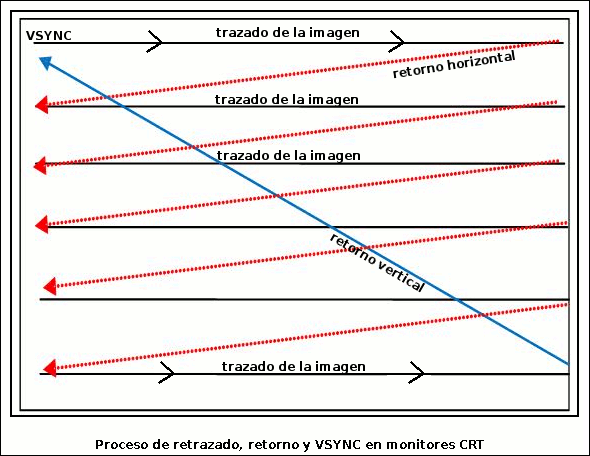

Interrupciones del procesador Z80
================================================================================

En este capítulo vamos a ver qué son las interrupciones del microprocesador Z80 y cómo utilizarlas en nuestro beneficio para ejecutar rutinas de servicio "en paralelo" al flujo del programa. Aunque la introducción inicial sera básicamente teórica, la aplicación práctica es bastante sencilla, pudiendo utilizar las rutinas de esta entrega directamente sin conocimiento total de la información teórica presentada.

Los microprocesadores suelen disponer como mínimo de una señal de Interrupción. Esta señal, normalmente es invocada externamente por dispositivos de I/O que requieren la atención del procesador, solicitando la atención del mismo por algún tipo de evento.

De esta forma, no es necesario que sea nuestro programa el encargado de comprobar continuamente si ha ocurrido un evento concreto.

Una señal de interrupción provoca que el procesador termine de ejecutar la instrucción en curso y ya no continúe con la ejecución de la siguiente instrucción apuntada por PC (el contador de programa). En lugar de esto, temporalmente, lanza una porción de código definida como ISR (Interrupt Service Program), en la que podemos realizar determinadas tareas regulares, desde actualizar variables de ticks/segundos/minutos/horas con precisión, hasta enviar datos musicales al chip de música AY, por ejemplo.

Cuando se finaliza la ejecución de la rutina ISR, el procesador continúa la ejecución desde donde se detuvo al llegarle la señal de interrupción. Para nuestro programa la ejecución de la ISR es "transparente". No obstante, es importante que estas rutinas ISR sean lo más reducidas y rápidas posibles para no afectar a la velocidad de ejecución del programa principal.

El Z80A (el corazón del ZX Spectrum) dispone de 2 tipos de señales de interrupción: una señal de alta prioridad (NMI, Non-mascarable-Interrupt), y otra señal enmascarable de menor prioridad (MI). El procesador, como hemos dicho, lee el estado de las señales /NMI e /INT al acabar la ejecución de cada instrucción (salvo en el caso de instrucciones repetitivas como LDDR, por ejemplo, que lo realiza al acabar cada subinstrucción como LDD). 

.. figure:: nmi_int_pinout.png
   :scale: 90%
   :align: center
   :alt: Pinout del uP Z80

   Pinout del uP Z80

Veamos a continuación los 2 tipos de interrupciones, en qué modos pueden operar, y qué podemos hacer con ellas.

Interrupciones NMI
--------------------------------------------------------------------------------

Las interrupciones no enmascarables (NMI) permiten que dispositivos I/O ajenos al procesador le interrumpan solicitando atención por parte del mismo. El microprocesador Z80 verifica el estado de la señal de interrupción NMI en el correspondiente pin del procesador en el último T-estado del ciclo de ejecución actual (incluyendo las instrucciones con prefijo al opcode). En ese momento realiza un "PUSH PC" y salta a la dirección de la ISR (hacia $0066). Tras 11 ciclos de reloj, se ejecuta el código correspondiente, se recupera "PC" de la pila y se continúa la ejecución del programa original. En el caso de que ocurran 2 interrupciones simultáneamente (una de tipo NMI y otra de tipo MI), la interrupción NMI tiene prioridad.

En el caso del Sinclair ZX Spectrum, las NMI simplemente provocan un RESET del ordenador, puesto que $0066 es una posición de memoria que cae dentro de la ROM y que no puede modificarse salvo hacia $0000, dirección de inicio del ciclo de ejecución y que provoca el mencionado reset.

Interrupciones MI
--------------------------------------------------------------------------------

Las interrupciones enmascarables (MI, INT o INTRQ) se denominan así porque, al contrario que las NMI, pueden ser ignoradas por el procesador cuando han sido deshabilitadas con la instrucción DI (Disable Interrupt).

Cuando el procesador recibe una de estas interrupciones actúa de 3 formas diferentes según el modo actual de interrupción en que esté. El Z80 puede estar en 3 modos de interrupción o IM (Interrupt Mode):

* Modo 0: En este modo de interrupción, el dispositivo que desea interrumpir al procesador activa la pantilla /INT del mismo y durante el ciclo de reconocimiento de interrupción del procesador coloca el opcode de una instrucción en el bus de datos del Z80. Normalmente será una instrucción de 1 sólo byte (normalmente un RST XX) ya que esto sólo hace necesario escribir y mantener un opcode en el bus de datos (aunque puede ser, en periféricos más complejos y con una correcta temporización, un JP o CALL seguido de la dirección de salto). Este modo de interrupción existe principalmente por compatibilidad con el procesador 8080.
* Modo 1: Cuando se recibe una señal INT y el procesador está en IM 1, el Z80 ejecuta un DI (Disable Interrupts), se salva en la pila el valor actual de PC, y se realiza un salto a la ISR ubicada en la dirección $0038 (en la ROM). Es el modo de interrupción por defecto del Spectrum (por ejemplo, en el intérprete BASIC), y en este modo el Spectrum no sabe qué dispositivo ha causado la interrupción y es la rutina ISR la encargada de determinar qué dispositivo externo (o proceso interno) es el que requiere la atención del procesador.
* Modo 2: Es el modo más utilizado en los programas comerciales e implica el uso del registro I y el bus de datos para generar un vector de salto. Los 8 bits superiores de la dirección de salto del ISR se cargan en el registro I. El dispositivo que desea interrumpir al procesador colocar los 8 bits bajos de la dirección (por convención, un número par, es decir, con el bit 0 a 0) en el bus de datos.

La lectura de la parte baja de la dirección de salto desde el bus de datos permite que cada dispositivo pueda tener su propia rutina ISR y solicitar una interrupción al procesador y que ésta sea atendida por la rutina especializada adecuada.

El vector resultante de combinar I y BUS_DATOS no apunta a la ISR en sí misma, sino a una dirección de 2 bytes que es la que realmente contiene la dirección de la ISR. Esto nos permite también utilizar nuestras propias ISRs por software, desde nuestros propios programas. Concretamente I*256 apunta a una tabla de direcciones de ISRs (Tabla de Vectores de Interrupción) que será indexada por el byte bajo de la dirección (lo que nos da un total de 128 ISRs posibles de 2 bytes de dirección de inicio absoluta cada una). Es por esto que la dirección del byte bajo es, por convención, un número par, de forma que siempre accedamos a las direcciones de 16 bits correctas en la tabla (I*256+N y I*256+N+1 siendo N par) y no a media dirección de una ISR y media de otra (como veremos más adelante).

Así pues, se puede definir la dirección de salto de la interrupción en modo IM2 como::

    DIR_SALTO = [ (I*256)+VALOR_EN_BUS_DE_DATOS ]

Finalmente, este es el coste en T-estados de la aceptación de interrupciones en cada modo::

    NMI:      11 t-estados
    INT IM 0: 13 t-estados (si la instrucción del bus es un RST)
    INT IM 1: 13 t-estados
    INT IM 2: 19 t-estados

Instrucciones relacionadas con las interrupciones
--------------------------------------------------------------------------------

Cambio del modo de interrupción (IM)
~~~~~~~~~~~~~~~~~~~~~~~~~~~~~~~~~~~~~~~~~~~~~~~~~~~~~~~~~~~~~~~~~~~~~~~~~~~~~~~~

Podemos cambiar el modo de interrupcion en el Spectrum con la instrucción del procesador "IM"::

    IM 0       ; Cambiar a modo IM 0 (8 T-Estados).
    IM 1       ; Cambiar a modo IM 1 (8 T-Estados).
    IM 2       ; Cambiar a modo IM 2 (8 T-Estados).

Como ya hemos dicho, el Spectrum opera normalmente en IM 1, donde se llama regularmente a una ISR que actualiza lee el estado del teclado y actualiza ciertas variables del sistema (LAST_K, FRAMES, etc) para la conveniencia del intérprete de BASIC (y, en algunos casos, de nuestros propios programas). Esta ISR (la RST $38) pretende hacer uso exclusivo del registro IY por lo que si nuestro programa necesita hacer uso de este registro es importante hacerlo entre un DI y un EI para evitar que pueda ocurrir una interrupción con su valor modificado por nosotros y provocar un reset en el Spectrum. También tenemos que tener en cuenta esto si estando en modo IM 2 llamamos manualmente a la RST $38 para actualizar variables del sistema (aunque no es habitual que necesitemos ejecutar la ISR que usa el intérprete de BASIC).

En el caso de aplicaciones y juegos, lo normal es cambiar a IM 2 con una rutina propia de ISR que realice las tareas que nosotros necesitemos, especialmente temporización, actualización del buffer del chip AY de audio para reproducir melodías, etc.

Activar y desactivar las interrupciones del procesador
~~~~~~~~~~~~~~~~~~~~~~~~~~~~~~~~~~~~~~~~~~~~~~~~~~~~~~~~~~~~~~~~~~~~~~~~~~~~~~~~

Existen también 2 instrucciones especiales para DESACTIVAR las interrupciones (DI, Disable Interrupts), y ACTIVARLAS (EI, Enable Interrupts), manipulando el flip-flop del procesador IFF.

.. code-block:: tasm

    DI         ; Disable Interrupts (4 T-estados) -> IFF=0
    EI         ; Enable Interrupts (4 T-estados). -> IFF=1

Nótese el hecho importantísimo de que las interrupciones no se habilitan de nuevo al final la ejecución del EI, sino tras la ejecución de la instrucción que lo sigue en el flujo del programa. Más adelante veremos por qué.

Instrucción HALT
~~~~~~~~~~~~~~~~~~~~~~~~~~~~~~~~~~~~~~~~~~~~~~~~~~~~~~~~~~~~~~~~~~~~~~~~~~~~~~~~

La instrucción HALT es una instrucción muy útil que detiene el proceso de ejecución la CPU. Al llamarla, la CPU comienza a ejecutar continuamente NOPs de 4 t-estados (sin incrementar el contador de programa), hasta que se vea interrumpido por una NMI o una MI (INT), en cuyo momento se incrementa PC y se procesa la interrupción. Al volver de la ISR, el procesador continúa la ejecución del programa en la instrucción siguiente al HALT.

.. code-block:: tasm

  HALT       ; Halt computer and wait for INT (4 T-Estados).

Como veremos más adelante, la instrucción HALT nos será especialmente útil en determinadas ocasiones al trabajar con la manipulación del área de datos de la videomemoria.

Instrucciones RST
~~~~~~~~~~~~~~~~~~~~~~~~~~~~~~~~~~~~~~~~~~~~~~~~~~~~~~~~~~~~~~~~~~~~~~~~~~~~~~~~

Las instrucciones RST (ReSTart) que se utilizan para realizar un salto a una dirección concreta y específica mediante una instrucción de un sólo opcode. Existen las siguientes posibles instrucciones RST:

.. code-block:: tasm

    RST 0      ; Opcode C7 (11 T-estados).
    RST 8      ; Opcode CF (11 T-estados).
    RST 10h    ; Opcode D7 (11 T-estados).
    RST 18h    ; Opcode DF (11 T-estados).
    RST 20h    ; Opcode E7 (11 T-estados).
    RST 28h    ; Opcode EF (11 T-estados).
    RST 30h    ; Opcode F7 (11 T-estados).
    RST 38h    ; Opcode FF (11 T-estados).

El equivalente de esta instrucción de 1 sólo opcode es un "CALL 00XXh", y su existencia está justificada en que es necesario disponer de estas instrucciones de un sólo byte para que puedan así ser emplazadas en el bus de datos y leídas en el modo de interrupción IM 0, algo que no se podría hacer de una forma tan sencilla con la instrucción multibyte CALL.

En nuestros programas podemos utilizar estas instrucciones RST si queremos llamar manualmente a alguna de las rutinas de la ROM a la que hacen referencia, como RST $10 (o RST 16), que utilizamos en la entrega sobre el teclado para llamar a $0010, que aloja la rutina PRINT-A (la cual imprime en pantalla el carácter ASCII correspondiente al valor del registro A).

Instrucciones "LD A, R" y "LD A, I"
~~~~~~~~~~~~~~~~~~~~~~~~~~~~~~~~~~~~~~~~~~~~~~~~~~~~~~~~~~~~~~~~~~~~~~~~~~~~~~~~

Una instrucción de uso infrecuente con una peculiar utilidad es LD A, R. Con esta instrucción cargamos el valor del registro interno del procesador R (utilizado para el refresco de la DRAM) en el acumulador. Comunmente se utiliza para obtener algún tipo de valor "variable" como semilla o parte del proceso de generación de números aleatorios.

No obstante, esta instrucción de 2 bytes ($ED $5F) y 9 t-estados de ejecución tiene la particular utilidad de copiar en el flag P/V el contenido del flip-flop IFF2, por lo que podemos utilizarla para conocer el estado de las interrupciones enmascarables.

Así, una vez ejecuado un "LD A, R", sabemos que si la bandera está a 1 es que las interrupciones están habilitadas, mientras que si están a cero, es porque han sido deshabilitadas.

Como curiosidad, la instrucción LD A, I produce la misma afectación de P/V que LD A, R. Otros flags afectados por ambas instrucciones son "S", "C" (reseteado) y "z".

Las interrupciones de la ULA
--------------------------------------------------------------------------------

Como ya hemos dicho, las interrupciones están diseñadas para que los dispositivos externos puedan interrumpir al procesador Z80. En el caso del Spectrum, existe un dispositivo externo común a todos los modelos y que tiene funciones críticas para el sistema. Hablamos de la ULA, que en un Spectrum sin dispositivos conectados al puerto de expansión es el único periférico que provoca señales de interrupción al procesador.

La ULA, como encargada de gestionar la I/O, el teclado, y de refrescar el contenido de la pantalla usando los datos almacenados en el área de videoram del Spectrum, interrumpe al procesador de forma constante, a razón de 50 veces por segundo en sistemas de televisión PAL (Europa y Australia) y 60 veces por segundo en sistemas NTSC (USA).

Esto quiere decir que cada 1/50 (o 1/60) segundos, la ULA produce una señal INT (interrupción enmascarable), que provoca la ejecución de la ISR de turno (RST $38 en modo IM 1 ó la ISR que hayamos definido en modo IM 2).

En el modo IM 1 (el modo en que arranca el Spectrum), el salto a RST $38 provocado por las interrupciones generadas por la ULA produce la ejecución regular y continua cada 1/50 segundos de las rutinas de lectura del teclado, actualización de variables del sistema de BASIC y del reloj del sistema (FRAMES) requeridas por el intérprete de BASIC para funcionar.

En cuanto al modo IM 2, el que nos interesa principalmente para la realización de programas y juegos, la dirección de salto del ISR se compone como 16 bits a partir del registro I (en la parte alta de la dirección), y el identificador de dispositivo (par) en el bus de datos, utilizado como parte baja del vector de salto.

Como ya hemos visto en la definición del modo IM 2, la dirección resultante ((I*256)+ID_DE_DISPOSITIVO_EN_BUS_DATOS) se utiliza para consultar una tabla de vectores de interrupción para saltar. A partir de la dirección I*256, debe de haber una tabla de 256 bytes con 128 direcciones de salto absolutas de 2 bytes cada una.

De esta forma, cada dispositivo de hasta un total de 128 puede colocar su ID en el bus de datos y tener su propia ISR en la tabla:

* Un dispositivo con ID 0 tendría su dirección de salto a la ISR en (I*256+0 e I*256+1).
* Un dispositivo con ID 2 tendría su dirección de salto a la ISR en (I*256+2 e I*256+3).
* Un dispositivo con ID 4 tendría su dirección de salto a la ISR en (I*256+4 e I*256+5).
* Un dispositivo con ID 254 tendría su dirección de salto a la ISR en (I*256+254 e I*256+255).

Debido a que la tabla de saltos requiere 2 bytes por cada dirección y que existen 256 posibles valores en el bus de datos, el identificador de dispositivo tiene que ser un valor PAR, ya que si un dispositivo introdujera un valor IMPAR en el bus de datos, el procesador podría realizar un salto a una dirección compuesta a partir de los datos de salto de 2 dispositivos diferentes. Comprenderemos este problema con un ejemplo muy sencillo:

* Un dispositivo con ID 1 tendría su dirección de salto a la ISR en (I*256+1 e I*256+2) (que forman parte de las direcciones de salto de los dispositivos con ID 0 e ID 2).
* Un dispositivo con ID 255 tendría su dirección de salto a la ISR en (I*256+255 e I*256+256), lo que implicaría tratar de utilizar parte de la dirección de salto del dispositivo con ID 254 además de un byte de fuera de la tabla de vectores de interrupción.

Así pues, por convención, todos los dispositivos que se conectan a un Z80 tienen que colocar como ID de dispositivo en el bus de datos un identificador único par, que asegure que los vectores de salto de 2 dispositivos nunca puedan solaparse.

Existe una excepción notable a esta regla, y no es otra que la propia ULA. La ULA no está diseñada para funcionar en modo IM 2, ya que no coloca ningún identificador de dispositivo en el bus de datos cuando genera interrupciones. Está diseñada para funcionar en modo 1, donde no se espera este identificador y siempre se produce el salto a RST $38, sea cual sea el dispositivo que solicita la interrupción.

Por suerte, cuando no se coloca ningún valor en el bus de datos del Spectrum, éste adquiere el valor de 8 señales uno (11111111b, 255d o FFh), debido a las resistencias de pull-up al que están conectadas las líneas de dicho bus. Por lo tanto, nuestro procesador Z80A obtendrá como device-id del dispositivo que interrumpe un valor FFh (con cierta particularidad que veremos en la sección sobre Compatibilidad).

Este valor, impar, produce el siguiente valor dentro de la tabla de vectores de interrupción: (I*256+255) e (I*256+255+1), lo que produce la lectura dentro de la tabla de vectores del campo 255 y del 256, provocando la necesidad de que nuestra tabla de vectores requiera 257 en lugar de 256 bytes.

La interrupción de la ULA y el VSync de vídeo
--------------------------------------------------------------------------------

Como acabamos de ver, la ULA provee al procesador en modo IM1 de un mecanismo para, regularmente, escanear el teclado y evitar así que sean los propios programas quienes tengan que realizar esa tarea por software.

La interrupción generada por la ULA debe de ser de una regularidad tal que se ejecute suficientes veces por segundo para que el escaneo del teclado no pierda posibles pulsaciones de teclas del usuario, pero no tan frecuente como para que requiera gran cantidad de tiempo de procesador ejecutando una y otra vez la ISR asociada.

Como nos cuenta el libro sobre la ULA de Chris Smith, el ingenierio de Sinclair, Richard Altwasser, aprovechó la señal de VSYNC que la ULA genera como señal de sincronización para el televisor como lanzador de la señal de interrupción. Esta señal se genera 50 veces por segundo para televisiones PAL y 60 para televisiones NTSC, y tiene la duración adecuada para que el procesador detecte la interrupción en su patilla INTrq.

Este es el precisamente el motivo por el cual la interrupción generada por la ULA se genera 50 (ó 60 veces por segundo): un aprovechamiento de la señal de VSYNC para los televisores, con el consiguiente ahorro de electrónica adicional que supondría generar otra señal adicional para INTrq.

Por otra parte, para los programadores es una enorme ventaja el saber que la interrupción del procesador por parte de la ULA coincide con el VSYNC, ya que nos permite el uso de la instrucción HALT en nuestro programa para forzar al mismo a esperar a dicha interrupción y poder ejecutar código después del HALT que trabaje sobre la pantalla sabiendo que el haz de electrones no la está redibujando.

Como veremos en el capítulo dedicado a la memoria de vídeo, la ULA lee regularmente un área de aprox. 7 KB que empieza en la dirección de memoria $4000 y con los datos que hay en ese área alimenta al haz de electrones del monitor para que forme la imagen que aparece en pantalla. Como parte del proceso de generación de la imagen, 50 veces por segundo (una vez por cada "cuadro de imagen") la ULA debe de generar un pulso de VSYNC durante 256 microsegundos para el monitor que asegure que el inicio de la generación de la imagen está sincronizado con las líneas de vídeo que se le envían. Durante ese período, la ULA no está generando señal de vídeo sobre el televisor y podemos alterar el contenido de la videoram con seguridad.

¿Por qué es necesario tener esta certeza acerca de la ubicación del haz de electrones? La respuesta es que si alteramos el contenido de la videoram durante la generación de la imagen, es posible que se muestren en pantalla datos de la imagen del cuadro de vídeo anterior (datos de videoram ya trazados por el haz de electrones) junto a datos de la imagen del cuadro de vídeo que estamos generando, mostrando un efecto "cortinilla" o "efecto nieve".

Por mostrarlo de una manera gráfica (y con un ejemplo "teórico"), supongamos que tenemos una pantalla de color totalmente azul y queremos cambiarla a una pantalla de color totalmente verde. Imaginemos que cuando el haz de electrones ha mostrado la mitad de la pantalla nosotros cambiamos el contenido de la zona de atributos para que la pantalla completa sea verde. Con el haz en el centro de la pantalla, todavía recorriendo la videoram y "trazando" los colores en pantalla, todos los datos mostrados a partir de ese momento serán píxeles verdes, por lo que durante ese cuadro de imagen tendremos el 50% inicial de la pantalla en color azul y el 50% restante en verde, y no toda verde como era nuestra intención. Será en el próximo cuadro de retrazado de la pantalla cuando se leerán los valores de color verde de la VRAM de la zona superior de la pantalla y se retrazarán dichos píxeles en verde, dejándonos la pantalla totalmente de dicho color.

¿Cómo podemos evitar este efecto? Mediante la instrucción HALT.

El haz de electrones del monitor barre la pantalla empezando en la esquina superior izquierda de la misma, recorriendola de derecha a izquierda, trazando líneas horizontales con el contenido de la videomemoria. Cuando el haz llega a la derecha del televisor, baja a la siguiente línea de pantalla retrocediendo a la izquierda de la misma y se sincroniza con la ULA mediante una señal de HSYNC. De nuevo el haz de electrones traza una nueva línea horizontal hacia la derecha, repitiendo el proceso una y otra vez hasta llegar a la esquina inferor derecha. El haz de electrones debe entonces volver a la parte superior izquierda de la pantalla (mediante una diagonal directa) y sincronizarse con la ULA mediante un pulso VSYNC. 

   Recorrido del haz de electrones del monitor/TV

Sabemos que la interrupción generada por la ULA llega al procesador cuando se realiza el VSYNC con el monitor (cuando el haz de electrones está en el punto superior de su retroceso a la esquina superior izquierda de la pantalla), así que podemos utilizar HALT en nuestro programa para forzar al mismo a esperar una interrupción, es decir, a que se finalice el trazado del cuadro actual, asegurándonos que no se está escribiendo en pantalla. Esto nos deja un valioso pero limitado tiempo para realizar actualizaciones de la misma antes de que el haz de electrones comience el retrazado o incluso alcance el punto que queremos modificar.

En nuestro ejemplo anterior de la pantalla azul y verde, un HALT antes de llamar a la rutina que pinta la pantalla de verde aseguraría que la pantalla se mostrara completamente en verde (y no parcialmente) al haber realizado el cambio de los atributos tras el HALT (durante el VSYNC) y no durante el retrazado de la pantalla en sí misma.

Hay que tener en cuenta un detalle para temporizaciones precisas: aunque el microprocesador siempre recibe la señal de interrupción en el mismo instante de retorno del haz, la señal sólo es leída por el microprocesador al acabar la ejecución de la instrucción en curso, por lo que dependiendo del estado actual de ejecución y del tipo de instrucción (su tamaño y tiempo de ejecución) puede haber una variación de hasta 23 t-estados en el tiempo de procesado de la INT.

Una vez se produce la interrupción, tenemos un tiempo finito para trabajar sobre la pantalla antes de que comience el redibujado de la misma: 

+---------------------+---------------------------------------+
| Modelo de Spectrum  |  t-estados disponibles (+-1 t-estado) |
+=====================+=======================================+
|  16K                |  14336 t-estados                      |
+---------------------+---------------------------------------+
|  48K                |  14336 t-estados                      |
+---------------------+---------------------------------------+
|  128K               |  14361 t-estados                      |
+---------------------+---------------------------------------+
|  +2                 |  14361 t-estados                      |
+---------------------+---------------------------------------+
|  +2A                |  14364 t-estados                      |
+---------------------+---------------------------------------+
|  +3                 |  14364 t-estados                      |
+---------------------+---------------------------------------+

Detalles de temporización con este son los que permiten a algunos juegos realizar auténticas virguerías con el borde (como Aquaplane), o generar rutinas que permitan varios colores por carácter controlando la posición exacta del haz de electrones y cambiando los atributos mientras el haz está trazando un determinado scanline.

Las rutinas de ISR
--------------------------------------------------------------------------------

Hemos hablado ya de las rutinas de ISR y de cómo son llamadas 50 (o 60) veces por segundo. Lo normal en el desarrollo de un juego o programa medianamente complejo es que utilicemos el modo IM 2 y desarrollemos nuestra propia rutina ISR para que cumpla nuestras necesidades.

Las ISRs deben de optimizarse lo máximo posible, tratando de que sean lo más rápidas y óptimas posibles, ya que nuestro programa se ha visto interrumpido y no se continuará su ejecución hasta la salida de la ISR. Si tenemos en cuenta que normalmente nuestras ISRs se ejecutarán 50 veces por segundo, es importante no ralentizar la ejecución del programa principal llenando de código innecesario la ISR.

Es crítico también que en la salida de la ISR no hayamos modificado los valores de los registros con respecto a su entrada. Para eso, podemos utilizar la pila y hacer PUSH + POP de los registros utilizados o incluso utilizar los Shadow Registers si sabemos a ciencia cierta que nuestro programa no los utiliza (con un EXX y un EX AF, AF al principio y al final de nuestra ISR).

Al principio de nuestra ISR no es necesario desactivar las interrupciones con DI, ya que el Z80 las deshabilita al aceptar la interrupción. Debido a este "DI" automático realizado por el procesador, las rutinas de ISR deben incluir un EI antes del RET/RETI.

Así pues, de las rutinas ISR llamadas en las interrupciones se debe de volver con una instrucción RETN en las interrupciones no enmascarables y un EI + RETI en las enmascarables (aunque en algunos casos, según el periférico que provoca la interrupción, también se puede utilizar EI+RET, que es ligeramente más rápido y que tiene el mismo efecto en sistemas como el Spectrum).

.. code-block:: tasm

  RETI        ; Return from interrupt (14 T-Estados).
  RETN        ; Return from non-maskable interrupt (14 T-Estados).

Existe un motivo por el cual existe RETI y no se utiliza simplemente RET, y es que existen unos flip-flops internos en el procesador que le marcan cierto estados al procesador y que en el caso de salida de una interrupción deben resetearse.

Citando el documento ``z80undoc3.txt`` de Z80.info (por Sean Young)::

    3.1) Non-maskable interrupts (NMI)

    When a NMI is accepted, IFF1 is reset. At the end of the routine, IFF1 must
    be restored (so the running program is not affected). That's why IFF2 is
    there; to keep a copy of IFF1.

    An NMI is accepted when the NMI pin on the Z80 is made low. The Z80 responds 
    to the /change/ of the line from +5 to 0. When this happens, a call is done 
    to address 0066h and IFF1 is reset so the routine isn't bothered by maskable 
    interrupts. The routine should end with an RETN (RETurn from Nmi) which is 
    just a usual RET, but also copies IFF2 to IFF1, so the IFFs are the same as 
    before the interrupt.

    3.2) Maskable interrupts (INT)

    At the end of a maskable interrupt, the interrupts should be enabled again. 
    You can assume that was the state of the IFFs because otherwise the interrupt 
    wasn't accepted. So, an INT routine always ends with an EI and a RET 
    (RETI according to the official documentation, more about that later):

    INT:.
        .
        .
        EI
        RETI (or RET)

    Note a fact about EI: a maskable interrupt isn't accepted directly after it,
    so the next opportunity for an INT is after the RETI. This is very useful;
    if the INT is still low, an INT is generated again. If this happens a lot and
    the interrupt is generated before the RETI, the stack could overflow (since
    the routine is called again and again). But this property of EI prevents this.

    You can use RET in stead of RETI too, it depends on hardware setup. RETI
    is only useful if you have something like a Z80 PIO to support daisy-chaining:
    queueing interrupts. The PIO can detect that the routine has ended by the
    opcode of RETI, and let another device generate an interrupt. That is why
    I called all the undocumented EDxx RET instructions RETN: All of them 
    operate like RETN, the only difference to RETI is its specific opcode. 
    (Which the Z80 PIO recognises.)

Es decir, para aquellos sistemas basados en Z80 con hardware PIO que soporte múltiples dispositivos I/O encadenando sus interrupciones, se define un opcode especial RETI distinto de RET de forma que el PIO pueda detectar el fin de la ISR y pueda permitir a otros dispositivos generar una interrupción.

En el caso del Spectrum con la ULA como (habitualmente) único dispositivo que interrumpe, se utiliza normalmente RET en lugar de RETI por ser ligeramente más rápida en ejecución. No obstante, en nuestros ejemplos hemos utilizado RETI para acomodarlos a la teoría mostrada.

Como ya hemos comentado antes, EI no activa las interrupciones al acabar su ejecución, sino al acabar la ejecución de la siguiente instrucción. El motivo de esto es evitar que se pueda recibir una interrupción estando dentro de una ISR entre el EI y el RET:

.. code-block:: tasm

    Nuestra_ISR:
        PUSH HL
        código de la ISR
        POP HL
        EI
        RETI
        

Si EI habilitar las interrupciones de forma instantánea y se recibiera una interrupción entre la instrucción EI y el RETI, se volvería a entrar en la ISR, y por lo tanto se volvería a realizar el PUSH de PC y el PUSH de HL, rompiendo el flujo correcto del programa. Por contra, tal y como funciona EI sólo se habilitarán de nuevo las interrupciones tras la ejecución de RETI y la recuperación de PC de la pila, permitiendo así la ejecución de una nueva interrupción sin corromper el contenido del stack.

Finalmente, es importantísimo en los modelos de más de 16K (48K y 128K paginados) utilizar una tabla de vector de interrupciones ubicada en la página superior de la RAM (memoria por encima de los 32K), ya que la utilización del bloque inferior de memoria (dejando de lado la ROM, el bloque desde 16K a 32K) provocaría un efecto nieve en la pantalla. La elección estándar de la dirección de la tabla de vector de interrupciones recae en direcciones a partir de $FE00, por motivos que veremos al hablar sobre la ULA. Por otra parte, en la sección de Consideraciones y Curiosidades veremos cómo solucionar este problema en sistemas de 16K de memoria RAM.

Ninguna de las instrucciones que hemos visto (RST XX, EI, DI, RETI, RETN, HALT o IM XX) produce afectación alguna en los flags, salvo LD A, R, que altera el flag P/V con la utilidad que ya hemos visto.

La ISR de IM 1
--------------------------------------------------------------------------------

A modo de curiosidad, vamos a ver el código de la ISR que se ejecuta en modo 1 (RST $38), tomado del documento The Complete Spectrum ROM Disassembly con alguna modificación en los comentarios:

.. code-block:: tasm

    ; THE MASKABLE INTERRUPT ROUTINE
    ; The real time clock FRAMES is incremented and the keyboard
    ; scanned whenever a maskable interrupt occurs.
    ;
    ; FRAMES = 3 bytes variable. 
    ; BYTES 1 & 2 FRAMES - $5C78 and $5C79
    ; BYTE 3 FRAMES      - IY+40h = $5C7A
    ;
    MASK-INT:
        PUSH  AF                 ; Save the current values held in
        PUSH  HL                 ; these registers.
        LD    HL,($5C78)         ; The lower two bytes of the
        INC   HL                 ; frame counter are incremented (FRAMES)
        LD    ($5C78),HL         ; every 20 ms. (UK) -> INC BYTE_1_2(FRAMES)
        LD    A,H                ; The highest byte of the frame counter is
        OR    L                  ; only incremented when the value
        JR    NZ,KEY-INT         ; of the lower two bytes is zero
        INC   (IY+40h)           ; INC BYTE_3(FRAMES) ($5C7A)
    KEY-INT:
        PUSH  BC                  ; Save the current values held
        PUSH  DE                  ; in these registers.
        CALL  KEYBOARD            ; Now scan the keyboard. (CALL $02BF)
        POP   DE                  ; Restore the values.
        POP   BC
        POP   HL
        POP   AF
        EI                        ; The maskable interrupt is en-
        RET                       ; abled before returning.

Nótese cómo la ISR del modo 1 se ajusta a lo visto hasta ahora: se preserva cualquier registro que pueda utilizarse dentro de la misma, se reduce el tamaño y tiempo de ejecución de la ISR en la medida de lo posible, y se vuelve con un EI+RET.

La rutina actualiza el valor de la variable del sistema FRAMES (que viene a ser el equivalente de la variable "abs_ticks" del ejemplo que veremos en el siguiente apartado) y llama a la rutina de la ROM "KEYBOARD" ($02BF) que es la encargada de chequear el estado del teclado y actualizar ciertas variables del sistema para que el intérprete BASIC (o nuestros programas si corren en IM 1) pueda gestionar las pulsaciones de teclado realizadas por el usuario. Si bien la rutina "KEYBOARD" a la que se llama desde la ISR no es todo lo "pequeña" que se podría esperar de algo que se va a ejecutar en una ISR, sí que es cierto que es una de las partes primordiales del intérprete BASIC y que es más óptimo y rápido obtener el estado del teclado en la ISR (aunque la rutina sea larga e interrumpa 50 veces por segundo a nuestro programa con su ejecución) que tener que realizar la lectura del teclado dentro del propio intérprete de forma continuada.

Nótese, como nos apunta metalbrain en los foros de Speccy.org, que FRAMES es una variable de 3 bytes y que esta rutina ISR utiliza IY para acceder al tercer byte de esta variable cuando el incremento de los 2 bytes más bajos requieren el incremente del tercer byte. Lo hace a través de IY+40h y esto explica porqué desde BASIC, bajo IM1, no debemos utilizar código ASM que haga uso de IY, bajo riesgo de que este "INC" pueda realizarse sobre un valor de IY que no sea el esperado y por tanto "corromper" un byte de código de nuestro programa o de datos, pantalla, etc.

ISR de atención a la ULA en IM 2
--------------------------------------------------------------------------------

La clave de este capítulo, y la principal utilidad del uso de interrupciones en nuestros programas es la de aprovechar las interrupciones que la ULA genera 50 veces por segundo (60 en América) en el modo IM 2.

Antes de pasar al modo IM 2, nosotros somos los responsables de generar la tabla de vectores de interrupción con los valores a los que el procesador debe de saltar en caso de recibir una interrupción de un dispositivo externo. Para eso, generamos en memoria una tabla de 257 bytes y en ella introducimos las direcciones de salto de las ISRs. En un Spectrum estándar sin dispositivos conectados al bus de expansión sólo recibiremos interrupciones generadas por la ULA, con un device_id predictible de valor $FF (este device-id es también el causante de que la tabla sea de 257 bytes y no de 256).

Veamos cómo instalar una rutina ISR que se ejecute cada vez que se recibe una interrupción de la ULA. Para ello podemos generar nuestra tabla de vectores de interrupción a partir de una posición de memoria como, por ejemplo, $FE00. Para ello asignamos a I el valor $FE, lo que implica que nuestra tabla de vectores de interrupción estará localizada desde $FE00 hasta $FEFF+1 ($FF00).

Para atender a las interrupciones generadas por la ULA (device_id $FF), tendremos que realizar los siguientes pasos:

* Crear una rutina de ISR correcta (preservar registros, salir con EI+RETI o EI+RET, etc).
* Colocar la dirección de nuestra ISR en las posiciones de memoria $FEFF y $FEFF+1 (que es de donde leerá el Z80 la dirección de salto cuando reciba la interrupción con ID $FF).
* Asignar a I el valor $FE y saltar a IM 2 (de esta forma, le decimos al Z80 que la tabla de vectores de interrupción empieza en $FE00).

El código resultante sería el siguiente:

.. code-block:: tasm

    ; Instalando una ISR de atención a la ULA.
    
    ORG 50000
    
    ; Instalamos la ISR:
        LD HL, ISR_ASM_ROUTINE        ; HL = direccion de la rutina de ISR
        DI                            ; Deshabilitamos las interrupciones
        LD ($FEFF), HL                ; Guardamos en (65279 = $FEFF) la direccion
        LD A, 254                     ; de la rutina ISR_ASM_ROUTINE
        LD I, A                       ; Colocamos en I el valor $FE 
        IM 2                          ; Saltamos al modo de interrupciones 2
        EI
        
        resto programa
    
    
    ;--- Rutina de ISR. 
    ISR_ASM_ROUTINE:
        PUSH AF
        PUSH HL
        codigo de la ISR
        POP HL
        POP AF
        EI
        RETI

De esta forma, saltamos a IM 2 y el procesador se encargará de ejecutar la rutina ISR_ASM_ROUTINE 50 veces por segundo, por el siguiente proceso:

* La ULA provoca una señal de interrupción enmascarable INT.
* La ULA no coloca ningún device ID en el bus de datos; debido a las resistencias de pull-up, el bus de datos toma el valor $FF.
* El procesador termina de ejecutar la instrucción en curso y, si las interrupciones están actualmente habilitadas procesa la interrupción.
* El procesador lee del bus de datos el valor $FE y, al estar en modo IM 2, compone junto al registro una dirección "$FEFF" (campo $FF dentro de la tabla de vectores de interrupción que empieza en $FE*256 = $FE00).
* El procesador lee la dirección de 16 bits que se compone con el contenido de las celdillas de memoria $FEFF y $FEFF+1 ($FF00). Esta dirección de 16 bits es la que hemos cargado nosotros con "LD ($FEFF), HL" y que apunta a nuestra rutina ISR.
* El procesador salta a la dirección de 16 bits compuesta, que es la dirección de nuestra ISR.
* Se ejecuta la ISR, de la cual salimos con EI+RETI, provocando la continuación de la ejecución del programa original hasta la siguiente interrupción.

Como hemos dicho en el apartado sobre ISRs, es crítico que la tabla de vectores de interrupción se ubique en una página alta de la RAM, es decir; que no esté dentro del área comprendida entre los 16K y los 32K que el procesador y la ULA comparten regularmente para que la ULA pueda actualizar la pantalla. En todos los ejemplos que hemos visto y veremos, la dirección de la tabla de vectores de interrupción comienza a partir de $FE00. Ubicarla a partir de $FF00 (que es la única página más alta que $FE00) no sería una elección apropiada puesto que al necesitar una tabla de 257 bytes para la ULA (device ID=$FF), parte de la dirección de salto se compondría con "$FFFF +1 = $0000" (la ROM).

Con la teoría descrita hasta ahora ya tenemos los mecanismos para realizar programas que dispongan de sus propias ISRs de servicio, como los ejemplos que veremos a continuación.

Ejemplos y aplicaciones
--------------------------------------------------------------------------------

Control de ticks, segundos y minutos
~~~~~~~~~~~~~~~~~~~~~~~~~~~~~~~~~~~~~~~~~~~~~~~~~~~~~~~~~~~~~~~~~~~~~~~~~~~~~~~~

A continuación se muestra un ejemplo completo de ISR que gestiona una serie de variables en memoria:

* abs_ticks : Esta variable se incrementa en cada ejecución de la interrupción (es decir, 50 veces por segundo), y al ser de 16 bits se resetea a 0 al superar el valor 65535. Puede ser muy útil como controlador de tiempo entre 2 sucesos que duren menos de 21 minutos (65535/50/60).
* timer: Esta variable es igual que abs_ticks pero se decrementa en lugar de incrementarse. Existe para ser utilizada por ciertas funciones útiles que veremos más adelante en este mismo capítulo.
* ticks : Esta variable se incrementa igual que abs_ticks en cada ejecución de la ISR (50 veces por segundo), pero cuando su valor llega a 50 la seteamos a 0 y aprovechamos este cambio para incrementar la variable segundos.
* seconds : Esta variable almacena segundos transcurridos. Sólo se incrementa cuando ticks vale 50, es decir, cuando han pasado 50 ticks que son 1 segundo. Cuando la variable llega a 60, se resetea a cero y se incrementa la variable minutes.
* pause : Esta variable nos permite que la ISR no incremente el tiempo cuando estamos en "modo pausa".
* clock_changed : Esta variable cambia de 0 a 1 cuando nuestra ISR ha modificado el "reloj" interno formado por las variables minutos y segundos. La utiliza el bucle principal del programa para saber cuándo actualizar el reloj en pantalla.

Para ello generamos una ISR y la enlazamos con el modo 2 de interrupciones.

Tras esto, nos mantenemos en un bucle de programa infinito que detecta cuándo la variable clock_changed cambia de 0 a 1 y que actualiza el valor en pantalla del reloj, volviendo a setear dicha variable a 0 hasta que la ISR modifique de nuevo el reloj. Cuando clock_changed vale 0, el programa se mantiene en un simple bucle que no realiza acciones salvo comprobar el estado de clock_changed continuamente. La ISR se ejecuta, por tanto, "en paralelo" a nuestro programa cuando las interrupciones solicitan la atención del procesador, 50 veces por segundo.

.. code-block:: tasm 
        
    ; Ejemplo de ISR que gestiona un contador de ticks, minutos y segundos.
    
    ORG 50000
    
    ; Instalamos la ISR:
        LD HL, CLOCK_ISR_ASM_ROUTINE
        DI
        LD (65279), HL                ; Guardamos en (65279 = $FEFF) la direccion
        LD A, 254                     ; de la rutina CLOCK_ISR_ASM_ROUTINE
        LD I, A
        IM 2
        EI
    
    Bucle_entrada:
        LD A, (clock_changed)
        AND A
        JR Z, Bucle_entrada           ; Si clock_changed no vale 1, no hay
                                        ; que imprimir el mensaje -> loop
        
        ; Si estamos aqui es que clock_changed = 1... lo reseteamos
        ; e imprimimos por pantalla la información como MM:SS
        XOR A
        LD (clock_changed), A         ; clock_changed = 0
        
        CALL 0DAFh                    ; Llamamos a la rutina de la ROM que
                                        ; hace un CLS y pone el cursor en (0,0)
        
        LD A, (minutes)               ; Imprimimos minutos + ":" + segundos
        CALL PrintInteger2Digits
        LD A, ":"
        RST 16
        LD A, (seconds)
        CALL PrintInteger2Digits
        
        JR Bucle_entrada 
        
        clock_changed DB 0
        ticks         DB 0
        seconds       DB 0
        minutes       DB 0
        pause         DB 0
        abs_ticks     DW 0
        timer         DW 0
    
    
    ;-----------------------------------------------------------------------
    ; Rutina de ISR : incrementa ticks 50 veces por segundo, y el resto
    ; de las variables de acuerdo al valor de ticks.
    ;-----------------------------------------------------------------------
    CLOCK_ISR_ASM_ROUTINE:
        PUSH AF
        PUSH HL
        
        LD A, (pause)
        OR A
        JR NZ, clock_isr_fin          ; Si pause==1, no continuamos la ISR
        
        LD HL, (abs_ticks)
        INC HL
        LD (abs_ticks), HL            ; Incrementamos abs_ticks (absolutos)
        
        LD HL, (timer)
        DEC HL
        LD (timer), HL                ; Decrementamos timer (ticks absolutos)
        
        LD A, (ticks)
        INC A
        LD (ticks), A                 ; Incrementamos ticks (50 veces/seg)
        
        CP 50
        JR C, clock_isr_fin           ; if ticks < 50,  fin de la ISR
                                        ; si ticks >= 50, cambiar seg:min
        XOR A
        LD (ticks), A                 ; ticks = 0
        
        LD A, 1
        LD (clock_changed), A         ; ha cambiado el numero de segundos
        
        LD A, (seconds)
        INC A
        LD (seconds), A               ; segundos = segundos +1
        
        CP 60
        JR C, clock_isr_fin           ; si segundos < 60 -> salir de la ISR
        
        XOR A                         ; si segundos == 60 -> inc minutos
        LD (seconds), A               ; segundos = 0
        
        LD A, (minutes)
        INC A
        LD (minutes), A               ; minutos = minutos + 1
        
        CP 60
        JR C, clock_isr_fin           ; si minutos > 60 -> resetear minutos
        XOR A
        LD (minutes), A               ; minutos = 0
        
    clock_isr_fin:
        POP HL
        POP AF
    
        EI
        RETI
    
    
    ;-----------------------------------------------------------------------
    ; PrintInteger2Digits: Imprime en la pantalla un numero de 1 byte en
    ;        base 10, pero solo los 2 primeros digitos (0-99).
    ;        Para ello convierte el valor numerico en una cadena llamando
    ;        a Byte2ASCII_2Dig y luego llama a RST 16 para imprimir cada
    ;        caracter por separado.
    ;
    ; Entrada: A = valor a "imprimir" en 2 digitos de base 10.
    ;-----------------------------------------------------------------------
    PrintInteger2Digits:
        PUSH AF
        PUSH DE
        CALL Byte2ASCII_Dec2Digits     ; Convertimos A en Cadena Dec 0-99
        LD A, D
        RST 16                         ; Imprimimos primer valor HEX
        LD A, E
        RST 16                         ; Imprimimos segundo valor HEX
        
        POP DE
        POP AF
        RET
    
    
    ;-----------------------------------------------------------------------
    ; Byte2ASCII_Dec2Digits: Convierte el valor del registro H en una 
    ; cadena de texto de max. 2 caracteres (0-99) decimales.
    ;
    ; IN:   A = Numero a convertir
    ; OUT:  DE = 2 bytes con los ASCIIs
    ;
    ; Basado en rutina dtoa2d de:
    ; http://99-bottles-of-beer.net/language-assembler-%28z80%29-813.html
    ;-----------------------------------------------------------------------
    Byte2ASCII_Dec2Digits:
        LD D, '0'                      ; Starting from ASCII '0' 
        DEC D                          ; Because we are inc'ing in the loop
        LD E, 10                       ; Want base 10 please
        AND A                          ; Clear carry flag
    
    dtoa2dloop:
        INC D                          ; Increase the number of tens
        SUB E                          ; Take away one unit of ten from A
        JR NC, dtoa2dloop              ; If A still hasn't gone negative, do another
        ADD A, E                       ; Decreased it too much, put it back
        ADD A, '0'                     ; Convert to ASCII
        LD E, A                        ; Stick remainder in E
        RET
    ;-----------------------------------------------------------------------
    
    END 50000

La siguiente captura muestra la salida del anterior programa de ejemplo transcurridos 1 minuto y 5 segundos desde el inicio de su ejecución: 

   Salida del ejemplo de reloj

El programa anterior nos muestra algunos detalles interesantes:

* CALL 0DAFh y RST 16 (CLS y PRINT-A): Podemos aprovechar las rutinas de la ROM (CLS, PLOT, DRAW, PRINT-A) dentro de nuestros programas, evitando escribir más código del necesario cuando la ROM ya provee de alguna rutina para ello. Por contra, esto hace nuestros programas no portables, ya que las rutinas de la ROM del Spectrum no están presentes (al menos no en las mismas direcciones y con los mismos parámetros de entrada y salida) en otros sistemas basados en Z80 como el Amstrad o el MSX.
* Byte2ASCII_Dec2Digits : Esta rutina permite convertir un valor numérico de 8 bits de 0 a 99 en 2 caracteres ASCII para imprimir después con la rutina PrintInteger2Digits.

Algo tan básico como disponer de un reloj interno de ticks, segundos y minutos es sumamente importante para los juegos, puesto que podemos:

* Temporizar el juego para proporcionar al jugador un tiempo límite o informarle de cuánto tiempo lleva transcurrido. La variable "pause" permite que la ISR no cuente el tiempo cuando a nosotros nos interese detener el contaje (juego pausado por el jugador, al mostrar escenas entre fase y fase o mensajes modales en pantalla, etc).
* Utilizar la información de ticks (como "timer" o "abs_ticks" y/o otras variables "temporales" que podemos agregar a la ISR) para que el tiempo afecte al juego. Esto permite, por ejemplo, para reducir el nivel de vida de un personaje con el tiempo, etc.
* Actualizar regularmente el buffer de "notas" del chip AY de los modelos de 128K para reproducir melodías AY en paralelo a la ejecución de nuestro programa.
* Llevar un control exacto de ticks para procesos de retardos con valores precisos. Es decir, si necesitamos hacer una espera de N ticks, o de N segundos (sabiendo que 50 ticks son 1 segundo), podemos utilizar la variable de 16 bits "timer" que se decrementa en cada ejecución de la ISR. Podemos así generar una rutina WaitNTicks en la que establecer "timer" a un valor concreto y esperar a que valga 0 (ya que será decrementado por la ISR).

En este ejemplo en lugar de esperar a que timer valga 0, esperamos a que su byte alto valga FFh, en previsión de utilizarla en otros bloques de código más largos en el que se nos pueda pasar el ciclo exacto en que timer sea igual a cero. Comprobando que el byte alto de timer sea FFh, tenemos una rutina que nos permite tiempos de espera desde 1 tick hasta 49151/50/60=16 minutos. Veamos el siguiente ejemplo:

.. code-block:: tasm
        
    ; Ejemplo de WaitNticks
    
    ORG 50000
    
        ; Instalamos la ISR:
        LD HL, CLOCK_ISR_ASM_ROUTINE
        DI
        LD (65279), HL                ; Guardamos en (65279 = $FEFF) la direccion
        LD A, 254                     ; de la rutina CLOCK_ISR_ASM_ROUTINE
        LD I, A
        IM 2
        EI
        
    Bucle_entrada:
        LD A, "."
        RST 16
        LD A, "5"
        RST 16
        LD A, " "
        RST 16                        ; Imprimimos por pantalla ".5 "
        LD HL, 25                     ; Esperamos 25 ticks (0.5 segundos)
        CALL WaitNTicks
        
        LD A, "3"
        RST 16
        LD A, " "
        RST 16                        ; Imprimimos por pantalla "3 "
        LD HL, 3*50                   ; Esperamos 150 ticks (3 segundos)
        CALL WaitNTicks
        
        JP Bucle_entrada
        
        ticks         DB 0
        timer         DW 0
        
        
    ;-----------------------------------------------------------------------
    ; WaitNTicks: Esperamos N ticks de procesador (1/50th) en un bucle.
    ;-----------------------------------------------------------------------
    WaitNTicks:
        LD (timer), HL          ; seteamos "timer" con el tiempo de espera
        
        Waitnticks_loop:           ; bucle de espera, la ISR lo ira decrementando
        LD HL, (timer)
        LD A, H                 ; cuando (timer) valga 0 y lo decrementen, su
        CP $FF                  ; byte alto pasara a valer FFh, lo que quiere
                                ; decir que ha pasado el tiempo a esperar.
        JR NZ, Waitnticks_loop  ; si no, al bucle de nuevo.
        RET
        
        
    ;-----------------------------------------------------------------------
    ; Rutina de ISR : incrementa ticks y decrementa timer 50 veces por seg.
    ;-----------------------------------------------------------------------
    CLOCK_ISR_ASM_ROUTINE:
        PUSH AF
        PUSH HL
        
        LD HL, (timer)
        DEC HL
        LD (timer), HL                ; Decrementamos timer (absolutos)
        
        LD A, (ticks)
        INC A
        LD (ticks), A                 ; Incrementamos ticks (50 veces/seg)
        
        CP 50
        JR C, clock_isr_fin           ; if ticks < 50,  fin de la ISR
        XOR A                         ; si ticks >= 50, cambiar seg:min
        LD (ticks), A                 ; y ticks = 0
        
    clock_isr_fin:
        POP HL
        POP AF
        EI
        RETI
        
    END 50000

Este ejemplo muestra por pantalla la cadena de texto ".5 " (con un espacio al final) y después espera 25 ticks (0.5 segundos). A continuación muestra la cadena "3 " y espera 150 ticks (3 segundos). Este proceso se repite en un bucle infinito. 

.. figure:: im_wait.png
   :scale: 90%
   :align: center
   :alt: Ejemplo de espera con ISR

   Ejemplo de espera con ISR

Aprovechando las rutinas anteriores, y que tenemos disponible al procesador para, por ejemplo, chequear el teclado, podemos agregar a nuestro programa funciones como la siguiente, la cual mantiene al procesador dentro de un bucle durante N segundos o bien hasta el usuario pulse una tecla, permitiendo pantallas de presentación o de créditos donde no es necesario obligar al usuario a pulsar una tecla para avanzar, aunque siga existiendo esta posibilidad.

.. code-block:: tasm
        
    ;-----------------------------------------------------------------------
    ; WaitKeyOrTime: Esperamos N ticks de procesador o una tecla.
    ;-----------------------------------------------------------------------
    WaitKeyOrTime:
        LD (timer), HL            ; seteamos "timer" con el tiempo de espera
    
    Waitkeyticks_loop:           ; bucle de espera, la ISR lo ira decrementando
        XOR A
        IN A,(254)
        OR 224
        INC A                     ; Comprobamos el estado del teclado
        RET NZ                    ; Si hay tecla pulsada, salimos
        
        LD HL, (timer)
        LD A, H                   ; cuando (timer) valga 0 y lo decrementen, su
        CP $FF                    ; byte alto pasara a valer FFh, lo que quiere
                                    ; decir que ha pasado el tiempo a esperar.
        JR NZ, Waitkeyticks_loop  ; si no, al bucle de nuevo.
        RET

Compatibilidad de nuestra ISR en Timex Sinclair y con otros periféricos
--------------------------------------------------------------------------------

Este apartado es extremadamente importante si pretendemos realizar programas totalmente funcionales en otros modelos de Spectrum como los TIMEX SINCLAIR vendidos en el continente Americano, o bien en modelos estándar con dispositivos conectados al bus de expansión.

Como ya hemos dicho, la ULA no está preparada para funcionar en IM 2 y por lo tanto no coloca ningún valor en el bus de datos antes de generar una señal de interrupción. Debido a las resistencias pull-up, el valor "por defecto" de este bus es $FFh (11111111b), que es el valor que hemos utilizado en nuestros anteriores ejemplos para diseñar una ISR que se ejecute las 50 (ó 60) veces por segundo que interrumpe la ULA al Z80A. Es por eso que en los ejemplos anteriores estamos escribiendo la dirección de nuestra ISR en ($FEFF y $FEFF+1).

Por desgracia, si tenemos conectado algún dispositivo hardware mal diseñado en el bus de expansión del Spectrum, el valor del bus ya no tiene por qué ser $FFh sino que estos dispositivos externos pueden provocar que dicho valor sea diferente. El mismo problema sucede en ciertos modelos de Timex Sinclair, como por ejemplo el TS2068, el cual no tiene las resistencias de pull-up conectadas a las líneas del bus de datos por lo que el valor que aparezca en dicho bus puede ser totalmente arbitrario o aleatorio. Los programas anteriores de ejemplo, que ubicaba la ISR en $FEFF (asumiendo el device-id de $FF), no tendría asegurada la compatibilidad con este modelo.

Con un valor aleatorio en el bus de datos, el procesador podría saltar a cualquiera de las direcciones de la tabla de vectores de interrupción.

Una primera aproximación a solucionar este problema podría ser la de introducir la misma dirección de salto (la de nuestra rutina ISR) en las 128 direcciones de salto de la tabla de vectores. De esta forma, fuera cual fuera el valor en el bus de datos, el procesador siempre saltaría a nuestra ISR.

A continuación se muestra la tabla de vectores de interrupción:

+----------+-------+
| Posición | Valor |
+==========+=======+
| ($FE00)  | $FE   |
+----------+-------+
| ($FE01)  | $00   |
+----------+-------+
| ($FE02)  | $FE   |
+----------+-------+
| ($FE03)  | $00   |
+----------+-------+
| ($FEFF)  | $FE   |
+----------+-------+
| ($FF00)  | $00   |
+----------+-------+

El problema es que tampoco podemos determinar si este valor aleatorio en el bus es par o impar, de forma que si fuera par saltaría a la dirección correcta de uno de los vectores ($FE00), mientras que si fuera impar saltaría a una dirección incorrecta compuesta por parte de la dirección de un device-id, y parte de la dirección del otro ($00FE), como ya vimos en un apartado anterior.

La forma de solucionar esta problemática es bastante curiosa y original: basta con ubicar nuestra ISR en una dirección "capicúa", donde coincidan la parte alta y la parte baja de la misma, y rellenar la tabla de vectores de interrupción con este valor. Por ejemplo, en el compilador de C z88dk y la librería SPlib se utiliza para su ISR la dirección $F1F1. De esta forma, la tabla de vectores de interrupción se llena con 257 valores "$F1". Así, sea cual sea el valor que tome el bus de datos cuando se recibe la interrupción (y sea par o impar), el procesador siempre saltará a $F1F1, donde estará nuestra ISR.

Así queda la tabla:

+----------+-------+
| Posición | Valor |
+==========+=======+
| ($FE00)  | $F1   |
+----------+-------+
| ($FE01)  | $F1   |
+----------+-------+
| ($FE02)  | $F1   |
+----------+-------+
| ($FE03)  | $F1   |
+----------+-------+
| ($FEFF)  | $F1   |
+----------+-------+
| ($FF00)  | $F1   |
+----------+-------+

La pega de este sistema es que convertimos al versátil modo IM 2 con posibilidad de ejecutar hasta 128 ISRs diferentes que atiendan cada una a su periférico correspondiente en una evolución del IM 1 (donde siempre se saltaba a $0038), pero en la cual la dirección de salto está fuera de la ROM y es personalizable. Este "IM 1 mejorado" lo que nos permite es funcionar como en IM1 pero con nuestra propia ISR única. De hecho, esta es la forma más habitual de utilizar IM 2.

La única desventaja es que en esta ISR deberemos gestionar todas las interrupciones de cualquier periférico basado en interrupciones que queramos que interactúe con nuestro programa, aunque en el 99% de los programas o juegos (a excepción del uso del AMX mouse o similares) no se suele interactuar con los periféricos mediante este sistema.

Resumamos lo que acabamos de ver y comprender de forma esquemática las ventajas de una tabla de 257 bytes con el valor $F1 en cada elemento de la misma:

* Por lo que hemos visto hasta ahora, en un Spectrum estándar sin dispositivos en el bus de expansión la ULA se identifica al interrumpir el procesador como $FF, aunque no intencionadamente pues es el resultado del valor por defecto que hay en el bus de datos cuando no se coloca ningún dato debido a las resistencias de pull-up.
* En nuestras anteriores rutinas guardábamos en FEFFh la dirección de la rutina de ISR que queríamos que se ejecutara cuando la interrupcion se identificaba con ID $FF (la ULA).
* Cargábamos I con 256 (FE) antes de saltar a IM2, de esta forma cuando la ULA producía una interrupción con id $FFh se saltaba a la direccion que había en ($FEFF), que era la de nuestra ISR.
* Por desgracia, en ciertos modelos Timex Sinclair o si tenemos dispositivos conectados al bus de expansion puede que no encontremos $FF en el bus de datos, sino un valor arbitrario. Esto puede producir que la interrupcion no llegue como "ID=FF" y que, por lo tanto, no se produzca el salto a ($FEFF) sino a otro de los elementos de la tabla de vectores de interrupcion.
* Para evitar que esto ocurra, podemos generar una tabla de 257 bytes y llenarla con el valor "$F1". De esta forma, sea cual sea el valor leído en el bus de datos, se saltará a $F1F1 (ya sea par o impar el valor del bus, las 2 partes de la dirección de salto en la tabla siempre sería $F1 + $F1).
* Nuestra ISR deberá de estar pues en $F1F1 y ser la responsable de gestionar cualquier periferico que pueda haber generado la interrupción.

A continuación podemos ver cómo sería el esqueleto del programa de ejemplo de reloj temporizador visto anteriormente utilizando una ISR diseñada para funcionar aunque existan dispositivos conectados al bus de expansión que modifiquen el valor del mismo cuando no haya datos en él.

.. code-block:: tasm
        
    ; Ejemplo de ISR que gestiona un contador de ticks, minutos y segundos.
    ; Este sistema de definir la ISR y saltar a IM2 es el mas compatible
    ; con todos los modelos de Sinclair Spectrum y dispositivos conectados.
    
    ORG 50000
    
        ; Generamos una tabla de 257 valores "$F1" desde $FE00 a $FF00
        LD HL, $FE00                 
        LD A, $F1
        LD (HL), A                    ; Cargamos $F1 en $FE00 
        LD DE, $FE01                  ; Apuntamos DE a $FE01
        LD BC, 256                    ; Realizamos 256 LDI para copiar $F1
        LDIR                          ; en toda la tabla de vectores de int.
        
        ; Instalamos la ISR:
        DI
        LD A, 254                     ; Definimos la tabla a partir de $FE00.
        LD I, A
        IM 2                          ; Saltamos a IM2
        EI
        
    ; ---------------------------------------------------------------
    ; aqui insertamos el codigo del programa, incluidas subrutinas
    ; ---------------------------------------------------------------
    
    
    ; A continuación la rutina ISR, ensamblada en $F1F1:
    ;
    ; Con el ORG $F1F1 nos aseguramos de que la ISR sera ensamblada
    ; por el ensamblador a partir de esta direccion, que es donde queremos
    ; que este ubicada para que el salto del procesador sea a la ISR.
    ; Asi pues, todo lo que siga a este ORG se ensamblara para cargarse
    ; a partir de la direccion $F1F1 de la RAM.
    
    ORG $F1F1
    
    ;-----------------------------------------------------------------------
    ; Rutina de ISR : incrementa ticks 50 veces por segundo, y el resto
    ; de las variables de acuerdo al valor de ticks.
    ;-----------------------------------------------------------------------
    CLOCK_ISR_ASM_ROUTINE:
        PUSH AF
        PUSH HL
        
        ; (... aqui insertamos el resto de la ISR...)
        
    clock_isr_fin:
        POP HL
        POP AF
        
        EI
        RETI
    
    ; Si vamos a colocar mas codigo en el fichero ASM detra de la ISR; este
    ; sera ensamblado en direcciones a partir del final de la ISR en memoria
    ; (siguiendo a la misma). Como seguramente no queremos esto, es mejor ubicar
    ; la ISR con su ORG $F1F1 al final del listado, o bien enlazarla como
    ; un binario aparte junto al resto del programa, o bien colocar otro ORG
    ; tras las ISR y antes de la siguiente rutina a ensamblar.
    
    END 50000

El "ORG $F1F1" indica al assembler (pasmo en este caso) que debe ensamblar todo lo que va detrás de esta directiva a partir de la dirección de memoria indicada. En el ejemplo anterior hemos ubicado la rutina de ISR al final del programa, puesto que si seguimos añadiendo código tras la ISR, esté será ensamblado en ($F1F1 + TAMAÑO_ISR). Si no queremos que la ISR esté al final del listado fuente, podemos utilizar las siguientes directivas de pasmo para continuar el ensamblado de más rutinas a partir de la dirección inmediatamente anterior al ORG:

.. code-block:: tasm
        
    ; Recuperando una posicion de ensamblado
    ORG 50000
    
        ; Nuestro programa
        ; (...)
        
        ; Guardamos en una variable de preprocesador la posicion
        ; de este punto en el proceso de ensamblado ($)
        PUNTO_ENSAMBLADO EQU $
        
    ;----------------------------------------------------
    ; Nuestra rutina de ISR ensamblada en $F1F1 debido
    ; a la directiva ORG $F1F1
    ;----------------------------------------------------
    ORG $F1F1
        Rutina_ISR:
        ; La rutina ISR
        
    
    ORG PUNTO_ENSAMBLADO
    ;----------------------------------------------------
    ; El codigo continua pero no ensamblado tras $F1F1
    ; sino en la direccion anterior al ORG
    ;----------------------------------------------------
    Mas_Rutinas:
        ; Resto del programa

El listado completo del ejemplo está disponible para su descarga al final del capítulo, pero es esencialmente igual al primer ejemplo de reloj interno basado en ISR con ciertas excepciones:

* La rutina de ISR se ensambla en $F1F1 mediante una directiva del ensamblador ORG $F1F1 antes de la misma, lo cual hace que en el programa resultante, dicho código se ubique a partir de $F1F1.
* Se genera en $FE00 una tabla de 257 bytes conteniendo el valor $F1, para que la dirección de salto de una interrupción sea siempre $F1F1 independientemente de cuál sea el valor del device_id en el bus de datos (sea también par o impar).

De esta forma nuestra ISR será compatible con los diferentes modelos de Sinclair Spectrum con o sin periféricos conectados al bus de expansión.

Otros autores de libros sobre programación (y a su vez programadores), como David Webb, proponen la utilización de $FDFD como vector de salto, y colocar en esta dirección un JP a la dirección de la rutina real. Nótese que $FDFD está 3 bytes en memoria antes que $FE00, por lo que de esta forma se puede tener el salto a la ISR junto a la tabla de vectores de interrupción, consecutivos en memoria. No obstante, esto añade 10 t-estados adicionales a la ejecución de la ISR, los relativos al salto, y no nos es de especial utilidad dada la posibilidad de los ensambladores cruzados de ubicar nuestra ISR en $F1F1 mediante la directiva ORG.

Curiosidades y consideraciones
--------------------------------------------------------------------------------

Teclado y el cassette por interrupciones
~~~~~~~~~~~~~~~~~~~~~~~~~~~~~~~~~~~~~~~~~~~~~~~~~~~~~~~~~~~~~~~~~~~~~~~~~~~~~~~~

Estando conectados los puertos de teclado y de unidad de cassette y disco a la ULA, el lector podría preguntarse por qué las pulsaciones de teclado o la entrada de datos desde estos dispositivos de almacenamiento no se gestionan mediante interrupciones.

Lamentablemente, en el caso del ZX Spectrum no se gestiona la pulsación de teclas ni la E/S del cassette mediante interrupciones, sino que la ULA proporciona al procesador acceso al estado de estos componentes directamente mediante operaciones de I/O (instrucciones Z80 IN/OUT).

Las instrucciones de acceso al cassette, por ejemplo, requieren tanta cantidad de tiempo de ejecución del procesador que no sería factible tratarlo en una ISR de interrupción, sobre todo en un microprocesador con la "escasa" potencia del Z80 y a 3.50 Mhz.

El bug de la ISR de NMI en la ROM
~~~~~~~~~~~~~~~~~~~~~~~~~~~~~~~~~~~~~~~~~~~~~~~~~~~~~~~~~~~~~~~~~~~~~~~~~~~~~~~~

Resulta especialmente curioso el motivo por el cual las interrupciones NMI son generalmente de nula utilidad en el Spectrum salvo para provocar un reset. Como ya hemos dicho, al recibirse una NMI se realiza un salto a $0066 donde hay un bloque de código "ISR" especial de la ROM el cual, en teoría, estaba preparado para permitir la ejecución de una subrutina propia cuya dirección ubicaramos en la dirección de memoria $5CB0, a menos que el contenido de $5CB0 fuera 0, que provocaría un retorno de la NMI.

Por desgracia, un bug en esta subrutina acabó dejándola inservible salvo en el caso de ubicar un cero en esta variable del sistema, con RESET como única consecuencia::

        
    ; THE 'NON-MASKABLE INTERRUPT' ROUTINE
    ; This routine is not used in the standard Spectrum but the code
    ; allows for a system reset to occur following activation of the
    ; NMI line. The system variable at 5CB0, named here NMIADD, has
    ; to have the value zero for the reset to occur.
    0066 RESET:     PUSH  AF                  ; Save the current values held
                    PUSH  HL                  ; in these registers.
                    LD    HL,($5CB0)          ; The two bytes of NMIADD
                    LD    A,H                 ; must both be zero for the reset
                    OR    L                   ; to occur.
                    JR    NZ,$0070            ; Note: This should have been JR Z!
                    JP    (HL)                ; Jump to START.
    0070 NO-RESET   POP   HL                  ; Restore the current values to
                    POP   AF                  ; these registers and return.
                    RETN

La instrucción "JR NZ, $0070" debería haber sido un "JR Z, $0070" para permitir un "JP ($5CB0)" al recibir una NMI.

Este bug estaba presente en la primera versión de la ROM del Spectrum y no fue corregido en futuras versiones, entendemos que para preservar la compatibilidad hacia atrás y evitar que aparecieran dispositivos hardware que no funcionara en revisiones del Spectrum con el bug en su ROM.

Modo IM 2 en Spectrum 16K
~~~~~~~~~~~~~~~~~~~~~~~~~~~~~~~~~~~~~~~~~~~~~~~~~~~~~~~~~~~~~~~~~~~~~~~~~~~~~~~~

Como ya hemos comentado, la ULA y el procesador compiten en uso por la zona de memoria comprendida entre los 16K y los 32K, por lo que es crítico ubicar el vector de interrupciones en un banco de memoria por encima de los 32K (típicamente, en $FE00).

Lamentablemente, en los modelos de 16KB de memoria sólo tenemos disponible la famosa página de 16KB entre $4000 y $7FFF que se ve afectada por las lecturas de memoria de la ULA.

Aunque no es habitual diseñar programas para los modelos de Spectrum de 16KB, Miguel A. Rodríguez Jódar nos aporta una solución basada en apuntar el registro I a la ROM de tal forma que (I*256)+$FF proporcione un valor de la ROM cuyo contenido sea una dirección de memoria física en RAM disponible para ubicar nuestra ISR. Para poder realizar este pequeño truco es importante saber que el valor del bus de datos durante la interrupción será $FF, es decir, saber que no hay dispositivos mal diseñados conectados al bus de expansión que puedan alterar el valor del bus de datos:

Citando a Miguel A.:

    La idea es poner un valor a I que esté comprendido entre 00h y 3Fh. Esto, claro está, hace que I apunte a la ROM, y que por tanto la dirección final de salto tenga que estar en la ROM. ¿Y esto plantea alguna dificultad? No, si encontramos algún valor de I tal que la posición I*256+255 contenga un valor de 16 bits (la dirección final de la ISR) que esté entre 4000h y 7FFFh.

    El siguiente programa en BASIC escanea la ROM probando todas las combinaciones de I posibles entre 0 y 63, y muestra en pantalla la dirección en la que debería comenzar la ISR para los valores válidos que encuentre: 

.. figure:: busqueda_i.png
   :scale: 90%
   :align: center
   :alt: Búsqueda de direcciones en la ROM

   Búsqueda de direcciones en la ROM

    El resultado, con la ROM estándar del Spectrum 16/48K, es éste:

   
Así, por ejemplo, se puede escribir una rutina IM 2 para un programa de 16K, así:

.. code-block:: tasm

    LD I, 40
    IM 2
    
    resto del programa

    ORG 32348
       aqui va la ISR

Aunque se use este sistema, hay aún un "peligro" oculto, aunque considero que es de menor relevancia, al menos hoy día. Es el hecho de que los periféricos "copiones" tipo Transtape y similares, usados en un Spectrum real para crear un snapshot, no pueden saber si el micro está en modo IM1 o IM2. Pueden saber si las interrupciones estaban habilitadas o no consultando el valor del flip-flop IFF2 al que se accede mediante el bit de paridad del registro F tras ejecutar una instrucción LD A,I ó LD A,R , pero no se puede saber directamente si el micro está en modo IM 0, IM1 ó IM 2.

En un emulador que cree snapshots esto no es un problema, pero en un Spectrum real sí. Los "copiones" usan un método puramente heurístico que consiste en ver el valor de I: si dicho valor es mayor que 63, entonces asumen que el programa lo ha modificado con la intención de usar su propia ISR, por lo que graban el snapshot indicando que el micro estaba en modo IM 2. En cualquier otro caso, asumen IM 1.

Habría que ver el código de la ROM de los copiones más populares para ver qué condición chequean, ya que la otra opción es que asuman IM 1 sólamente cuando I valga 63 (el valor que la ROM pone por defecto) y asuman IM 2 en cualquier otro caso. Si es así como lo hacen, un snapshot de 16K con interrupciones se generará con la información correcta.

    

