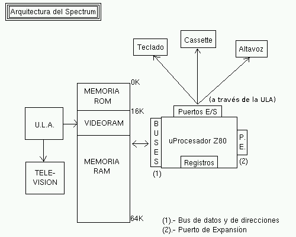
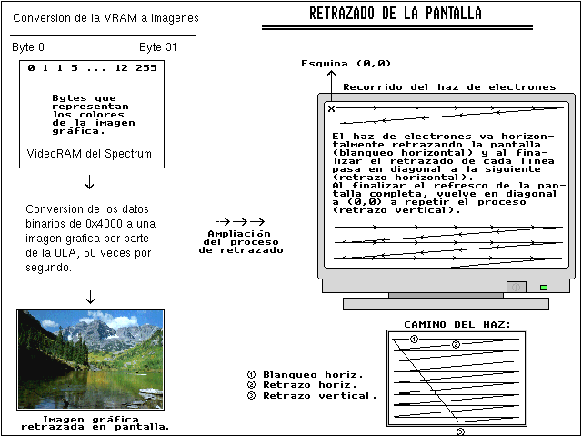

Paginación de memoria 128K
================================================================================

Si el bus de direcciones del Spectrum es de 16 bits y por lo tanto sólo puede acceder a posiciones de memoria entre 0 y 65535... ¿cómo se las arreglan los modelos de 128KB para acceder a la memoria situada entre las celdillas 65535 y 131071? La respuesta es un mecanismo tan simple como ingenioso: se utiliza una técnica conocida como paginación de memoria.

En este artículo aprenderemos a aprovechar los 128K de memoria de que disponen los modelos de Spectrum 128K, +2, +2A y +3. Gracias a la paginación nos saltaremos la limitación de direccionamiento de 64K del microprocesador Z80 para acceder a la totalidad de la memoria disponible.

Paginación
--------------------------------------------------------------------------------

Los modelos de Spectrum 128K, +2, +2A, +2B y +3 disponen de 128KB de memoria, aunque no toda está disponible simultáneamente. Al igual que en el modelo de 48KB, el microprocesador Z80 sólo puede direccionar 64K-direcciones de memoria, por lo que para acceder a esta memoria "extra", se divide en bloques de 16KB y se "mapea" (pagina) sobre la dirección de memoria $c000.

¿Qué quiere decir esto? Que nuestro procesador, con un bus de direcciones de 16 bits, sólo puede acceder a la memoria para leer las "celdillas" entre $0000 y $FFFF (0-65535). Para leer casillas de memoria superiores a 65535, harían falta más de 16 bits de direcciones, ya que 65535 es el mayor entero que se puede formar con 16 bits (1111111111111111b).

Así que ... ¿cómo hacemos para utilizar más de 64KB de memoria si nuestro procesador sólo puede leer datos de la celdilla 0, 1, 2, 3 ... 65534 y 65535? La respuesta es: mediante la paginación.

Los 64KB de memoria del Spectrum, se dividen en 4 bloques de 16KB. El primer bloque ($0000 - $4000) está mapeado sobre la ROM del Spectrum. Accediendo a los bytes desde $0000 a $3FFF de la memoria estamos accediendo a los bytes $0000 a $3FFF del "chip (físico)" de 16K de memoria que almacena la ROM del Spectrum. Se dice, pues, que la ROM está mapeada (o paginada) sobre $0000 en el mapa de memoria.

Dejando la ROM de lado (16KB), los 48KB de memoria restantes están formados por 3 bloques de 16KB. El segundo bloque de 16K de memoria (primero de los 3 que estamos comentando), en el rango $4000 a $7FFF está mapeado sobre el "chip de memoria" que almacena el área de pantalla del Spectrum. El tercero ($8000 a $BFFFF) es memoria de propósito general (normalmente cargaremos nuestros programas aquí).

El bloque que nos interesa a nosotros es el cuarto. La zona final del área de memoria, desde $C000 a $FFFF, es nuestra "ventana" hacia el resto de memoria del 128K. Dividiendo los 128KB de memoria en bloques de 16KB, tendremos 8 bloques que podremos "montar" (o paginar) sobre el área $C000 a $FFFF.

Veamos una figura donde se muestra el estado del mapa de memoria del Spectrum:

.. figure:: mapa_memoria.png
   :scale: 90%
   :align: center
   :alt: Mapa de memoria

   Mapa de memoria

Cualquiera de los 8 bloques de 16KB (128 KB / 16 KB = 8 bloques) puede ser "mapeado" en los 16Kb que van desde $c000 a $ffff, y podremos cambiar este mapeo de un bloque a otro mediante instrucciones I/O concretas.

La última porción de 16KB de la memoria es, pues, una "ventana" que podemos deslizar para que nos dé acceso a cualquiera de los 8 bloques disponibles. Esto nos permite "paginar" el bloque 0 y escribir o leer sobre él, por ejemplo. El byte 0 del bloque 0 se accede a través de la posición de memoria $C000 una vez paginado, el byte 1 desde $C0001, y así hasta el byte 16383, al que accedemos mediante $FFFF.

Si paginamos el bloque 1 en nuestra ventana $C000-$FFFF, cuando accedamos a este rango de memoria, ya no accederíamos a los mismos datos que guardamos en el banco 0, sino a la zona de memoria "Banco 1". Es posible incluso mapear la zona de pantalla (Banco 5), de forma que las direcciones $4000 y $C000 serían equivalentes: los 8 primeros píxeles de la pantalla.

El mapa de memoria del Spectrum con los bloques mapeables/paginables sobre $C000 es el siguiente:

.. figure:: pag_normal.png
   :scale: 90%
   :align: center
   :alt: Paginación de los modelos 128k/+2

   Paginación de los modelos 128k/+2

Cambiando de banco
--------------------------------------------------------------------------------

El puerto que controla la paginación en los modelos 128K es el $7FFD. En realidad, nuestro Spectrum sólo decodifica los bits 1 y 15, por lo que cualquier combinación con los bits 1 y 15 a cero accederá a la gestión de paginación. No obstante, se recomiente utilizar $7FFD por compatibilidad con otros sistemas.

La lectura del puerto $7FFD no devolverá ningún valor útil, pero sí podemos escribir en él un valor con cierto formato:

+-------+-----------------------------------------------------------------------------------+
| Bits  |                                    Significado                                    |
+=======+===================================================================================+
|  0-2  |  Página de la RAM (0-7) a mapear en el bloque $c000 - $ffff.                      |
+-------+-----------------------------------------------------------------------------------+
|       |  Visualizar la pantalla gráfica "normal" (0) o shadow (1).                        |
|       |  La pantalla normal está en el banco 5, y la shadow en el 7.                      |
|  3    |  Aunque cambiemos a la visualización de la pantalla shadow,                       |
|       |  la pantalla "normal" RAM5 seguirá mapeada entre $4000 y $7fff.                   |
|       |  No es necesario tener mapeada la pantalla shadow                                 |
|       |  para que pueda ser visualizado su contenido.                                     |
+-------+-----------------------------------------------------------------------------------+
|  4    |  Selección de la ROM, entre (0) ROM BASIC 128K (Menú y editor), y (1) BASIC 48K.  |
+-------+-----------------------------------------------------------------------------------+
|  5    |  Si lo activamos, se desactivará el paginado de memoria hasta que se resetee el   |
|       |  Spectrum. El hardware ignorará toda escritura al puerto $7FFD.                   |
+-------+-----------------------------------------------------------------------------------+

A la hora de cambiar de página de memoria hay que tener en cuenta lo siguiente:

* La pila (stack) debe de estar ubicada en una zona de memoria que no vaya a ser paginada (no puede star dentro de la zona que va a cambiar).
* Las interrupciones deben de estar deshabilitadas para realizar el cambio de banco.
* Si se va a ejecutar código con interrupciones (y no pueden estar deshabilitadas), entonces debemos actualizar la variable del sistema $5B5C (23388d) con el último valor enviado al puerto $7FFD.

Un ejemplo de cambio de banco en ASM:

.. code-block:: tasm

    LD      A, ($5b5c)      ; Valor previo del puerto (variable del sistema)
    AND     $f8             ; Cambia sólo los bits que debas cambiar
    OR      4               ; Seleccionar banco 4
    LD      BC, $7ffd       ; Colocamos en BC el puerto a
    DI                      ; Deshabilitamos las interrupciones
    LD      ($5b5c), A      ; Actualizamos la variable del sistema
    OUT     (C), A          ; Realizamos el paginado
    EI

Podemos crearnos una rutina lista para usar con este código, como la que sigue:

.. code-block:: tasm

    ;-----------------------------------------------------------------------
    ; SetRAMBank: Establece un banco de memoria sobre $c000
    ; Entrada   : B = banco (0-7) a paginar entre $c000-$ffff
    ; Modifica  : A, B, C
    ;-----------------------------------------------------------------------
    SetRAMBank:
        LD A, ($5b5c)      ; Valor previo del puerto (variable del sistema)
        AND $f8             ; Cambia sólo los bits que debas cambiar
        OR B               ; Seleccionar banco "B"
        LD BC, $7ffd       ; Colocamos en BC el puerto a
        DI                      ; Deshabilitamos las interrupciones
        LD ($5b5c), A      ; Actualizamos la variable del sistema
        OUT (C), A          ; Realizamos el paginado
        EI

Un detalle apuntado por la documentación de World Of Spectrum es que los bancos 1, 3, 5 y 7 son "contended memory", lo que quiere decir que se reduce ligeramente la velocidad de acceso a estos bancos con respecto a los otros bancos. Un apunte muy importante es que en el caso del +2A y +3, los bancos de contended-memory ya no son el 1, 3, 5 y 7, sino los bloques 4, 5, 6 y 7. Al final de este capítulo veremos con más detalle qué es la contended-memory y en qué puede afectar a nuestros programas.

Particularidades +2A/+3
--------------------------------------------------------------------------------

En el caso del +2A y +3 hay que tener en cuenta una serie de detalles "extra" a lo visto anteriormente, y es que estos 2 modelos tienen un modo de paginación especial, aunque siguen siendo compatible con el sistema de paginación que hemos visto. Por eso estos detalles que veremos a continuación son opcionales, ya que podemos utilizar el modo de paginación de la misma forma que en el +2 y 128K (paginación normal):

* Los bancos de contended-memory son los bloques 4, 5, 6 y 7 (no el 1, 3, 5 y 7).
* +2A y +3 tienen 4 ROMS en lugar de 2, por lo que el bit 4 del puerto $7FFD se convierte ahora en el bit bajo de la ROM a seleccionar, mientras que el bit alto se toma del bit 2.
* +2A y +3 tienen funcionalidades extra de paginado, que se controlan con el puerto $1FFD.

Este puerto (el $1FFD) tiene el siguiente significado a la hora de escribir en él: 

+-------+-----------------------------------------------------------+
| Bits  |                        Significado                        |
+=======+===========================================================+
|  0    |  Modo de paginado (0=normal, 1=especial)                  |
+-------+-----------------------------------------------------------+
|  1    |  Ignorado en el modo normal, usando en el modo especial.  |
+-------+-----------------------------------------------------------+
|  2    |  En modo normal, bit alto de la selección de ROM.         |
|       |  Usado de forma diferente en el modo especial.            |
+-------+-----------------------------------------------------------+
|  3-4  |  3=Motor del disco (1/0, ON/OFF), 4=Impresora             |
+-------+-----------------------------------------------------------+

Cuando se activa el modo especial, el mapa de memoria cambia a una de estas configuraciones, según los valores de los bits 1 y 2 del puerto $1FFD:

.. figure:: pag_especial.png
   :scale: 90%
   :align: center
   :alt: Paginación especial +2A/+3

   Paginación especial +2A/+3

Por otra parte, las 4 ROMS mapeables del +2A y +3 son: 

+------+------------------------------------------+
| ROM  |                 Contenido                |
+======+==========================================+
|  0   |  Editor 128K, Menú y programa de testeo  |
+------+------------------------------------------+
|  1   |  Chequeador de sintaxis 128K BASIC       |
+------+------------------------------------------+
|  2   |  +3DOS                                   |
+------+------------------------------------------+
|  3   |  BASIC 48K                               |
+------+------------------------------------------+

De nuevo, al igual que en el caso del puerto genérico sobre paginación, es recomendable actualizar la variable del sistema que almacena el "valor actual" de este puerto, en $5B67 (23399).

Ejemplo sencillo: alternando Bancos 0 y 1
--------------------------------------------------------------------------------

El siguiente ejemplo muestra la paginación de la siguiente forma:

1. Paginamos el bloque/banco 0 sobre el área $C000-$FFFF.
2. Escribimos en memoria, en la posición $C000, el valor $AA.
3. Paginamos el bloque/banco 1 sobre el área $C000-$FFFF.
4. Escribimos en memoria, en la posición $C000, el valor $01.
5. Volvemos a paginar el banco 0 sobre el área de paginación.
6. Leemos el valor de la posición de memoria $C000 y rellenamos toda la pantalla con dicho valor.
7. Volvemos a paginar el banco 1 sobre el área de paginación.
8. Leemos el valor de la posición de memoria $C000 y rellenamos toda la pantalla con dicho valor.

Haciendo esto, guardamos 2 valores diferentes en 2 bancos diferentes, y posteriormente recuperamos dichos bancos para verificar que, efectivamente, los valores siguen en las posiciones (0000) de los bancos y que la paginación de una banco a otro funciona adecuadamente. Se han elegido los valores $AA y $01 porque se muestra en pantalla como 2 tramas de pixeles bastante diferenciadas, siendo la primera un entramado de barras verticales separadas por 1 pixel, y la segunda separados por 7 pixeles.

Para terminar de comprender el ejemplo, lo mejor es compilarlo y ejecutarlo:

.. code-block:: tasm

    ;----------------------------------------------------------------------
    ; Bancos.asm
    ;
    ; Demostracion del uso de bancos / paginación en modo 128K
    ;----------------------------------------------------------------------
    
    ORG 32000
        
        LD HL, 0
        ADD HL, SP                      ; Guardamos el valor actual de SP
        EX DE, HL                       ; lo almacenamos en DE
        
        LD SP, 24000                    ; Pila fuera de $c000-$ffff
        
        CALL Wait_For_Keys_Released
        LD HL, $c000                   ; Nuestro puntero
        
        ; Ahora paginamos el banco 0 sobre $c000 y guardamos un valor
        ; en el primer byte de sus 16K (en la direccion $c000):
        LD B, 0
        CALL SetRAMBank                 ; Banco 0
        
        LD A, $AA
        LD (HL), A                      ; ($c000) = $AA
        
        ; Ahora paginamos el banco 1 sobre $c000 y guardamos un valor
        ; en el primer byte de sus 16K (en la direccion $c000):
        LD B, 1
        CALL SetRAMBank                 ; Banco 1
        
        LD A, $01
        LD (HL), A                      ; ($C000) = $01
        
        ; Esperamos una pulsación de teclas antes de empezar:
        CALL Wait_For_Keys_Pressed
        CALL Wait_For_Keys_Released
        
        ; Ahora vamos a cambiar de nuevo al banco 0, leemos el valor que
        ; hay en $c000 y lo representamos en pantalla. Recordemos que
        ; acabamos de escribir $01 (00000001) antes de cambiar de banco,
        ; y que en su momento pusimos $AA (unos y ceros alternados):
        LD B, 0
        CALL SetRAMBank                 ; Banco 0
        LD A, (HL)                      ; Leemos ($c000)
        CALL ClearScreen                ; Lo pintamos en pantalla
        
        ; Esperamos una pulsación de teclas:
        CALL Wait_For_Keys_Pressed
        CALL Wait_For_Keys_Released
        
        ; Ahora vamos a cambiar de nuevo al banco 1, leemos el valor que
        ; hay en $c000 y lo representamos en pantalla. Recordemos que
        ; acabamos de leer $A antes de cambiar de banco, y que en su
        ; momento pusimos $01:
        LD B, 1
        CALL SetRAMBank                 ; Banco 0
        LD A, (HL)                      ; Leemos ($c000)
        CALL ClearScreen                ; Lo pintamos en pantalla
        
        ; Esperamos una pulsación de teclas:
        CALL Wait_For_Keys_Pressed
        CALL Wait_For_Keys_Released
        
        EX DE, HL                       ; Recuperamos SP para poder volver
        LD SP, HL                       ; a BASIC sin errores
        RET 
        
        
        ;-----------------------------------------------------------------------
        ; SetRAMBank: Establece un banco de memoria sobre $c000
        ; Entrada: B = banco (0-7) a paginar entre $c000-$ffff
        ;-----------------------------------------------------------------------
    SetRAMBank:
        LD A,($5b5c)                  ; Valor anterior del puerto
        AND $f8                       ; Sólo cambiamos los bits necesarios
        OR B                           ; Elegir banco "B"
        LD BC,$7ffd
        DI
        LD ($5b5c),A
        OUT (C),A
        EI
        RET
        
        
    ;-----------------------------------------------------------------------
    ; ClearScreen: Limpia toda la pantalla con un patrón gráfico dado.
    ; Entrada: A = valor a "imprimir" en pantalla.
    ;-----------------------------------------------------------------------
    ClearScreen:
        PUSH HL
        PUSH DE
        LD HL, 16384
        LD (HL), A
        LD DE, 16385
        LD BC, 6143
        LDIR
        POP DE
        POP HL
        RET
        
        
        ;-----------------------------------------------------------------------
        ; Rutinas para esperar la pulsación y liberación de todas las teclas:
        ;-----------------------------------------------------------------------
    Wait_For_Keys_Pressed:
        XOR A                        ; A = 0
        IN A, (254)
        OR 224
        INC A
        JR Z, Wait_For_Keys_Pressed
        RET
        
    Wait_For_Keys_Released:
        XOR A
        IN A, (254)
        OR 224
        INC A
        JR NZ, Wait_For_Keys_Released
        RET
        
    END 32000

El programa anterior, una vez ensamblado y ejecutado, esperará la pulsación de una tecla para mostrarnos en pantalla el valor de la celdilla de memoria $c000 mapeando primero uno de los bancos, y luego el otro.

Contended Memory
--------------------------------------------------------------------------------

En este capítulo hemos hablado de la Contended Memory (podríamos traducirlo por "contención de memoria" o "memoria contenida").

Esta peculiaridad de la memoria del Spectrum puede traernos de cabeza en circunstancias muy concretas, como la programación de emuladores, o la creación de rutinas críticas donde el timming sea muy importante o donde tengamos que sincronizarnos de una forma muy precisa con algún evento.

El efecto es el siguiente: algunas zonas de memoria, en determinadas circunstancias, son de acceso más lento que otras en cuanto a ejecución de código que afecten a ellas (leer de esas zonas, escribir en esas zonas, ejecutar código que está en esas zonas). La causa es sencilla: una misma celdilla de memoria no puede ser accedida por 2 dispositivos diferentes simultáneamente.

¿Acaso existen en el Spectrum otro dispositivo que acceda a la memoria además del microprocesador (cuando lee, decodifica y ejecuta instrucciones, o cuando lee/escribe en memoria)? Sí, lo hay, y es la ULA (Uncommited Logic Array). 

   La ULA y su papel en el Spectrum

La ULA es, digamos, "el chip gráfico" del Spectrum. Su labor no es como en los chips gráficos actuales o los chips gráficos de otros ordenadores (y consolas) de 8 bits, la de apoyar al software con funciones extra, sino que en el Spectrum la ULA se limita a leer la VIDEORAM (parte de la memoria que contiene la información gráfica a representar en el monitor), interpretarla, y mandar al modulador de TV las señales adecuadas para la visualización de dicha información en la TV. Sencillamente, es el chip que lee la VideoMemoria y la convierte en los píxeles que vemos en la TV.

¿Cómo trabaja la ULA? Este pequeño chip fabricado por Ferranti recorre 50 veces por segundo la zona de memoria que comienza en $4000 (16384) y transforma los datos numéricos en píxeles apagados o encendidos con el color de la tinta y papel asociado a cada celdilla 8×1 (8×8 en realidad) que va leyendo byte a byte, horizontalmente. Esto implica una sincronización con el haz de electrones del monitor de TV, que empieza en la esquina superior-izquierda y avanza horizontalmente hasta llegar al final de cada línea para, como en una máquina de escribir, pasar a la siguiente línea horizontal, y así hasta llegar hasta la esquina inferior derecha.

   El retrazado de pantalla

El problema es que mientras el haz de electrones del monitor avanza redibujando la imagen, el Spectrum no puede interrumpirlo (de hecho, no puede controlarlo, sólo se sincroniza con él) y tiene que servirle todos los datos necesarios para el retrazado de la imagen.

Esto implica que cuando la ULA está "redibujando" la pantalla (y recordemos que lo hace 50 veces por segundo) y por tanto leyendo de las sucesivas posiciones de memoria comenzando en $4000, el procesador no puede acceder a las celdillas exactas de memoria a las que accede la ULA hasta que ésta deja de hacer uso de ellas. En otras palabras, a la hora de leer celdillas de memoria entre $4000 y $7FFF, la ULA tiene prioridad sobre el procesador.

Por eso, los programas que corren en la zona de memoria entre $4000 y $7FFF (o pretenden acceder a la misma justo cuando la ULA quiere leer algún dato gráfico de la VRAM) pueden ser ralentizados cuando la ULA está leyendo la pantalla.

Como se detalla en la FAQ de comp.sys.sinclair alojada en World Of Spectrum, este efecto sólo se da cuando se está dibujando la pantalla propiamente dicha, ya que para el trazado del borde la ULA proporciona al haz de electrones el color a dibujar y no se accede a memoria, por lo que no se produce este retraso o delay.

Controlar exactamente los retrasos que se producen y cómo afectarán a la ejecución de nuestros programas es un ejercicio bastante complejo que requiere conocimiento de los tiempos de ejecución de las diferentes instrucciones, número de ciclo desde que comenzó el retrazado de la pantalla, etc. Por ejemplo, una misma instrucción, NOP, que requiere 4 ciclos de reloj para ejecutarse en condiciones normales, puede ver aumentado su tiempo de ejecución a 10 ciclos (4 de ejecución y 6 de delay) si el contador de programa (PC) está dentro de una zona de memoria contenida, y dicho delay afectaría sólo al primer ciclo (lectura de la instrucción por parte del procesador). Por contra, si en lugar de una instrucción NOP tenemos una instrucción LD que acceda a memoria (también contenida), el delay puede ser mayor.

Como podéis imaginar, este es uno de los mayores quebraderos de cabeza para los programadores de emuladores, y es la principal causa (junto con la Contended I/O, su equivalente en cuanto a acceso de puertos, también producido por la ULA), de que hasta ahora no todos los juegos fueran correctamente emulados con respecto a su funcionamiento en un Spectrum. También muchas demos con complejas sincronizaciones y timmings dejaban de funcionar en emuladores de Spectrum que no implementaban estos "retrasos" y que, en su emulación "perfecta del micro", ejecutaban siempre todas las instrucciones a su velocidad "teórica".

En nuestro caso, como programadores, la mejor manera de evitar problemas en la ejecución de nuestros programas es la tratar de no situar código, siempre que sea posible, entre $4000 y $7FFF.

Si recordáis, en el capítulo dedicado a la gestión de la pila, ya obtuvimos la recomendación de no ubicar la pila en el bloque de 16KB a partir de $4000 precisamente por este motivo.

Contended Memory + Paginación
--------------------------------------------------------------------------------

¿Cómo afecta la contended-memory al sistema de paginación de los modelos 128K? Al igual que en el 48K existe una "página" ($4000-$7FFF) a la que la ULA accede y por tanto afectada por sus lecturas, en el caso de los 128K existen bancos de memoria completos (páginas) de memoria contenida. Como ya hemos visto, estos bancos son:

* Modelos +2/128K : Bancos 1, 3, 5 y 7.
* Modelos +2A/+3: Bancos 4, 5, 6 y 7.

La afectación de velocidad de lectura de esta memoria es más importante de lo que parece. Según el manual del +3:

    The RAM banks are of two types: RAM pages 4 to 7 which are contended 
    (meaning that they share time with the video circuitry), and RAM pages
    0 to 3 which are uncontended (where the processor has exclusive use).
    Any machine code which has critical timing loops (such as music or
    communications programs) should keep all such routines in uncontended
    banks.

    For example, executing NOPs in contended RAM will give an effective
    clock frequency of 2.66Mhz as opposed to the normal 3.55MHz in
    uncontended RAM. 

    This is a reduction in speed of about 25%.

Es decir, la velocidad de acceso a memoria (y por tanto, también de ejecución) cae un 25% de promedio en un banco con contended-memory con respecto a un banco que no lo sea.

El problema, que para el 128K y +2 las páginas que sufre una penalización son unas, y para el +2A y +3 otras diferentes, por lo que parece que siempre tendremos que primar a uno de los modelos sobre otros: o usamos números de bancos que no penalicen al +2A/+3, o lo hacemos para el 128K/+2.

Lo mejor es no situar en la zona paginada rutinas como las de vídeo o audio, o al menos, no hacerlo si éstas son críticas. En cualquier caso, es probable que para el 90% de las rutinas o datos de un programa no existan problemas derivados de correr o estar alojados en memoria contenida, pero puede ser un detalle a tener muy en cuenta en rutinas que requieran un timming perfecto (efectos con el borde, efectos gráficos complejos, etc).

Paginación de memoria desde Z88DK (C)
--------------------------------------------------------------------------------

Podemos paginar memoria también desde C usando Z88DK mediante un código como el siguiente:

.. code-block:: c

    //--- SetRAMBank ------------------------------------------------------
    //
    // Se mapea el banco (0-7) indicado sobre $C000.
    //
    // Ojo: aqui no se deshabilitan las interrupciones y ademas en lugar
    // de usar el registro B, se usa un parametro tomado desde la pila.
    // En caso de ser importante la velocidad, se puede usar "B" y no pasar
    // el parametro en la pila, llamando SetRAMBank con un CALL.
    //
    void SetRAMBank( char banco )
    {
    #asm
    .SetRAMBank
        ld hl, 2
        add hl, sp
        ld a, (hl)
    
        ld b, a
        ld  A, ($5B5C)
        and F8h
        or  B
        ld  BC, $7FFD
        ld  ($5B5C), A
        out (C), A
    #endasm
    }

Con el anterior código podemos mapear uno de los bancos de memoria de 16KB sobre la página que va desde $C000 a $FFFF, pero debido al uso de memoria, variables y estructuras internas que hace Z88DK, debemos seguir una serie de consideraciones.

* Todo el código en ejecución debe estar por debajo de $C000, para lo cual es recomendable definir los gráficos al final del "binario".
* Es importantísimo colocar la pila en la memoria baja, mediante la siguiente instrucción (o similar, según la dirección en que queremos colocarla) al principio de nuestro programa::

    /* Allocate space for the stack */
    #pragma output STACKPTR=24500

La regla general es asegurarse de que no haya nada importante (para la ejecución de nuestro programa) en el bloque $C000 a $FFFF cuando se haga el cambio: ni la pila, ni código al que debamos acceder. Tan sólo datos que puedan ser intercambiandos de un banco a otro sin riesgo para la ejecución del mismo (por ejemplo, los datos de un nivel de juego en el que ya no estamos).

En resumen
--------------------------------------------------------------------------------

Comprendiendo el sistema de paginación de los modelos de 128K y aprendiendo a utilizarlo conseguimos una gran cantidad de memoria adicional que ir paginando sobre el bloque $C000-$FFFF.

Así, podemos almacenar los datos de diferentes niveles en diferentes bloques, y cambiar de uno a otro mediante paginación en el momento adecuado. Esto permite realizar cargas de datos desde cinta almacenando la totalidad de los datos del juego o programa en bancos libres de memoria y convertir nuestro juego multicarga (con una carga por fase) en un juego de carga única (con todos los elementos del juego almacenados en memoria), evitando el tedioso sistema de rebobinar y volver a cargar la primera fase cuando el jugador muere.

Ahora bastará con que nuestro programa, una vez cargado en memoria y en ejecución, pagine un determinado bloque, cargue 16K-datos sobre él, pagine otro bloque diferente, y realice otra carga de datos desde cinta, y así sucesivamente con todos los bloques de datos del juego. Estas cargas de datos podemos hacerlas bien desde nuestro programa "principal" una vez cargado y en memoria, o bien desde un mini-programa lanzado por el cargador BASIC y previo a cargar el programa definitivo.

El resultado: 128KB de memoria a nuestro alcance, tanto para cargar múltiples datos gráficos o de mapeado sobre ellos como para llenarlos internamente desde nuestro programa. 