Gráficos (I): la videomemoria del Spectrum
================================================================================

Para comprender el funcionamiento de la videomemoria del Spectrum debemos empezar por comprender cómo el monitor o TV CRT genera las imágenes.

Los monitores/televisiones CRT (de Cathode Ray Tube, o Tubo de Rayos Catódicos), que incluye tanto a los televisores como a los monitores estándar que no sean de tecnología TFT/LED/PLASMA, funcionan mediante un "bombardeo" de electrones que excitan los elementos fosforescentes de pantalla.

Simplificando el proceso, podría decirse que el monitor o pantalla es una matriz de elementos fosforescentes (los píxeles) protegidos y delimitados por una máscara (que determina la "posición" de los mismos) y el CRT un cañón de electrones capaz de "iluminar" el pixel al que apunta. Este pixel se mantiene "excitado" y por tanto "encendido" un tiempo limitado, ya que se va apagando progresivamente cuando el haz de electrones deja de excitarlo. Esto implica que hay que volver a bombardear dicho punto de nuevo para que se encienda durante otro período de tiempo. Realizando esta operación suficientes veces por segundo (50 veces por segundo en sistemas PAL y 60 en sistemas NTSC), dará la sensación óptica de que el pixel no se apaga nunca. 

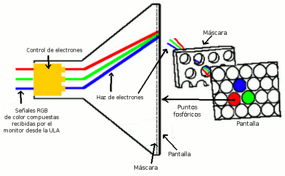

   El CRT generando un pixel

Concretando un poco más, en el caso de los monitores de fósforo verde o de blanco y negro, cada pixel se compone de un único elemento de la matriz (habitualmente de fósforo) excitable, que puede estar encendido o apagado. En el caso de los monitores de color, cada pixel se compone de 3 sub-pixels muy cercanos de colores Rojo, Azul y Verde (Red Green Blue) los cuales podemos ver si nos acercamos lo suficiente a un monitor CRT: 

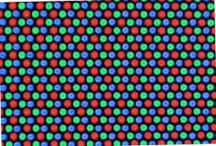

   Trama de subpíxeles RGB que forman un pixel

El haz de electrones activa 1, 2 ó los 3 subpíxeles (las componentes) que forman un pixel con una intensidad mayor o menor según el color RGB y los valores de las componentes que forman el color real. Así, activando con máxima intensidad las 3 componentes RGB (en 8 bits, R=255, G=255 y B=255), debido a la cercanía de los subpíxeles, nuestro ojo apreciará desde la distancia de visión "normal" un único píxel de color blanco. Si el haz de electrones excitara sólo el subpixel R y no el G y el B (R=valor, G=0, B=0), veríamos un pixel de color rojo cuya tonalidad variaría en función del valor de la componente R.

La ULA tiene definidos los colores del Spectrum con unas componentes de color concretas que podemos ver aproximadamente en la siguiente tabla y en la imagen donde se representan:

+--------+---------------------+-------------------+
| Valor  |        Color        |  Componentes RGB  |
+========+=====================+===================+
|  0     |  Negro              |  (0, 0, 0 )       |
+--------+---------------------+-------------------+
|  1     |  Azul               |  (0, 0, 192)      |
+--------+---------------------+-------------------+
|  2     |  Rojo               |  (192, 0, 0)      |
+--------+---------------------+-------------------+
|  3     |  Magenta            |  (192, 0, 192)    |
+--------+---------------------+-------------------+
|  4     |  Verde              |  (0, 192, 0)      |
+--------+---------------------+-------------------+
|  5     |  Cian               |  (0, 192, 192)    |
+--------+---------------------+-------------------+
|  6     |  Amarillo           |  (192, 192, 0)    |
+--------+---------------------+-------------------+
|  7     |  Blanco             |  (192, 192, 192)  |
+--------+---------------------+-------------------+
|  8     |  Negro + Brillo     |  (0, 0, 0)        |
+--------+---------------------+-------------------+
|  9     |  Azul + Brillo      |  (0, 0, 255)      |
+--------+---------------------+-------------------+
|  10    |  Rojo + Brillo      |  (255, 0, 0)      |
+--------+---------------------+-------------------+
|  11    |  Magenta + Brillo   |  (255, 0, 255)    |
+--------+---------------------+-------------------+
|  12    |  Verde + Brillo     |  (0, 255, 0)      |
+--------+---------------------+-------------------+
|  13    |  Cian + Brillo      |  (0, 255, 255)    |
+--------+---------------------+-------------------+
|  14    |  Amarillo + Brillo  |  (255, 255, 0)    |
+--------+---------------------+-------------------+
|  15    |  Blanco + Brillo    |  (255, 255, 255)  |
+--------+---------------------+-------------------+

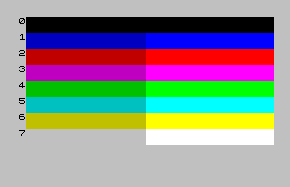

   La gama de colores del Spectrum

Pero volvamos al retrazado de nuestra imagen: y es que no sólo hay que trazar y refrescar un único pixel: el CRT debe de refrescar todos los píxeles de la pantalla. Para ello, el cañón de electrones del monitor (un triple cañón realmente, para atacar a las 3 componentes de color) realiza un recorrido desde la esquina superior izquierda hasta la inferior derecha refrescando todos los píxeles de la pantalla y volviendo de nuevo a la posición inicial para repetir el proceso.

Como ya vimos en el capítulo dedicado a las interrupciones, el haz de electrones de una pantalla CRT comienza su recorrido en la esquina superior izquierda del monitor y avanza horizontalmente hacia a la derecha retrazando lo que se conoce como un "scanline" (una línea horizontal). Al llegar a la derecha del monitor y tras haber trazado todos los píxeles de la primera línea, se desactiva el bombardeo de electrones y se produce un retorno a la parte izquierda de la pantalla y un descenso al scanline inferior. Al llegar aquí, mediante la sincronización con una señal HSYNC monitor-dispositivo, se "activa" de nuevo el trazado de imagen para redibujar el nuevo scanline con la información que le suministra el dispositivo que está conectado al monitor.

El haz de electrones traza pues, scanline a scanline, toda la pantalla hasta llegar a la parte inferior derecha, momento en el que el haz de electrones vuelve a la parte superior izquierda dejando de bombardear electrones durante el retorno, sincronizándose con el dispositivo al que esté conectado (la ULA y el modulador de vídeo del Spectrum en este caso) mediante una señal VSYNC. 

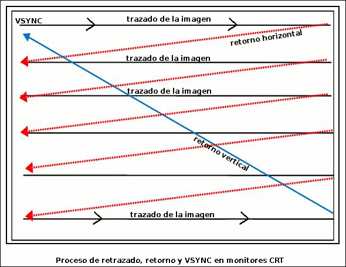

   Proceso de retrazado de la imagen.

Este proceso se repite continuamente (a razón de 50 ó 60 veces por segundo según el sistema de televisión de nuestra región) y no se puede interrumpir ni variar (ni el tiempo de avance de la señal de televisión en horizontal ni el tiempo total que se tarda en retrazar un cuadro.

Es el dispositivo conectado a la televisión o monitor (el Spectrum en este caso) quien le debe de proporcionar los datos gráficos que el monitor ha de retrazar, sincronizándose este dispositivo con el monitor mediante las señales de HSYNC y VSYNC.

Cuando se produce un VSYNC y el monitor va a comenzar a trazar los datos del primer scanline, es la ULA en el caso del Spectrum la encargada de alimentar el flujo de datos a dibujar con el timing correcto que necesita el monitor conforme avanza por la pantalla. Mediante la señal de HSYNC se vuelven a sincronizar de forma que la ULA pueda comenzar a surtir los datos del siguiente scanline, repitiendo el proceso hasta acabar el retrazado de toda la imagen.

Así pues, sabemos que la televisión necesita retrazar continuamente la imagen que aparece en pantalla, por lo que ésta debe de estar almacenada en algún lugar para que la ULA pueda leer estos datos y proporcionarselos al monitor a través del cable de vídeo. Este almacen no es un área de memoria dentro de la ULA sino dentro de la propia RAM de nuestro Spectrum. Hablamos de la videomemoria, videoram, o "fichero de imagen".

La videomemoria del Spectrum
--------------------------------------------------------------------------------

Cuando comenzamos nuestro curso de ensamblador vimos la organización del mapa de memoria del Spectrum, con la ROM mapeada entre $0000 y $3FFFF, y los 16 o 48KB de memoria a continuación de la misma. A partir de la dirección de memoria $4000 y hasta $7FFF nos encontramos un área de memoria etiquetada como "videoram" o "videomemoria".

Este área de aprox. 7 KB de memoria es donde podemos encontrar la representación digital de la imagen que estamos viendo en el monitor y que la ULA lee regularmente para poder generar la señal de vídeo que requiere el retrazar la imagen. 

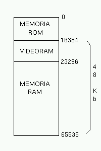

   La videoram en el mapa de memoria del Spectrum

Las rutinas de la ROM o de BASIC que dibujan puntos, líneas, rectángulos o caracteres de texto, lo que realmente hacen internamente es escribir datos en posiciones concretas y calculadas de la videoram ya que estos datos escritos se convertirán en píxeles en el monitor cuando la ULA los recoja en su proceso de envío de datos al monitor y éste los dibuje en la pantalla.

Algo tan sencillo como establecer a "1" el bit 7 de la posición de memoria $4000 provocará la aparición en el monitor de un pixel activo en la posición (0,0) de la pantalla. Si en lugar de cambiar un único bit en esa posición, cambiamos los bits apropiados en las posiciones apropiadas, podremos provocar el trazado de una imagen, un carácter, etc.

Veamos un sencillo ejemplo de esto. Vamos a imprimir una letra A empezando en la posición (128,96) de la pantalla. Definimos primero los píxeles que van a conformar esta letra mediante esta matriz de 8×8::

    Pixel       76543210
    --------------------
    Scanline 0  --XXXX--
    Scanline 1  -X----X-
    Scanline 2  -X----X-
    Scanline 3  -XXXXXX-
    Scanline 4  -X----X-
    Scanline 5  -X----X-
    Scanline 6  -X----X-
    Scanline 7  --------

Esta representación gráfica, convertida en bits a 1 (pixel activo) o a 0 (bit no activo) sería la siguiente::

    Valor BIT   76543210    Decimal
    --------------------------------
    Scanline 0  00111100  =   60d
    Scanline 1  01000010  =   66d
    Scanline 2  01000010  =   66d
    Scanline 3  01111110  =  126d
    Scanline 4  01000010  =   66d
    Scanline 5  01000010  =   66d
    Scanline 6  01000010  =   66d
    Scanline 7  00000000  =    0d

Habrá que escribir estos valores en posiciones concretas de la videomemoria que provoquen que los píxeles de nuestra letra A aparezcan unos sobre otros y en la posición de pantalla elegida.

Así pues, ensamblamos y ejecutamos el siguiente programa:

.. code-block:: tasm

        ; Ejemplo de escritura de un grafico con forma de A

    ORG 50000

        LD HL, 18514       ; Scanline 0 en Y=96
        LD A, 60           ; 00111100b
        LD (HL), A         ; Escribir

        LD HL, 18770       ; Scanline 1 en Y=97
        LD A, 66           ; 01000010b
        LD (HL), A         ; Escribir

        LD HL, 19026       ; Scanline 2 en Y=98
        LD A, 66           ; 01000010b
        LD (HL), A         ; Escribir

        LD HL, 19282       ; Scanline 3 en Y=99
        LD A, 126          ; 01111110b
        LD (HL), A         ; Escribir

        LD HL, 19538       ; Scanline 4 en Y=100
        LD A, 66           ; 01000001b
        LD (HL), A         ; Escribir

        LD HL, 19794       ; Scanline 5 en Y=101
        LD A, 66           ; 01000001b
        LD (HL), A         ; Escribir

        LD HL, 20050       ; Scanline 6 en Y=102
        LD A, 66           ; 01000001b
        LD (HL), A         ; Escribir

        LD HL, 20306       ; Scanline 7 en Y=103
        LD A, 0            ; 00000000b
        LD (HL), A         ; Escribir

        RET
    END 50000

Lo que produce la siguiente imagen en pantalla: 

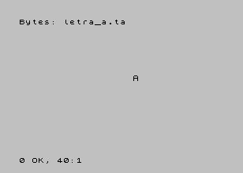

   Trazando una letra A en pantalla.

Los valores de posiciones de memoria en que hemos escrito el estado de los píxeles han sido precalculadas manualmente para que los valores que escribíamos en ella aparecieran en la posición exacta de pantalla en que los vemos al ejecutar el programa.

Esto es una demostración de cómo alterar el contenido de la videoram es la forma real de generar gráficos en la pantalla del Spectrum. Estos gráficos generados pueden ir desde un simple pixel de coordenadas (x,y) (cambio de un bit en la dirección de memoria adecuada) hasta un sprite completo, una pantalla de carga o fuentes de texto.

La resolución gráfica del Spectrum permite la activación o desactivación de 256 píxeles horizontales contra 192 píxeles verticales, es decir, la pantalla tiene una resolución de 256×192 píxeles que pueden estar, cada uno de ellos, encendido o apagado.

Si nos olvidamos del color y pensamos en el Spectrum como en un sistema monocromo, se puede considerar que 256×192 es una resolución de pantalla bastante respetable para la potencia de un microprocesador como el Z80A, ya que a más resolución de pantalla, más operaciones de escritura y lectura de memoria necesitaremos para generar los gráficos en nuestros juegos.

Por desgracia, la "alta" resolución del Spectrum se ve ligeramente empañada por el sistema de color en baja resolución diseñado para poder reducir la cantidad de RAM necesaria para alojar la videomemoria.

A nivel de color, existe la posibilidad de definir color en baja resolución. Esto implica que podemos establecer un color de tinta y otro de papel (así como brillo y parpadeo) en bloques de 8×8 píxeles con una resolución de 32×24 bloques. Se puede decir que la definición de los colores es, pues, a nivel de "carácter".

Debido a esta mezcla de gráficos en alta definición y colorido en baja definición, la videomemoria del Spectrum se divide en 2 áreas:

* El área de imagen: Es el área de memoria que va desde $4000 (16384) hasta $57FF (22527). Este área de memoria de 6 KB almacena la información gráfica de 256×192 píxeles, donde cada byte (de 8 bits) define el estado de 8 píxeles (en cada bit del byte se tiene el estado de un pixel, con 1=activo, 0=no activo), de forma que se puede codificar cada línea de 256 pixeles con 256/8=32 bytes. Utilizando 32 bytes por línea, podemos almacenar el estado de una pantalla completa con 32*192 = 6144 bytes = 6 KB de memoria. Por ejemplo, la celdilla de memoria 16384 contiene el estado de los 8 primeros píxeles de la línea 0 de la pantalla, desde (0,0) a (7,0).
* El área de atributos: Es el área de memoria comprendida entre $5800 (22528) y $5AFF (23295). Cada uno de estos 768 bytes se denomina atributo y almacena los colores de pixel activo (tinta) y no activo (papel) de un bloque de 8×8 de la pantalla. Por ejemplo, la celdilla de memoria 22528 almacena el atributo de color del bloque (0,0) que se corresponde con los 64 píxeles desde las posiciones de pantalla (0,0) hasta (7,7).

La ULA genera para el monitor una imagen utilizando los píxeles definidos en el área de imagen junto a los colores que le corresponde a ese píxel según el valor del atributo del bloque en baja resolución al que corresponda la posición del pixel.

Así, para generar el valor del punto de pantalla (6,0), la ULA utiliza el bit 1 de la posición de memoria 16384, representando este pixel con el color de tinta (si el bit vale 1) o de papel (si vale 0) del atributo definido en (22528), ya que el pixel (6,0) forma parte del primer bloque de baja resolución de pantalla.

En la siguiente imagen podemos ver un ejemplo simplificado de cómo se produce la generación de la imagen como "superposición" de la información gráfica en alta resolución y la información de color en baja resolución: 

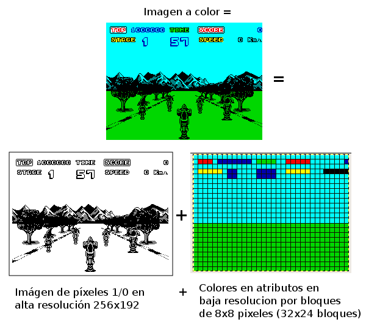

   Gráficos de 256x192 con color a 32x24

¿Cuál es el motivo de crear este sistema mixto de imagen de alta resolución y atributos de baja resolución? No es otro que el ahorro de memoria. Si quisieramos disponer de un sistema de 256×192 píxeles donde cada pixel pudiera disponer de su propio valor de color o de un índice en una paleta de colores, necesitaríamos la siguiente cantidad de memoria para alojar la pantalla:

* Utilizando un sistema de 3 componentes RGB que vayan desde 0 a 255, necesitaríamos 3 bytes por cada pixel, lo que implicaría la necesidad de 256x192x3 = 147456 bytes = 144KB sólo para almacenar la imagen de pantalla actual. No sólo sería una enorme cantidad de memoria, sino que nuestro Z80A a 3.50Mhz a duras penas podría generar gráficos a pantalla completa con suficiente velocidad, ya que la cantidad de operaciones de lectura y escritura serían enormes para su capacidad.
* Utilizando el sistema de paleta actual con 16 posibles colores (4 bits), codificando 2 píxeles en cada byte (4 bits de índice de color en la paleta * 2 píxeles = 8 bits), obtendríamos un sistema de 4 bits por píxel (2 píxeles por byte) que requeriría 256×192/2 bytes = 24576 = 24KB de memoria para alojar la videomemoria. Esto representa la mitad exacta de toda la memoria RAM disponible del Spectrum y 8KB más de lo que disponía el modelo de 16KB que, no nos olvidemos, fue el Spectrum original. Además, se perdería la posibilidad de hacer flash al no disponer de un bit a tal efecto.

Buscando una solución más económica (recordemos que Sir Clive Sinclair quería que los precios de sus productos fueran realmente reducidos) se optó por un sistema de vídeo mixto (que fue incluso patentado) con 256×192 = 6144 bytes (6KB) dedicados al fichero de imagen y 32×24 = 768 bytes dedicados a los atributos de bloques de color, resultando en un total de 6912 bytes. La videomemoria del Spectrum ocupaba así menos de 7 KB, permitiendo que el ZX Spectrum de 16KB de RAM todavía dispusiera de 9 KB de memoria de trabajo.

A cambio de este enorme ahorro de memoria, el color en el Spectrum implica realizar un cuidadoso diseño de los gráficos y los mapeados para evitar lo que se conoce como "colour clash" o "attribute clash" (colisión de atributos), que se produce cuando los gráficos pasan de un bloque de color en baja resolución a otro, con lo que los colores que debía tener un determinado gráfico modifican los del fondo, los de otro gráfico, etc.

Para demostrar el efecto de la colisión de atributos podemos acudir a un sencillo programa en BASIC:

.. code-block:: basic
        
    10 BORDER 1: PAPER 1: INK 7: CLS
    20 FOR R = 10 TO 70 STEP 10 : CIRCLE 128, 96, R : NEXT R
    30 PAUSE 0
    40 INK 2 : PLOT 30, 30 : DRAW 220, 120

Lo primero que hace el programa es dibujar una serie de círculos concéntricos de color blanco (INK 7) sobre papel azul (PAPER 1): 

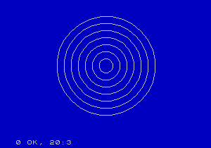

   Círculos concéntricos

A continuación pulsamos una tecla y se ejecuta el "INK 2 + PLOT + DRAW" que traza una línea diagonal roja. Como en una misma celdilla de 8×8 no pueden haber 2 colores de tinta diferentes, cada pixel rojo que dibuja la rutina DRAW afecta a los 8×8 píxeles del recuadro al que corresponde. Cada nuevo pixel dibujado modifica los atributos de su correspondiente bloque en baja resolución, por lo que se alteran también los colores de los círculos allá donde coincidan con la línea: 

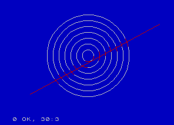

   Añadimos una línea.

Ampliando la zona central podemos ver el efecto del "attribute clash" con la alteración de los colores del círculo debido al dibujado de los píxeles rojos de la línea: 

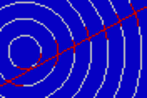

   Attribute clash

En los juegos con colorido podemos apreciar el "attribute clash" fácilmente si es necesario gran cantidad de colores en pantalla o el movimiento de los personajes debe de ser pixel a pixel sobre un fondo colorido. En el siguiente ejemplo podemos ver una ampliación del sprite del juego Altered Beast donde el color de tanto las botas como el cuerpo del personaje provocan el cambio de color de los píxeles del decorado que entran dentro del mismo bloque de caracteres en baja resolución:

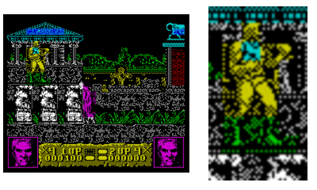

   "Ligero" Attribute Clash en Altered Beast 

Los programadores tienen diferentes técnicas para dotar a los juegos de color sorteando las limitaciones del color en baja resolución y evitando el "attribute clash". La más obvia y sencilla es de generar el juego en formato monocolor, ya sea toda la pantalla o sólo el área de juego: 

.. figure:: hate.png
   :scale: 50%
   :align: center
   :alt: Area de juego monocolor en De esta forma, todo el área donde se mueven los sprites es del mismo color por lo que no existen colisiones de atributos entre ellos.

La forma más elaborada es la de realizar un diseño gráfico teniendo en mente el sistema de atributos del Spectrum, de forma que se posicionen los elementos en pantalla de tal modo que no haya colisiones entre los mismos. A continuación podemos ver un par de capturas que muestran un excelente colorido sin apenas colisiones de atributos:

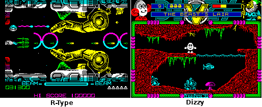
   
   Excelente diseño gráfico que disimula la colisión de atributos

En este capítulo trataremos la organización de la zona de imagen y la zona de atributos de cara a tratar en el próximo capítulo el cómo calcular las posiciones de memoria relativas a cada coordenada (x,y) de pixel o de atributo en que deseemos escribir. Tras estos 2 capítulos sobre la videoram trabajaremos con sprites de baja o alta resolución (movimiento de 32×24 vs 256×192 posiciones diferentes), fuentes de texto, etc.

A continuación veremos una descripción más detallada de cada una de estas 2 áreas de memoria.

Videomemoria: Área de Imagen
--------------------------------------------------------------------------------

El área de imagen del Spectrum es el bloque de 6144 bytes (6KB) entre 16384 ($4000) y 22527 ($57FF). Cada una de las posiciones de memoria de este área almacenan la información de imagen (estado de los píxeles) de 8 píxeles de pantalla consecutivos, donde un bit a 1 significa que el pixel está encendido y un valor de 0 que está apagado.

Como veremos cuando hablemos del área de atributos, que los píxeles estén a ON o a OFF no implica que la ULA sólo dibuje los píxeles activos. Si el pixel está activo (bit a 1), la ULA lo traza en pantalla utilizando el color de tinta actual que corresponda a ese píxel mientras que un bit a 0 significa que el pixel no está encendido y que la ULA debe de dibujarlo con el color de papel actual.

Así pues, en este área se codifica el estado de cada pixel a razón de 1 bit por píxel, lo que implica que cada byte almacena la información de 8 píxeles consecutivos requiriendo la totalidad de la pantalla (256/8) * 192 = 32 * 192 = 6144 bytes.

Tomemos como ejemplo la primera celdilla de memoria del área de imagen, la $4000 o 16384. Los diferentes bits de esta celdilla de memoria se corresponden con el estado de los píxeles desde (0,0) hasta (7,0): 

+------------------+---------+---------+---------+---------+---------+---------+---------+---------+
| Bits de (16384)  |    7    |    6    |    5    |    4    |    3    |    2    |    1    |    0    |
+==================+=========+=========+=========+=========+=========+=========+=========+=========+
|  Pixel           |  (0,0)  |  (1,0)  |  (2,0)  |  (3,0)  |  (4,0)  |  (5,0)  |  (6,0)  |  (7,0)  |
+------------------+---------+---------+---------+---------+---------+---------+---------+---------+

Podemos comprobar esto de una forma rápida ejecutando este sencillo programa en BASIC:

.. code-block:: basic
        
    10 CLS
    20 POKE 16384, 170
    30 PAUSE 0

Con este programa escribimos el valor 170 (10101010 en binario) en la posición de memoria 16384, que implica poner a ON (a 1) los píxeles (0,0), (2,0), (4,0) y (6,0), y poner a OFF (a 0) los píxeles (1,0), (3,0), (5,0) y (7,0).

Si ejecutáis el programa en BASIC veréis aparecer en la esquina superior de la pantalla 4 píxeles activos, alternándose con otros 4 píxeles no activos. Os mostramos una ampliación de la esquina superior de la pantalla con el resultado de la ejecución:

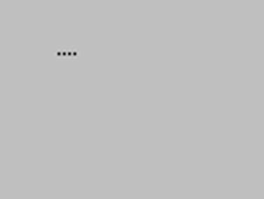

   POKE 16384,170

Si avanzamos a la siguiente celdilla de memoria, la $4001 (o 16385), tendremos el estado de los siguientes píxeles de la misma línea horizontal: 

+-----------------+---------+---------+----------+----------+----------+----------+----------+----------+
| Bit de (16385)  |    7    |    6    |     5    |     4    |     3    |     2    |     1    |     0    |
+=================+=========+=========+==========+==========+==========+==========+==========+==========+
|  Pixel          |  (8,0)  |  (9,0)  |  (10,0)  |  (11,0)  |  (12,0)  |  (13,0)  |  (14,0)  |  (15,0)  |
+-----------------+---------+---------+----------+----------+----------+----------+----------+----------+

De nuevo, avanzando 1 byte más en memoria, avanzamos otros 8 píxeles horizontalmente: 

+-----------------+----------+----------+----------+----------+----------+----------+----------+----------+
| Bit de (16386)  |     7    |     6    |     5    |     4    |     3    |     2    |     1    |     0    |
+=================+==========+==========+==========+==========+==========+==========+==========+==========+
|  Pixel          |  (16,0)  |  (17,0)  |  (18,0)  |  (19,0)  |  (20,0)  |  (21,0)  |  (22,0)  |  (23,0)  |
+-----------------+----------+----------+----------+----------+----------+----------+----------+----------+

Así, hasta que llegamos al byte número 32 desde 16384, es decir, a la celdilla 16415, donde: 

+-----------------+-----------+-----------+-----------+-----------+-----------+-----------+-----------+-----------+
| Bit de (16415)  |     7     |     6     |     5     |     4     |     3     |     2     |     1     |     0     |
+=================+===========+===========+===========+===========+===========+===========+===========+===========+
|  Pixel          |  (248,0)  |  (249,0)  |  (250,0)  |  (251,0)  |  (252,0)  |  (253,0)  |  (254,0)  |  (255,0)  |
+-----------------+-----------+-----------+-----------+-----------+-----------+-----------+-----------+-----------+

Con este byte acabamos el primer "scanline" de 256 píxeles, que va desde (0,0) hasta (255,0). Comprobémoslo con el siguiente programa en BASIC que guarda el valor 170 (10101010b) en las 32 posiciones de memoria consecutivas a 16384:

.. code-block:: basic

    10 CLS
    20 FOR I=0 TO 31 : POKE 16384+I, 170 : NEXT I
    30 PAUSE 0

En pantalla aparecerá lo siguiente: 

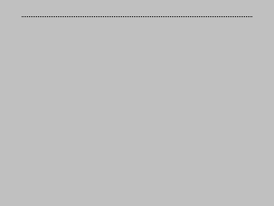

   32 bytes 170 desde 16384

Ahora la pregunta crucial es ... ¿a qué pixel corresponderá el siguiente byte en videomemoria? Si aplicamos la lógica, lo más intuitivo sería que la posición de memoria 16416 (16384+32) tuviera los datos de los píxeles desde (0,1) hasta (7,1), es decir, los 8 primeros píxeles de la segunda línea (segundo scanline) de la pantalla.

Por desgracia, esto no es así, y los 32 bytes a partir de 16416 no hacen referencia a la segunda línea de pantalla sino a la primera línea del segundo "bloque" de caracteres, es decir, a los píxeles desde (0,8) a (255,8), por lo que realmente, los bits de 16416 representan: 

+-----------------+---------+---------+---------+---------+---------+---------+---------+---------+
| Bit de (16416)  |    7    |    6    |    5    |    4    |    3    |    2    |    1    |    0    |
+=================+=========+=========+=========+=========+=========+=========+=========+=========+
|  Pixel          |  (0,8)  |  (1,8)  |  (2,8)  |  (3,8)  |  (4,8)  |  (5,8)  |  (6,8)  |  (7,8)  |
+-----------------+---------+---------+---------+---------+---------+---------+---------+---------+

Podemos comprobar esto mediante el siguiente programa en BASIC, que escribe el valor 170 en las primeras 64 posiciones de memoria de la VRAM:

.. code-block:: basic
        
    10 CLS
    20 FOR I=0 TO 63 : POKE 16384+I, 170 : NEXT I
    30 PAUSE 0

 Se podría esperar que al rellenar las primeras 2 posiciones de memoria se alteraran las 2 primeras líneas de la pantalla, pero como hemos explicado, no es así sino que se escribe en la primera línea del primer carácter, y la primera línea del segundo carácter en baja resolución.

En resumen, si avanzamos de 32 en 32 bytes, tenemos lo siguiente:

* La videomemoria empieza en 16384 y contiene "ristras" consecutivas de 32 bytes que almacenan en estado de 256 píxeles.
* Los primeros 32 bytes definen la línea 0 del bloque en baja resolución Y=0 de pantalla.
* Los siguientes 32 bytes definen la línea 0 del bloque Y=1 de pantalla.
* Los siguientes 32 bytes definen la línea 0 del bloque Y=3 de pantalla.
* Los siguientes 32 bytes definen la línea 0 del bloque Y=4 de pantalla.
* Los siguientes 32 bytes definen la línea 0 del bloque Y=5 de pantalla.
* Los siguientes 32 bytes definen la línea 0 del bloque Y=6 de pantalla.
* Los siguientes 32 bytes definen la línea 0 del bloque Y=7 de pantalla.
* Los siguientes 32 bytes definen la línea 1 del bloque Y=1 de pantalla.
* Los siguientes 32 bytes definen la línea 1 del bloque Y=2 de pantalla.
* Los siguientes 32 bytes definen la línea 1 del bloque Y=3 de pantalla.
* Los siguientes 32 bytes definen la línea 1 del bloque Y=4 de pantalla.
* Los siguientes 32 bytes definen la línea 1 del bloque Y=5 de pantalla.
* Los siguientes 32 bytes definen la línea 1 del bloque Y=6 de pantalla.
* Los siguientes 32 bytes definen la línea 1 del bloque Y=7 de pantalla.
* Los siguientes 32 bytes definen la línea 2 del bloque Y=1 de pantalla.
* Los siguientes 32 bytes definen la línea 2 del bloque Y=2 de pantalla.
* (etc...)

hasta el byte 18331 o $47ff (cuando hemos avanzado 32*8*8 = 32 bytes por 8 líneas de cada una de las 8 filas de caracteres), que contiene el estado de los 8 píxeles del bloque de baja resolución (31,7) de la pantalla. 

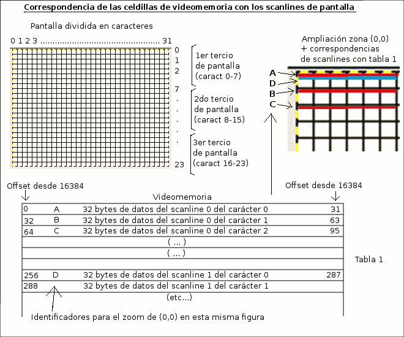

   

¿Qué quiere decir esto? Que los primeros 2KB de videoram (entre $4000 y $47ff) contienen la información de todos los píxeles de los 8 primeros bloques en baja resolución de pantalla, de forma que primero vienen todas las líneas horizontales 0 de cada bloque, luego todas las líneas horizontales 1 de cada bloque, líneas horizontales 2 de cada bloque, etc, hasta que se rellenan las últimas líneas horizontales (líneas 7) de los 8 primeros caracteres. Esto produce que el rellenado de los 2 primeros KB de la videoram rellene un área de pantalla entre (0,0) y (255,63), lo que se conoce como el primer tercio de la pantalla.

* Primer tercio: Los 2 primeros KB de la videoram (de $4000 a $47ff) cubren los datos gráficos de los primeros 64 scanlines de la pantalla (líneas 0 a 7).
* Segundo tercio: Los siguientes 2KB de la videoram (de $4800 a $4fff) cubren los datos gráficos de los siguientes 64 scanlines de la pantalla (líneas 8 a 15).
* Tercer tercio: Los siguientes 2KB de la videoram (de $5000 a $57ff) cubren los datos gráficos de los últimos 64 scanlines de la pantalla (líneas 16 a 23).

Y, resumiendo en un sólo párrafo la organización de cada tercio:

Cuando nos movemos dentro de la videomemoria que representa cada tercio de pantalla primero tenemos todas las primeras líneas de cada "carácter 8×8", después todas las segundas líneas de cada carácter, y así hasta las octavas líneas de cada carácter, de tal forma que el último byte del "tércio" coincide con el pixel (7,7) del carácter (31,7) de esa zona de la pantalla.

En la siguiente imagen podemos ver la ubicación de los 3 tercios y sus posiciones de inicio y final: 

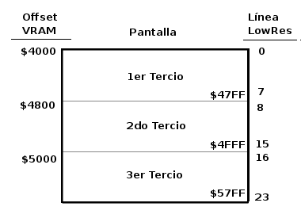

Con el programa de ejemplo del apartado Explorando el área de imagen con un ejemplo podremos comprobar experimentalmente la organización de la videomemoria y la división de la pantalla en tercios de 8 "caracteres" de 8 scanlines cada uno.

Mientras tanto, sabiendo que entre $4000 y $57ff (6144 bytes) tenemos el área de imagen de la pantalla, donde cada byte representa el estado de 8 píxeles, podemos realizar la siguiente rutina útil que sirve para rellenar toda la pantalla con un patrón de píxeles determinado (CLS con patrón):

.. code-block:: tasm

   ;-------------------------------------------------------
   ; Limpiar la pantalla con el patron de pixeles indicado.
   ; Entrada:  A = patron a utilizar
   ;-------------------------------------------------------
   ClearScreen:
      push hl
      push de
      push bc
   
      ld hl, 16384          ; HL = Inicio de la videoram
      ld (hl), a            ; Escribimos el patron A en (HL)
      ld de, 16385          ; Apuntamos DE a 16385
      ld bc, 192*32-1       ; Copiamos 192*32-1 veces (HL) en (DE)
      ldir                  ; e incrementamos HL y DL. Restamos 1
                           ; porque ya hemos escrito en 16384.
   
      pop bc
      pop de
      pop hl
      ret

De esta forma, podemos llamar a nuestra rutina ClearScreen colocando en A el patron con el que rellenar la pantalla, que puede ser 0 para "limpiarla" o 1 para activar todos los píxeles a 1.

Los PUSH y POP están puestos para preservar los valores de los registros, pero podemos quitarlos si vamos a llamar a esta función siempre de forma controlada y no queremos preservarlos (o se pueden preservar antes de llamarla). 

Explorando el área de imagen con un ejemplo
--------------------------------------------------------------------------------

Veamos un sencillo programa (vramtest.asm) que nos va a permitir verificar de forma experimental la teoría sobre la videomemoria que hemos visto en los apartados anteriores.

Este programa carga HL con el inicio del área de imágen de la videomemoria (16384 o $4000), y escribe bloques de 32 bytes (todo un scanline horizontal) con el valor 255 (11111111b o, lo que es lo mismo, los 8 píxeles de ese bloque activos).

Cada iteración del bucle interno escribe una línea de 256 píxeles en pantalla (32 bytes de valor 11111111b = 32*8 = 256 píxeles). Este bucle interno lo repetimos 192 veces para cubrir la totalidad de scanlines de la pantalla.

Hemos añadido en cada iteración del bucle externo la necesidad de pulsar y liberar una tecla para permitir al lector estudiar los efectos de cada escritura de 32 bytes en la pantalla.

Nótese como HL va a incrementarse de 32 en 32 bytes siempre, pero sin embargo, como ya sabemos por la organización de la videoram, esto no se reflejará en pantalla con un avance línea a línea de nuestro "patrón" de 256 píxeles.

A continuación tenemos el código fuente del programa y 2 capturas de pantalla que ilustran lo que acabamos de explicar.

.. code-block:: tasm

   ; Mostrando la organizacion de la videomemoria
   
      ORG 50000
   
   ; Pseudocodigo del programa:
   ;
   ; Limpiamos la pantalla
   ; Apuntamos HL a 16384
   ; Repetimos 192 veces:
   ;    Esperamos pulsacion de una tecla
   ;    Repetimos 32 veces:
   ;       Escribir 255 en la direccion apuntada por HL
   ;       Incrementar HL
   
   Start:
      ld a, 0
      call ClearScreen           ; Borramos la pantalla
   
      ld hl, 16384               ; HL apunta a la VRAM
      ld b, 192                  ; Repetimos para 192 lineas
   
   bucle_192_lineas:
      ld d, b                    ; Nos guardamos el valor de D para el
                                 ; bucle exterior (usaremos B ahora en otro)
      ld b, 32                   ; B=32 para el bucle interior
   
      call Wait_For_Key          ; Esperamos que se pulse y libere tecla
   
      ld a, 255                  ; 255 = 11111111b = todos los pixeles
   
   bucle_32_bytes:
      ld (hl), a                 ; Almacenamos A en (HL) = 8 pixeles
      inc hl                     ; siguiente byte (siguientes 8 pix.)
      djnz bucle_32_bytes        ; 32 veces = 32 bytes = 1 scanline
   
      ld b, d                    ; Recuperamos el B del bucle exterior
   
      djnz bucle_192_lineas      ; Repetir 192 veces
   
      jp Start                   ; Inicio del programa
   
   ;-----------------------------------------------------------------------
   ; Limpiar la pantalla con el patron de pixeles indicado.
   ; Entrada:  A = patron a utilizar
   ;-----------------------------------------------------------------------
   ClearScreen:
      ld hl, 16384
      ld (hl), a
      ld de, 16385
      ld bc, 192*32-1
      ldir
      ret
   
      INCLUDE "utils.asm"
   
      END 50000

La ejecución del programa tras realizar 6 pulsaciones de teclado mostraría el siguiente aspecto: 

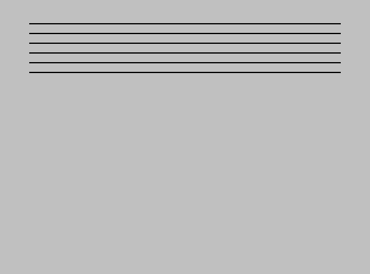

Comentemos esta captura de pantalla: como cabría esperar ahora que conocemos la organización del área de imagen de la VRAM, aunque hemos escrito en la memoria de forma lineal (desde 16384 hasta 16384+(32*6)-1), los scanlines en pantalla no son consecutivos, ya que no hemos cubierto los 6 primeros scanlines de la pantalla sino el primer scanline de los 6 primeros bloques 8×8 del primer tercio.

Si continuamos realizando pulsaciones de teclado, agotaremos las líneas del primer tercio y pasaremos al segundo, con una organización similar al del primero: 
   

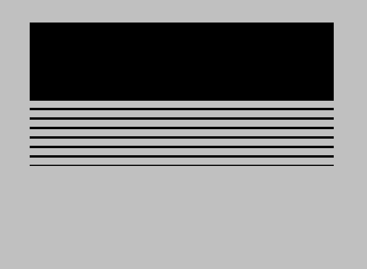

Recomendamos al lector que continue la ejecución del programa hasta recorrer toda la pantalla y que trate de anticiparse mentalmente acerca de dónde se mostrará la siguiente línea antes de realizar la pulsación de teclado.

Es probable que la pauta de rellenado de la pantalla de nuestro ejemplo le resulte más que familiar al lector: efectivamente, es el mismo orden de relleno que producen las pantallas de carga de los juegos cargadas a partir de un ``LOAD "" SCREEN$``. La carga de pantalla desde cinta con ``LOAD "" SCREEN$`` no es más que la lectura desde cinta de los 6912 bytes de una pantalla completa (6144 bytes de imagen y 768 bytes de atributos) y su almacenamiento lineal en $4000.

La lectura secuencial desde cinta y su escritura lineal en videomemoria resulta en la carga de los datos gráficos en el mismo orden de scanlines en que nuestro programa de ejemplo ha rellenado la pantalla, seguida de la carga de los atributos, que en un rápido avance (sólo 768 bytes a cargar desde cinta) dotaba a la pantalla de carga de su color.

Del mismo modo, un simple ``SAVE "imagen" SCREEN$`` o ``SAVE "imagen" CODE`` 16384, 6912 toma los 6912 bytes de la videoram y los almacena en cinta. El lector puede acudir al capítulo dedicado a Rutinas de SAVE y LOAD para refrescar la información acerca de la carga de datos desde cinta e inclusión de pantallas gráficas completas en sus programas.

Muchos programas comerciales trataban de evitar la carga de la pantalla visible scanline a scanline, para lo que cargaban los datos de ``SCREEN$`` en un área de memoria libre y después transferían rápidamente esta pantalla a videoram con instrucciones ``LDIR``.

Este concepto, el de Pantalla Virtual, resulta muy interesante: podemos utilizar un área de memoria alta para simular que es la pantalla completa o una zona (la de juego) de la misma. Esto permitía dibujar los sprites y gráficos sobre ella (sin que el jugador viera nada de estos dibujados, puesto que dicha zona de RAM no es videoram), y volcarla regularmente sobre videoram tras un ``HALT``. De esta forma se evita que el jugador pueda ver parpadeos en el dibujado de los sprites o la construcción de la pantalla "a trozos". La utilización de una pantalla virtual implicará el consumo de casi 7KB de memoria para almacenar nuestra "vscreen", por lo que lo normal sería sólo replicar el área de juego (evitando marcadores y demás) si pensamos utilizar esta técnica. 

   

Motivaciones de la organización del área de imágenes
--------------------------------------------------------------------------------

Una vez ejecutado el programa anterior en todas sus iteraciones el lector podría preguntarse: ¿qué utilidad tiene esta caprichosa organización de la videomemoria en lugar de una organización lineal y continua donde cada nuevo bloque de 32 bytes se correspondiera con el siguiente scanline de pantalla?

Esta organización de memoria tiene como objetivo el facilitar las rutinas de impresión de texto, algo que podemos ver en las posiciones de inicio de las diferentes líneas de un mismo carácter: 

+-------------------------+----------------------+
|  Scanline del carácter  | Dirección de memoria |
+=========================+======================+
| 0                       | $4000                |
+-------------------------+----------------------+
| 1                       | $4100                |
+-------------------------+----------------------+
| 2                       | $4200                |
+-------------------------+----------------------+
| 3                       | $4300                |
+-------------------------+----------------------+
| 4                       | $4400                |
+-------------------------+----------------------+
| 5                       | $4500                |
+-------------------------+----------------------+
| 6                       | $4600                |
+-------------------------+----------------------+
| 7                       | $4700                |
+-------------------------+----------------------+

Tal y como está organizada la videoram, basta con calcular la dirección de inicio del bloque en baja resolución donde queremos trazar un carácter, imprimir los 8 píxeles que forman su scanline (con la escritura de un único byte en videomemoria), y saltar a la siguiente posición de videomemoria donde escribir. Como se puede apreciar en la tabla anterior, este salto a la siguiente línea se realiza con un simple ``INC`` del byte alto de la direccion (``inc h`` en el caso de que estemos usando HL para escribir). De esta forma se simplifican las rutinas de trazado de caracteres y UDGs de la ROM.

Pensemos que los antecesores del ZX Spectrum (ZX80 y ZX81) tenían una videomemoria orientada al texto en baja resolución, y con la visión del software de la época y la potencia de los microprocesadores existentes lo normal era pensar en el Spectrum como un microordenador orientado a programar en BASIC y realizar programas "de gestión", más que pensar en él como una máquina de juegos. En este contexto, potenciar la velocidad de ejecución del trazado de texto era crucial.

Videomemoria: Área de atributos
--------------------------------------------------------------------------------

El área de atributos es el bloque de 768 bytes entre $5800 (22528) y $5aff (23295), ambas celdillas de memoria incluídas. Cada una de las posiciones de memoria de este área almacenan la información de color (color de tinta, color de papel, brillo y flash) de un bloque de 8×8 píxeles en la pantalla.

El tamaño de 768 bytes de este área viene determinado por la resolución del sistema de color del Spectrum: Hemos dicho que el sistema gráfico dispone de una resolución de 256×192, pero el sistema de color divide la pantalla en bloques de 8×8 píxeles, lo que nos da una resolución de color de 256/8 x 192/8 = 32×24 bloques. Como la información de color de cada bloque se codifica en un único byte, para almacenar la información de color de toda una pantalla se requieren 32 x 24 x 1 = 768 bytes.

Sabemos ya pues que hay una correspondencia directa entre los 32×24 bloques de 8×8 píxeles de la pantalla y cada byte individual del área de atributos, pero ¿cómo se estructura esta información?

La organización lógica del área de atributos es más sencilla y directa que la del área de imagen. Aquí, los 32 primeros bytes del área de atributos se corresponden con los 32 primeros bloques horizontales de la pantalla. Es decir, la celdilla 22528 se corresponde con el bloque (0,0), la 22529 se corresponde con (1,0), la 22530 con (2,0), y así hasta llegar a la celdilla 22559 en (31,0). La siguiente celdilla en memoria, 22560, se corresponde con el siguiente bloque en pantalla, el primero de la segunda línea, (0,1), y así de forma sucesiva.

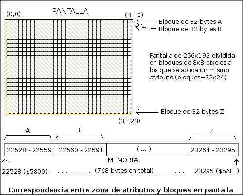

Se puede decir que el área de atributos es totalmente lineal; consta de 768 bytes que se corresponden de forma consecutiva con el estado de cada bloque y de cada fila horizontal de bloques de pantalla: Los primeros 32 bytes del área se corresponden con la primera fila horizontal de bloques, los siguientes 32 bytes con la segunda, los siguientes 32 bytes con la tercera, hasta los últimos 32 bytes, que se corresponden con los de la línea 23. El byte alojado en la última posición ($5aff) se corresponde con el atributo del bloque (31,23).

A continuación podemos ver una tabla que muestra los inicios y fin de cada línea de atributos en pantalla: 

   

+--------+------------------------+---------------------+
| Línea  | Inicio (carácter 0,N)  | Fin (carácter 31,N) |
+========+========================+=====================+
| 0      | $5800                  | $581f               |
+--------+------------------------+---------------------+
| 1      | $5820                  | $583f               |
+--------+------------------------+---------------------+
| 2      | $5860                  | $585f               |
+--------+------------------------+---------------------+
| 3      | $5840                  | $587f               |
+--------+------------------------+---------------------+
| 4      | $5880                  | $589f               |
+--------+------------------------+---------------------+
| 5      | $58a0                  | $58bf               |
+--------+------------------------+---------------------+
| 6      | $58c0                  | $58df               |
+--------+------------------------+---------------------+
| 7      | $58e0                  | $58ff               |
+--------+------------------------+---------------------+
| 8      | $5900                  | $591f               |
+--------+------------------------+---------------------+
| 9      | $5920                  | $593f               |
+--------+------------------------+---------------------+
| 10     | $5940                  | $595f               |
+--------+------------------------+---------------------+
| 11     | $5960                  | $597f               |
+--------+------------------------+---------------------+
| 12     | $5980                  | $599f               |
+--------+------------------------+---------------------+
| 13     | $59a0                  | $59bf               |
+--------+------------------------+---------------------+
| 14     | $59c0                  | $59df               |
+--------+------------------------+---------------------+
| 15     | $59e0                  | $59ff               |
+--------+------------------------+---------------------+
| 16     | $5a00                  | $5a1f               |
+--------+------------------------+---------------------+
| 17     | $5a20                  | $5a3f               |
+--------+------------------------+---------------------+
| 18     | $5a40                  | $5a5f               |
+--------+------------------------+---------------------+
| 19     | $5a60                  | $5a7f               |
+--------+------------------------+---------------------+
| 20     | $5a80                  | $5a9f               |
+--------+------------------------+---------------------+
| 21     | $5aa0                  | $5abf               |
+--------+------------------------+---------------------+
| 22     | $5ac0                  | $5adf               |
+--------+------------------------+---------------------+
| 23     | $5ae0                  | $5aff               |
+--------+------------------------+---------------------+

Esta organización del área de atributos es muy sencilla y permite un cálculo muy sencillo de la posición de memoria del atributo de un bloque concreto de pantalla. Es decir, podemos encontrar fácilmente la posición de memoria que almacena el atributo que corresponde a un bloque concreto en baja resolución de pantalla mediante::

   Direccion_Atributo(x_bloque,y_bloque) = 22528 + (y_bloque*32) + x_bloque

O, con desplazamientos::

   Direccion_Atributo(x_bloque,y_bloque) = 22528 + (y_bloque<<5) + x_bloque

Si en vez de una posición de bloque tenemos una posición de pixel, podemos convertirla primero a bloque dividiendo por 8:

   Direccion_Atributo(x_pixel,y_pixel) = 22528 + ((y_pixel/8)*32) + (x_pixel/8)

Con desplazamientos::

   Direccion_Atributo(x_pixel,y_pixel) = 22528 + ((y_pixel>>3)<<5) + (x_pixel>>3)

La información en cada byte de este área se codifica de la siguiente manera::

   Bit     7        6 	  5 - 4 - 3    2 - 1 - 0
   Valor FLASH 	BRIGHT 	PAPER         INK 

 Es decir, utilizamos:

* Los bits 0, 1 y 2 para almacenar el color de tinta, es decir, el color que la ULA utilizará para trazar los píxeles que estén activos (=1) del recuadro 8×8 al que referencia este atributo. Nótese que con 3 bits podemos almacenar un valor numérico entre 0 y 7, que son los 8 colores básicos del Spectrum.
* Los bits 3, 4 y 5 para almacenar el color de tinta, es decir, el color que la ULA utilizará para trazar los píxeles que estén activos (=1) del recuadro 8×8 al que referencia este atributo. De nuevo, se utiliza un valor de 0-7.
* El bit 6 para indicar si está activado el modo brillo de color o no.
* El bit 7 para indicar si el bloque 8×8 al que referencia este atributo debe parpadear o no. El parpadeo, para la ULA, consiste en el intercambio de las señales de color de tinta y color de papel que envía al monitor, alternándolas cada aproximadamente medio segundo.

Recordemos que estos colores básicos son: 

+--------+----------+
| Valor  | Color    |
+========+==========+
| 0      | Negro    |
+--------+----------+
| 1      | Azul     |
+--------+----------+
| 2      | Rojo     |
+--------+----------+
| 3      | Magenta  |
+--------+----------+
| 4      | Verde    |
+--------+----------+
| 5      | Cian     |
+--------+----------+
| 6      | Amarillo |
+--------+----------+
| 7      | Blanco   |
+--------+----------+

A estos colores se les puede activar el bit de brillo para obtener una tonalidad más cercana a la intensidad máxima de dicho color. Examinando de nuevo la captura que veíamos al principio del artículo: 

   Colores con y sin brillo.

   
La relación de los colores con su "identificador numérico" está basada en el estado de 4 bits: BRILLO, COMPONENTE_R, COMPONENTE_G y COMPONENTE_B: 

+---------+----------------------+--------------------+-----------------+
|  Valor  | Bits "BRILLO R G B"  | Color              | Componentes RGB |
+=========+======================+====================+=================+
| 0       | 0000b                | Negro              | (0, 0, 0 )      |
+---------+----------------------+--------------------+-----------------+
| 1       | 0001b                | Azul               | (0, 0, 192)     |
+---------+----------------------+--------------------+-----------------+
| 2       | 0010b                | Rojo               | (192, 0, 0)     |
+---------+----------------------+--------------------+-----------------+
| 3       | 0011b                | Magenta            | (192, 0, 192)   |
+---------+----------------------+--------------------+-----------------+
| 4       | 0100b                | Verde              | (0, 192, 0)     |
+---------+----------------------+--------------------+-----------------+
| 5       | 0101b                | Cian               | (0, 192, 192)   |
+---------+----------------------+--------------------+-----------------+
| 6       | 0110b                | Amarillo           | (192, 192, 0)   |
+---------+----------------------+--------------------+-----------------+
| 7       | 0111b                | Blanco             | (192, 192, 192) |
+---------+----------------------+--------------------+-----------------+
| 8       | 1000b                | Negro + Brillo     | (0, 0, 0)       |
+---------+----------------------+--------------------+-----------------+
| 9       | 1001b                | Azul + Brillo      | (0, 0, 255)     |
+---------+----------------------+--------------------+-----------------+
| 10      | 1010b                | Rojo + Brillo      | (255, 0, 0)     |
+---------+----------------------+--------------------+-----------------+
| 11      | 1011b                | Magenta + Brillo   | (255, 0, 255)   |
+---------+----------------------+--------------------+-----------------+
| 12      | 1100b                | Verde + Brillo     | (0, 255, 0)     |
+---------+----------------------+--------------------+-----------------+
| 13      | 1101b                | Cian + Brillo      | (0, 255, 255)   |
+---------+----------------------+--------------------+-----------------+
| 14      | 1110b                | Amarillo + Brillo  | (255, 255, 0)   |
+---------+----------------------+--------------------+-----------------+

 Todos los colores se componen a través del estado de las componentes R, G y B (entre 0 y 1), así como de mezclas de dichas componentes (Ej: Cian = 5 = 101b = R+B). Sería perfectamente posible separar la memoria de atributos en 3 pantallas alojando el estado de las 3 componentes de color (o incluso de combinaciones de ellas) extrayendo la información de los bits correspondientes.

Pero volvamos a cada atributo individual: Si tuvieramos que codificar mediante una operación matemática un color directamente como atributo, y sabiendo que las multiplicaciones por potencias de dos equivalen a desplazamientos, se podría realizar de la siguiente forma::

   Atributo = (Flash*128) + (Bright*64) + (Paper*8) + Ink

O lo que es lo mismo::

   Atributo = (Flash<<7) + (Bright<<6) + (Paper<<3) + Ink

A continuación veremos un ejemplo similar al del capítulo anterior para estudiar la organización de la memoria de atributos.

Explorando el área de atributos con un ejemplo
--------------------------------------------------------------------------------

A continuación tenemos el código de otro un sencillo programa (attrtest.asm) que muestra la total linealidad del área de atributos con respecto a los bloques de baja resolución de la pantalla.

Este programa carga HL con el inicio del área de atributos de la videomemoria (22528), y escribe bloques de 32 bytes (los atributos de 32 bloques de 8×8) con un valor que cambia entre 8 y 15 (o lo que es lo mismo, variando entre 0 y 7 los 3 bits de PAPEL del atributo, bits del 3 al 5).

Al igual que en el ejemplo anterior. hemos añadido de nuevo en cada iteración del bucle externo la necesidad de pulsar y liberar una tecla para permitir al lector estudiar los efectos de cada escritura de 32 bytes en la pantalla, y poder tratar de predecir el efecto de la escritura de los siguientes 32 bytes.

.. code-block:: tasm
      
   ; Mostrando la organizacion de la videomemoria (atributos)
      ORG 50000
   
   ; Pseudocodigo del programa:
   ;
   ; Borramos la pantalla
   ; Apuntamos HL a 22528
   ; Repetimos 24 veces:
   ;    Esperamos pulsacion de una tecla
   ;    Repetimos 32 veces:
   ;       Escribir un valor de PAPEL 0-7 en la direccion apuntada por HL
   ;       Incrementar HL
   
   Start:
      ld a, 0
      call ClearScreen           ; Borramos la pantalla
   
      ld hl, 22528               ; HL apunta a la VRAM
      ld b, 24                   ; Repetimos para 192 lineas
   
   bucle_lineas:
      ld d, b                    ; Nos guardamos el valor de D para el
                                 ; bucle exterior (usaremos B ahora en otro)
      ld b, 32                   ; B=32 para el bucle interior
   
      call Wait_For_Key          ; Esperamos que se pulse y libere tecla
   
      ld a, (papel)              ; Cogemos el valor del papel
      inc a                      ; Lo incrementamos
      ld (papel), a              ; Lo guardamos de nuevo
      cp 8                       ; Si es == 8 (>7), resetear
      jr nz,no_resetear_papel
   
      ld a, 255
      ld (papel), a              ; Lo hemos reseteado: lo guardamos
      xor a                      ; A=0
   
   no_resetear_papel:
   
      sla a                      ; Desplazamos A 3 veces a la izquierda
      sla a                      ; para colocar el valor 0-7 en los bits
      sla a                      ; donde se debe ubicar PAPER (bits 3-5).
   
   bucle_32_bytes:
      ld (hl), a                 ; Almacenamos A en (HL) = attrib de 8x8
      inc hl                     ; siguiente byte (siguientes 8x8 pixeles.)
      djnz bucle_32_bytes        ; 32 veces = 32 bytes = 1 scanline de bloques
   
      ld b, d                    ; Recuperamos el B del bucle exterior
   
      djnz bucle_lineas          ; Repetir 24 veces
   
      jp Start                   ; Inicio del programa
   
   papel  DEFB   255              ; Valor del papel
   
   ;-----------------------------------------------------------------------
   ; Limpiar la pantalla con el patron de pixeles indicado.
   ; Entrada:  A = patron a utilizar
   ;-----------------------------------------------------------------------
   ClearScreen:
      ld hl, 16384
      ld (hl), a
      ld de, 16385
      ld bc, 192*32-1
      ldir
      ret
   
      INCLUDE "utils.asm"
   
      END 50000

Si ensamblamos y ejecutamos el programa veremos lo siguiente tras algunos ciclos de iteración del bucle externo:

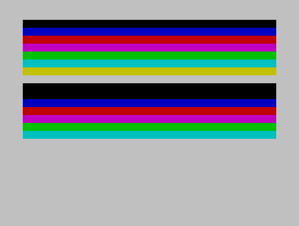

   Ejecución del programa de colores.

Nótese que no estamos trazando ningún pixel sino cambiando el color de PAPEL de cada bloque de 8×8 lo que provoca el cambio de color de los 64 píxeles del bloque que no estén activos (que son todos pues hemos borrado el contenido del área gráfica al principio del programa).

Con cada pulsación de teclado escribimos 32 bytes más en la zona de atributos, los cuales se corresponden con la siguiente fila de bloques de pantalla en baja resolución.

La memoria de atributos difiere de la de imagen en cuanto a que es totalmente lineal y que cada byte representa al bloque inmediatamente siguiente. Al llegar a la esquina derecha de la pantalla, el siguiente byte se corresponde con el primero de la siguiente línea.

Con esta información, nos podemos crear la siguiente rutina para establecer el valor de atributos de toda la pantalla:

.. code-block:: tasm

   ;-------------------------------------------------------
   ; Establecer los colores de la pantalla con el byte de
   ; atributos indicado.
   ; Entrada:  A = atributo a utilizar
   ;-------------------------------------------------------
   ClearAttributes:
      push hl
      push de
      push bc
   
      ld hl, 22528          ; HL = Inicio del area de atributos
      ld (hl), a            ; Escribimos el patron A en (HL)
      ld de, 22529          ; Apuntamos DE a 22528
      ld bc, 24*32-1        ; Copiamos 767 veces (HL) en (DE)
      ldir                  ; e incrementamos HL y DL. Restamos 1
                           ; porque ya hemos escrito en 22528.
      pop bc
      pop de
      pop hl
      ret

Dado lo habitual que puede ser llamar a ClearScreen y ClearAttributes, podemos desarrollar una función ClearScreenAttributes que realice ambas funciones en una misma llamada:

.. code-block:: tasm

   ;-----------------------------------------------------------------------
   ; Limpiar la pantalla con el patron de pixeles y atributos indicado.
   ; Entrada:  H = atributo, L = patron
   ;-----------------------------------------------------------------------
   ClearScreenAttrib:
      push de
      push bc
      push bc
   
      ld a, h               ; A = el atributo
      ex af, af             ; Nos guardamos el atributo en A'
      ld a, l               ; Cargamos en A el patron
      ld hl, 16384          ; HL = Inicio del area de imagen
      ld (hl), a            ; Escribimos el valor de A en (HL)
      ld de, 16385          ; Apuntamos DE a 16385
      ld bc, 192*32-1       ; Copiamos 6142 veces (HL) en (DE)
      ldir
   
      ex af, af             ; Recuperamos A (atributo) de A'
      inc hl                ; Incrementamos HL y DE
      inc de                ; para entrar en area de atributos
      ld (hl), a            ; Almacenamos el atributo
      ld bc, 24*32-1        ; Ahora copiamos 767 bytes
      ldir
   
      pop bc
      pop bc
      pop de
      ret

El color del borde de la pantalla
--------------------------------------------------------------------------------

El área gráfica de 256×192 píxeles está centrada en el centro de la pantalla o monitor, dejando alrededor de ella un marco denominado BORDE. Este borde tiene 64 píxeles en las franjas horizontales y 48 píxeles en las verticales.

El borde tiene un color único que la ULA utiliza para retrazar todos y cada uno de los píxeles de este marco. Podemos cambiar este color accediendo en el Z80 al puerto de la ULA que controla el borde.

El conocido comando de BASIC BORDER llama a la rutina de la ROM BORDER en $2294, la cual realiza el cambio del color del borde mediante el acceso a la ULA y además actualiza la variable del sistema BORDCR en 23624d.

Concretamente, basta con escribir un valor en el rango 0-7 en el puerto $fe (254) para que la ULA utilice ese valor desde ese instante como color del borde. Las típicas líneas "de carga" en el borde que podemos ver durante las rutinas de LOAD y SAVE son cambios del color del borde realizados rápidamente como indicadores de la carga mientras la ULA está dibujando el cuadro actual. Si se cambia el borde con la suficiente rapidez, la ULA cambiará el color con que lo está dibujando cuando todavía no ha acabado la generación del cuadro de imagen actual. El valor 0-7 representa el identificador de color a utilizar de la paleta de 8 colores de la ULA, y este valor lo almacena internamente la ULA (no el Z80), ya que requiere de acceso instantáneo a él durante la generación del vídeo.

En el capítulo dedicado a los Puertos de Entrada / Salida pudimos ya observar un ejemplo de cambio de color del borde, que ahora vamos a modificar para separar el OUT en una función SetBorder propia:

.. code-block:: tasm

   ; Cambio del color del borde al pulsar espacio
      ORG 50000
   
      ld b, 6              ; 6 iteraciones, color inicial borde
   
   start:
   
   bucle:
      ld a, $7f            ; Semifila B a ESPACIO
      in a, ($fe)          ; Leemos el puerto
      bit 0, a             ; Testeamos el bit 0 (ESPACIO)
      jr nz, bucle         ; Si esta a 1 (no pulsado), esperar
   
      ld a, b              ; A = B
      call SetBorder       ; Cambiamos el color del borde
   
   suelta_tecla:            ; Ahora esperamos a que se suelte la tecla
      ld a, $7f            ; Semifila B a ESPACIO
      in a, ($fe)          ; Leemos el puerto
      bit 0, a             ; Testeamos el bit 0
      jr z, suelta_tecla   ; Saltamos hasta que se suelte
   
      djnz bucle           ; Repetimos "B" veces
      ld b, 7
      jp start             ; Y repetir
   
   salir:
      ret
   
   ;------------------------------------------------------------
   ; SetBorder: Cambio del color del borde al del registro A
   ;------------------------------------------------------------
   SetBorder:
      out ($fe), a
      ret
   
      END 50000            ; Ejecucion en 50000

La ejecución del programa anterior cambiará el color del borde con cada pulsación de la tecla ESPACIO:

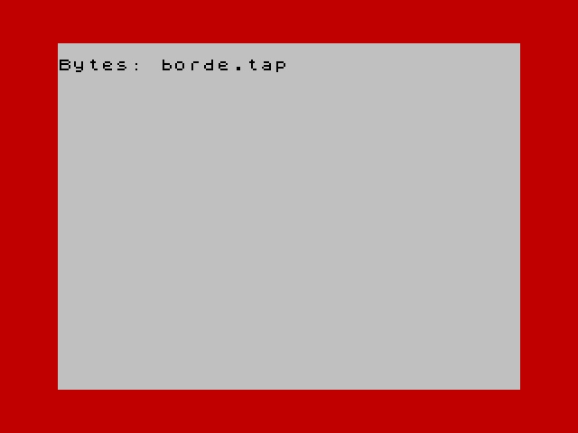

   Cambio del borde.

Si por algún motivo necesitaramos actualizar la variable del sistema BORDCR (porque vayamos a llamar a rutinas de la ROM que lo puedan manipular), bastará con modificar SetBorder para que almacene el valor del borde en la posición de memoria (23624) colocando primero el valor 0-7 en la posición de bits de papel y estableciendo la tinta a negro si el brillo está activo:

.. code-block:: tasm

   ;------------------------------------------------------------
   ; SetBorder: Cambio del color del borde al del registro A
   ; Se establece BORDCR tal cual lo requiere BASIC.
   ;------------------------------------------------------------
   SetBorder:
      out ($fe), a           ; Cambiamos el color del borde
      rlca
      rlca
      rlca                   ; A = A*8 (colocar en bits PAPER)
      bit 5, a               ; Mirar si es un color BRIGHT
      jr nz, SetBorder_fin   ; No es bright -> guardarlo
                              ; Si es bright
      xor %00000111          ; -> cambiar la tinta a 0
   
   SetBorder_fin:
      ld (23624), a        ; Salvar el valor en BORDCR
   
      ret

Mantener actualizado BORDCR puede ser útil si pretendemos llamar a la rutina de la ROM BEEPER (en $03b65), ya que el puerto que se utiliza para controlar el altavoz es el mismo que el del borde (salvo que se utiliza el bit 4 del valor que se envía con OUT $fe). La rutina BEEPER carga el valor de BORDCR para, además del manipular el bit 4 del puerto, cargar los bits 0, 1 y 2 con el borde actual para que éste no cambie. Si no estuviera almacenado el valor del borde en BORDCR y BEEPER no lo incluyera en los bits 0-2 de su OUT, lo establecería en negro (000) con cada cambio del estado del speaker.

Finalmente, recomendamos al lector que elimine del programa anterior la necesidad de pulsar y soltar una tecla. De esta forma podrá verificar qué sucede cuando se cambia el color del borde mientras la ULA lo está dibujando:

.. code-block:: tasm
      
   ; Cambio del color del borde mientras la ULA dibuja
      ORG 50000
   
      ld b, 6              ; 6 iteraciones, color inicial borde
   
   start:
   
   bucle:
      ld a, b              ; A = B
      call SetBorder       ; Cambiamos el color del borde
   
      djnz bucle           ; Repetimos "B" veces
      ld b, 7
      jp start             ; Y repetir
   
   salir:
      ret
   
      END 50000

El resultado de la ejecución es el siguiente: 

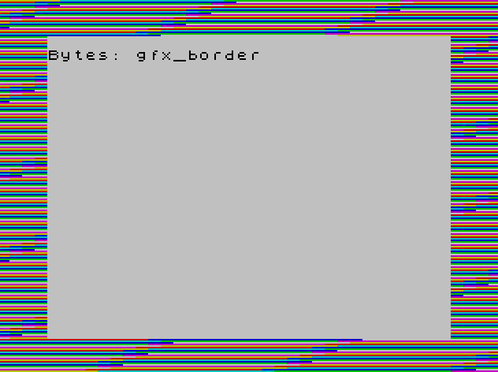

   Cambio del borde sin parada

Como curiosidad al respecto de la diferencia de velocidad entre BASIC y ensamblador, pruebe a ejecutar el siguiente programa en su intérprete BASIC:

.. code-block:: basic

   10 FOR i=0 TO 7 : BORDER I : NEXT I : GOTO 10

La ejecución del anterior programa sólo es capaz de establecer 2 (3 a lo sumo) bordes diferentes en un mismo cuadro de imagen mientras que la versión ASM puede cambiar el color del borde más de 35 veces por cuadro:

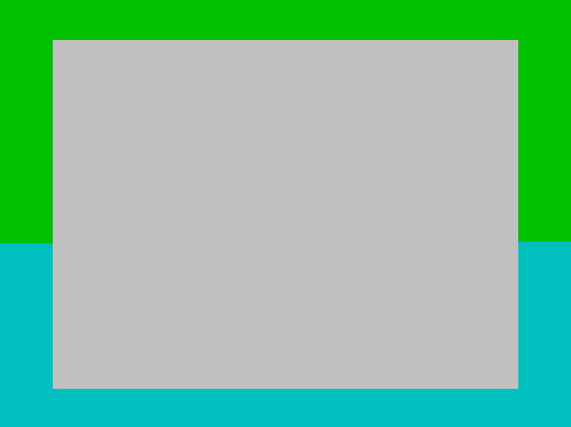

   Cambio del borde en BASIC

Ahora que conocemos el formato de una celdilla de atributo podemos hablar de la variable del sistema ATTR-T (dirección de memoria $5c8f o 23695), la cual almacena el atributo actual temporal que las rutinas de la ROM del Spectrum como nuestra conocida rst 16.

A continuación tenemos un ejemplo que imprime cadenas con diferentes atributos de color. Para ello se ha creado una rutina PrintString basada en imprimir caracteres mediante rst 16, que utiliza el valor de ATTR-T.

.. code-block:: tasm
      
   ; Prueba ATTR-P
      ORG 50000
   
   Start:
   
      ld a, 1                    ; Borde azul
      call BORDER
   
      ld a, 8+4
      ld (CLS_COLOR), a
      call CLS
   
      ld a, 56                   ; Negro sobre gris
      ld (ATTR_T), a             ; Cambiamos ATTR-T
   
      ld de, linea1
      call PrintString
   
      ld a, 12                   ; Verde sobre azul
      ld (ATTR_T), a             ; Cambiamos ATTR-T
   
      ld de, linea2
      call PrintString
   
      ld a, 64+2+9               ; Atributos: m + brillo.
      ld (ATTR_T), a             ; Cambiamos ATTR-T
   
      ld de, linea2
      call PrintString
   
      call Wait_For_Key          ; Esperamos que se pulse y libere tecla
   
      ret                        ; Fin del programa
 
      ATTR_T    EQU   $5c8f
      
      ;-------------------------------------------------------------------------
      ; Datos
      ;-------------------------------------------------------------------------
      linea1  DEFB 'Impreso con ATTR-T actual', _CR, _CR, _EOS
      linea2  DEFB 'Esto es una prueba', _CR,'cambiando los atributos', _CR, _CR, _EOS
      
      INCLUDE "utils.asm"
      
      END 50000

Con nuestra nueva rutina de PrintString trazaremos en pantalla 1 línea con los atributos actuales seguida de 2 líneas con diferentes atributos. Nótese como rst 16 entiende e interpreta en las cadenas los códigos de control como por ejemplo 13 (retorno de carro).

   El atributo ATTR

Cuando tratemos las fuentes de texto como sprites de carácteres en baja resolución utilizaremos rutinas de impresión de cadenas más rápidas (y con juegos de caracteres personalizados) al no tener que interpretar éstas los diferentes códigos de control que se pueden insertar en las mismas.

Efectos sobre la imagen y los atributos
--------------------------------------------------------------------------------

Ahora ya conocemos la organización de la zona de imagen y atributos y sabemos (del capítulo sobre rutinas de SAVE/LOAD) cargar en ella datos gráficos desde cinta o incluir los datos gráficos en nuestro propio programa y volcarlos con instrucciones LDIR. Estamos pues en disposición de realizar pequeñas y sencillas rutinas de borrado de pantalla o de aparición de los datos en la misma de diferentes formas, como por ejemplo:

* Efectos de fundido de los atributos de pantalla a negro.
* Efectos de aparición de imagen como establecer todos los atributos a negro, copiar los datos gráficos y hacer aparecer la imagen realizando una copia de los atributos desde una zona de atributos virtual con algún tipo de efecto (circular, desde los laterales, como un recuadro, etc).
* Desaparición de la imagen manipulando los bits de pantalla (de izquierda a derecha, de arriba a abajo, reduciendo estos bits a cero, etc).
* Inversión horizontal, vertical o de estado de los bits de los datos gráficos de pantalla.
* Zoom o reducción de alguna zona de pantalla.

Por ejemplo, la siguiente rutina vacía el contenido de una pantalla (preferentemente monocolor) haciendo una rotación de los píxeles de cada bloque de pantalla. Los bloques 0-15 verán sus píxeles rotados a la izquierda y los bloques 16-31 a la derecha:

.. code-block:: tasm

   ; Fundido de los pixeles a cero con una cortinilla
   
      ORG 50000
   
   Start:
      ; Rellenamos la VRAM de pixeles copiando 6 KB de la ROM
      ld hl, 0
      ld de, 16384
      ld bc, 6144
      ldir
   
      call Wait_For_Key
      call FadeScreen
   
      ret
   
   ;-----------------------------------------------------------------------
   ; Fundido de pantalla decrementando los pixeles de pantalla
   ;-----------------------------------------------------------------------
   FadeScreen:
      push af
      push bc
      push de
      push hl                      ; Preservamos los registros
   
      ld b, 9                      ; Repetiremos el bucle 9 veces
      ld c, 0                      ; Nuestro contador de columna
   
   fadegfx_loop1:
      ld hl, 16384                 ; Apuntamos HL a la zona de atributos
      ld de, 6144                  ; Iteraciones bucle
   
   fadegfx_loop2:
      ld a, (hl)                   ; Cogemos el grupo de 8 pixeles
   
   
      ;-- Actuamos sobre el valor de los pixeles --
      cp 0                         ;
      jr z, fadegfx_save           ; Si ya es cero, no hacemos nada
   
      ex af, af                    ; Nos guardamos el dato
   
      ld a, c                      ; Pasamos el contador a A
      cp 15                        ; Comparamos A con 15
      jr nc, fadegfx_mayor15       ; Si es mayor, saltamos
   
      ex af, af                    ; Recuperamos en A los pixeles
      rla                          ; Rotamos A a la izquierda
      jr fadegfx_save              ; Y guardamos el dato
   
   fadegfx_mayor15:
      ex af, af                    ; Recuperamos en A los pixeles
      srl a                        ; Rotamos A a la derecha
   
      ;-- Fin actuacion sobre el valor de los pixeles --
   
   fadegfx_save:
   
      ld (hl), a                   ; Almacenamos el atributo modificado
      inc hl                       ; Avanzamos puntero de memoria
   
      ; Incrementamos el contador y comprobamos si hay que resetearlo
      inc c
      ld a, c
      cp 32
      jr nz, fadegfx_continue
   
      ld c, 0
   
   fadegfx_continue:
   
      dec de
      ld a, d
      or e
      jp nz, fadegfx_loop2      ; Hasta que DE == 0
   
      djnz fadegfx_loop1        ; Repeticion 9 veces
   
      pop hl
      pop de
      pop bc
      pop af                       ; Restauramos registros
      ret
   
      INCLUDE "utils.asm"
   
      END 50000

El efecto sobre píxeles aleatorios en pantalla es el siguiente: 

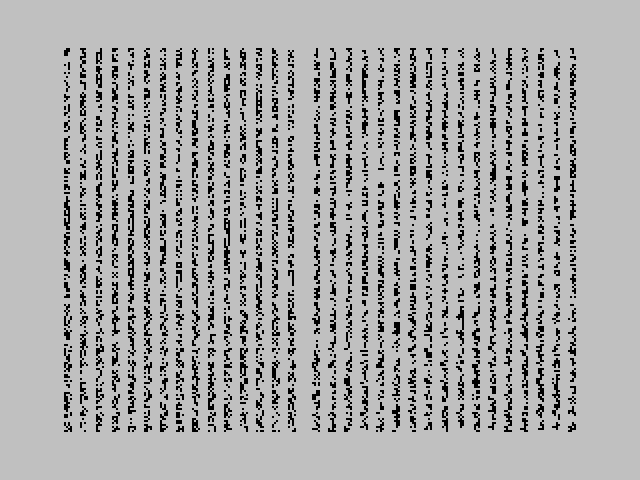

   Cambios en pixeles aleatorios

Podemos cambiar la rutina para que realice diferentes efectos sobre los píxeles modificando el núcleo de la misma, identificado con el comentario Actuamos sobre el valor de los píxeles.

A continuación podemos ver la rutina de degradación de atributos que vimos como un ejemplo en el capítulo dedicado a la pila. Este efecto aplicado sobre una pantalla gráfica puede utilizarse como "fundido a negro" de la misma. Podemos utilizar el esqueleto del programa anterior como base para llamar a esta rutina:

.. code-block:: tasm
      
   ;-----------------------------------------------------------------------
   ; Fundido de pantalla decrementando tinta y papel en los atributos.
   ;-----------------------------------------------------------------------
   FadeAttributes:
      push af
      push bc
      push de
      push hl                      ; Preservamos los registros
   
      ld b, 9                      ; Repetiremos el bucle 9 veces
   
   fadescreen_loop1:
      ld hl, 16384+6144            ; Apuntamos HL a la zona de atributos
      ld de, 768                   ; Iteraciones bucle
   
      halt
      halt                         ; Ralentizamos el efecto
   
   fadescreen_loop2:
      ld a, (hl)                   ; Cogemos el atributo
      and %01111111                ; Eliminamos el bit de flash
      ld c, a
   
      and %00000111                ; Extraemos la tinta (and 00000111b)
      jr z, fadescreen_ink_zero    ; Si la tinta ya es cero, no hacemos nada
   
      dec a                        ; Si no es cero, decrementamos su valor
   
   fadescreen_ink_zero:
   
      ex af, af                    ; Nos hacemos una copia de la tinta en A'
      ld a, c                      ; Recuperamos el atributo
      sra a
      sra a                        ; Pasamos los bits de paper a 0-2
      sra a                        ; con 3 instrucciones de desplazamiento >>
   
      and %00000111                ; Eliminamos el resto de bits
      jr z, fadescreen_paper_zero  ; Si ya es cero, no lo decrementamos
   
      dec a                        ; Lo decrementamos
   
   fadescreen_paper_zero:
      sla a
      sla a                        ; Volvemos a color paper en bits 3-5
      sla a                        ; Con 3 instrucciones de desplazamiento <<
   
      ld c, a                      ; Guardamos el papel decrementado en A
      ex af, af                    ; Recuperamos A'
      or c                         ; A = A or c  =  PAPEL OR TINTA
   
      ld (hl), a                   ; Almacenamos el atributo modificado
      inc hl                       ; Avanzamos puntero de memoria
   
      dec de
      ld a, d
      or e
      jp nz, fadescreen_loop2      ; Hasta que DE == 0
   
      djnz fadescreen_loop1        ; Repeticion 9 veces
   
      pop hl
      pop de
      pop bc
      pop af                       ; Restauramos registros
      ret

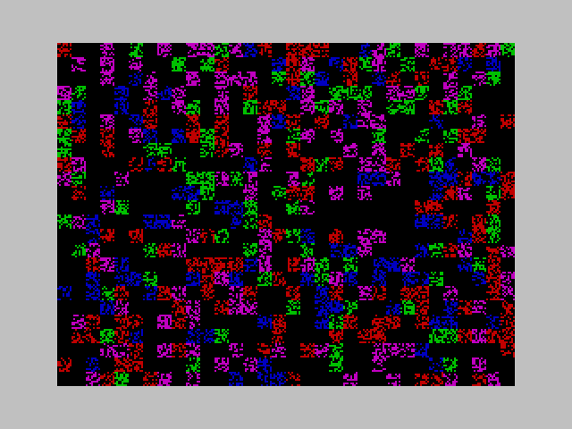

   Cambios en atributos

Rutinas más complejas pueden producir cortinillas y efectos mucho más vistosos. En la revista Microhobby se publicaron muchos de estos efectos de zoom, desaparición de pantalla o inversión, dentro de la sección Trucos.

Del mismo modo, el libro 40 Best Machine code Routines for the ZX Spectrum ("Las 40 mejores rutinas en código máquina para el ZX Spectrum") de John Hardman y Andrew Hewson nos proporciona una serie de rutinas en ensamblador para realizar diferentes acciones con los píxeles y los atributos de la videoram, como por ejemplo:

* Scrollear atributos a izquierda, derecha, arriba o abajo.
* Scroll de pantalla de un carácter (8 pixels) a izquierda, derecha, arriba o abajo.
* Scroll de pantalla de un pixel a izquierda, derecha, arriba o abajo.
* Mezclar dos imágenes con OR o XOR.
* Inversión de la pantalla (píxeles a 0 se ponen a 1, y píxeles a 1 se ponen a 0).
* Invertir carácter vertical y horizontalmente.
* Rotar carácter 90º en sentido horario.
* Alterar todos los atributos de la pantalla (los bits deseados).
* Cambiar todos los atributos de la pantalla de un determinado valor por otro valor.
* Rellenado de regiones cerradas (poniendo a 1 los píxeles dentro de esas regiones).
* Impresión de figuras.
* Copia de una zona de la pantalla en otra, ampliándola por una cantidad entera (por ejemplo, x2 o x3).

La Shadow VRAM de los modelos de 128K
--------------------------------------------------------------------------------

En el capítulo dedicado a la paginación de memoria en los modelos de 128KB se habló de la paginación de bloques de 16KB sobre el área entre $c000 y $ffff. El bloque de 16KB que almacena la videoram (el bloque 5, o, como se le conoce técnicamente, RAM5) está normalmente mapeado sobre $4000. 

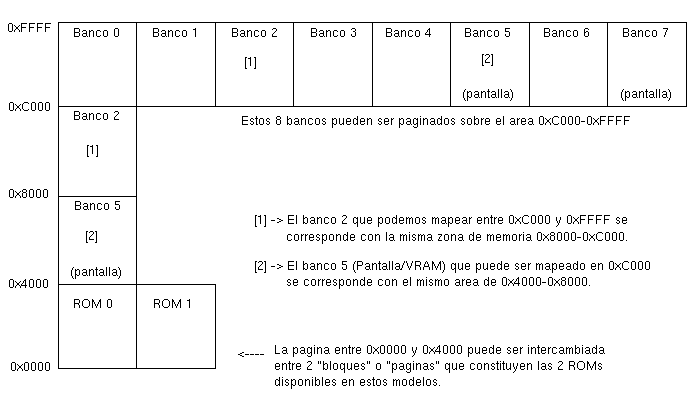

   Shadow RAM

En los modelos de 128K, existe un segundo bloque de 16KB que podemos utilizar como VideoRAM (Shadow VRAM). El Z80 y la ULA nos permiten mapear RAM7 sobre $c000-$ffff, dejando la VideoRAM original sobre $4000. Más interesante todavía, la ULA puede visualizar el contenido de RAM7 en lugar del de RAM5 aunque no hayamos mapeado RAM7 en ningún sitio. Y recordemos que también podemos mapear la VRAM estándar (RAM5) sobre $c000, accediendo a ella a través de $c000 además de mediante $4000.

El poder visualizar una VRAM aunque no esté mapeada y el poder mapear tanto RAM5 como RAM7 sobre $c000 nos permite organizar el código de nuestro programa para que siempre escriba sobre $c000, teniendo mapeada en $c000 la pantalla que actualmente no esté visible.

La utilidad principal de esta funcionalidad es la de poder generar un cuadro de imagen o animación en una "pantalla virtual" (la pantalla shadow) que no es visible, cambiando la visualización a esta pantalla una vez compuesta la imagen actual. De esta forma es posible trabajar con una pantalla completa sin que nos alcance el haz de electrones durante su dibujado, especialmente en juegos que realicen scrolles de todo el área de imagen.

En el tiempo disponible tras un pulso VSYNC no hay tiempo material para actualizar los 6KB de una pantalla completa sin que el haz de electrones alcance a nuestro programa conforme manipula la memoria, por lo que esta técnica permitiría realizar ese tipo de acciones con el siguiente proceso:

* Mapeamos RAM7 sobre $c000.
* Visualizamos RAM5 (RAM7 no es visible).
* Trabajamos sobre $c000 (sobre RAM7). Los cambios en nuestra pantalla shadow no son visibles.
* Esperamos una interrupción (mediante halt o mediante coordinación con la ISR de la ULA).
* Cambiamos la visualización a RAM7 (RAM5 deja de ser visible).
* Mapeamos ahora RAM5 sobre $c000.
* Trabajamos sobre $c000 (sobre RAM5). Los cambios en nuestra pantalla shadow no son visibles.
* Repetimos el proceso.

Con este mecanismo siempre trabajamos sobre $c000 pero los cambios que realizamos sobre esta pantalla virtual no son perceptibles por el usuario. Cambiando la visualización de la VRAM a nuestra pantalla actual tras una interrupción hacemos los cambios visibles de forma inmediata, sin que el haz de electrones afecte a nuestro scroll o al dibujado de sprites. La tasa de fotogramas por segundo ya no sería de 50 (no podríamos generar 1 cuadro de imagen por interrupción) pero se evitaría un posible molesto efecto de parpadeo o cortinilla.

La desventaja de este sistema es que utilizamos $c000-$ffff como pantalla virtual con lo que perdemos 16KB efectivos de RAM así como la posibilidad de paginar sobre $c000. Nos quedan así 16KB de memoria (entre $8000 y $bfff) para alojar el código de nuestro programa, los datos gráficos, textos, etc. Esto puede ser una enorme limitación según el tipo de juego o programa que estemos realizando.

En realidad, si diseñamos adecuadamente nuestro programa, podemos aprovechar más de 16KB, puesto que sólo necesitamos mapear RAM5 ó RAM7 en $c000 durante la generación de la pantalla virtual. Esto obliga a que los gráficos, fuentes, sprites y mapeados del juego deban estar disponibles en $8000-$bfff, pero una vez finalizada la generación de la pantalla podemos volver a mapear RAM0 sobre $c000, volviendo a la lógica del juego que podría estar ubicada en ese bloque, junto al resto de variables, imágenes o textos usados en los menúes, efectos sonoros, músicas, etc.

Como véis, se necesita tener muy controlada la ubicación de las diferentes rutinas y variables y diseñar el juego para que mapee la página adecuada en cada momento y salte a una rutina concreta sólo cuando la rutina a la que hace referencia un call esté contenida en la página mapeada.

Se reseñó también, en el apartado Particularidades del +2A/+3 la existencia de unos modos extendidos de paginación que permitirían ubicar la segunda VideoRAM (el bloque 7, o RAM7) sobre $4000, permitiendo el alternar entre la visualización de RAM5 o de RAM7 sin perder la memoria $c000-$ffff como "Pantalla Virtual": 

.. figure:: pag_especial.png
   :scale: 50%
   :align: center
   :alt: Modos de paginación especial del +2A/+3

   Modos de paginación especial del +2A/+3

   

Como puede verse en la figura anterior, los modos Bit2 = 0, Bit1 = 1 (Bancos 4-5-6-3) y Bit2 = 1, Bit 1=1 (Bancos 4-7-6-3) del puerto $1ffd permiten paginar cualquiera de las 2 videorams (RAM5 o RAM7) sobre $4000.

Pese a las posibilidades de "animación sin parpadeo" que proporcionan estas técnicas, la utilización de cualquiera de las dos tiene una desventaja clara además de la "pérdida" (durante el dibujado de la pantalla shadow) de los 16KB $c000-$ffff, y es la incompatibilidad con modelos de 48K, requiriendo un modelo de 128Kb para paginar RAM7 o incluso de un +2A/+3 para el uso de la paginación extendida. Si a los 16KB de RAM5 le restamos los 7KB de pantalla nos quedan otros 9KB adicionales, pero con la particularidad de que ese bloque de memoria está "compartido" con la ULA por lo que la velocidad de lectura, escritura y ejecución efectiva de este bloque se puede ver reducida hasta en un 25%.

En el próximo capítulo
--------------------------------------------------------------------------------

En el siguiente capítulo trataremos el cálculo de posiciones en memoria a partir de coordenadas en alta y baja resolución, lo que será la base del posicionamiento de Sprites en baja y alta resolución y fuentes de texto. 