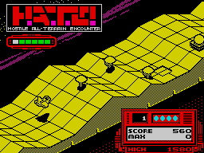

Gráficos (I): la videomemoria del Spectrum
================================================================================

Para comprender el funcionamiento de la videomemoria del Spectrum debemos empezar por comprender cómo el monitor o TV CRT genera las imágenes.

Los monitores/televisiones CRT (de Cathode Ray Tube, o Tubo de Rayos Catódicos), que incluye tanto a los televisores como a los monitores estándar que no sean de tecnología TFT/LED/PLASMA, funcionan mediante un "bombardeo" de electrones que excitan los elementos fosforescentes de pantalla.

Simplificando el proceso, podría decirse que el monitor o pantalla es una matriz de elementos fosforescentes (los píxeles) protegidos y delimitados por una máscara (que determina la "posición" de los mismos) y el CRT un cañón de electrones capaz de "iluminar" el pixel al que apunta. Este pixel se mantiene "excitado" y por tanto "encendido" un tiempo limitado, ya que se va apagando progresivamente cuando el haz de electrones deja de excitarlo. Esto implica que hay que volver a bombardear dicho punto de nuevo para que se encienda durante otro período de tiempo. Realizando esta operación suficientes veces por segundo (50 veces por segundo en sistemas PAL y 60 en sistemas NTSC), dará la sensación óptica de que el pixel no se apaga nunca. 

.. figure:: tubo_rayos.png
   :scale: 50%
   :align: center
   :alt: El CRT generando un pixel

   El CRT generando un pixel

Concretando un poco más, en el caso de los monitores de fósforo verde o de blanco y negro, cada pixel se compone de un único elemento de la matriz (habitualmente de fósforo) excitable, que puede estar encendido o apagado. En el caso de los monitores de color, cada pixel se compone de 3 sub-pixels muy cercanos de colores Rojo, Azul y Verde (Red Green Blue) los cuales podemos ver si nos acercamos lo suficiente a un monitor CRT: 

.. figure:: pixeles-crt.png
   :scale: 50%
   :align: center
   :alt: Trama de subpíxeles RGB que forman un pixel

   Trama de subpíxeles RGB que forman un pixel

El haz de electrones activa 1, 2 ó los 3 subpíxeles (las componentes) que forman un pixel con una intensidad mayor o menor según el color RGB y los valores de las componentes que forman el color real. Así, activando con máxima intensidad las 3 componentes RGB (en 8 bits, R=255, G=255 y B=255), debido a la cercanía de los subpíxeles, nuestro ojo apreciará desde la distancia de visión "normal" un único píxel de color blanco. Si el haz de electrones excitara sólo el subpixel R y no el G y el B (R=valor, G=0, B=0), veríamos un pixel de color rojo cuya tonalidad variaría en función del valor de la componente R.

La ULA tiene definidos los colores del Spectrum con unas componentes de color concretas que podemos ver aproximadamente en la siguiente tabla y en la imagen donde se representan:

+--------+---------------------+-------------------+
| Valor  |        Color        |  Componentes RGB  |
+========+=====================+===================+
|  0     |  Negro              |  (0, 0, 0 )       |
+--------+---------------------+-------------------+
|  1     |  Azul               |  (0, 0, 192)      |
+--------+---------------------+-------------------+
|  2     |  Rojo               |  (192, 0, 0)      |
+--------+---------------------+-------------------+
|  3     |  Magenta            |  (192, 0, 192)    |
+--------+---------------------+-------------------+
|  4     |  Verde              |  (0, 192, 0)      |
+--------+---------------------+-------------------+
|  5     |  Cian               |  (0, 192, 192)    |
+--------+---------------------+-------------------+
|  6     |  Amarillo           |  (192, 192, 0)    |
+--------+---------------------+-------------------+
|  7     |  Blanco             |  (192, 192, 192)  |
+--------+---------------------+-------------------+
|  8     |  Negro + Brillo     |  (0, 0, 0)        |
+--------+---------------------+-------------------+
|  9     |  Azul + Brillo      |  (0, 0, 255)      |
+--------+---------------------+-------------------+
|  10    |  Rojo + Brillo      |  (255, 0, 0)      |
+--------+---------------------+-------------------+
|  11    |  Magenta + Brillo   |  (255, 0, 255)    |
+--------+---------------------+-------------------+
|  12    |  Verde + Brillo     |  (0, 255, 0)      |
+--------+---------------------+-------------------+
|  13    |  Cian + Brillo      |  (0, 255, 255)    |
+--------+---------------------+-------------------+
|  14    |  Amarillo + Brillo  |  (255, 255, 0)    |
+--------+---------------------+-------------------+
|  15    |  Blanco + Brillo    |  (255, 255, 255)  |
+--------+---------------------+-------------------+

   La gama de colores del Spectrum

Pero volvamos al retrazado de nuestra imagen: y es que no sólo hay que trazar y refrescar un único pixel: el CRT debe de refrescar todos los píxeles de la pantalla. Para ello, el cañón de electrones del monitor (un triple cañón realmente, para atacar a las 3 componentes de color) realiza un recorrido desde la esquina superior izquierda hasta la inferior derecha refrescando todos los píxeles de la pantalla y volviendo de nuevo a la posición inicial para repetir el proceso.

Como ya vimos en el capítulo dedicado a las interrupciones, el haz de electrones de una pantalla CRT comienza su recorrido en la esquina superior izquierda del monitor y avanza horizontalmente hacia a la derecha retrazando lo que se conoce como un "scanline" (una línea horizontal). Al llegar a la derecha del monitor y tras haber trazado todos los píxeles de la primera línea, se desactiva el bombardeo de electrones y se produce un retorno a la parte izquierda de la pantalla y un descenso al scanline inferior. Al llegar aquí, mediante la sincronización con una señal HSYNC monitor-dispositivo, se "activa" de nuevo el trazado de imagen para redibujar el nuevo scanline con la información que le suministra el dispositivo que está conectado al monitor.

El haz de electrones traza pues, scanline a scanline, toda la pantalla hasta llegar a la parte inferior derecha, momento en el que el haz de electrones vuelve a la parte superior izquierda dejando de bombardear electrones durante el retorno, sincronizándose con el dispositivo al que esté conectado (la ULA y el modulador de vídeo del Spectrum en este caso) mediante una señal VSYNC. 

.. figure:: vsync_int.png
   :scale: 50%
   :align: center
   :alt: Proceso de retrazado de la imagen.

   Proceso de retrazado de la imagen.

Este proceso se repite continuamente (a razón de 50 ó 60 veces por segundo según el sistema de televisión de nuestra región) y no se puede interrumpir ni variar (ni el tiempo de avance de la señal de televisión en horizontal ni el tiempo total que se tarda en retrazar un cuadro.

Es el dispositivo conectado a la televisión o monitor (el Spectrum en este caso) quien le debe de proporcionar los datos gráficos que el monitor ha de retrazar, sincronizándose este dispositivo con el monitor mediante las señales de HSYNC y VSYNC.

Cuando se produce un VSYNC y el monitor va a comenzar a trazar los datos del primer scanline, es la ULA en el caso del Spectrum la encargada de alimentar el flujo de datos a dibujar con el timing correcto que necesita el monitor conforme avanza por la pantalla. Mediante la señal de HSYNC se vuelven a sincronizar de forma que la ULA pueda comenzar a surtir los datos del siguiente scanline, repitiendo el proceso hasta acabar el retrazado de toda la imagen.

Así pues, sabemos que la televisión necesita retrazar continuamente la imagen que aparece en pantalla, por lo que ésta debe de estar almacenada en algún lugar para que la ULA pueda leer estos datos y proporcionarselos al monitor a través del cable de vídeo. Este almacen no es un área de memoria dentro de la ULA sino dentro de la propia RAM de nuestro Spectrum. Hablamos de la videomemoria, videoram, o "fichero de imagen".

La videomemoria del Spectrum
--------------------------------------------------------------------------------

Cuando comenzamos nuestro curso de ensamblador vimos la organización del mapa de memoria del Spectrum, con la ROM mapeada entre $0000 y $3FFFF, y los 16 o 48KB de memoria a continuación de la misma. A partir de la dirección de memoria $4000 y hasta $7FFF nos encontramos un área de memoria etiquetada como "videoram" o "videomemoria".

Este área de aprox. 7 KB de memoria es donde podemos encontrar la representación digital de la imagen que estamos viendo en el monitor y que la ULA lee regularmente para poder generar la señal de vídeo que requiere el retrazar la imagen. 

.. figure:: romram.png
   :scale: 50%
   :align: center
   :alt: La videoram en el mapa de memoria del Spectrum

   La videoram en el mapa de memoria del Spectrum

Las rutinas de la ROM o de BASIC que dibujan puntos, líneas, rectángulos o caracteres de texto, lo que realmente hacen internamente es escribir datos en posiciones concretas y calculadas de la videoram ya que estos datos escritos se convertirán en píxeles en el monitor cuando la ULA los recoja en su proceso de envío de datos al monitor y éste los dibuje en la pantalla.

Algo tan sencillo como establecer a "1" el bit 7 de la posición de memoria $4000 provocará la aparición en el monitor de un pixel activo en la posición (0,0) de la pantalla. Si en lugar de cambiar un único bit en esa posición, cambiamos los bits apropiados en las posiciones apropiadas, podremos provocar el trazado de una imagen, un carácter, etc.

Veamos un sencillo ejemplo de esto. Vamos a imprimir una letra A empezando en la posición (128,96) de la pantalla. Definimos primero los píxeles que van a conformar esta letra mediante esta matriz de 8×8::

    Pixel       76543210
    --------------------
    Scanline 0  --XXXX--
    Scanline 1  -X----X-
    Scanline 2  -X----X-
    Scanline 3  -XXXXXX-
    Scanline 4  -X----X-
    Scanline 5  -X----X-
    Scanline 6  -X----X-
    Scanline 7  --------

Esta representación gráfica, convertida en bits a 1 (pixel activo) o a 0 (bit no activo) sería la siguiente::

    Valor BIT   76543210    Decimal
    --------------------------------
    Scanline 0  00111100  =   60d
    Scanline 1  01000010  =   66d
    Scanline 2  01000010  =   66d
    Scanline 3  01111110  =  126d
    Scanline 4  01000010  =   66d
    Scanline 5  01000010  =   66d
    Scanline 6  01000010  =   66d
    Scanline 7  00000000  =    0d

Habrá que escribir estos valores en posiciones concretas de la videomemoria que provoquen que los píxeles de nuestra letra A aparezcan unos sobre otros y en la posición de pantalla elegida.

Así pues, ensamblamos y ejecutamos el siguiente programa:

.. code-block:: tasm

        ; Ejemplo de escritura de un grafico con forma de A

    ORG 50000

        LD HL, 18514       ; Scanline 0 en Y=96
        LD A, 60           ; 00111100b
        LD (HL), A         ; Escribir

        LD HL, 18770       ; Scanline 1 en Y=97
        LD A, 66           ; 01000010b
        LD (HL), A         ; Escribir

        LD HL, 19026       ; Scanline 2 en Y=98
        LD A, 66           ; 01000010b
        LD (HL), A         ; Escribir

        LD HL, 19282       ; Scanline 3 en Y=99
        LD A, 126          ; 01111110b
        LD (HL), A         ; Escribir

        LD HL, 19538       ; Scanline 4 en Y=100
        LD A, 66           ; 01000001b
        LD (HL), A         ; Escribir

        LD HL, 19794       ; Scanline 5 en Y=101
        LD A, 66           ; 01000001b
        LD (HL), A         ; Escribir

        LD HL, 20050       ; Scanline 6 en Y=102
        LD A, 66           ; 01000001b
        LD (HL), A         ; Escribir

        LD HL, 20306       ; Scanline 7 en Y=103
        LD A, 0            ; 00000000b
        LD (HL), A         ; Escribir

        RET
    END 50000

Lo que produce la siguiente imagen en pantalla: 

.. figure:: letra_a.png
   :scale: 50%
   :align: center
   :alt: Trazando una letra A en pantalla.

   Trazando una letra A en pantalla.

Los valores de posiciones de memoria en que hemos escrito el estado de los píxeles han sido precalculadas manualmente para que los valores que escribíamos en ella aparecieran en la posición exacta de pantalla en que los vemos al ejecutar el programa.

Esto es una demostración de cómo alterar el contenido de la videoram es la forma real de generar gráficos en la pantalla del Spectrum. Estos gráficos generados pueden ir desde un simple pixel de coordenadas (x,y) (cambio de un bit en la dirección de memoria adecuada) hasta un sprite completo, una pantalla de carga o fuentes de texto.

La resolución gráfica del Spectrum permite la activación o desactivación de 256 píxeles horizontales contra 192 píxeles verticales, es decir, la pantalla tiene una resolución de 256×192 píxeles que pueden estar, cada uno de ellos, encendido o apagado.

Si nos olvidamos del color y pensamos en el Spectrum como en un sistema monocromo, se puede considerar que 256×192 es una resolución de pantalla bastante respetable para la potencia de un microprocesador como el Z80A, ya que a más resolución de pantalla, más operaciones de escritura y lectura de memoria necesitaremos para generar los gráficos en nuestros juegos.

Por desgracia, la "alta" resolución del Spectrum se ve ligeramente empañada por el sistema de color en baja resolución diseñado para poder reducir la cantidad de RAM necesaria para alojar la videomemoria.

A nivel de color, existe la posibilidad de definir color en baja resolución. Esto implica que podemos establecer un color de tinta y otro de papel (así como brillo y parpadeo) en bloques de 8×8 píxeles con una resolución de 32×24 bloques. Se puede decir que la definición de los colores es, pues, a nivel de "carácter".

Debido a esta mezcla de gráficos en alta definición y colorido en baja definición, la videomemoria del Spectrum se divide en 2 áreas:

* El área de imagen: Es el área de memoria que va desde $4000 (16384) hasta $57FF (22527). Este área de memoria de 6 KB almacena la información gráfica de 256×192 píxeles, donde cada byte (de 8 bits) define el estado de 8 píxeles (en cada bit del byte se tiene el estado de un pixel, con 1=activo, 0=no activo), de forma que se puede codificar cada línea de 256 pixeles con 256/8=32 bytes. Utilizando 32 bytes por línea, podemos almacenar el estado de una pantalla completa con 32*192 = 6144 bytes = 6 KB de memoria. Por ejemplo, la celdilla de memoria 16384 contiene el estado de los 8 primeros píxeles de la línea 0 de la pantalla, desde (0,0) a (7,0).
* El área de atributos: Es el área de memoria comprendida entre $5800 (22528) y $5AFF (23295). Cada uno de estos 768 bytes se denomina atributo y almacena los colores de pixel activo (tinta) y no activo (papel) de un bloque de 8×8 de la pantalla. Por ejemplo, la celdilla de memoria 22528 almacena el atributo de color del bloque (0,0) que se corresponde con los 64 píxeles desde las posiciones de pantalla (0,0) hasta (7,7).

La ULA genera para el monitor una imagen utilizando los píxeles definidos en el área de imagen junto a los colores que le corresponde a ese píxel según el valor del atributo del bloque en baja resolución al que corresponda la posición del pixel.

Así, para generar el valor del punto de pantalla (6,0), la ULA utiliza el bit 1 de la posición de memoria 16384, representando este pixel con el color de tinta (si el bit vale 1) o de papel (si vale 0) del atributo definido en (22528), ya que el pixel (6,0) forma parte del primer bloque de baja resolución de pantalla.

En la siguiente imagen podemos ver un ejemplo simplificado de cómo se produce la generación de la imagen como "superposición" de la información gráfica en alta resolución y la información de color en baja resolución: 

   Gráficos de 256x192 con color a 32x24

¿Cuál es el motivo de crear este sistema mixto de imagen de alta resolución y atributos de baja resolución? No es otro que el ahorro de memoria. Si quisieramos disponer de un sistema de 256×192 píxeles donde cada pixel pudiera disponer de su propio valor de color o de un índice en una paleta de colores, necesitaríamos la siguiente cantidad de memoria para alojar la pantalla:

* Utilizando un sistema de 3 componentes RGB que vayan desde 0 a 255, necesitaríamos 3 bytes por cada pixel, lo que implicaría la necesidad de 256x192x3 = 147456 bytes = 144KB sólo para almacenar la imagen de pantalla actual. No sólo sería una enorme cantidad de memoria, sino que nuestro Z80A a 3.50Mhz a duras penas podría generar gráficos a pantalla completa con suficiente velocidad, ya que la cantidad de operaciones de lectura y escritura serían enormes para su capacidad.
* Utilizando el sistema de paleta actual con 16 posibles colores (4 bits), codificando 2 píxeles en cada byte (4 bits de índice de color en la paleta * 2 píxeles = 8 bits), obtendríamos un sistema de 4 bits por píxel (2 píxeles por byte) que requeriría 256×192/2 bytes = 24576 = 24KB de memoria para alojar la videomemoria. Esto representa la mitad exacta de toda la memoria RAM disponible del Spectrum y 8KB más de lo que disponía el modelo de 16KB que, no nos olvidemos, fue el Spectrum original. Además, se perdería la posibilidad de hacer flash al no disponer de un bit a tal efecto.

Buscando una solución más económica (recordemos que Sir Clive Sinclair quería que los precios de sus productos fueran realmente reducidos) se optó por un sistema de vídeo mixto (que fue incluso patentado) con 256×192 = 6144 bytes (6KB) dedicados al fichero de imagen y 32×24 = 768 bytes dedicados a los atributos de bloques de color, resultando en un total de 6912 bytes. La videomemoria del Spectrum ocupaba así menos de 7 KB, permitiendo que el ZX Spectrum de 16KB de RAM todavía dispusiera de 9 KB de memoria de trabajo.

A cambio de este enorme ahorro de memoria, el color en el Spectrum implica realizar un cuidadoso diseño de los gráficos y los mapeados para evitar lo que se conoce como "colour clash" o "attribute clash" (colisión de atributos), que se produce cuando los gráficos pasan de un bloque de color en baja resolución a otro, con lo que los colores que debía tener un determinado gráfico modifican los del fondo, los de otro gráfico, etc.

Para demostrar el efecto de la colisión de atributos podemos acudir a un sencillo programa en BASIC:

.. code-block:: basic
        
    10 BORDER 1: PAPER 1: INK 7: CLS
    20 FOR R = 10 TO 70 STEP 10 : CIRCLE 128, 96, R : NEXT R
    30 PAUSE 0
    40 INK 2 : PLOT 30, 30 : DRAW 220, 120

Lo primero que hace el programa es dibujar una serie de círculos concéntricos de color blanco (INK 7) sobre papel azul (PAPER 1): 

   Círculos concéntricos

A continuación pulsamos una tecla y se ejecuta el "INK 2 + PLOT + DRAW" que traza una línea diagonal roja. Como en una misma celdilla de 8×8 no pueden haber 2 colores de tinta diferentes, cada pixel rojo que dibuja la rutina DRAW afecta a los 8×8 píxeles del recuadro al que corresponde. Cada nuevo pixel dibujado modifica los atributos de su correspondiente bloque en baja resolución, por lo que se alteran también los colores de los círculos allá donde coincidan con la línea: 

.. figure:: cclash_02.png
   :scale: 50%
   :align: center
   :alt: Añadimos una línea.

   Añadimos una línea.

Ampliando la zona central podemos ver el efecto del "attribute clash" con la alteración de los colores del círculo debido al dibujado de los píxeles rojos de la línea: 

.. figure:: cclash_03.png
   :scale: 50%
   :align: center
   :alt: Attribute clash

   Attribute clash

En los juegos con colorido podemos apreciar el "attribute clash" fácilmente si es necesario gran cantidad de colores en pantalla o el movimiento de los personajes debe de ser pixel a pixel sobre un fondo colorido. En el siguiente ejemplo podemos ver una ampliación del sprite del juego Altered Beast donde el color de tanto las botas como el cuerpo del personaje provocan el cambio de color de los píxeles del decorado que entran dentro del mismo bloque de caracteres en baja resolución:

.. figure:: altbeast.png
   :scale: 50%
   :align: center
   :alt:  "Ligero" Attribute Clash en Altered Beast

   "Ligero" Attribute Clash en Altered Beast 

Los programadores tienen diferentes técnicas para dotar a los juegos de color sorteando las limitaciones del color en baja resolución y evitando el "attribute clash". La más obvia y sencilla es de generar el juego en formato monocolor, ya sea toda la pantalla o sólo el área de juego: 

La forma más elaborada es la de realizar un diseño gráfico teniendo en mente el sistema de atributos del Spectrum, de forma que se posicionen los elementos en pantalla de tal modo que no haya colisiones entre los mismos. A continuación podemos ver un par de capturas que muestran un excelente colorido sin apenas colisiones de atributos:

