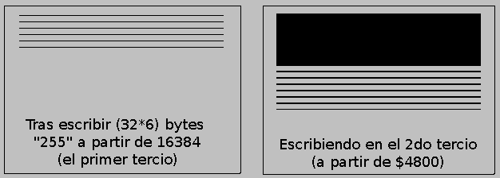
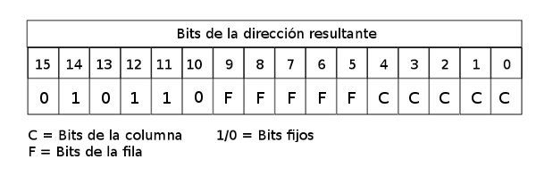
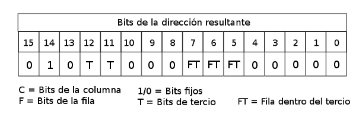
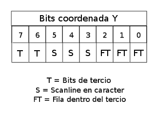
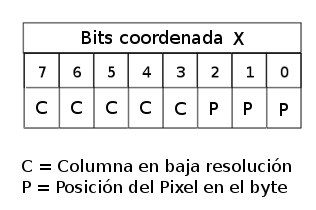
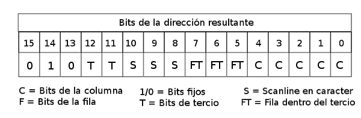

Gráficos (y II): Cálculo de direcciones y coordenadas
================================================================================

En el anterior capítulo exploramos la organización interna de los 6912 bytes de la videomemoria del Spectrum, separándo esta videomemoria en un área de 6144 bytes de archivo de imagen comenzando en la dirección 16384 y otros 768 bytes de archivo de atributos comenzando en la dirección 22528.

La manipulación de dichas áreas de memoria nos permite el trazado de gráficos en pantalla y la manipulación de los colores que tienen dichos gráficos en el monitor. Esto es así porque este área de memoria es leída por el chip de la ULA 50 veces por segundo en sistemas de televisión PAL (Europa y Australia) y 60 veces por segundo en sistemas NTSC (América y Asia) para enviar la señal que el televisor convierte en una imagen para nuestros ojos.

Es necesario que la ULA refresque la pantalla de forma continuada y regular ya que debe reflejar los cambios que los programas hagan en la videomemoria, así cómo para refrescar el estado de los píxeles del monitor (necesario por el funcionamiento de la tecnología CRT).

Sabemos por el capítulo anterior que escribir en la videomemoria nos permite trazar gráficos en pantalla. Hasta ahora hemos visto efectos globales aplicados a toda la vram (borrados, fundidos, etc), pero nuestro interés principal será, seguramente, el trazar gráficos con precisión de bloque o de pixel en la pantalla.

Para poder realizar esta tarea necesitamos relacionar las posiciones de memoria de la videoram con las coordenadas (x,y) de pantalla cuya información gráfica representan. Necesitaremos pues programar rutinas de cálculo de direcciones en función de coordenadas de alta y baja resolución. Sabemos cómo dibujar, pero no cómo calcular la dirección de memoria donde hacerlo. Este es precisamente nuestro objetivo en esta sección.

Para empezar, estableceremos una terminología unánime a la que haremos referencia a lo largo de todo el capítulo, con las siguientes definiciones:

* Resolución del área gráfica: El Spectrum dispone de una resolución de 256×192 píxeles cuyo estado se define en cada byte del área de imagen de la videomemoria.
* Estado de un pixel: Cada byte del área de imagen contiene el estado de 8 píxeles, de tal forma que cada uno de los bits de dicho byte pueden estar a 1 (pixel encendido, se traza con el color de tinta) o a 0 (apagado, se traza con el color del papel).
* Resolución del área de atributos: El Spectrum tiene una resolución de color de 32×24 puntos, que se mapean sobre la pantalla de forma que cada grupo de 8×8 píxeles del área gráfica tiene una correspondencia con un atributo del área de atributos.
* Atributo: Un atributo define en los 8 bits de un byte el color de tinta y papel y el estado de brillo y parpadeo de un bloque concreto de la pantalla.
* Bloque o carácter: Si dividimos la pantalla de 256×192 en 32×24 bloques de color, nos quedan bloques de 8×8 píxeles que mantienen el mismo atributo de pantalla. Estamos acostumbrados a trabajar con bloques ya que el intérprete BASIC del Spectrum utiliza la fuente de la ROM de 8×8 en una rejilla de bloques que coincide con la resolución de atributos. Podemos pensar en los bloques como "posiciones de carácter".
* Scanline: Un scanline es una línea normalmente horizontal de datos gráficos. Por ejemplo, el scanline 0 de pantalla es la línea gráfica que va desde (0,0) a (255,0), y que definen los 32 bytes de videomemoria que van desde 16384 hasta 16415. También se puede hablar del scanline de un sprite o de un carácter cuando nos referimos a una línea concreta de esa porción de gráfico.
* Coordenadas (x,y): Se utiliza la nomenclatura (x,y) para definir la posición de un píxel en pantalla en función de su posición horizontal y vertical siendo (0,0) la esquina superior izquierda de la misma y (255,191) la esquina inferior derecha. Son, pues, "coordenadas en alta resolución".
* Coordenadas (c,f): Se utiliza la nomenclatura (c,f), de (columna,fila), para hacer referencia a la posición de un bloque 8×8 en pantalla en función de su posición horizontal y vertical siendo (0,0) la esquina superior izquierda y (31,23) la esquina inferior derecha. Se conocen como "coordenadas en baja resolución" o "coordenadas de bloque" o "de carácter".
* Conversión (c,f) a (x,y): Como cada bloque es de 8×8 píxeles, podemos convertir una coordenada en baja resolución a coordenadas de pixel como (x,y) = (8*c,8*f). Asímismo, (c,f) = (x/8,y/8).
* Tercio de pantalla: El área gráfica del Spectrum se divide en 3 áreas de 2KB de videoram que almacenan la información de 256×64 píxeles. Estas áreas son comunmente denominadas "tercios".
* Offset o Desplazamiento: Llamaremos offset o desplazamiento a la cantidad de bytes que tenemos que avanzar desde una base (normalmente el inicio de la propia memoria o un punto de la misma) para llegar a una posición de memoria. Así, un offset de 32 bytes desde 16384 referenciará a los 8 píxeles desde (0,1) a (7,1). En las rutinas que veremos, el offset estará calculado con $0000 como la base, es decir, serán offsets absolutos (posiciones de memoria).

Con estas definiciones, podemos hacer las siguientes afirmaciones:

- La pantalla del Spectrum tiene 192 scanlines horizontales de 256 píxeles cada uno.
- La pantalla del Spectrum se divide en 32×24 bloques o posiciones de caracteres.
- Un bloque o carácter tiene 8 scanlines de 8 píxeles cada uno (8×8).
- Cada byte de la videoram almacena el estado de 8 píxeles, por lo que un bloque se almacena en 8×8/8 = 8 bytes.
- Cada posición de bloque / carácter de la pantalla tiene asociado un atributo del área de atributos.
- Cada uno de los 3 tercios de la pantalla tiene 8 líneas de 32 caracteres.

Para aprovechar la información que trataremos en este capítulo es imprescindible comprender a la perfección la organización interna de la videomemoria que se detalló en el anterior capítulo.

A modo de resumen, la estructura interna de estas 2 áreas de memoria es la siguiente: 

* Área de imagen:

    * El área de imagen se divide en 3 tercios de pantalla de 2KB de memoria cada uno, que van de $4000 a $47ff (tercio superior), de $4800 a $4fff (tercio central) y de $5000 a $57ff (tercio inferior).

    * Cada uno de los tercios comprende 8 líneas de 32 bloques horizontales (256×64 píxeles). Dentro de cada uno de esos 2KB, tenemos, de forma lineal, 64 bloques de 32 bytes (256 píxeles) de información que representan cada scanline de esos 8 bloques.

    * Los primeros 32 bytes de dicho bloque contienen la información del scanline 0 del bloque 0. Avanzando de 32 en 32 bytes tenemos los datos del scanline 0 del bloque 1, el scanline 0 del bloque 2, el scanline 0 del bloque 3, etc, hasta que llegamos al scanline 7 del bloque 0. Los siguientes 32 bytes repiten el proceso pero con el scanline 1 de cada bloque.

    * Tras los últimos 32 bytes de un tercio, vienen los primeros 32 bytes del siguiente tercio, con la misma organización, pero afectando a otra porción de la pantalla.

   Tercios en pantalla

* Area de atributos:

    * El área de atributos se encuentra en memoria inmediatamente después del área de imagen, por lo que empieza en la posición de memoria 16384+6144 = 22528 ($5800).
    * Cada byte del área de atributos se denomina atributo y define el valor de color de tinta, papel, brillo y flash de un carácter / bloque de la pantalla. Esto implica que el área de atributos ocupa 32x24x1 = 768 bytes en memoria, por lo que empieza en 22528 ($5800) y acaba en 23295 ($5aff).
    * Los diferentes bits de un atributo de carácter son: Bit 7 = FLASH, Bit 6 = BRIGHT, Bits 5-3 = PAPER, Bits 2-0 = INK.
    * Los valores de tinta y papel son un valor de 0-7 que junto al brillo como bit más significativo componen un índice (B-I-I-I) contra una paleta de colores interna definida en la ULA, donde el 0 es el color negro y el 15 el blanco de brillo máximo.
    * La organización interna del área de atributos es lineal: Los primeros 32 bytes desde $5800 se corresponden con los atributos de la primera fila de bloques de la pantalla. Los segundos 32 bytes, con la segunda fila, y así sucesivamente hasta los últimos 32 bytes que se corresponden con los atributos de la fila 23. La organización de la zona de atributos no se ve pues relacionada con los tercios de pantalla, tan sólo con la columna y fila (c,f) del bloque.

Nuestro capítulo de hoy tiene los siguientes objetivos prioritarios:

* Cálculo de posiciones de atributo: Saber calcular la posición en memoria del atributo de una posición de carácter (c,f) o de un pixel (x,y).
* Cálculo de posiciones de carácter (baja resolución): Saber calcular la posición en memoria en que comienzan los datos gráficos (pixel 0,0 del carácter) de un carácter o bloque de 8×8 píxeles referenciado como (c,f) o (x,y), asumiendo una resolución de 32×24 bloques en pantalla coincidiendo con las posiciones de carácter de texto estándar.
* Cálculo de posiciones de pixel (alta resolución): Saber calcular la posición en memoria de un pixel referenciado por (x,y).
* Cálculo de posiciones diferenciales: Dada una dirección de memoria de un atributo, carácter o pixel, ser capaz de modificar esta dirección para acceder a los elementos de la izquierda, derecha, arriba o abajo.

Utilizaremos las rutinas que veremos a continuación para el posicionamiento en pantalla de los elementos de nuestros juegos y programas. En los próximos capítulos trabajaremos ya con sprites en baja y alta resolución, fuentes de texto, mapeados por bloques, etc.

Cálculo de posiciones de atributo
--------------------------------------------------------------------------------

Durante el desarrollo de un programa gráfico o un juego necesitaremos (ya sea como funciones independientes o dentro de rutinas de sprites/gráficos más amplias) alguna de las siguientes rutinas:

* Get_Attribute_Offset_LR(c,f) : Dadas las coordenadas en baja resolución (columna,fila) de un bloque / carácter, debe devolver la dirección de memoria del atributo de dicho bloque.
* Get_Attribute_Offset_HR(x,y) : Dadas las coordenadas en alta resolución (x,y) contenida en un bloque / carácter, debe devolver la dirección de memoria del atributo de dicho bloque.
* Get_Attribute_Coordinates_LR(offset): Dada una dirección de memoria dentro del área de atributos, debe devolver las coordenadas (c,f) en baja resolución del bloque al que está asociado.
* Get_Attribute_Coordinates_HR(offset): Dada una dirección de memoria dentro del área de atributos, debe devolver las coordenadas (x,y) en alta resolución del pixel superior izquierdo del bloque al que está asociado.

Es importante comprobar antes de llamar a nuestras rutinas si estas modifican algún registro o flag que necesitemos preservar. Podemos modificar las rutinas para que realicen PUSH y POP de los registros necesarios o hacer nosotros estos PUSH/POP en la rutina llamadora.

Comencemos con las rutinas: 

``Get_Attribute_Offset``

Una primera aproximación a la obtención de la dirección en memoria de un atributo concreto (columna,fila) podría ser la utilización de una tabla de 24 valores de 16 bits que alojara las direcciones de inicio en memoria de los atributos del primer carácter de cada fila.

De esta forma bastaría con utilizar el número de fila como índice en la tabla y sumar el número de columna para obtener la dirección de memoria de la celdilla de atributos de (c,f): 

+----------+---------------------------+-------------+--------------------+
| Línea f  | Dirección en Hexadecimal  | En Decimal  | En Binario         |
+==========+===========================+=============+====================+
| 0        | $5800                     | 22528       | 0101100000000000b  |
+----------+---------------------------+-------------+--------------------+
| 1        | $5820                     | 22560       | 0101100000100000b  |
+----------+---------------------------+-------------+--------------------+
| 2        | $5840                     | 22592       | 0101100001000000b  |
+----------+---------------------------+-------------+--------------------+
| 3        | $5860                     | 22624       | 0101100001100000b  |
+----------+---------------------------+-------------+--------------------+
| 4        | $5880                     | 22656       | 0101100010000000b  |
+----------+---------------------------+-------------+--------------------+
| 5        | $58a0                     | 22688       | 0101100010100000b  |
+----------+---------------------------+-------------+--------------------+
| 6        | $58c0                     | 22720       | 0101100011000000b  |
+----------+---------------------------+-------------+--------------------+
| 7        | $58e0                     | 22752       | 0101100011100000b  |
+----------+---------------------------+-------------+--------------------+
| 8        | $5900                     | 22784       | 0101100100000000b  |
+----------+---------------------------+-------------+--------------------+
| 9        | $5920                     | 22816       | 0101100100100000b  |
+----------+---------------------------+-------------+--------------------+
| 10       | $5940                     | 22848       | 0101100101000000b  |
+----------+---------------------------+-------------+--------------------+
| 11       | $5960                     | 22880       | 0101100101100000b  |
+----------+---------------------------+-------------+--------------------+
| 12       | $5980                     | 22912       | 0101100110000000b  |
+----------+---------------------------+-------------+--------------------+
| 13       | $59a0                     | 22944       | 0101100110100000b  |
+----------+---------------------------+-------------+--------------------+
| 14       | $59c0                     | 22976       | 0101100111000000b  |
+----------+---------------------------+-------------+--------------------+
| 15       | $59e0                     | 23008       | 0101100111100000b  |
+----------+---------------------------+-------------+--------------------+
| 16       | $5a00                     | 23040       | 0101101000000000b  |
+----------+---------------------------+-------------+--------------------+
| 17       | $5a20                     | 23072       | 0101101000100000b  |
+----------+---------------------------+-------------+--------------------+
| 18       | $5a40                     | 23104       | 0101101001000000b  |
+----------+---------------------------+-------------+--------------------+
| 19       | $5a60                     | 23136       | 0101101001100000b  |
+----------+---------------------------+-------------+--------------------+
| 20       | $5a80                     | 23168       | 0101101010000000b  |
+----------+---------------------------+-------------+--------------------+
| 21       | $5aa0                     | 23200       | 0101101010100000b  |
+----------+---------------------------+-------------+--------------------+
| 22       | $5ac0                     | 23232       | 0101101011000000b  |
+----------+---------------------------+-------------+--------------------+
| 23       | $5ae0                     | 23264       | 0101101011100000b  |
+----------+---------------------------+-------------+--------------------+

Así pues, podríamos tener una tabla de 16 bytes para indexarla con el número de fila, que permitiría calcular la dirección de memoria como::

    dirección_atributo(c,f) = tabla_offsetY_LR[ f ] + c

No obstante, existe una opción mucho más aconsejable en el caso de los atributos como es el realizar el cálculo de la dirección destino en lugar de un lookup en una tabla.

Como ya vimos en el capítulo anterior, la dirección de un atributo concreto se puede calcular mediante la siguiente fórmula::

    Direccion_Atributo(x_bloque,y_bloque) = 22528 + (f*32) + c

Desde el inicio del área de atributos, avanzamos 32 bytes por fila hasta posicionarnos en el bloque de 32 bytes que referencia a nuestro bloque, y sumamos el número de columna.

Implementando este cálculo en código máquina, obtendríamos la siguiente rutina (de la cual no haremos uso, ya que diseñaremos una versión mucho más óptima):

.. code-block:: tasm

    ;-------------------------------------------------------------
    ; Obtener la direccion de memoria del atributo del caracter
    ; (c,f) especificado mediante multiplicacion por 32.
    ;
    ; Entrada:   B = FILA,  C = COLUMNA
    ; Salida:    HL = Direccion del atributo
    ;-------------------------------------------------------------
    Get_Attribute_Offset_LR_SLOW:
        ; calcular dir_atributo como "inicio_attr + (32*f) + c"
        ld h, 0
        ld l, b                  ; HL = "fila"
        add hl, hl               ; HL = HL*2
        add hl, hl               ; HL = HL*4
        add hl, hl               ; HL = HL*8
        add hl, hl               ; HL = HL*16
        add hl, hl               ; HL = HL*32
        ld d, 0
        ld e, c                  ; DE = "columna"
        add hl, de               ; HL = fila*32 + columna
        ld de, 22528             ; Direccion de inicio de atributos
        add hl, de               ; HL = 22528 + fila*32 + columna
        ret

El código que acabamos de ver es perfectamente funcional pero tiene ciertas desventajas:

* Hace uso de prácticamente todo el juego de registros, DE incluído (lo que nos implicaría realizar PUSHes y POPs en nuestra rutina externa o dentro de la misma).
* Tiene un coste de ejecución de 112 t-estados.

Veamos cómo podemos mejorar esta rutina: Si nos fijamos en la representación en binario de la anterior tabla de direcciones, veremos que todas ellas siguen un patrón común: 

+----------+---------------------------+-------------+----------------------+
| Linea f  | Dirección en Hexadecimal  | En Decimal  | En Binario           |
+==========+===========================+=============+======================+
| 0        | $5800                     | 22528       | -010110-00000-00000b |
+----------+---------------------------+-------------+----------------------+
| 1        | $5820                     | 22560       | -010110-00001-00000b |
+----------+---------------------------+-------------+----------------------+
| 2        | $5840                     | 22592       | -010110-00010-00000b |
+----------+---------------------------+-------------+----------------------+
| 3        | $5860                     | 22624       | -010110-00011-00000b |
+----------+---------------------------+-------------+----------------------+
| 4        | $5880                     | 22656       | -010110-00100-00000b |
+----------+---------------------------+-------------+----------------------+
|omitido   | omitido                   | omitido     | omitido              |
+----------+---------------------------+-------------+----------------------+
| 21       | $5aa0                     | 23200       | -010110-10101-00000b |
+----------+---------------------------+-------------+----------------------+
| 22       | $5ac0                     | 23232       | -010110-10110-00000b |
+----------+---------------------------+-------------+----------------------+

Ocurre que:

* Los 6 bits más significativos de la dirección son 010110, que es la parte de la dirección que provoca que todas las posiciones estén entre $5800 y $5aff.
* Los bits 5, 6, 7 y 8 se corresponden con la fila que queremos consultar.
* Los bits 0, 1, 2, 3 y 4 los utilizaremos para acceder a a la columna deseada. En la tabla anterior son siempre 0 porque estamos mostrando las direcciones de inicio de cada fila, es decir, de (0,f), por lo que estos bits 0-4 son 0.

La formación de la dirección destino queda pues así: 

   Cálculo de la dirección (c,f)

La rutina de cálculo de la dirección del atributo a partir de coordenadas de baja resolución se podría implementar, pues, de la siguiente forma:

.. code-block:: tasm

    ;-------------------------------------------------------------
    ; Get_Attribute_Offset_LR:
    ; Obtener la direccion de memoria del atributo del caracter
    ; (c,f) especificado. Por David Webb.
    ;
    ; Entrada:   B = FILA,  C = COLUMNA
    ; Salida:    HL = Direccion del atributo
    ;-------------------------------------------------------------
    Get_Attribute_Offset_LR:
        ld a, b                  ; Ponemos en A la fila (000FFFFFb)
        rrca
        rrca
        rrca                     ; Desplazamos A 3 veces (A=A>>3)
        and %00000011            ; A = A and %00000011 = los 2 bits mas
                                ; altos de FILA (%000FFFFF -> %000000FF)
        add a, %01011000         ; Ponemos los bits 15-10 como 010110b
        ld h, a                  ; Lo cargamos en el byte alto de HL
        ld a, b                  ; Recuperamos de nuevo en A la FILA
        and %00000111            ; Nos quedamos con los 3 bits que faltan
        rrca
        rrca                     ; Los rotamos para colocarlos en su
        rrca                     ; ubicacion final (<<5 = >>3)
        add a, c                 ; Sumamos el numero de columna
        ld l, a                  ; Lo colocamos en L
        ret                      ; HL = %010110FFFFFCCCCC

La rutina realiza operaciones de bits para ubicar los datos de FILA, COLUMNA y 010011b en las posiciones que requiere la dirección destino final. Aconsejamos al lector revisar el capítulo dedicado a Desplazamientos de memoria, bits y operaciones lógicas para recordar el efecto de los desplazamientos realizados con operaciones como RRCA, SRA, SLA, RLC, etc.

El coste de ejecución de esta rutina es de (RET aparte) 70 t-estados y no hace uso de DE, lo que es un ahorro sustancial tanto en tiempo de ejecución como en preservación de un registro muy utilizado.

La salida de esta rutina se puede utilizar directamente para almacenar en (HL) el atributo del caracter (c,f) cuya direccion hemos solicitado:

.. code-block:: tasm
        
        ld b, 10
        ld c, 12
        call Get_Attribute_Offset_LR
    
        ld a, 85                 ; Brillo + Magenta sobre Cyan
        ld (hl), a               ; Establecemos el atributo de (12,10)

La rutina no hace ningún tipo de comprobación del rango de COLUMNA y FILA, por lo que si proporcionamos valores menores de cero o mayores de 31 o 23 respectivamente se devolverá una dirección de memoria fuera del área de atributos.

La versión para coordenadas en alta resolución de la anterior rutina (Get_Attribute_Offset_HR(x,y)) se implementa fácilmente mediante la conversión de las coordenadas (x,y) en coordenadas (c,f) dividiendo x e y entre 8 para obtener las coordenadas de baja resolución que corresponden al pixel que estamos considerando.

Para eso, las primeras líneas de la rutina deberían ser:

.. code-block:: tasm

    srl b
    srl b
    srl b                    ; B = B/8 -> Ahora B es FILA
 
    srl c
    srl c
    srl c                    ; C = C/8 -> Ahora C es COLUMNA

Una vez obtenido (c,f), el desarrollo de la rutina es el mismo que en el caso de Get_Attribute_Offset_LR(c,f):

.. code-block:: tasm
        
    ;-------------------------------------------------------------
    ; Get_Attribute_Offset_HR:
    ; Obtener la direccion de memoria del atributo del caracter al
    ; que corresponde el pixel (x,y) especificado.
    ;
    ; Entrada:   B = Y,  C = X
    ; Salida:    HL = Direccion del atributo
    ;-------------------------------------------------------------
    Get_Attribute_Offset_HR:
        srl b
        srl b
        srl b                    ; B = B/8 -> Ahora B es FILA
    
        srl c
        srl c
        srl c                    ; C = C/8 -> Ahora C es COLUMNA
    
        ld a, b
        rrca
        rrca
        rrca                     ; Desplazamos A 3 veces (A=A>>3)
        and %00000011            ; A = A and 00000011 = los 2 bits mas
                                ; altos de FILA (000FFFFFb -> 000000FFb)
        add a, %01011000         ; Ponemos los bits 15-10 como 010110b
        ld h, a                  ; Lo cargamos en el byte alto de HL
        ld a, b                  ; Recuperamos de nuevo en A la FILA
        and %00000011            ; Nos quedamos con los 3 bits que faltan
        rrca
        rrca                     ; Los rotamos para colocarlos en su
        rrca                     ; ubicacion final (<<5 = >>3)
        add a, c                 ; Sumamos el numero de columna
        ld l, a                  ; Lo colocamos en L
        ret                      ; HL = 010110FFFFFCCCCCb

Hemos utilizado las instrucciones de desplazamiento SRL sobre los registros B y C para dividir sus valores por 8 y convertir la dirección (x,y) en una dirección (c,f), pudiendo aplicar así el algoritmo de cálculo de dirección que ya conocemos.

``Get_Attribute_Coordinates``

La siguiente rutina nos proporciona, dada una dirección de memoria apuntada por HL y dentro de la zona de atributos, la posición (c,f) que corresponde a dicho carácter. Se basa en la descomposición de HL en los campos que componen la dirección del atributo:

.. code-block:: tasm

    ;-------------------------------------------------------------
    ; Get_Attribute_Coordinates_LR
    ; Obtener las coordenadas de caracter que se corresponden a
    ; una direccion de memoria de atributo.
    ;
    ; Entrada:    HL = Direccion del atributo
    ; Salida:     B = FILA,  C = COLUMNA
    ;-------------------------------------------------------------
    Get_Attribute_Coordinates_LR:
                                ; Descomponemos HL = 010110FF FFFCCCCCb
        ld a, h                  ; A = 010110FFb
        and %00000011            ; A = bits 0, 1 de HL = 2 bits altos de F, CF=0
        rlca
        rlca
        rlca                     ; Rotacion a izquierda 000000FFb -> 000FF000b
        ld b, a                  ; B = 000FF000b
    
        ld a, l
        and %11100000            ; Nos quedamos con los 3 bits mas altos
        rlca
        rlca
        rlca                     ; Rotacion a izquierda FFF00000b -> 00000FFFb
        or b                     ; A = A + B = 000FFFFFb
        ld b, a                  ; B = FILA
    
        ld a, l
        and %00011111            ; Nos quedamos con los 5 bits mas bajos
        ld c, a                  ; C = COLUMNA
    
        ret

De nuevo, el código no incluye ningún tipo de control sobre la dirección que se le proporciona, que podría estar fuera de la zona de atributos y le haría devolver valores en el rango 0-255 para B y para C que, obviamente, no corresponden con la dirección entrada en HL.

La rutina para trabajar con coordenadas en alta resolución (Get_Attribute_Coordinates_HR(x,y)) es esencialmente idéntica a su versión en baja resolución, salvo que finaliza multiplicando B y C por 8 (mediante instrucciones de desplazamiento a izquierda) para convertir las coordenadas (c,f) en (x,y). Los valores (x,y) resultantes se corresponderán con el pixel superior izquierdo del bloque apuntado por (c,f).

.. code-block:: tasm

    ;-------------------------------------------------------------
    ; Get_Attribute_Coordinates_HR
    ; Obtener las coordenadas de pixel que se corresponden a
    ; una direccion de memoria de atributo.
    ;
    ; Entrada:    HL = Direccion del atributo
    ; Salida:     B = y,  C = x
    ;-------------------------------------------------------------
    Get_Attribute_Coordinates_HR:
                                ; Descomponemos HL = 010110FF FFFCCCCCb
        ld a, h                  ; A = 010110FFb
        and 3                    ; A = bits 0, 1 de HL = 2 bits altos de F, CF=0
        rlca
        rlca
        rlca                     ; Rotacion a izquierda 000000FFb -> 000FF000b
        ld b, a                  ; B = 000FF000b
    
        ld a, l
        and %11100000            ; Nos quedamos con los 3 bits mas altos
        rlca
        rlca
        rlca                     ; Rotacion a izquierda FFF00000b -> 00000FFFb
        or b                     ; A = A + B = 000FFFFFb
        ld b, a                  ; B = FILA
    
        ld a, l
        and %00011111            ; Nos quedamos con los 5 bits mas bajos
        ld c, a                  ; C = COLUMNA
    
        sla c
        sla c
        sla c                    ; C = C*8
    
        sla b
        sla b
        sla b                    ; B = B*8
    
        ret

Cálculo de posiciones diferenciales de atributo
--------------------------------------------------------------------------------

Una vez calculada la posición de memoria de un atributo, puede interesarnos (por ejemplo, en una rutina de impresión de Sprites) el conocer la dirección de memoria del bloque inferior, superior, izquierdo o derecho sin necesidad de recalcular HL a partir de las coordenadas. Por ejemplo, esto sería útil para imprimir los atributos de un sprite de Ancho X Alto caracteres sin recalcular la dirección de memoria para cada atribuo.

Asumiendo que HL contiene una dirección de atributo válida y que tenemos verificado que nuestro sprite no tiene ninguno de sus caracteres fuera del área de pantalla, podemos modificar HL para movernos a cualquiera de los atributos de alrededor. Para eso aprovecharemos la linealidad del área de atributos incrementando o decrementando HL para movernos a izquierda o derecha y sumando o restando 32 a HL para bajar o subir una línea:

.. code-block:: tasm

    Atributo_derecha:
        inc hl                   ; HL = HL + 1
    
    Atributo_izquierda:
        dec hl                   ; HL = HL - 1
    
    Atributo_abajo:
        ld de, 32
        add hl, de               ; HL = HL + 32
    
    Atributo_arriba:
        ld de, -32
        add hl, de               ; HL = HL - 32

Si tenemos la necesidad de preservar el valor del registro DE y el utilizarlo para sumar o restar 32 nos supone hacer un PUSH y POP del mismo a la pila y queremos evitar esto, podemos sumar la parte baja y después incrementar la parte alta si ha habido acarreo:

.. code-block:: tasm

    Atributo_abajo_sin_usar_DE_2:
        ld a, l                  ; A = L
        add a, 32                ; Sumamos A = A + 32 . El Carry Flag se ve afectado.
        ld l, a                  ; Guardamos en L (L = L+32)
        jr nc, attrab_noinc
        inc h
    attrab_noinc:                ; Ahora HL = (H+CF)*256 + (L+32) = HL + 32
    
    Atributo_arriba_sin_usar_DE:
        ld a, l                  ; A = L
        sub 32                   ; Restamos A = A - 32 . El Carry Flag se ve afectado.
        ld l, a                  ; Guardamos en L (L = L-32)
        jr nc, attrab_nodec
        dec h
    attrab_nodec:                ; Ahora HL = (H+CF)*256 + (L+32) = HL + 32

Nótese que, como nos apunta Jaime Tejedor en los foros de Speccy.org, el código con salto...

.. code-block:: tasm

        jr nc, attrab_noinc
        inc h
    attrab_noinc:

... es más rápido que la combinación de ADD y ADC para sumar 32 al byte bajo de HL y 0 + Acarreo al byte alto de HL:

.. code-block:: tasm

        ld a, 0                  ; Ponemos A a cero, no podemos usar un "xor a"
                                ; o un "or a" porque afectariamos al Carry Flag.
        adc a, h                 ; A = H + CarryFlag
        ld h, a                  ; H = H + CarryFlag
                                ; Ahora HL = (H+CF)*256 + (L+32) = HL + 32

Este código no utiliza DE pero se apoya en el registro A para los cálculos. Si necesitamos preservar su valor, siempre podemos realizar un ex af, af' antes y después de la ejecución de la rutina.

Cálculo de posiciones de caracteres
--------------------------------------------------------------------------------

Nuestro siguiente objetivo es el de conocer el mecanismo para trabajar con gráficos de baja resolución o gráficos de bloque / carácter. Esto nos permitirá dibujar gráficos de 8×8 píxeles (o de múltiplos de ese tamaño) comenzando en posiciones de memoria de carácter, en nuestra pantalla de 32×24 bloques de baja resolución.

Para ello necesitamos calcular la dirección de inicio en videomemoria de la dirección de inicio del bloque.

Las rutinas que tenemos que implementar son:

* Get_Char_Offset_LR(c,f) : Dadas las coordenadas en baja resolución (columna,fila) de un bloque / carácter, debe devolver la dirección de memoria de los 8 pixeles del scanline 0 de dicho bloque.
* Get_Char_Offset_HR(x,y) : Dadas las coordenadas en alta resolución (x,y) de un bloque / carácter, debe devolver la dirección de memoria de los 8 pixeles del scanline 0 de dicho bloque.
* Get_Char_Coordinates_LR(offset): Dada una dirección de memoria dentro del área de imagen, debe devolver las coordenadas (c,f) en baja resolución del bloque al que está asociada.
* Get_Char_Coordinates_HR(offset): Dada una dirección de memoria dentro del área de imagen, debe devolver las coordenadas (x,y) en alta resolución del pixel superior izquierdo del bloque al que está asociada.

Nótese que podemos realizar las 2 primeras rutinas de forma que devuelvan el offset calculado bien en el registro DE o bien en el registro HL. Según utilicemos los registros en el código que llama a la rutina, puede sernos más conveniente recibir el valor en uno u otro registro. Si resulta necesario, podemos adaptar el código de las rutinas para que funcionen con uno u otro registro, o utilizar al final de la misma (o tras el call) un EX HL, DE que devuelva el resultado en el registro que más nos interese.

Cálculo de posiciones de caracteres por composición
--------------------------------------------------------------------------------

Utilizando técnicas de composición desde los bits de las coordenadas vamos a calcular la dirección de inicio de cada "primera línea" de fila de caracteres de la pantalla, es decir, el scanline 0 de cada fila de bloques en baja resolución. Conociendo la posición inicial de dicha línea podemos sumar el número de columna y posicionarnos en el inicio del carácter (c,f) deseado, para trazar en él texto o un sprite de 8×8 (o múltiplos).

Al igual que en el caso de las direcciones de atributo, es posible componer la dirección de memoria de este "pixel 0" del "scanline 0" de la fila f mediante descomposición de los bits de las coordenadas y su recomposición en una dirección en memoria.

Para encontrar la relación coordenadas/dirección comencemos viendo una tabla con las direcciones de pantalla buscadas ya precalculadas:

+----------+------------------------+------------+--------------------+---------------+------------------------+
| Linea f  | Direccion (0,f) (HEX)  | (Decimal)  | (Binario)          | Tercio (0-2)  | Fila dentro del tercio |
+==========+========================+============+====================+===============+========================+
| 0        | $4000                  | 16384      | 0100000000000000b  | 0 (00b)       | 0                      |
+----------+------------------------+------------+--------------------+---------------+------------------------+
| 1        | $4020                  | 16416      | 0100000000100000b  | 0 (00b)       | 1                      |
+----------+------------------------+------------+--------------------+---------------+------------------------+
| 2        | $4040                  | 16448      | 0100000001000000b  | 0 (00b)       | 2                      |
+----------+------------------------+------------+--------------------+---------------+------------------------+
| 3        | $4060                  | 16480      | 0100000001100000b  | 0 (00b)       | 3                      |
+----------+------------------------+------------+--------------------+---------------+------------------------+
| 4        | $4080                  | 16512      | 0100000010000000b  | 0 (00b)       | 4                      |
+----------+------------------------+------------+--------------------+---------------+------------------------+
| 5        | $40a0                  | 16544      | 0100000010100000b  | 0 (00b)       | 5                      |
+----------+------------------------+------------+--------------------+---------------+------------------------+
| 6        | $40c0                  | 16576      | 0100000011000000b  | 0 (00b)       | 6                      |
+----------+------------------------+------------+--------------------+---------------+------------------------+
| 7        | $40e0                  | 16608      | 0100000011100000b  | 0 (00b)       | 7                      |
+----------+------------------------+------------+--------------------+---------------+------------------------+
| 8        | $4800                  | 18432      | 0100100000000000b  | 1 (01b)       | 0                      |
+----------+------------------------+------------+--------------------+---------------+------------------------+
| 9        | $4820                  | 18464      | 0100100000100000b  | 1 (01b)       | 1                      |
+----------+------------------------+------------+--------------------+---------------+------------------------+
| 10       | $4840                  | 18496      | 0100100001000000b  | 1 (01b)       | 2                      |
+----------+------------------------+------------+--------------------+---------------+------------------------+
| 11       | $4860                  | 18528      | 0100100001100000b  | 1 (01b)       | 3                      |
+----------+------------------------+------------+--------------------+---------------+------------------------+
| 12       | $4880                  | 18560      | 0100100010000000b  | 1 (01b)       | 4                      |
+----------+------------------------+------------+--------------------+---------------+------------------------+
| 13       | $48a0                  | 18592      | 0100100010100000b  | 1 (01b)       | 5                      |
+----------+------------------------+------------+--------------------+---------------+------------------------+
| 14       | $48c0                  | 18624      | 0100100011000000b  | 1 (01b)       | 6                      |
+----------+------------------------+------------+--------------------+---------------+------------------------+
| 15       | $48e0                  | 18656      | 0100100011100000b  | 1 (01b)       | 7                      |
+----------+------------------------+------------+--------------------+---------------+------------------------+
| 16       | $5000                  | 20480      | 0101000000000000b  | 2 (10b)       | 0                      |
+----------+------------------------+------------+--------------------+---------------+------------------------+
| 17       | $5020                  | 20512      | 0101000000100000b  | 2 (10b)       | 1                      |
+----------+------------------------+------------+--------------------+---------------+------------------------+
| 18       | $5040                  | 20544      | 0101000001000000b  | 2 (10b)       | 2                      |
+----------+------------------------+------------+--------------------+---------------+------------------------+
| 19       | $5060                  | 20576      | 0101000001100000b  | 2 (10b)       | 3                      |
+----------+------------------------+------------+--------------------+---------------+------------------------+
| 20       | $5080                  | 20608      | 0101000010000000b  | 2 (10b)       | 4                      |
+----------+------------------------+------------+--------------------+---------------+------------------------+
| 21       | $50a0                  | 20640      | 0101000010100000b  | 2 (10b)       | 5                      |
+----------+------------------------+------------+--------------------+---------------+------------------------+
| 22       | $50c0                  | 20672      | 0101000011000000b  | 2 (10b)       | 6                      |
+----------+------------------------+------------+--------------------+---------------+------------------------+

Examinemos (y marquemos) los bits de la representación binaria de la dirección para una selección de elementos de la tabla: 

+----------+------------------------+------------+------------------------+---------------+------------------------+
| Linea f  | Direccion (0,f) (HEX)  | (Decimal)  | (Binario)              | Tercio (0-2)  | Fila dentro del tercio |
+==========+========================+============+========================+===============+========================+
| 0        | $4000                  | 16384      | -010-00000-000-00000b  | 0 (00b)       | 0                      |
+----------+------------------------+------------+------------------------+---------------+------------------------+
| 1        | $4020                  | 16416      | -010-00000-001-00000b  | 0 (00b)       | 1                      |
+----------+------------------------+------------+------------------------+---------------+------------------------+
| 2        | $4040                  | 16448      | -010-00000-010-00000b  | 0 (00b)       | 2                      |
+----------+------------------------+------------+------------------------+---------------+------------------------+
| 3        | $4060                  | 16480      | -010-00000-011-00000b  | 0 (00b)       | 3                      |
+----------+------------------------+------------+------------------------+---------------+------------------------+
| sigue... | sigue...               | sigue...   |  sigue...              | sigue...      | sigue....              |
+----------+------------------------+------------+------------------------+---------------+------------------------+
| 8        | $4800                  | 18432      | -010-01000-000-00000b  | 1 (01b)       | 0                      |
+----------+------------------------+------------+------------------------+---------------+------------------------+
| 9        | $4820                  | 18464      | -010-01000-001-00000b  | 1 (01b)       | 1                      |
+----------+------------------------+------------+------------------------+---------------+------------------------+
| 10       | $4840                  | 18496      | -010-01000-010-00000b  | 1 (01b)       | 2                      |
+----------+------------------------+------------+------------------------+---------------+------------------------+
| sigue... | sigue...               | sigue...   |  sigue...              | sigue...      | sigue....              |
+----------+------------------------+------------+------------------------+---------------+------------------------+

Lo primero que puede llamarnos la atención es lo siguiente:

* Hay una relación directa entre el byte alto de la dirección y el tercio en que está posicionada la línea. 
* Esta relación está marcada por los bits 3 y 4 del byte superior:
  
  * Tercio superior (0, 00b) → Byte alto = $40 → Bits 3 y 4 = 00.
  * Tercio central (1, 01b) → Byte alto = $48 → Bits 3 y 4 = 01.
  * Tercio inferior (2, 10b) → Byte alto = $50 → Bits 3 y 4 = 10.
  * Conclusión: el número de tercio se corresponde con los 2 bits superiores de la coordenada Y, de tal forma que las fila (0,7) están en el tercio 00b, las filas 8-15 en el tercio 01b, y las 16-23 en el 10b.
  
* Hay una relación directa entre el número de fila dentro de cada tercio (0-7) y los 3 bits superiores (5-7) del byte bajo de la dirección.
* Los 3 bytes más significativos de la dirección son siempre 010b. Esta es la parte de la composición de la dirección que ubica el offset en memoria en el rango de direcciones del área de imagen de la videoram ($4000 a $57ff).
* Los 5 bytes menos significativos de la dirección son siempre cero en la tabla. En realidad, representan a la columna (posición c de carácter dentro de los 32 bytes de datos horizontales) pero al estar calculando direcciones de inicio de línea (c = 0 = 00000b), en nuestro caso son siempre cero.

Así pues, podemos componer la dirección en memoria del pixel (0,0) de un carácter (0,f) de la pantalla como: 

   Cálculo de la dirección del scanline 0 de (0,F)

A partir del anterior diagrama, se desarrollan las siguientes subrutinas:

``Get_Line_Offset``

Esta rutina devuelve en HL la dirección de memoria de una fila en baja resolución. Esa dirección apunta a los 8 píxeles (0-7) del scanline 0 de la fila solicitada.

.. code-block:: tasm

    ;-------------------------------------------------------------
    ; Get_Line_Offset_LR(f)
    ; Obtener la direccion de memoria de inicio de la fila f.
    ;
    ; Entrada:   B = FILA
    ; Salida:   HL = Direccion de memoria del caracter (0,f)
    ;-------------------------------------------------------------
    Get_Line_Offset_LR:
        ld a, b                  ; A = B, para extraer los bits de tercio
        and %00011000            ; A = A and 00011000b
                                ; A = estado de bits de TERCIO desde FILA
        add a, %01000000         ; Sumamos $40 (bits superiores = 010)
        ld h, a                  ; Ya tenemos la parte alta calculada
                                ; H = 010TT000
        ld a, b                  ; Ahora calculamos la parte baja
        and %00000111            ; Nos quedamos con los bits más bajos de FILA
                                ; que coinciden con FT (Fila dentro del tercio)
        rrca                     ; Ahora A = 00000NNNb  (donde N=FT)
        rrca                     ; Desplazamos A 3 veces
        rrca                     ; A = NNN00000b
        ld l, a                  ; Lo cargamos en la parte baja de la direccion
        ret                      ; HL = 010TT000NNN00000b

``Get_Char_Offset``

Como ya sabemos, la posición horizontal de un pixel dentro de una fila sí que es lineal, a razón de 8 píxeles por columna, por lo que::

    OFFSET(c,f) = Direccion_Inicio(f) + c

y también::

    OFFSET(x,y) = Direccion_Inicio(y/8) + (x/8)

Así, una vez calculado el inicio de línea, basta sumar la columna para obtener la dirección de memoria del scanline 0 del carácter en baja resolución (c,f): 

   Cálculo de la dirección del scanline (c,f)

El código con la columna añadida quedaría así:

.. code-block:: tasm

    ;-------------------------------------------------------------
    ; Get_Char_Offset_LR(c,f)
    ; Obtener la direccion de memoria del caracter (c,f) indicado.
    ;
    ; Entrada:   B = FILA,  C = COLUMNA
    ; Salida:   HL = Direccion de memoria del caracter (c,f)
    ;-------------------------------------------------------------
    Get_Char_Offset_LR:
        ld a, b                  ; A = B, para extraer los bits de tercio
        and %00011000            ; A = A and 00011000b
                                ; A = estado de bits de TERCIO desde FILA
        add a, %01000000         ; Sumamos $40 (bits superiores = 010)
        ld h, a                  ; Ya tenemos la parte alta calculada
                                ; H = 010TT000
        ld a, b                  ; Ahora calculamos la parte baja
        and %00000111            ; Nos quedamos con los bits más bajos de FILA
                                ; que coinciden con FT (Fila dentro del tercio)
        rrca                     ; Ahora A = 00000NNNb     (N=FT)
        rrca                     ; Desplazamos A 3 veces a la derecha
        rrca                     ; A = NNN00000b
        add a, c                 ; Sumamos COLUMNA -> A = NNNCCCCCb
        ld l, a                  ; Lo cargamos en la parte baja de la direccion
        ret                      ; HL = 010TT000NNNCCCCCb

Una rutina que deba trabajar con direcciones en alta resolución pero que devuelva el offset del inicio del bloque que contiene el punto (x,y) deberá dividir B y C entre 8 en el punto de entrada de la rutina:

.. code-block:: tasm

    
    ;-------------------------------------------------------------
    ; Get_Char_Offset_HR(x,y)
    ; Obtener la direccion de memoria del caracter que contiene
    ; el pixel (x,y) indicado.
    ;
    ; Entrada:  B = Y,  C = X
    ; Salida:   HL = Direccion de memoria del caracter con (x,y)
    ;-------------------------------------------------------------

    Get_Char_Offset_HR:

        srl b
        srl b
        srl b                    ; B = B/8 -> Ahora B es FILA
        srl c
        srl c
        srl c                    ; C = C/8 -> Ahora C es COLUMNA
    
        ...                      ; Resto de la rutina Get_Char_Offset_LR
        ret  

``Get_Char_Coordinates``

Nuestra siguiente subrutina tiene como objetivo el calcular la posición (c,f) en baja resolución de un carácter dado un offset en memoria que almacene alguno de los 64 pixeles del mismo. Llamar a esta función con la dirección de cualquiera de las 8 líneas de un carácter devolvería el mismo par de coordenadas (c,f): 

.. code-block:: tasm

    ;-------------------------------------------------------------
    ; Get_Char_Coordinates_LR(offset)
    ; Obtener las coordenadas (c,f) que corresponden a una
    ; direccion de memoria de imagen en baja resolucion.
    ;
    ; Entrada:   HL = Direccion de memoria del caracter (c,f)
    ; Salida:    B = FILA, C = COLUMNA
    ;-------------------------------------------------------------
    Get_Char_Coordinates_LR:
    
        ; HL = 010TT000 NNNCCCCCb ->
        ;      Fila = 000TTNNNb y Columna = 000CCCCCb
    
                                ; Calculo de la fila:
        ld a, h                  ; A = H, para extraer los bits de tercio
        and %00011000            ; A = 000TT000b
        ld b, a                  ; B = A = 000TT000b
    
        ld a, l                  ; A = L, para extraer los bits de N (FT)
        and %0b11100000          ; A = A and 11100000b = NNN00000b
        rlc a                    ; Rotamos A 3 veces a la izquierda
        rlc a
        rlc a                    ; A = 00000NNNb
        or b                     ; A = A or b = 000TTNNNb
        ld b, a                  ; B = A = 000TTNNNb
    
                                ; Calculo de la columna:
        ld a, l                  ; A = L, para extraer los bits de columna
        and %00011111            ; Nos quedamos con los ultimos 5 bits de L
        ld c, a                  ; C = Columna
        ret             ; HL = 010TT000NNNCCCCCb

Adaptar esta rutina a alta resolución (Get_Char_Coordinates_HR(x,y)) implicaría el multiplicar las coordenadas X e Y por 8, añadiendo el siguiente código inmediatamente antes del ret:

.. code-block:: tasm

        sla c
        sla c
        sla c                    ; C = C*8
    
        sla b
        sla b
        sla b                    ; B = B*8

Si no queremos tener una rutina específica para esta operación, podemos llamar a la rutina en baja resolución y realizar los desplazamientos (\*8) a la salida de la misma. 

Cálculo de posiciones diferenciales de carácter
--------------------------------------------------------------------------------

Recorrer los 8 scanlines de un bloque
~~~~~~~~~~~~~~~~~~~~~~~~~~~~~~~~~~~~~~~~~~~~~~~~~~~~~~~~~~~~~~~~~~~~~~~~~~~~~~~~

Dada en HL la dirección del primer scanline de un bloque, podemos avanzar a lo largo de los 7 scanlines del mismo bloque sumando "256" a dicha dirección. Como sumar 256 equivale a incrementar la parte alta de la dirección, podemos subir y bajar al scanline anterior y siguiente de los 8 que componen el carácter mediante simples dec h e inc h:

.. code-block:: tasm

    Scanline_Arriba_HL:
    dec h                      ; H = H - 1  (HL = HL-255)
    
    Scanline_Abajo_HL:
    inc h                      ; H = H + 1  (HL = HL-255)

Este salto de 256 bytes será válido sólo dentro de los 8 scanlines de un mismo carácter.

Offset del carácter de la izquierda/derecha/arriba/abajo
~~~~~~~~~~~~~~~~~~~~~~~~~~~~~~~~~~~~~~~~~~~~~~~~~~~~~~~~~~~~~~~~~~~~~~~~~~~~~~~~

Dentro de las rutinas de impresión de sprites de más de un carácter es probable que necesitemos movernos a los carácteres de alrededor de uno dado (normalmente hacia la derecha y hacia abajo).

Las siguientes rutinas no realizan control de la posición, por lo que moverse en una dirección cuando estamos en el límite del eje vertical u horizontal tendrá resultados diferentes de los esperados.

Moverse un carácter a derecha o izquierda es sencillo dada la disposición lineal de las filas de caracteres. Estando en el scanline 0 de un carácter, bastará con incrementar o decrementar la posición de memoria actual:

.. code-block:: tasm

    Caracter_Derecha_HL:
        inc hl                   ; HL = HL + 1
    
    Caracter_Izquierda_HL:
        dec hl                   ; HL = HL - 1

Moverse un carácter arriba o abajo es más laborioso ya que tenemos que tener en cuenta los cambios de tercios. Para ello, basta con que recordemos la disposición de los bits de la dirección::

    Bits = 	Dirección VRAM 	Bits de Tercio 	Bits de scanline 	Bits de Carácter-Y 	Bits de Columna
    HL = 	010 	        TT              SSS                 NNN 	            CCCCC

Así, para saltar al siguiente carácter tenemos que incrementar los 3 bits más altos de L (sumando 32). Esto provocará el avance de bloque en bloque, pero debemos tener en cuenta el momento en que realizamos un salto del bloque 7 al 8, y del 15 al 16, ya que entonces tenemos que cambiar de tercio y poner NNN a 0.

Podemos detectar fácilmente el paso de la fila 7 a la 8 y de la 15 a la 16 ya que en ambos casos la "Fila dentro del Tercio" (NNN, bits 7, 6 y 5 de la dirección) pasaría de 111b a 1000b, lo que provocaría que estos 3 bits se quedaran a 0 y se activara el bit de CARRY.

Es decir, cuando tenemos TT = 00b y NNN = 111b y queremos avanzar al siguiente scanline, sumamos 32 (00100000b) con lo que provocamos NNN = 000b y Carry=1. Teniendo la variable "Fila dentro del Tercio" a 1, basta con que incrementemos TT sumando 00001000b (8) a la parte alta, lo que sumaría 01b a los 2 bits de tercio TT:

El código sería el siguiente:

.. code-block:: tasm

    Caracter_Abajo_HL:
        ld a, l                       ; Cargamos A en L y le sumamos 32 para
        add a, %00100000              ; incrementar "Bloque dentro del tercio" (+32)
        ld l, a                       ; L = A
        jr nc, no_ajustar_H_abajob    ; Si esta suma produce acarreo, ajustar
        ld a, h                       ; la parte alta sumando 8 a H (TT = TT + 1).
        add a, %00001000              ; Ahora NNN=000b y TT se ha incrementado.
        ld h, a                       ; H = A
    no_ajustar_H_abajob
                                    ; Ahora HL apunta al bloque de debajo.

El procedimiento para subir un carácter es similar:

.. code-block:: tasm

    Caracter_Arriba_HL:
        ld a, l                       ; Cargamos L en A
        and %11100000                 ; A = A and 11100000b
        jr nz, nofix_h_arribab        ; Si no es cero, no retrocedemos tercio
        ld a, h                       ; Si es cero, ajustamos tercio (-1)
        sub %00001000                 ; Decrementamos TT
        ld h, a
    nofix_h_arribab:
        ld a, l                       ; Decrementar NNN
        sub 32
        ld l, a                       ; NNN = NNN-1
        ret

Con estas 2 subrutinas podemos subir y bajar carácter a carácter sin tener que recalcular la dirección destino y haciendo uso sólo de A, H y L. Hay que tener en cuenta, no obstante, que se no comprueban los límites de la pantalla, por lo que no nos avisarán si pretendemos "subir" más arriba de la línea 0 o "bajar" más abajo de la 23. 

Cálculo de posiciones de píxeles
--------------------------------------------------------------------------------

Finalmente, en cuanto a coordenación, vamos a estudiar el cálculo de la dirección de memoria de un pixel (x,y) en alta resolución. La dirección en memoria obtenida tendrá la información gráfica de 8 píxeles (pues cada byte almacena el estado de 8 píxeles horizontales consecutivos). Debido a esto nuestra rutina no sólo deberá devolver el offset en memoria sino un valor de posición relativa 0-7 que nos permita alterar el pixel concreto solicitado.

Nuestra rutina de cálculo de offset puede ser implementada mediante 2 aproximaciones:

* Mediante cálculo de la posición de memoria a partir de las coordenadas (x,y), utilizando operaciones de descomposición y rotación de bits, como ya hemos visto en los apartados anteriores.
* Mediante una tabla precalculada de posiciones de memoria que almacene la dirección de inicio de cada línea de pantalla, a la cual sumaremos el número de columna (x/8), obteniendo así el offset de nuestro pixel.

Vamos a ver las 2 técnicas por separado con rutinas aplicadas a cada uno de los métodos. Cada sistema, como veremos, tiene sus ventajas e inconvenientes, resultando siempre ambos un balance entre el tiempo de ejecución de una rutina y la ocupación en bytes en memoria entre código y datos de la misma.

Las rutinas que tenemos que implementar son:

* Get_Pixel_Offset(x,y) : Dadas las coordenadas en alta resolución (x,y) de un pixel, debe devolver la dirección de memoria que aloja el pixel y un indicador de la posición del pixel dentro de dicho byte (recordemos que cada dirección de memoria contiene los datos de 8 píxeles lineales consecutivos), utilizando descomposición y composición de bits.
* Get_Pixel_Coordinates(offset): Dada una dirección de memoria dentro del área de imagen, debe devolver las coordenadas (x,y) del pixel al que está asociada.
* Get_Pixel_Offset_LUT(x,y) : Dadas las coordenadas en alta resolución (x,y) de un pixel, debe devolver la dirección de memoria que aloja dicho pixel mediante la utilización de tablas de precálculo (Look Up Table, o LUT).

Cálculo de posiciones de pixeles mediante composición
--------------------------------------------------------------------------------

Hasta ahora hemos visto rutinas que nos proporcionan la posición en memoria de un bloque en baja resolución, pero en el caso que veremos ahora tenemos una coordenada Y que se mueve de 0 a 191, por lo que la posición en memoria puede corresponder a cualquiera de los 8 scanlines de un bloque dado. Además, la coordenada X tampoco es un carácter por lo que el pixel resultante es el estado de un bit concreto de la dirección obtenida.

Así pues, ¿cómo podemos calcular la dirección destino del pixel cuando tratamos con coordenadas en alta resolución? Recuperemos para ello parte de nuestra tabla de direcciones de memoria en baja resolución:

+---------------+--------------+------------------------+------------+--------------------+---------------+-------------------+
| Línea LowRes  | Línea HiRes  | Direccion (0,f) (HEX)  | (Decimal)  | (Binario)          | Tercio (0-2)  | Fila en el tercio |
+===============+==============+========================+============+====================+===============+===================+
| 0             | 0            | $4000                  | 16384      | 0100000000000000b  | 0 (00b)       | 0                 |
+---------------+--------------+------------------------+------------+--------------------+---------------+-------------------+
| 1             | 8            | $4020                  | 16416      | 0100000000100000b  | 0 (00b)       | 1                 |
+---------------+--------------+------------------------+------------+--------------------+---------------+-------------------+
| 2             | 16           | $4040                  | 16448      | 0100000001000000b  | 0 (00b)       | 2                 |
+---------------+--------------+------------------------+------------+--------------------+---------------+-------------------+
| 3             | 24           | $4060                  | 16480      | 0100000001100000b  | 0 (00b)       | 3                 |
+---------------+--------------+------------------------+------------+--------------------+---------------+-------------------+
| etc           | etc          |                        |            |                    |               |                   |
+---------------+--------------+------------------------+------------+--------------------+---------------+-------------------+

Añadamos ahora las direcciones en alta resolución y veamos el estado de los diferentes bits de la coordenada Y y de la dirección de videomemoria que le corresponde:

+-----------+-----------+---------------------+------------------------+----------------------+---------------+-------------------+
| Coord. F  | Coord. Y  | Coord. Y (Binario)  | Direccion (0,y) (HEX)  | (Binario)            | Tercio (0-2)  | Fila en el tercio |
+===========+===========+=====================+========================+======================+===============+===================+
| 0         | 0         | 00000-000-b         | $4100                  | 01000-000-00000000b  | 0 (00b)       | 0                 |
+-----------+-----------+---------------------+------------------------+----------------------+---------------+-------------------+
| 0         | 1         | 00000-001-b         | $4200                  | 01000-001-00000000b  | 0 (00b)       | 0                 |
+-----------+-----------+---------------------+------------------------+----------------------+---------------+-------------------+
| 0         | 2         | 00000-010-b         | $4300                  | 01000-010-00000000b  | 0 (00b)       | 0                 |
+-----------+-----------+---------------------+------------------------+----------------------+---------------+-------------------+
| 0         | 3         | 00000-011-b         | $4400                  | 01000-011-00000000b  | 0 (00b)       | 0                 |
+-----------+-----------+---------------------+------------------------+----------------------+---------------+-------------------+
| 0         | 4         | 00000-100-b         | $4500                  | 01000-100-00000000b  | 0 (00b)       | 0                 |
+-----------+-----------+---------------------+------------------------+----------------------+---------------+-------------------+
| 0         | 5         | 00000-101-b         | $4600                  | 01000-101-00000000b  | 0 (00b)       | 0                 |
+-----------+-----------+---------------------+------------------------+----------------------+---------------+-------------------+
| 0         | 6         | 00000-110-b         | $4700                  | 01000-110-00000000b  | 0 (00b)       | 0                 |
+-----------+-----------+---------------------+------------------------+----------------------+---------------+-------------------+
| 0         | 7         | 00000-111-b         | $4800                  | 01000-111-00000000b  | 0 (00b)       | 0                 |
+-----------+-----------+---------------------+------------------------+----------------------+---------------+-------------------+
| 1         | 8         | 00001-000-b         | $4020                  | 01000-000-00100000b  | 0 (00b)       | 1                 |
+-----------+-----------+---------------------+------------------------+----------------------+---------------+-------------------+
| 1         | 9         | 00001-001-b         | $4120                  | 01000-001-00100000b  | 0 (00b)       | 1                 |
+-----------+-----------+---------------------+------------------------+----------------------+---------------+-------------------+
| 1         | 10        | 00001-010-b         | $4220                  | 01000-010-00100000b  | 0 (00b)       | 1                 |
+-----------+-----------+---------------------+------------------------+----------------------+---------------+-------------------+
| 1         | 11        | 00001-011-b         | $4320                  | 01000-011-00100000b  | 0 (00b)       | 1                 |
+-----------+-----------+---------------------+------------------------+----------------------+---------------+-------------------+

Como puede verse, la diferencia entre la composición de baja resolución y la de alta resolución es la modificación de los 3 bits menos significativos de la parte alta de la dirección, que son un reflejo de los 3 bits bajos de la coordenada Y.

Si examinamos en binario la coordenada Y, vemos que ésta se puede descomponer en 2 bits de Tercio de Pantalla, 3 bits de Fila Dentro del Tercio (FT o N en los ejemplos) y 3 bits de Scanline Dentro Del Carácter (S): 

   Bits coordenada y

Por otra parte, ya sabemos que C es X / 8, por lo que ya tenemos todos los componentes para realizar nuestra rutina de cálculo de dirección de memoria. 

   Bits coordenada x

Así pues, la composición final de la dirección de memoria del pixel (x,y) se define de la siguiente forma:

   Calculo de la dirección del pixel (x,y)

No obstante, recordemos que esta dirección de memoria obtenida hace referencia a 8 píxeles, por lo que necesitamos obtener además la información del número de bit con el que se corresponde nuestro pixel, que podemos extraer del resto de la división entre 8 de la coordenada X (P = X and %00000111).

La rutina resultante es similar a la vista en baja resolución con la descomposición de la coordenada Y en el "número de scanline" (0-7) y la "fila dentro del tercio (0-7)":

.. code-block:: tasm

    ;-------------------------------------------------------------
    ; Get_Pixel_Offset_HR(x,y)
    ; Obtener la direccion de memoria del pixel (x,y).
    ;
    ; Entrada:   B = Y,  C = X
    ; Salida:   HL = Direccion de memoria del caracter con (x,y)
    ;            A = Posicion del pixel (0-7) en el byte.
    ;-------------------------------------------------------------
    Get_Pixel_Offset_HR:
    
        ; Calculo de la parte alta de la direccion:
        ld a, b
        and %00000111            ; A = 00000SSSb
        ld h, a                  ; Lo guardamos en H
        ld a, b                  ; Recuperamos de nuevo Y
        rra
        rra
        rra                      ; Rotamos para asi obtener el tercio
        and %00011000            ; con un and 00011000b -> 000TT000b
        or h                     ; H = H or a = 00000SSSb or 000TT000b
        or %01000000             ; Mezclamos H con 01000000b (vram)
        ld h, a                  ; Establecemos el "H" definitivo
    
        ; Calculo de la parte baja de la direccion:
        ld a, c                  ; A = coordenada X
        rra
        rra
        rra                      ; Rotamos para obtener CCCCCb
        and %00011111            ; A = A and 31 = 000CCCCCb
        ld l, a                  ; L = 000CCCCCb
        ld a, b                  ; Recuperamos de nuevo Y
        rla                      ; Rotamos para obtener NNN
        rla
        and %11100000            ; A = A and 11100000b
        or l                     ; L = NNNCCCCC
        ld l, a                  ; Establecemos el "L" definitivo
    
        ; Finalmente, calcular posicion relativa del pixel:
        ld a, c                  ; Recuperamos la coordenada X
        and %00000111            ; and 00000111 para obtener pixel
                                ; A = 00000PPP
        ret

Esta rutina de 128 t-estados nos devuelve el valor de la dirección calculado en HL y la posición relativa del pixel dentro del byte: 

+-------------------------------------------+----+----+----+----+----+----+----+----+
| Valor de A                                | 7  | 6  | 5  | 4  | 3  | 2  | 1  | 0  |
+===========================================+====+====+====+====+====+====+====+====+
| Posición del pixel desde la izquierda     | 7  | 6  | 5  | 4  | 3  | 2  | 1  | 0  |
+-------------------------------------------+----+----+----+----+----+----+----+----+
| Posición del pixel dentro del byte (Bit)  | 0  | 1  | 2  | 3  | 4  | 5  | 6  | 7  |
+-------------------------------------------+----+----+----+----+----+----+----+----+

Esta posición relativa del pixel nos sirve para 2 cosas:

Por una parte, cuando realicemos rutinas de impresión de sprites con movimiento pixel a pixel, este valor nos puede servir para tratar los sprites (rotarlos) de cara a su impresión en posiciones de byte.

Por otra parte, si necesitamos activar (PLOT, bit=1), desactivar (UNPLOT, b=0) o testear el estado del pixel (x,y), podremos utilizar este valor "posición del pixel" para generar una máscara de pixel.

Si queremos convertir la posición del pixel en una máscara de pixel (por ejemplo, convertir A=6 en el bit 6 activo (A=%01000000), podemos hacerlo con un bucle:

.. code-block:: tasm

        and %00000111               ; and 00000111 para obtener pixel
                                    ; A = 00000PPP, y además setear ZF si es 0
        ;--- Nuevo código ---
    
        ld b, a                     ; Poner en B el numero de pixel
        ld a, %10000000             ; Activar sólo el bit 7 de A
        jr z, getpixoff_norotate    ; Si el ''and %00000111' dice que A == 0
                                    ; entonces ya no necesitamos rotar
    getpixoff_loop:
        rra                         ; Rotar A a la derecha B veces
        djnz getpixoff_lop
    getpixoff_norotate:
                                    ; Ahora A es una máscara de pixel
        ;--- Fin nuevo código ---
    
        ret

