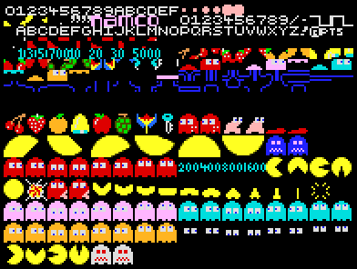

Gráficos (y III): Sprites y Gráficos en baja resolución (bloques)
================================================================================

En este capítulo crearemos rutinas específica de impresión de sprites de 8×8 píxeles en posiciones exáctas de carácter (gráficos de bloques) y la extenderemos a la impresión de sprites de 16×16 píxeles (2×2 bloques). Además de estas rutinas de tamaños específicos, analizaremos una rutina más genérica que permita imprimir sprites de tamaños múltiples del anterior (16×16, 24×16, etc).

Imprimir en posiciones exactas de carácter (de 0 a 31 para la coordenada X, y de 0 a 23 para la coordenada Y), coincidiendo con las posiciones posibles de la rejilla de 32×24 en pantalla es lo que se conoce como “gráficos en baja resolución”. Los gráficos, aunque sean muy detallados, se mueven “carácter a carácter”.

El capítulo hará uso intensivo de los algoritmos de cálculo de direcciones de memoria a partir de coordenadas y del movimiento relativo descritos en 2 anteriores capítulos, aunque las rutinas mostradas a continuación podrían ser directamente utilizadas incluso sin conocimientos sobre la organización de la videomemoria del Spectrum.

Estudiaremos también los métodos de impresión sobre pantalla: transferencia directa, operaciones lógicas y uso de máscaras, y la generación de los datos gráficos y de atributos a partir de la imagen formada en un editor de sprites. 

Teoría sobre el trazado de sprites
--------------------------------------------------------------------------------

Comencemos con las definiciones básicas de la terminología que se usará en este capítulo.

Sprite: Se utiliza el término anglosajón sprite (traducido del inglés: “duendecillo”) para designar en un juego o programa a cualquier gráfico que tenga movimiento. En el caso del Spectrum, que no tiene como otros sistemas hardware dedicado a la impresión de Sprites, aplicamos el término a cualquier mapa de bits (del inglés bitmap) que podamos utilizar en nuestros programas: el gráfico del personaje protagonista, los de los enemigos, los gráficos de cualquier item o incluso las propias fuentes de texto de los marcadores. 

.. figure:: gfx3_sprite.png
   :scale: 50%
   :align: center
   :alt: Sprite

   Sprite

Editor de Sprites: Los sprites se diseñan en editores de sprites, que son aplicaciones diseñadas para crear Sprites teniendo en cuenta la máquina destino para la que se crean. Por ejemplo, un editor de Sprites para Spectrum tomará en cuenta, a la hora de aplicar colores, el sistema de tinta/papel en bloques de 8×8 píxeles y no nos permitirá dibujar colores saltándonos dicha limitación que después existirá de forma efectiva en el hardware destino. 

.. figure:: gfx3_sevenup.png
   :scale: 50%
   :align: center
   :alt: Gráficos en SevenUP

   Gráficos en SevenUP

Estos programas gráficos tratan los sprites como pequeños rectángulos (con o sin zonas transparentes en ellos) del ancho y alto deseado y se convierten en mapas de bits (una matriz de píxeles activos o no activos agrupados) que se almacenan en los programas como simples ristras de bytes, preparados para ser volcados en la pantalla con rutinas de impresión de sprites.

.. figure:: gfx3_sprite_bitmap.png
   :scale: 50%
   :align: center
   :alt: Sprite Bitmap

   Sprite Bitmap

Rutinas de impresión de Sprites: son rutinas que reciben como parámetro la dirección en memoria del Sprite y sus Atributos y las coordenadas (x,y) destino, y vuelcan esta información gráfica en la pantalla.

Sprite Set: Normalmente todos los Sprites de un juego se agrupan en un “sprite set” (o “tile set”), que es una imagen rectangular o un array lineal que almacena todos los datos gráficos del juego de forma que la rutina de impresión de Sprites pueda volcar uno de ellos mediante unas coordenadas origen y un ancho y alto (caso del tileset rectangular) o mediante un identificador dentro del array de sprites (caso del tileset lineal).

El sistema de sprites en formato rectangular suele ser utilizado en sistemas más potentes que el Spectrum, permitiendo además sprites de diferentes tamaños en el mismo tileset. Las rutinas que imprimen estos sprites a lo largo del juego requieren como parámetros, además de la posición (x,y) de destino, una posición (x,y) de origen y un ancho y alto para “extraer” cada sprite de su “pantalla origen” y volcarlo a la pantalla destino.

   Sprites de Pacman

En el caso del Spectrum, nos interesa mucho más el sistema de almacenamiento lineal dentro de un “vector” de datos, ya que normalmente agruparemos todos los sprites de un mismo tamaño en un mismo array. Podremos disponer de diferentes arrays para elementos de diferentes tamaños. Cuando queramos hacer referencia a uno de los sprites de dicho array, lo haremos con un identificador numérico (0-N) que indicará el número de sprite que queremos dibujar comenzando desde arriba y designando al primero como 0. 

.. figure:: gfx3_tilesetsk.png
   :scale: 50%
   :align: center
   :alt: Tileset

   Tileset

En un juego donde todos los sprites son de 16×16 y los fondos están formados por sprites o tiles de 8×8, se podría tener un “array” para los sprites, otro para los fondos, y otro para las fuentes de texto. Durante el desarrollo del bucle del programa llamaremos a la rutina de impresión de sprites pasando como parámetro el array de sprites, el ancho y alto del sprite, y el identificador del sprite que queremos dibujar.

Frame (fotograma): El “sprite set” no sólo suele alojar los diferentes gráficos de cada personaje o enemigo de un juego, sino que además se suelen alojar todos los frames (fotogramas) de animación de cada personaje. En sistemas más modernos se suele tener un frameset (un array de frames) por cada personaje, y cada objeto del juego tiene asociado su frameset y su estado actual de animación y es capaz de dibujar el frame que le corresponde.
En el Spectrum, por limitaciones de memoria y código, lo normal es tener todo en un mismo spriteset, y tener almacenados los identificadores de animación de un personaje en lugar de su frameset. Así, sabremos que nuestro personaje andando hacia la derecha tiene una animación que consta de los frames (por ejemplo) 10, 11 y 12 dentro del spriteset.

Tiles: Algunos bitmaps, en lugar de ser llamados “sprites”, reciben el nombre de tiles (“bloques”). Normalmente esto sucede con bitmaps que no van a tener movimiento, que se dibujan en posiciones exáctas de carácter, y/o que no tienen transparencia. Un ejemplo de tiles son los “bloques” que forman los escenarios y fondos de las pantallas cuando son utilizados para componer un mapa de juego en base a la repetición de los mismos. Los tiles pueden ser impresos con las mismas rutinas de impresión de Sprites (puesto que son bitmaps), aunque normalmente se diseñan rutinas específicas para trazar este tipo de bitmaps aprovechando sus características (no móviles, posición de carácter, no transparencia), con lo que dichas rutinas se pueden optimizar. Como veremos en el próximo capítulo, los tiles se utilizan normalmente para componer el área de juego mediante un tilemap (mapa de tiles): 

.. figure:: gfx3_tilemap.png
   :scale: 50%
   :align: center
   :alt: Tilemap

   Tilemap

Máscaras de Sprites: Finalmente, cabe hablar de las máscaras de sprites, que son bitmaps que contienen un contorno del sprite de forma que se define qué parte del Sprite original debe sobreescribir el fondo y qué parte del mismo debe de ser transparente. 

.. figure:: gfx3_masks.png
   :scale: 50%
   :align: center
   :alt: Máscaras

   Máscaras

Las máscaras son necesarias para saber qué partes del sprite son transparentes: sin ellas habría que testear el estado de cada bit para saber si hay que “dibujar” ese pixel del sprite o no. Gracias a la máscara, basta un AND entre la máscara y el fondo y un OR del sprite para dibujar de una sóla vez 8 píxeles sin realizar testeos individuales de bits.

Diseño de una rutina de impresión de sprites
--------------------------------------------------------------------------------

En microordenadores como el Spectrum existe un vínculo especial entre los “programadores” y los “diseñadores gráficos”, ya que estos últimos deben diseñar los sprites teniendo en cuenta las limitaciones del Spectrum y a veces hacerlo tal y como los programadores los necesitan para su rutina de impresión de Sprites o para salvar las limitaciones de color del Spectrum o evitar colisiones de atributos entre personajes y fondos.

El diseño gráfico del Sprite
~~~~~~~~~~~~~~~~~~~~~~~~~~~~~~~~~~~~~~~~~~~~~~~~~~~~~~~~~~~~~~~~~~~~~~~~~~~~~~~~

El diseñador gráfico y el programador deben decidir el tamaño y características de los Sprites y el “formato para el sprite origen” a la hora de exportar los bitmaps como “datos binarios” para su volcado en pantalla.

A la hora de crear una rutina de impresión de sprites tenemos que tener en cuenta el formato del Sprite de Origen. Casi se podría decir que más bien, la rutina de impresión de sprites debemos escribirla o adaptarla al formato de sprites que vayamos a utilizar en el juego.

Dicho formato puede ser:

* Sprite con atributos de color (multicolor) o sin atributos de color (monocolor).
* Si el sprite tiene atributos de color, los atributos pueden ir:

      * En un array de atributos aparte del array de datos gráficos.

      * En el mismo array de datos gráficos, pero detrás del último de los sprites (linealmente, igual que los sprites), como: sprite0,sprite1,atributos0,atributos1.

      * En el mismo array de datos gráficos, pero el atributo de un sprite va detrás de dicho sprite en el vector, intercalado: sprite0,atributos0,sprite1,atributos1.
* Sprite que altere o no altere el fondo:

    * Si no debe alterarlo, se tiene que decidir si será mediante impresión por operación lógica o si será mediante máscaras (y dibujar y almacenar estas).

Además, hay que tener las herramientas para el dibujado y la conversión de los bitmaps o spritesets en código, en el formato que hayamos decidido. Más adelante en el capítulo profundizaremos en ambos temas: la organización en memoria del Sprite (o del Spriteset completo) y las herramientas de dibujo y conversión.

La creación de la rutina de impresión
~~~~~~~~~~~~~~~~~~~~~~~~~~~~~~~~~~~~~~~~~~~~~~~~~~~~~~~~~~~~~~~~~~~~~~~~~~~~~~~~

Dadas las limitaciones en velocidad de nuestro querido procesador Z80A, el realizar una rutina de impresión de sprites en alta resolución rápida es una tarea de complejidad media/alta que puede marcar la diferencia entre un juego bueno y un juego malo, especialmente conforme aumenta el número de sprites en pantalla y por tanto, el parpadeo de los mismos si la rutina no es suficientemente buena.

La complejidad de las rutinas que veremos concretamente en este capítulo será de un nivel más asequible puesto que vamos a trabajar con posiciones de carácter en baja resolución y además crearemos varias rutinas específicas y una genérica.

Para crear estas rutinas necesitamos conocer la teoría relacionada con:

* El cálculo de posición en memoria de las coordenadas (c,f) en las que vamos a dibujar el Sprite.
* El dibujado de cada scanline del sprite en pantalla, ya sea con LD/ldir o con operaciones lógicas tipo OR/XOR.
* El avance a través del sprite para acceder a otros scanlines del mismo.
* El avance diferencial en pantalla para movernos hacia la derecha (por cada bloque de anchura del sprite), y hacia abajo (por cada scanline de cada bloque y por cada bloque de altura del sprite).
* El cálculo de posición en memoria de atributos del bloque (0,0) del sprite.
* El avance diferencial en la zona de atributos para imprimir los atributos de los sprites de más de 1×1 bloques.

Gracias a los 2 últimos capítulos del curso y a nuestros conocimientos en ensamblador, ya tenemos los mecanismos para dar forma a la rutina completa.

Diseñaremos rutinas de impresión de sprites en baja resolución de 1×1 bloques (8×8 píxeles), 2×2 bloques (16×16 píxeles) y NxM bloques. Las 2 primeras rutinas, específicas para un tamaño concreto, serán más óptimas y eficientes que la última, que tendrá que adecuarse a cualquier tamaño de sprite y por lo tanto no podrá realizar optimizaciones basadas en el conocimiento previo de ciertos datos.

Por ejemplo, cuando sea necesario multiplicar algún registro por el valor del ancho del sprite, en el caso de la rutina de 1×1 no será necesario multiplicar y en el caso de la rutina de 2×2 podremos hacer uso de 1 desplazamiento a izquierda, pero la rutina de propósito general tendrá que realizar la multiplicación por medio de un bucle de sumas. Así, imprimir un sprite de 2×2 con su rutina específica será mucho más rápido que imprimir el mismo sprite con la genérica.

Aunque trataremos de optimizar las rutinas en la medida de lo posible, se va a intentar no realizar optimizaciones que hagan la rutina ilegible para el lector. Las rutinas genéricas que veremos hoy serán rápidas pero siempre podrán optimizarse más mediante trucos y técnicas al alcance de los programadores con más experiencia. Es labor del programador avanzado el adaptar estas rutinas a cada juego para optimizarlas al máximo en la medida de lo posible.

En este sentido, en alguna de las rutinas utilizaremos variables en memoria para alojar datos de entrada o datos temporales o intermedios. Aunque acceder a la memoria es “lenta” comparada con tener los datos guardados en registros, cuando comenzamos a manejar muchos parámetros de entrada (y de trabajo) en una rutina y además hay que realizar cálculos con ellos, es habitual que agotemos los registros disponibles, más todavía teniendo en cuenta la necesidad de realizar dichos cálculos. En muchas ocasiones se acaba realizando uso de la pila con continuos PUSHes y POPs destinados a guardar valores y recuperarlos posteriormente a realizar los cálculos o en ciertos puntos de la rutina.

Las instrucciones PUSH y POP toman 11 y 10 t-estados respectivamente, mientras que escribir o leer un valor de 8 bits en memoria (ld (NN), a y ld a, (NN)) requiere 13 t-estados y escribir o leer un valor de 16 bits toma 20 t-estados ld (NN), rr y ld rr, (NN)) con la excepción de ld (NN), hl que cuesta 16 t-estados. 